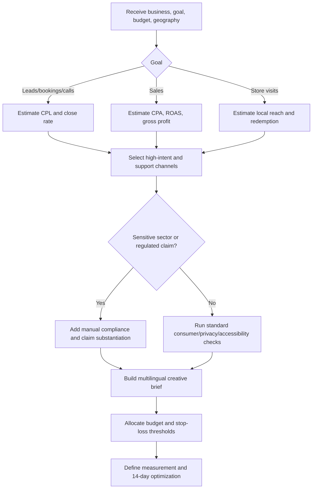
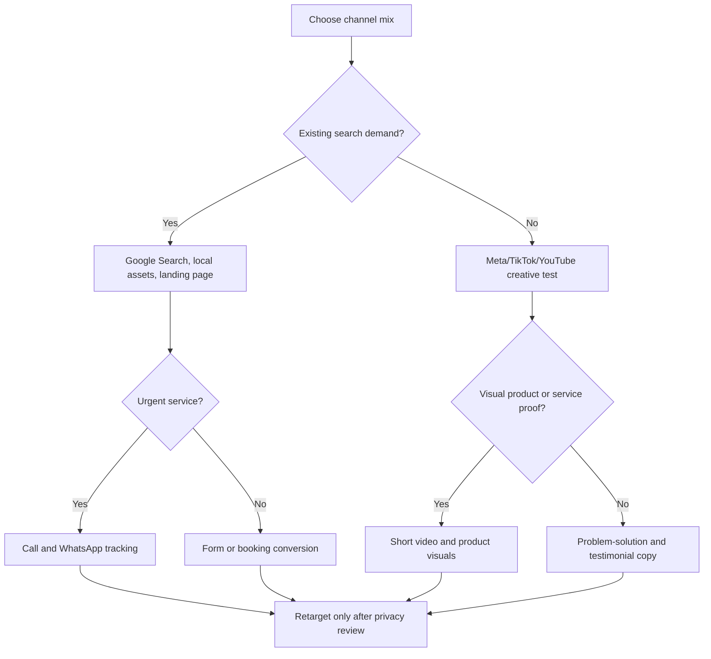
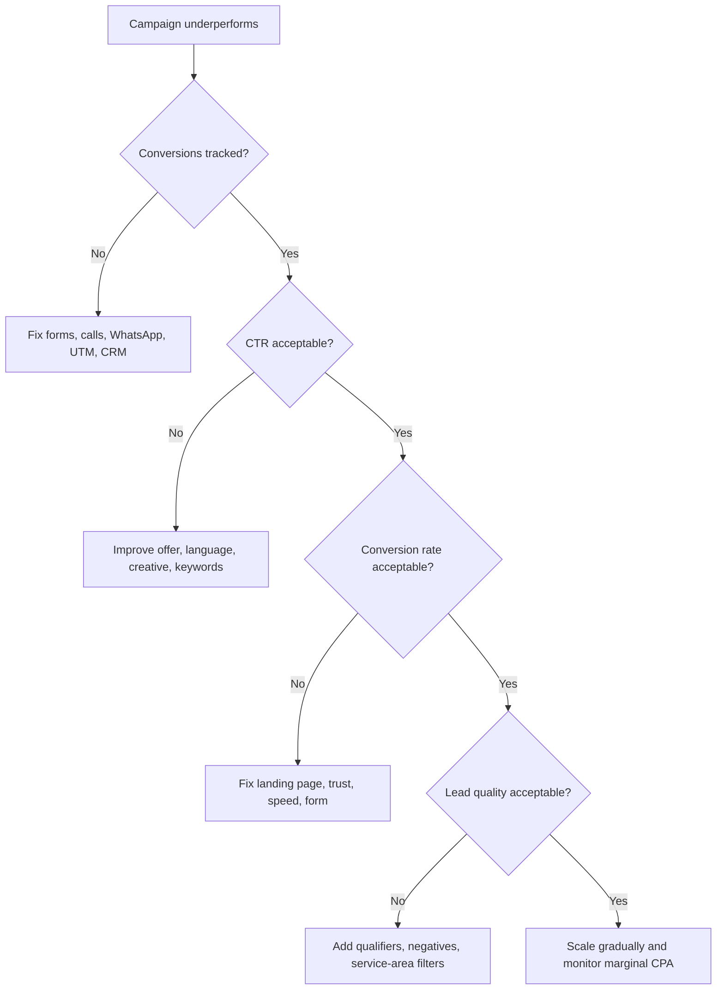

# Advertising Campaign Planner

## Purpose

Design practical advertising campaigns for Israeli small businesses, freelancers, consumer services, and ecommerce. Produce a plan that covers objective, target audiences, geography, language, channel mix, budget, creative direction, compliance checks, measurement, and ROI.

Use this skill for campaigns targeting Israel in Hebrew, Arabic, Russian, or English. Prioritize Israeli context: city targeting, ₪ budgets, VAT-sensitive price presentation, lead-form privacy, direct-marketing consent, right-to-left landing pages, accessibility, and regulated-sector claims.

Do not treat compliance output as final legal advice. Treat it as a launch checklist requiring verification against current law, regulator guidance, and platform policy.

## Input checklist

| Field | Required | Example | Default if missing |
|---|---:|---|---|
| Business type | Yes | Accountant, dental clinic, ecommerce store | Ask once or infer from context |
| Goal | Yes | Leads, bookings, sales, calls, store visits | Leads |
| Geography | Yes | Tel Aviv, Haifa, nationwide | Israel nationwide |
| Monthly budget | Yes | ₪6,000 | Suggest minimum viable test |
| Average order value | ROI | ₪450 | Mark ROI as directional |
| Gross margin | ROI | 0.55 | Show scenario range |
| Languages | Yes | Hebrew, Arabic, Russian | Hebrew plus landing fallback |
| Offer | Helpful | Free consultation, bundle, coupon | Recommend low-friction offer |
| Constraints | Helpful | Health, finance, minors, direct messages | Flag review requirement |

## Operating rules

1. Start with the business outcome, then choose channels.
2. Allocate small budgets to fewer channels; avoid fragmentation.
3. Separate prospecting, high-intent capture, retargeting, and retention.
4. Verify that the business can serve each advertised language.
5. Calculate profitability from gross profit, not revenue.
6. Surface compliance risk before creative approval.
7. Use assumptions explicitly; do not claim certainty from modeled ROI.

## Planning decision tree



## Channel decision tree



## Israeli language guidance

### Hebrew
Use direct, concrete Israeli Hebrew. Mention city, availability, service area, price conditions, proof, and next step. Prefer plural-neutral calls to action such as "קבעו", "השאירו פרטים", and "בדקו זמינות". Avoid fake urgency, exaggerated superlatives, unclear VAT wording, and hidden material terms.

### Arabic
Use native Arabic copy, not literal translation. Localize city names, service availability, contact preferences, and support hours. Use Arabic only when sales or service can continue professionally in Arabic.

### Russian
Use natural Russian for Russian-speaking audiences where the service fit is real. Avoid Hebrew idioms rendered word-for-word. Route leads to Russian-capable staff or remove the variant.

### English
Use English for tourists, expats, international professionals, B2B services, real estate, education, and travel. Israeli disclosure and consumer rules may still apply.

## Budget allocation guide

| Situation | Search | Social prospecting | Retargeting | Creative/testing |
|---|---:|---:|---:|---:|
| Local service with demand | 55% | 20% | 15% | 10% |
| Ecommerce sales | 35% | 35% | 20% | 10% |
| New brand or unclear demand | 20% | 50% | 15% | 15% |
| Freelancer lead generation | 45% | 25% | 15% | 15% |
| Budget below ₪2,000 | 70%–90% one primary channel | 0%–20% | 0%–10% | 10% |

Minimum test guidance: local search ₪1,500–₪3,000; Meta lead test ₪2,000–₪5,000; ecommerce multi-channel test ₪5,000–₪12,000; competitive legal, finance, dental, insurance, and real estate campaigns often require more.

## ROI formulas

```text
Clicks = Spend / CPC
Leads = Clicks × Conversion Rate
Sales = Leads × Lead-to-Sale Rate
Gross Profit = Sales × Average Order Value × Gross Margin
ROI = (Gross Profit - Spend) / Spend
Break-even CPA = Average Order Value × Gross Margin
Break-even Sales = Spend / Break-even CPA
```

Example: A home-repair business in Haifa spends ₪4,500. CPC is ₪5.50, landing conversion is 5%, close rate is 30%, average job value is ₪900, and gross margin is 45%. Estimated clicks: 818. Leads: 41. Sales: 12. Gross profit: ₪4,860. ROI: about 8%. Treat this as viable only if lead quality and call handling remain stable.

## Israeli compliance checklist

### Consumer protection and price transparency
Check misleading claims, discount terms, seller identity, availability, warranty, cancellation, delivery, and material limitations. For consumer pricing, handle VAT display carefully and avoid unclear "from" pricing.

### Sponsored content and influencer promotions
Clearly mark paid content, affiliate links, gifted products, advertorials, and influencer arrangements. Do not let paid promotion appear as independent editorial content.

### Privacy and databases
Collect only necessary data. State collection purpose, identity of collector, retention, transfer, and removal/contact options. Review customer-list uploads, custom audiences, remarketing, cookies, and sensitive data.

### Direct marketing and spam
For email, SMS, WhatsApp, and automated messages, verify consent where required, sender identity, commercial nature, and easy removal. Do not convert a lead inquiry into broad unrelated marketing without review.

### Accessibility
Check landing pages, forms, documents, and video. Verify contrast, keyboard use, labels, error messages, captions, alt text, and Hebrew right-to-left rendering.

### Regulated and sensitive sectors
Escalate health, clinics, supplements, mental health, finance, loans, insurance, investments, tax, alcohol, chance-based promotions, minors, real estate, employment, education, environmental claims, and professional licensing.

## Required output sections

1. Campaign summary
2. Assumptions
3. Audience segments
4. Language and localization plan
5. Offer and funnel
6. Channel mix and budget
7. Creative brief
8. Compliance review
9. Measurement plan
10. ROI estimate
11. Launch checklist
12. Next 14-day optimization plan

## Concrete examples

### Independent accountant in Petah Tikva
Budget: ₪6,000. Languages: Hebrew and Russian. Goal: qualified leads. Allocate ₪3,300 to Google Search, ₪1,200 to social prospecting, ₪900 to retargeting, and ₪600 to creative testing. Use keywords around "רואה חשבון לעוסק מורשה", "הצהרת הון", and "פתיחת עוסק פטור". Do not guarantee tax savings or imply Tax Authority endorsement. Add privacy notice to the lead form. If annual client value is ₪2,400 and gross margin is 70%, break-even CPA is ₪1,680; with a 20% close rate, break-even CPL is ₪336.

### Ecommerce skincare store
Budget: ₪12,000. Languages: Hebrew and Arabic. Allocate ₪4,200 to search/catalog, ₪4,200 to paid social prospecting, ₪2,400 to retargeting, and ₪1,200 to creative. Substantiate cosmetic claims, avoid treatment promises, show delivery fees, show cancellation policy, and verify consent before direct marketing. If AOV is ₪220 and margin is 52%, break-even CPA is ₪114.40.

### No-website emergency plumber
Use one primary call-focused channel. Use call tracking, service-area exclusions, negative keywords, clear opening hours, and manual lead logging. Do not split ₪1,500 across four platforms.

## Edge cases

- **Budget under ₪1,000:** recommend one channel, organic local work, WhatsApp tracking, and manual follow-up.
- **No AOV or margin:** provide scenario ranges; do not label the campaign profitable.
- **Multilingual ad without service capacity:** remove the language or add routing.
- **Minors:** flag high risk; avoid manipulative targeting and unclear parental consent.
- **Retargeting-heavy plan:** pause until privacy notice and audience source are verified.
- **Regulated claims:** remove guarantees and document substantiation before launch.

## Anti-patterns

Do not allocate tiny budgets across too many platforms. Do not count likes as business outcomes. Do not translate Hebrew literally into Arabic or Russian. Do not hide material conditions in footnotes. Do not calculate ROI from revenue alone. Do not send SMS or WhatsApp marketing without consent review. Do not use unsupported before/after, medical, finance, tax-saving, or environmental claims.

## Troubleshooting map



## Production checklist

Confirm business identity, service area, landing URL, phone, WhatsApp, and opening hours. Verify offer terms, valid dates, inventory, VAT, delivery, cancellation, and warranty. Check native-language copy. Add privacy notice and consent language. Check accessibility. Configure conversion tracking. Add negative keywords and exclusions. Define stop-loss thresholds. Prepare response scripts and complaint handling. Review results after 3, 7, and 14 days.
