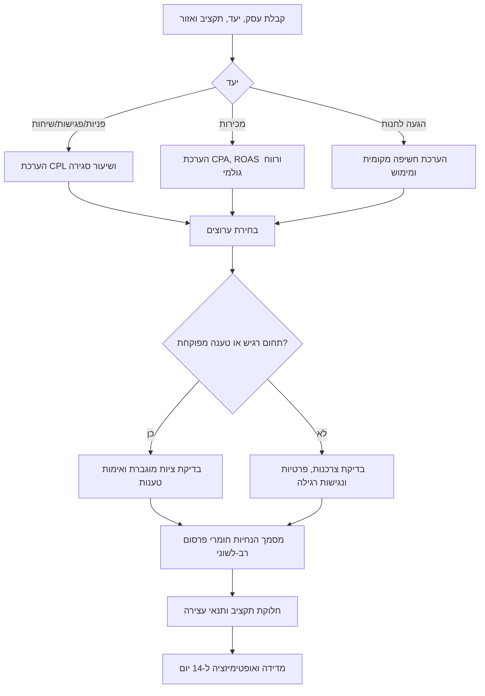
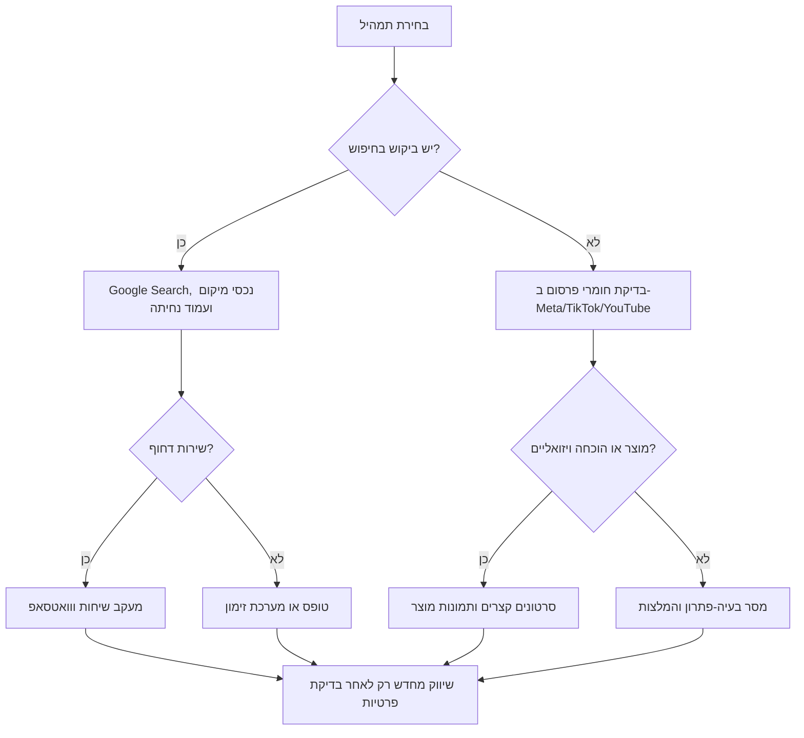
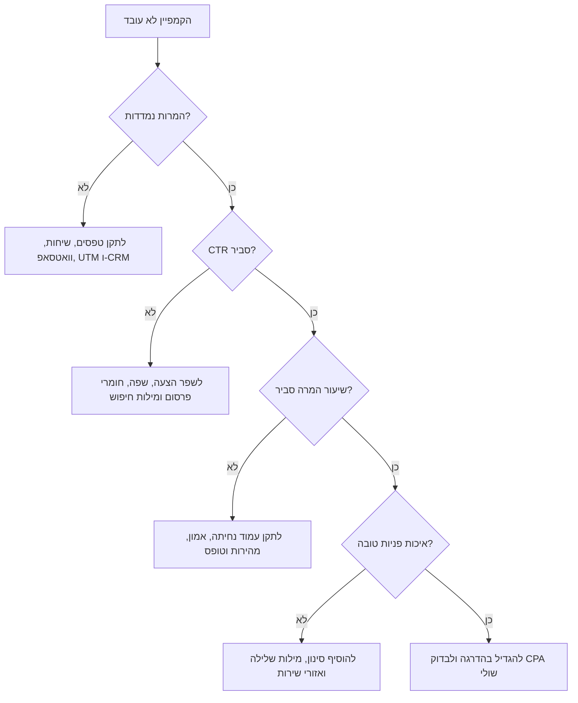

# מתכנן קמפיינים פרסומיים

## מטרה

לתכנן קמפיינים פרסומיים לעסקים קטנים, עצמאים, נותני שירותים, מרפאות, חנויות מקוונת ועסקים צרכניים בישראל. התוצר צריך לכלול יעד עסקי, קהלי יעד, אזור פעילות, שפה, תמהיל ערוצים, תקציב, מסמך הנחיות חומרי פרסום, בדיקות ציות, מדידה והערכת החזר השקעה.

השתמשו במיומנות זו לקמפיינים בישראל בעברית, ערבית, רוסית או אנגלית. התאימו לעיר, לשכונה, לתקציב בש״ח, להצגת מחיר רגישה למע״מ, לפרטיות בטפסי פניות, להסכמה לדיוור, לנגישות, לעמודי נחיתה מימין לשמאל ולתחומים מפוקחים.

אין להציג את בדיקת הציות כייעוץ משפטי סופי. יש לוודא דרישות עדכניות מול הדין, הרגולטור, מדיניות הפלטפורמות וגורם מקצועי כאשר הסיכון מהותי.

## נתוני חובה

| שדה | חובה | דוגמה | ברירת מחדל כשחסר |
|---|---:|---|---|
| סוג העסק | כן | רואה חשבון, מרפאת שיניים, חנות מקוונת | להסיק או לבקש פעם אחת |
| יעד | כן | פניות, פגישות, מכירות, שיחות, הגעה לחנות | פניות |
| אזור | כן | תל אביב, חיפה, כל הארץ | כל ישראל |
| תקציב חודשי | כן | ₪6,000 | להציע בדיקה מינימלית |
| שווי עסקה ממוצעת | החזר השקעה | ₪450 | לציין שהחישוב כיווני |
| רווח גולמי | החזר השקעה | 0.55 | להציג תרחישים |
| שפות | כן | עברית, ערבית, רוסית | עברית וברירת מחדל לעמוד נחיתה |
| הצעה | רצוי | ייעוץ ללא התחייבות, חבילה, קופון | להציע הצעה פשוטה למדידה |
| מגבלות | רצוי | בריאות, פיננסים, קטינים, דיוור | לסמן בדיקה מוגברת |

## כללי עבודה

1. התחילו מהתוצאה העסקית ורק אחר כך בחרו ערוצים.
2. בתקציב קטן בחרו פחות ערוצים; אל תפצלו יתר על המידה.
3. הפרידו בין קהל חדש, ביקוש פעיל, שיווק מחדש ושימור.
4. ודאו שהעסק יכול לתת שירות בכל שפה שבה מפרסמים.
5. חשבו רווחיות לפי רווח גולמי ולא לפי הכנסה.
6. הציפו סיכוני ציות לפני אישור חומרי פרסום.
7. ציינו הנחות במפורש; אל תציגו החזר השקעה מחושב כוודאות.

## תרשים תכנון



## בחירת ערוצים



## שפה ולוקליזציה בישראל

### עברית
כתבו עברית ישירה, ברורה ומכבדת. ציינו עיר, זמינות, אזור שירות, תנאי מחיר, הוכחה ופעולה הבאה. השתמשו בקריאות לפעולה כגון "קבעו", "השאירו פרטים" ו"בדקו זמינות". הימנעו מדחיפות מזויפת, סופרלטיבים לא מוכחים, ניסוח מע״מ לא ברור ותנאים מוסתרים.

### ערבית
כתבו ערבית טבעית ולא תרגום מילולי. התאימו שמות אזורים, זמינות שירות, ערוצי קשר ושעות מענה. פרסמו בערבית רק כאשר אפשר לתת שירות מקצועי בערבית.

### רוסית
השתמשו ברוסית טבעית לקהל דובר רוסית כאשר יש התאמה אמיתית לשירות. הימנעו מתרגום מילולי של ביטויים עבריים. נווטו פניות לאיש שירות דובר רוסית או הסירו את הווריאנט.

### אנגלית
השתמשו באנגלית לתיירים, עולים, אנשי מקצוע בינלאומיים, B2B, נדל״ן, חינוך ותיירות. דרישות גילוי וצרכנות בישראל עדיין עשויות לחול.

## חלוקת תקציב

| מצב | חיפוש | רשתות חברתיות לקהל חדש | שיווק מחדש | חומרי פרסום ובדיקות |
|---|---:|---:|---:|---:|
| שירות מקומי עם ביקוש | 55% | 20% | 15% | 10% |
| מכירות מקוונת | 35% | 35% | 20% | 10% |
| מותג חדש או ביקוש לא ברור | 20% | 50% | 15% | 15% |
| עצמאי שמחפש פניות | 45% | 25% | 15% | 15% |
| תקציב מתחת ל-₪2,000 | 70%–90% בערוץ מרכזי אחד | 0%–20% | 0%–10% | 10% |

תקציבי בדיקה: חיפוש מקומי ₪1,500–₪3,000; קמפיין פניות ב-Meta ₪2,000–₪5,000; מסחר מקוון בכמה ערוצים ₪5,000–₪12,000; תחומים תחרותיים כגון משפטים, פיננסים, שיניים, ביטוח ונדל״ן דורשים לרוב יותר.

## חישוב החזר השקעה

```text
קליקים = תקציב / עלות לקליק
פניות = קליקים × שיעור המרה
מכירות = פניות × שיעור סגירה
רווח גולמי = מכירות × שווי עסקה ממוצעת × שיעור רווח גולמי
החזר השקעה = (רווח גולמי - תקציב) / תקציב
CPA לאיזון = שווי עסקה ממוצעת × שיעור רווח גולמי
מכירות לאיזון = תקציב / CPA לאיזון
```

דוגמה: עסק תיקונים בחיפה משקיע ₪4,500. CPC צפוי ₪5.50, המרת עמוד נחיתה 5%, שיעור סגירה 30%, שווי עבודה ₪900, רווח גולמי 45%. קליקים: 818. פניות: 41. מכירות: 12. רווח גולמי: ₪4,860. החזר השקעה: כ-8%. יש להגדיל רק אם איכות הפניות והמענה הטלפוני נשארים יציבים.

## צ׳קליסט ציות בישראל

### שיעור מע״מ בדוגמאות מחיר לצרכן בישראל

השתמשו במע״מ בשיעור 18% החל מ-01/01/2025, אלא אם חלה פטור, עסקה בשיעור אפס או הוראה ענפית אחרת. בפרסום לצרכנים דרשו הצגת תנאי מחיר ברורים, טיפול במע״מ, דמי משלוח, תנאי ביטול ומגבלות מהותיות בסמוך לקריאה לפעולה.

### מינוח רגולטורי

אל תתייחסו לרשות אחת בשם כללי לכל פרסום בישראל. התאימו את הגוף המפקח להקשר: הרשות להגנת הצרכן ולסחר הוגן לפרסום צרכני ולהטעיה, הרשות להגנת הפרטיות למידע אישי ודיוור ישיר, משרד הבריאות לפרסום מטעה בתחומי בריאות, נציבות שוויון זכויות לאנשים עם מוגבלות לנגישות, ורשויות ענפיות כגון בנק ישראל, רשות ניירות ערך או רשות שוק ההון, ביטוח וחיסכון כאשר הדבר רלוונטי. פרסום משודר עשוי להיות כפוף גם לכללי הרשות השנייה.


### הגנת הצרכן ושקיפות מחיר
בדקו הטעיה, תנאי הנחה, זהות מוכר, זמינות, אחריות, ביטול עסקה, משלוח ותנאים מהותיים. בפרסום לצרכנים יש להיזהר במיוחד במע״מ, מחיר "החל מ-" ותנאי מבצע.

### תוכן ממומן ומשפיענים
סמנו תוכן בתשלום, קישורי שותפים, מוצרים שניתנו ללא תמורה, כתבות פרסומיות ושיתופי פעולה. אל תציגו תוכן מסחרי כביקורת עצמאית.

### פרטיות ומאגרי מידע
אספו רק מידע נחוץ. ציינו מטרת איסוף, זהות הגורם האוסף, שמירה, העברה ואפשרות פנייה/הסרה. בדקו העלאת רשימות לקוחות, קהלים מותאמים, שיווק מחדש, קוקיז ומידע רגיש.

### דיוור ישיר וספאם
בדוא״ל, SMS, וואטסאפ והודעות אוטומטיות ודאו הסכמה כאשר נדרשת, זהות שולח ואפשרות הסרה פשוטה. אל תהפכו פנייה לשירות להסכמה רחבה לדיוור אחר בלי בדיקה.

### נגישות
בדקו עמודי נחיתה, טפסים, מסמכים וסרטונים. ודאו ניגודיות, ניווט מקלדת, תוויות, הודעות שגיאה, כתוביות, טקסט חלופי ותצוגת ימין-לשמאל.

### תחומים רגישים
הסלימו בריאות, מרפאות, תוספים, בריאות נפש, פיננסים, הלוואות, ביטוח, השקעות, מס, אלכוהול, הגרלות, קטינים, נדל״ן, תעסוקה, חינוך, טענות סביבתיות ורישוי מקצועי.

## פורמט תוצר

1. תקציר קמפיין
2. הנחות עבודה
3. פלחי קהל
4. תכנית שפה ולוקליזציה
5. הצעה ומשפך
6. תמהיל ערוצים ותקציב
7. מסמך הנחיות חומרי פרסום
8. בדיקת ציות
9. תכנית מדידה
10. הערכת החזר השקעה
11. צ׳קליסט השקה
12. תכנית אופטימיזציה ל-14 יום

## דוגמאות

### רואה חשבון עצמאי בפתח תקווה
תקציב: ₪6,000. שפות: עברית ורוסית. יעד: פניות איכותיים. הקצו ₪3,300 ל-Google Search, ₪1,200 לרשתות חברתיות לקהל חדש, ₪900 לשיווק מחדש ו-₪600 לבדיקות חומרי פרסום. השתמשו בביטויים כמו "רואה חשבון לעוסק מורשה", "הצהרת הון" ו"פתיחת עוסק פטור". אל תבטיחו חיסכון במס ואל תרמזו לאישור רשות המסים. הוסיפו הודעת פרטיות בטופס פנייה. אם שווי לקוח שנתי הוא ₪2,400 והרווח הגולמי 70%, CPA לאיזון הוא ₪1,680; בשיעור סגירה 20%, CPL לאיזון הוא ₪336.

### חנות מקוונת לקוסמטיקה
תקציב: ₪12,000. שפות: עברית וערבית. הקצו ₪4,200 לחיפוש/קטלוג, ₪4,200 לרשתות חברתיות, ₪2,400 לשיווק מחדש ו-₪1,200 לחומרי פרסום. בססו טענות קוסמטיות, הימנעו מהבטחות טיפול רפואי, הציגו דמי משלוח ומדיניות ביטול, וודאו הסכמה לפני דיוור. אם שווי סל הוא ₪220 והרווח הגולמי 52%, CPA לאיזון הוא ₪114.40.

### אינסטלטור ללא אתר
בחרו ערוץ שיחות מרכזי אחד. הגדירו מעקב שיחות, החרגות אזור, מילות שלילה, שעות פעילות ברורות ותיעוד ידני של פניות. אל תפצלו ₪1,500 בין ארבע פלטפורמות.

## מקרי קצה

- **תקציב מתחת ל-₪1,000:** בחרו ערוץ אחד, עבודת לוקאל אורגנית, מעקב וואטסאפ וחזרה ידנית.
- **אין שווי עסקה או רווח גולמי:** הציגו תרחישים; אל תגדירו את הקמפיין כרווחי.
- **פרסום בשפה ללא יכולת שירות:** הסירו את השפה או הוסיפו ניתוב מתאים.
- **קטינים:** סמנו סיכון גבוה; הימנעו ממניפולציה ומחוסר בהירות לגבי הסכמת הורים.
- **שיווק מחדש כבד:** עצרו עד לבדיקה של הודעת פרטיות ומקור הקהל.
- **טענות מפוקחות:** הסירו הבטחות ותעדו ביסוס לפני השקה.

## טעויות נפוצות

אל תפצלו תקציב קטן בין יותר מדי פלטפורמות. אל תציגו לייקים כתוצאה עסקית. אל תתרגמו עברית מילולית לערבית או לרוסית. אל תסתירו תנאים מהותיים בהערת שוליים. אל תחשבו החזר השקעה לפי הכנסות בלבד. אל תשלחו SMS או וואטסאפ שיווקי בלי בדיקת הסכמה. אל תשתמשו בטענות לפני/אחרי, רפואיות, פיננסיות, חיסכון במס או סביבתיות בלי ביסוס.

## מפת פתרון בעיות



## צ׳קליסט השקה

ודאו זהות עסק, אזור שירות, כתובת עמוד, טלפון, וואטסאפ ושעות פעילות. בדקו תנאי מבצע, תאריכים בתבנית DD/MM/YYYY, מלאי, מע״מ, משלוח, ביטול ואחריות. בדקו ניסוח שפות עם דובר מקצועי. הוסיפו הודעת פרטיות ונוסח הסכמה. בדקו נגישות. הגדירו מדידת המרות. הוסיפו מילות שלילה והחרגות. הגדירו תנאי עצירה. הכינו תסריטי מענה וטיפול בתלונות. בדקו תוצאות אחרי 3, 7 ו-14 ימים.
