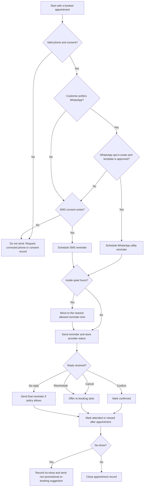

# Appointment Reminder & No-Show Tracker

Use this skill to design, schedule, send, and audit appointment reminders for Israeli service providers. Prefer transactional WhatsApp or SMS reminders for confirmed appointments, capture customer consent, track attendance outcomes, and suggest respectful re-booking messages after missed appointments.

## When to use this skill

Use this skill when the task includes one or more of these needs:

- Send reminders before appointments, meetings, treatments, classes, consultations, deliveries, or service visits.
- Produce Hebrew or bilingual reminder text with Israeli dates, phone numbers, and prices in ₪.
- Choose WhatsApp or SMS based on consent, reachability, delivery status, and customer preference.
- Track no-shows, late cancellations, attendance, reschedules, and customer-level risk.
- Suggest a re-booking message after a missed appointment without turning a reminder into unapproved marketing.
- Validate an Israeli small-business workflow against privacy, spam, and consumer-protection constraints.

Do not use this skill for emergency medical triage, debt collection pressure, political persuasion, or messages that hide sender identity.

## Required inputs

Collect these fields before generating messages or schedules:

| Field | Required | Example | Notes |
|---|---:|---|---|
| Business name | Yes | Aviv Physiotherapy | Use the public sender identity. |
| Customer name | Yes | Yael Cohen | Avoid sensitive details in message text. |
| Phone | Yes | +972501234567 | Normalize Israeli mobile numbers to E.164. |
| Channel consent | Yes | WhatsApp: true, SMS: true | Keep a consent timestamp and source. |
| Appointment date/time | Yes | 18-06-2026 15:30 | Use Asia/Jerusalem by default. |
| Service label | Yes | Follow-up session | Keep details generic when privacy matters. |
| Location or link | Recommended | Rothschild 10, Tel Aviv | Add parking or video-call instructions when useful. |
| Cancellation/re-booking rule | Recommended | Cancel up to 24 hours before | Avoid surprise fees. |
| Language | Recommended | he | Default to Hebrew for Israeli consumers unless known otherwise. |

## Decision tree



## Reminder schedule defaults

Use these defaults unless a business policy requires different timing:

| Timing | Channel | Purpose | Example |
|---|---|---|---|
| 48 hours before | WhatsApp preferred, SMS fallback | Confirm attendance and expose cancellation link | “Reply 1 to confirm, 2 to reschedule.” |
| 24 hours before | Same channel as first successful reminder | Reduce forgetfulness | Include location and time. |
| 3 hours before | SMS or WhatsApp | Same-day nudge | Keep short and practical. |
| 15 minutes after missed start | Manual review first | No-show tracking | Do not accuse. Offer help re-booking. |

Avoid sending between 21:00 and 08:00 local time. Move reminders that fall inside quiet hours to 20:30 on the previous evening or 08:30 on the same morning, depending on the business policy.

## Message examples

### Hebrew WhatsApp reminder

```text
שלום יעל, תזכורת לתור אצל Aviv Physiotherapy ביום 18-06-2026 בשעה 15:30.
כתובת: רוטשילד 10, תל אביב.
להגעה השיבי 1. לשינוי מועד השיבי 2. לביטול השיבי 3.
```

### Hebrew SMS reminder

```text
תזכורת: התור שלך אצל Aviv Physiotherapy נקבע ל-18-06-2026 בשעה 15:30. לשינוי מועד: 03-5555555
```

### English reminder for an Israeli customer

```text
Reminder: your appointment with Aviv Physiotherapy is on 18-06-2026 at 15:30.
Reply 1 to confirm, 2 to reschedule, or 3 to cancel.
```

### No-show follow-up

```text
שלום יעל, נראה שלא הצלחת להגיע לתור היום. אפשר לקבוע מועד חדש: 19-06-2026 09:00, 19-06-2026 13:00 או 21-06-2026 10:00.
```

Keep no-show follow-up factual. Do not shame, threaten, or add discounts unless marketing consent exists.

## Israeli compliance checklist

Before sending reminders:

1. Record the lawful reason for contacting the customer: booked appointment, service relationship, or explicit consent.
2. Separate transactional reminders from marketing messages. Re-booking after a no-show can stay transactional only when it directly relates to the missed appointment.
3. Store minimal personal data: name, phone, appointment time, service category, consent source, delivery status, and attendance result.
4. Avoid sensitive details in message bodies. Write “appointment” instead of a diagnosis, treatment type, or legal matter when discretion matters.
5. Keep unsubscribe/stop handling for SMS and WhatsApp. Stop marketing immediately when requested.
6. Check the “Do Not Call Me” database before marketing phone calls. Treat reminders as separate from unsolicited sales calls, but avoid using a reminder workflow as a sales-calling list.
7. Publish cancellation and no-show terms before booking. Show fee rules before payment collection.
8. Keep provider credentials outside prompts and files. Use environment variables.

## Workflow

### 1. Normalize customer and appointment data

```python
from scripts.appointment_reminder_noshow_client import Customer, Appointment, normalize_israeli_mobile

phone = normalize_israeli_mobile("050-123-4567")
customer = Customer(id="c1", name="Yael Cohen", phone_e164=phone, preferred_language="he", consent_whatsapp=True, consent_sms=True)
```

### 2. Generate reminders

```python
from datetime import datetime
from zoneinfo import ZoneInfo
from scripts.appointment_reminder_noshow_client import Appointment, AppointmentReminderClient, ReminderPolicy

appointment = Appointment(
    id="a1",
    customer=customer,
    starts_at=datetime(2026, 6, 18, 15, 30, tzinfo=ZoneInfo("Asia/Jerusalem")),
    business_name="Aviv Physiotherapy",
    service_name="Follow-up session",
    location="Rothschild 10, Tel Aviv",
    price_ils=250,
)
client = AppointmentReminderClient(policy=ReminderPolicy())
messages = client.plan_reminders([appointment], now=datetime(2026, 6, 16, 8, 0, tzinfo=ZoneInfo("Asia/Jerusalem")))
```

### 3. Send with a provider

Use `provider="mock"` for testing. Use `provider="twilio"`, `provider="whatsapp_cloud"`, or `provider="generic"` only after configuring credentials and callback URLs.

```bash
python scripts/appointment_reminder_noshow_cli.py message \
  --name "Yael Cohen" \
  --phone "050-123-4567" \
  --starts-at "2026-06-18T15:30:00+03:00" \
  --business-name "Aviv Physiotherapy" \
  --service-name "Follow-up session" \
  --location "Rothschild 10, Tel Aviv" \
  --language he
```

## Tracking attendance

Use the following statuses:

| Status | Meaning | Action |
|---|---|---|
| `scheduled` | Appointment exists and reminders can be planned. | Send reminders according to policy. |
| `confirmed` | Customer confirmed attendance. | Suppress repeated confirmation prompts. |
| `cancelled` | Customer cancelled before the cutoff. | Offer re-booking. |
| `rescheduled` | New appointment replaces the old one. | Link records. |
| `attended` | Customer arrived or completed the service. | Close the loop. |
| `no_show` | Customer did not attend and did not cancel in time. | Record outcome, then send a respectful re-booking option. |

Track no-show rate with both customer-level and business-level views:

```text
no_show_rate = no_show_count / completed_or_missed_appointments
```

Use no-show history to adjust reminder timing, not to discriminate. Increase confirmation clarity for customers with repeated missed appointments and require manual review before applying deposits or fees.

## Re-booking suggestions

Suggest slots that are:

- In the same timezone as the original appointment.
- During published business hours.
- Outside holidays and blocked calendar periods when that data is available.
- At least 2 hours after the missed appointment.
- Presented as options, not pressure.

Example:

```text
אפשר לקבוע מועד חדש באחד מהזמנים האלה: 19-06-2026 09:00, 19-06-2026 13:00, 21-06-2026 10:00.
```

## Troubleshooting

| Symptom | Likely cause | Fix |
|---|---|---|
| No reminder was sent | Missing consent or invalid phone | Validate E.164 and consent before scheduling. |
| WhatsApp failed with template error | Template was not approved or variables do not match | Use an approved utility template and exact variable names. |
| SMS appears as multiple charges | Hebrew text uses UCS-2 segmentation | Keep SMS short or prefer WhatsApp for longer Hebrew text. |
| Customer says the message is marketing | Reminder includes discount, upsell, or unrelated offer | Remove promotional content unless marketing consent exists. |
| Reminders arrive at night | Quiet-hour adjustment is missing | Apply Asia/Jerusalem quiet-hour policy before provider handoff. |
| No-show rate looks inflated | Cancelled or rescheduled appointments counted as no-shows | Count only missed appointments after the appointment start time and cutoff. |

## Anti-patterns

Avoid these patterns:

- Sending a WhatsApp blast to all past customers without opt-in.
- Writing sensitive treatment, debt, legal, or family details in message text.
- Charging a no-show fee that was not shown before booking.
- Treating “delivered” as “attended.” Delivery status only proves provider delivery, not arrival.
- Sending repeated reminders after a cancellation reply.
- Using a shared spreadsheet with unrestricted access to names, phone numbers, and attendance history.
- Reusing transactional reminders for promotions.

## Output format for generated plans

Return a compact JSON array when automation is requested:

```json
[
  {
    "appointment_id": "a1",
    "customer_id": "c1",
    "channel": "whatsapp",
    "send_at": "2026-06-16T15:30:00+03:00",
    "body": "שלום יעל...",
    "metadata": {
      "language": "he",
      "template_type": "utility",
      "quiet_hours_adjusted": false
    }
  }
]
```

## Safety and privacy defaults

Use the most conservative interpretation when the appointment context is sensitive. Prefer short reminders, opt-out support, minimal data retention, and manual review for fees or disputed no-shows.
