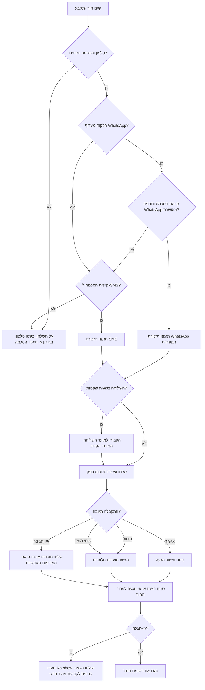

# תזכורות לתורים ומעקב אי-הגעה

השתמשו בסקיל הזה כדי לתכנן, לשלוח ולבקר תזכורות לתורים עבור עסקים קטנים, עצמאים, קליניקות, מדריכים, יועצים ונותני שירות בישראל. העדיפו הודעות תפעוליות ב-WhatsApp או SMS, שמרו תיעוד הסכמה, עקבו אחרי הגעה בפועל, והציעו קביעת מועד חדש לאחר אי-הגעה בצורה עניינית ומכבדת.

## מתי להשתמש בסקיל

השתמשו בסקיל כאשר המשימה כוללת אחד או יותר מהצרכים הבאים:

- שליחת תזכורות לפני תורים, טיפולים, שיעורים, פגישות ייעוץ, משלוחים או ביקורי שירות.
- יצירת הודעות בעברית או בשתי שפות עם תאריכים ישראליים, מספרי טלפון ישראליים וסכומים ב-₪.
- בחירת WhatsApp או SMS לפי הסכמה, העדפת לקוח, זמינות וסטטוס מסירה.
- מעקב אחרי הגעה, ביטול מאוחר, אי-הגעה, אישור הגעה ושינוי מועד.
- הצעת מועד חדש לאחר אי-הגעה בלי להפוך הודעה תפעולית להודעה שיווקית.
- בדיקת תהליך עסקי מול דרישות פרטיות, ספאם והגנת הצרכן בישראל.

אל תשתמשו בסקיל למיון חירום רפואי, גבייה מאיימת, שכנוע פוליטי או הודעות שמסתירות את זהות השולח.

## נתונים נדרשים

אספו את השדות הבאים לפני יצירת תזכורות או תזמון שליחה:

| שדה | חובה | דוגמה | הערות |
|---|---:|---|---|
| שם העסק | כן | קליניקת אביב | השתמשו בשם המוכר ללקוח. |
| שם הלקוח | כן | יעל כהן | הימנעו מפרטים רגישים בגוף ההודעה. |
| טלפון | כן | +972501234567 | נרמלו מספר נייד ישראלי ל-E.164. |
| הסכמה לערוץ | כן | WhatsApp: כן, SMS: כן | שמרו מקור ותאריך הסכמה. |
| מועד התור | כן | 18-06-2026 15:30 | השתמשו ב-Asia/Jerusalem כברירת מחדל. |
| סוג שירות | כן | פגישת המשך | השתמשו בתיאור כללי כשיש רגישות. |
| כתובת או קישור | מומלץ | רוטשילד 10, תל אביב | הוסיפו חניה, קומה או קישור וידאו לפי צורך. |
| מדיניות ביטול/קביעה מחדש | מומלץ | ביטול עד 24 שעות לפני | הציגו תנאים לפני גביית תשלום. |
| שפה | מומלץ | he | ברירת המחדל ללקוחות בישראל היא עברית, אלא אם ידוע אחרת. |

## עץ החלטה



## ברירות מחדל לתזמון

| תזמון | ערוץ | מטרה | דוגמה |
|---|---|---|---|
| 48 שעות לפני | WhatsApp, עם SMS כגיבוי | אישור הגעה והצגת אפשרות ביטול | “להגעה השיבו 1, לשינוי מועד השיבו 2.” |
| 24 שעות לפני | אותו ערוץ שבו נמסרה התזכורת הקודמת | הפחתת שכחה | כללו כתובת ושעה. |
| 3 שעות לפני | SMS או WhatsApp | תזכורת קצרה ביום התור | שמרו על נוסח קצר. |
| 15 דקות אחרי אי-הגעה | בדיקה ידנית לפני שליחה | מעקב No-show | אל תאשימו. הציעו עזרה בקביעה מחדש. |

הימנעו משליחה בין 21:00 ל-08:00. העבירו תזכורות שנופלות בשעות שקטות ל-20:30 בערב הקודם או ל-08:30 בבוקר, לפי מדיניות העסק.

## דוגמאות הודעה

### תזכורת WhatsApp בעברית

```text
שלום יעל, תזכורת לתור אצל קליניקת אביב ביום 18-06-2026 בשעה 15:30.
כתובת: רוטשילד 10, תל אביב.
להגעה השיבי 1. לשינוי מועד השיבי 2. לביטול השיבי 3.
```

### תזכורת SMS בעברית

```text
תזכורת: התור שלך אצל קליניקת אביב נקבע ל-18-06-2026 בשעה 15:30. לשינוי מועד: 03-5555555
```

### תזכורת באנגלית ללקוח בישראל

```text
Reminder: your appointment with Aviv Clinic is on 18-06-2026 at 15:30.
Reply 1 to confirm, 2 to reschedule, or 3 to cancel.
```

### הודעה אחרי אי-הגעה

```text
שלום יעל, נראה שלא הצלחת להגיע לתור היום. אפשר לקבוע מועד חדש: 19-06-2026 09:00, 19-06-2026 13:00 או 21-06-2026 10:00.
```

שמרו על נוסח ענייני לאחר אי-הגעה. אל תשתמשו בבושה, איום, הנחה או הצעה לא קשורה אלא אם קיימת הסכמה שיווקית מתאימה.

## בדיקת תאימות בישראל

לפני שליחת תזכורות:

1. תעדו בסיס פנייה ברור: תור קיים, קשר שירותי או הסכמה מפורשת.
2. הפרידו הודעה תפעולית מהודעה שיווקית. הצעת מועד חדש אחרי אי-הגעה נשארת תפעולית רק כאשר היא קשורה ישירות לתור שהוחמץ.
3. שמרו מינימום מידע אישי: שם, טלפון, מועד תור, קטגוריית שירות, מקור הסכמה, סטטוס מסירה ותוצאת הגעה.
4. הימנעו מפרטים רגישים בגוף ההודעה. כתבו “תור” במקום אבחנה, טיפול, עניין משפטי או מידע משפחתי.
5. תמכו בבקשות STOP, הסרה או הפסקת הודעות. הפסיקו שיווק מיד לאחר בקשה.
6. בדקו את מאגר “אל תתקשר אליי” לפני שיחות מכירה. אל תהפכו תהליך תזכורות לרשימת מכירות.
7. הציגו תנאי ביטול ואי-הגעה לפני קביעת התור או גביית תשלום.
8. שמרו מפתחות ספק מחוץ לקבצים. השתמשו במשתני סביבה.

## תהליך עבודה

### 1. נרמול לקוח ותור

```python
from scripts.appointment_reminder_noshow_client import Customer, normalize_israeli_mobile

phone = normalize_israeli_mobile("050-123-4567")
customer = Customer(id="c1", name="יעל כהן", phone_e164=phone, preferred_language="he", consent_whatsapp=True, consent_sms=True)
```

### 2. יצירת תזכורות

```python
from datetime import datetime
from zoneinfo import ZoneInfo
from scripts.appointment_reminder_noshow_client import Appointment, AppointmentReminderClient, ReminderPolicy

appointment = Appointment(
    id="a1",
    customer=customer,
    starts_at=datetime(2026, 6, 18, 15, 30, tzinfo=ZoneInfo("Asia/Jerusalem")),
    business_name="קליניקת אביב",
    service_name="פגישת המשך",
    location="רוטשילד 10, תל אביב",
    price_ils=250,
)
client = AppointmentReminderClient(policy=ReminderPolicy())
messages = client.plan_reminders([appointment], now=datetime(2026, 6, 16, 8, 0, tzinfo=ZoneInfo("Asia/Jerusalem")))
```

### 3. שליחה דרך ספק

השתמשו ב-`provider="mock"` לבדיקה. השתמשו ב-`provider="twilio"`, `provider="whatsapp_cloud"` או `provider="generic"` רק לאחר הגדרת סודות, מזהים וכתובות callback.

```bash
python scripts/appointment_reminder_noshow_cli.py message \
  --name "יעל כהן" \
  --phone "050-123-4567" \
  --starts-at "2026-06-18T15:30:00+03:00" \
  --business-name "קליניקת אביב" \
  --service-name "פגישת המשך" \
  --location "רוטשילד 10, תל אביב" \
  --language he
```

## מעקב סטטוסים

| סטטוס | משמעות | פעולה |
|---|---|---|
| `scheduled` | התור קיים ואפשר לתכנן תזכורות. | שלחו לפי מדיניות. |
| `confirmed` | הלקוח אישר הגעה. | הפסיקו לבקש אישור חוזר. |
| `cancelled` | הלקוח ביטל לפני מועד החיתוך. | הציעו קביעה מחדש. |
| `rescheduled` | נקבע תור חדש במקום התור הישן. | קשרו בין הרשומות. |
| `attended` | הלקוח הגיע או קיבל את השירות. | סגרו את הרשומה. |
| `no_show` | הלקוח לא הגיע ולא ביטל בזמן. | תעדו ושלחו הצעת קביעה מחדש מכבדת. |

חשבו שיעור אי-הגעה כך:

```text
שיעור No-show = מספר אי-הגעות / תורים שהסתיימו בהגעה או אי-הגעה
```

השתמשו בהיסטוריה כדי לשפר תזכורות, לא כדי להפלות. דרשו בדיקה ידנית לפני גביית פיקדון או דמי אי-הגעה.

## הצעות לקביעה מחדש

הציעו מועדים שעומדים בתנאים האלה:

- באותו אזור זמן של התור המקורי.
- בתוך שעות הפעילות שפורסמו.
- מחוץ לחגים וחסימות יומן כאשר המידע זמין.
- לפחות שעתיים אחרי התור שהוחמץ.
- מנוסחים כאפשרויות, לא כלחץ.

דוגמה:

```text
אפשר לקבוע מועד חדש באחד מהזמנים האלה: 19-06-2026 09:00, 19-06-2026 13:00, 21-06-2026 10:00.
```

## פתרון תקלות

| סימפטום | סיבה סבירה | תיקון |
|---|---|---|
| לא נשלחה תזכורת | חסרה הסכמה או מספר שגוי | בדקו E.164 ותיעוד הסכמה לפני תזמון. |
| WhatsApp נכשל בגלל תבנית | התבנית לא אושרה או המשתנים לא תואמים | השתמשו בתבנית Utility מאושרת ובשמות משתנים מדויקים. |
| SMS מחויב כמספר מקטעים | עברית נשלחת ב-UCS-2 | קצרו את ההודעה או העדיפו WhatsApp. |
| לקוח טוען שמדובר בשיווק | ההודעה כוללת הנחה, מכירה או הצעה לא קשורה | הסירו תוכן שיווקי ללא הסכמה מתאימה. |
| הודעות מגיעות בלילה | לא הופעלה מדיניות שעות שקטות | הפעילו התאמה לפי Asia/Jerusalem לפני השליחה. |
| שיעור אי-הגעה נראה גבוה מדי | ביטולים ושינויי מועד נספרו כ-No-show | ספרו רק תורים שהוחמצו אחרי מועד התור ומועד החיתוך. |

## דפוסים שיש להימנע מהם

- שליחת WhatsApp לכל לקוחות העבר בלי opt-in.
- כתיבת פרטי טיפול, חוב, עניין משפטי או מידע רגיש בגוף ההודעה.
- גביית דמי אי-הגעה שלא הוצגו לפני קביעת התור.
- פירוש “נמסר” כ-“הגיע”. סטטוס מסירה אינו הגעה בפועל.
- המשך שליחת תזכורות אחרי תגובת ביטול.
- שימוש בגיליון שיתופי עם גישה פתוחה לשמות, טלפונים והיסטוריית הגעה.
- שימוש בתזכורות תפעוליות לצורך קידום מכירות.

## פורמט פלט לתכנון אוטומציה

החזירו מערך JSON קומפקטי כאשר נדרש תכנון שליחה:

```json
[
  {
    "appointment_id": "a1",
    "customer_id": "c1",
    "channel": "whatsapp",
    "send_at": "2026-06-16T15:30:00+03:00",
    "body": "שלום יעל...",
    "metadata": {
      "language": "he",
      "template_type": "utility",
      "quiet_hours_adjusted": false
    }
  }
]
```

## ברירות מחדל לפרטיות

בחרו בפרשנות שמרנית כאשר ההקשר רגיש. העדיפו הודעות קצרות, תמיכה בהסרה, שמירת מידע מינימלית ובדיקה ידנית לפני חיובים או סימון אי-הגעה שנוי במחלוקת.
