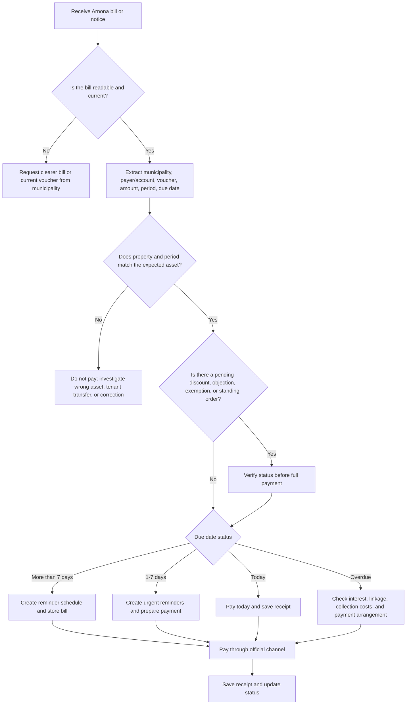
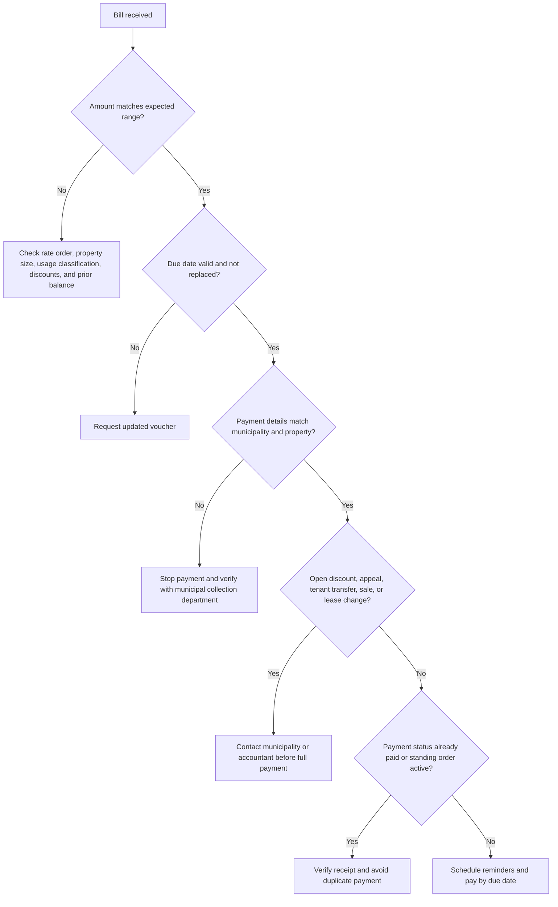

# Arnona Payment Reminder Skill

## Purpose

Create dependable reminder schedules and payment instructions for Israeli municipal property tax (Arnona) bills. Support consumers, freelancers, small businesses, accountants, and property managers that receive paper vouchers, email bills, PDF invoices, municipal app notices, or collection letters from any Israeli municipality or local council.

Use this skill to:

- Extract and normalize bill details: municipality, payer/account number, voucher number, property address, billing period, amount, due date, payment link, status, and receipt state.
- Decide whether to pay now, schedule reminders, request clarification, check a discount or objection, or contact the municipality.
- Generate localized payment instructions for online payment, bank transfer, standing order, municipal cashier, or accounting handoff.
- Create calendar/task reminders before the due date and overdue follow-ups after the due date.
- Prevent duplicate payments, wrong-property payments, late-payment costs, and lost receipts.
- Prepare evidence packs for accountants, tenants, landlords, or bookkeepers.

Do not calculate a legally binding Arnona charge unless the current municipal Arnona order, asset classification, area method, zone, usage, and discount decision are available. Do not add VAT to Arnona bill amounts or derive Arnona payment amounts from VAT. Focus on reminder reliability, current municipal balance checks, and safe payment execution.

## Inputs

Collect the following fields before generating a production reminder plan.

| Field | Required | Notes |
|---|---:|---|
| Municipality or local authority | Yes | Use the name printed on the bill. Match local councils and regional councils by official name. |
| Payer/account number | Yes | Often called מספר משלם, מספר חשבון, מספר נכס, מספר לקוח, or account/reference number. |
| Bill/voucher number | Yes | Needed for online payment and reconciliation. |
| Taxpayer name | Yes | Individual, business, landlord, tenant, or management company. |
| Property address | Yes | Include apartment, shop number, floor, industrial zone, or unit when present. |
| Billing period | Yes | Commonly bimonthly, annual, quarterly, or irregular after a correction. |
| Issue date | Yes | Used to detect stale or replaced vouchers. |
| Due date | Yes | The main reminder anchor. |
| Amount in ₪ | Yes | Use the amount payable on the latest bill, not a previous estimate. |
| Payment URL | Recommended | Prefer the link on the voucher or official municipal payment page. |
| Payment status | Recommended | unpaid, paid, partial, disputed, in standing order, or unknown. |
| Receipt or confirmation number | After payment | Required for evidence and accounting. |

## Output

Return a structured plan containing:

1. Current status: `paid`, `upcoming`, `due_soon`, `due_today`, or `overdue`.
2. Reminder schedule: 30, 14, 7, 3, 1, 0 days before the due date, plus overdue follow-up.
3. Payment instructions: required fields, exact checks before payment, payment-channel guidance, and receipt handling.
4. Validation warnings: suspicious dates, missing payer references, short voucher numbers, nonmatching property data, or late-payment risk.
5. Accounting handoff: amount, date, municipality, property, period, confirmation number, and receipt file naming convention.

## Core Workflow



## Decision Tree: Pay, Delay, or Escalate



## Reminder Policy

Default reminder offsets:

| Offset | Channel | Purpose |
|---:|---|---|
| 30 days before | Calendar | Early planning, cash-flow review, document checks. |
| 14 days before | Calendar | Verify bill, discount status, and payment method. |
| 7 days before | Email | Notify owner, business manager, or accountant. |
| 3 days before | SMS/task | Urgent payment preparation. |
| 1 day before | Task | Final check. |
| Due date | Calendar | Pay today. |
| 7 days after | Task | Overdue follow-up if receipt is missing. |

Adjust reminders for:

- Shabbat, holidays, and bank nonbusiness days.
- Businesses that require internal approval before payment.
- Multiple branches or properties with different municipalities.
- Tenants that reimburse landlords after payment.
- Credit-card limits near month end.
- Municipal systems that close at night or during maintenance.
- Bills under objection, discount review, or correction.

## Concrete Examples

### Example 1: Consumer bimonthly bill

Input:

```json
{
  "municipality": "Holon",
  "account_reference": "421337800",
  "bill_number": "2026-02-44127",
  "taxpayer_name": "Dana Levi",
  "property_address": "Sokolov 12/7, Holon",
  "period_start": "2026-01-01",
  "period_end": "2026-02-28",
  "issue_date": "2026-01-05",
  "due_date": "2026-02-28",
  "amount_nis": "782.40",
  "status": "unpaid"
}
```

Expected action: create reminders 30, 14, 7, 3, 1, and 0 days before 28-02-2026. Include an overdue check for 07-03-2026 only if no receipt exists.

### Example 2: Freelancer with home office

Input: a residential bill where part of the apartment is used for a business.  
Action: remind the payer to keep the Arnona receipt for bookkeeping, but avoid calling the entire bill a deductible business expense. Mark the receipt for accountant review and request professional classification guidance.

### Example 3: Small business branch

Input: a shop bill from a municipality with a high monthly amount.  
Action: add an approval step 14 days before the due date, alert the finance owner 7 days before, and store the payment confirmation with branch and property identifiers.

### Example 4: Overdue notice

Input: collection notice after the original due date.  
Action: do not reuse the old amount blindly. Instruct the payer to check updated balance, linkage, interest, collection costs, and whether a payment arrangement is available.

### Example 5: Duplicate bill

Input: two vouchers for the same municipality, property, period, and amount with different issue dates.  
Action: treat the newer voucher as controlling only after confirming that the older voucher was cancelled or superseded. Avoid paying both.

## Edge Cases

### Replaced or corrected voucher

A municipality may issue a corrected bill after a classification change, discount approval, occupancy update, meter/area correction, tenant transfer, or annual order change. Use the latest official balance only. Keep the older bill for audit trail, but do not schedule payment from an obsolete voucher.

### Standing order or direct debit

If the taxpayer has הוראת קבע, classify the bill as `standing_order_pending` in local records even if the normalized client uses `unpaid`. Generate a reminder to verify bank/card debit and receipt, not a reminder to pay manually. Manual payment can duplicate the debit.

### Discount request pending

If an eligibility request, disability discount, senior discount, low-income discount, vacant property exemption, new immigrant discount, reserve duty discount, or business relief request is pending, add a reminder to check status before paying the full amount. Paying in full may still be reasonable before the due date, but mark the payment as subject to later credit/refund.

### Tenant-landlord split

When a tenant pays Arnona directly, the landlord still may need evidence for lease compliance. Generate two outputs: payer instructions for the tenant and receipt request for the landlord/property manager.

### Property sale or lease change

If possession changed during the billing period, verify responsibility dates with municipality records. The printed payer may be wrong after a late ownership or tenant transfer update.

### Mixed-use property

For a residential unit used partly as a business, do not assume the municipal classification. Ask for the exact asset classification from the bill or municipal Arnona order before giving amount-related advice.

### Regional councils and local councils

Some councils use central payment providers or shared portals. Do not infer a payment link from the municipality name. Use the link on the bill or the council's official site.

### No online payment

Some payment routes require bank transfer, phone service, municipal cashier, or mailed voucher. Generate instructions that list required identifiers and caution that confirmation may arrive later.

### Overdue collection

After the due date, the amount printed on the original bill may be incomplete. Request an updated balance before payment. Mention interest, linkage, and collection expenses as items to verify.

### Partial payment

Do not create a "paid" status unless a receipt confirms full settlement of the bill or the municipality accepts a payment arrangement. Track partial payments separately.

## Anti-Patterns

Avoid these behaviors:

- Do not guess the payment URL from the municipality name.
- Do not pay from a search-engine advertisement or unofficial payment page.
- Do not use a prior-period voucher number for a new bill.
- Do not assume every authority uses bimonthly billing.
- Do not calculate payment amount from rates when an official bill is available.
- Do not ignore a pending objection, exemption, discount, tenant transfer, or standing order.
- Do not merge different properties under the same account without property identifiers.
- Do not mark a bill as paid based on credit-card authorization alone; require a receipt or municipal confirmation.
- Do not send the payer ID, bill number, or personal details to unverified links.
- Do not advise delaying payment solely because an objection exists; late-payment costs may accrue unless a stay or arrangement exists.
- Do not treat Arnona, water, parking fines, education fees, and business license fees as interchangeable.
- Do not assume Hebrew OCR extracted numbers correctly; verify every numeric field visually.

## Troubleshooting Quick Reference

| Symptom | Likely Cause | Action |
|---|---|---|
| Payment page rejects voucher | Wrong reference, expired voucher, municipality moved to another provider, or OCR error | Re-enter manually from the bill and try official municipality site. |
| Amount differs from bill | Interest, linkage, partial credit, discount, or updated balance | Contact collection department or fetch current balance. |
| Duplicate reminders | Bill imported twice or corrected bill not linked to original | Deduplicate by municipality + property + period + bill number. |
| Bill appears paid but no receipt | Standing order pending or card authorization not finalized | Check municipal account and card/bank statement. |
| Tenant refuses reimbursement | Missing receipt or lease allocation dispute | Send receipt, period, property address, and lease clause reference. |
| Business accountant rejects expense | Missing invoice/receipt or unclear business use | Provide receipt and ask accountant to classify the expense. |

## Production Checklist

Before enabling automatic reminders:

- Validate municipality and property identity from the latest bill.
- Store payer/account number and bill/voucher number separately.
- Store due dates as dates, not free text.
- Use DD/MM/YYYY for Hebrew user-facing messages and ISO YYYY-MM-DD for JSON.
- Store amounts in decimal format with two digits.
- Require a receipt before marking paid.
- Add manual review for overdue, disputed, partial, corrected, or unusually high bills.
- Add privacy controls for ID numbers, voucher numbers, property addresses, and payment URLs.
- Route all links through official municipality or printed-bill URLs.
- Keep a per-property audit trail: bill, reminders, payment confirmation, receipt, notes.
- Test Shabbat/holiday timing if messages are sent automatically.
- Verify that reminders are not sent after a bill is marked paid.
- Reconcile standing-order bills against actual debits.
- Review municipal Arnona orders annually, especially for business properties.

## Data Model

Recommended normalized bill object:

```json
{
  "municipality": "Ramat Gan",
  "account_reference": "900112233",
  "bill_number": "ARN-2026-00077",
  "taxpayer_name": "Example Studio",
  "property_address": "Bialik 40, Ramat Gan",
  "period_start": "2026-03-01",
  "period_end": "2026-04-30",
  "issue_date": "2026-03-03",
  "due_date": "2026-04-30",
  "amount_nis": "1288.90",
  "status": "unpaid",
  "payer_id": "123456782",
  "payment_url": "https://payments.example.invalid/arnona"
}
```

Use `payer_id` only when necessary. Mask it in logs and user-facing summaries unless the payer must enter it.

## Receipt Handling

After payment, store:

- Municipality.
- Payer/account number.
- Bill/voucher number.
- Property address.
- Billing period.
- Amount paid.
- Payment date.
- Payment method.
- Confirmation number.
- Receipt file or screenshot.
- Operator name when paid by a business employee.
- Notes about discount, objection, settlement, or reimbursement.

Recommended file name:

```text
YYYY-MM-DD_arnona_<municipality>_<property-or-branch>_<period>_<confirmation>.pdf
```

## Security and Privacy

Treat Arnona bills as sensitive personal and financial documents. They may contain home addresses, ID numbers, municipal account identifiers, payment links, and business location details.

Security rules:

- Prefer official municipal URLs and links printed on bills.
- Do not expose payer IDs or voucher numbers in chat titles, public logs, or shared screenshots.
- Mask identifiers in reminders unless needed for payment execution.
- Store receipts in access-controlled accounting folders.
- Do not send payment instructions to a tenant, employee, or accountant without confirming authorization.
- Do not use unofficial payment intermediaries unless the municipality explicitly directs to them.

## Localization Rules

English output:

- Use `₪1,234.56`.
- Use ISO dates in data and clear English dates in prose.
- Use "Arnona", "municipal property tax", "payer/account number", and "bill/voucher number".

Hebrew output:

- Use `₪1,234.56`.
- Use `DD/MM/YYYY`.
- Use "ארנונה", "מספר משלם/חשבון", "מספר שובר", "תקופת חיוב", "מועד לתשלום", "אישור תשלום", "קבלה", "הוראת קבע", "הנחה", "פטור", "השגה", "הסדר תשלומים", "הוצאות גבייה".
- Prefer professional Hebrew terms over transliteration.

## When to Escalate

Escalate to municipality service, collection department, accountant, or legal adviser when:

- The bill is overdue and collection costs may accrue.
- The amount changed materially from prior periods.
- The property classification or area looks wrong.
- A discount or exemption was denied or ignored.
- The payer is not the current occupier or owner.
- A business asset changed use, area, branch, or tenant.
- A bank/card debit occurred without matching receipt.
- The bill is part of enforcement, lien, execution, or formal collection.
- The user asks for legal rights, appeal strategy, or tax deductibility.

## Minimal Safe Answer Pattern

When only partial data is available, respond with a safe checklist instead of a payment instruction:

1. Request municipality, payer/account number, bill number, amount, due date, and billing period.
2. Ask whether a standing order, discount request, objection, or previous payment exists.
3. Instruct the user to use the official municipality payment page or link on the bill.
4. Suggest saving the receipt and updating reminders after payment.
5. Avoid claiming the amount is correct without the current bill.

## Files in This Package

- `SKILL.md` — English usage guide.
- `SKILL_HE.md` — Hebrew usage guide.
- `references/api-reference.md` — regulatory and integration reference.
- `references/verification-log.md` — web source validation log with two-pass checks.
- `references/workflow-guide.md` — end-to-end workflows.
- `references/troubleshooting.md` — operational troubleshooting guide.
- `references/test-scenarios.md` — concrete test scenarios.
- `references/migration-checklist.md` — migration guidance from calculator/optimizer workflows.
- `arnona_payment_reminder/client.py` — typed sync and async implementation.
- `scripts/arnona-payment-reminder-cli.py` — Click CLI.
- `scripts/test_arnona_payment_reminder_client.py` — pytest coverage.
- `scripts/examples/` — runnable examples.

## Disclaimer / הבהרה

This skill is a preparation and automation aid only. It does not constitute tax, legal, financial, or other professional advice, and its output must be reviewed by a licensed professional (רו"ח / עו"ד / יועץ מס) before any filing, payment, or contractual use.

כלי זה מהווה שכבת הכנה ואוטומציה בלבד. אין בו ייעוץ מס, ייעוץ משפטי או ייעוץ מקצועי אחר, ויש לאמת כל פלט מול בעל מקצוע מורשה לפני הגשה, תשלום או שימוש חוזי.
