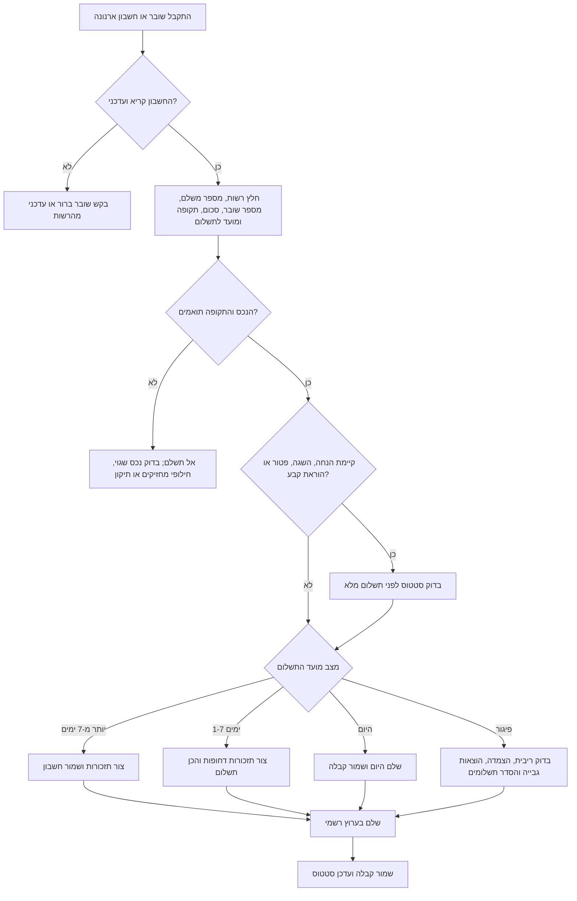
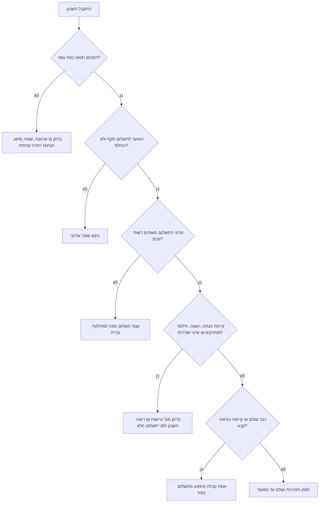

# מיומנות תזכורות לתשלום ארנונה

## מטרה

בנה תזכורות והוראות תשלום לתשלומי ארנונה בישראל. השתמש במיומנות עבור משקי בית, עצמאים, עסקים קטנים, בעלי נכסים, שוכרים, מנהלי נכסים ומשרדי הנהלת חשבונות שמקבלים שובר נייר, חשבון PDF, הודעת דוא"ל, הודעה באפליקציה עירונית או מכתב גבייה.

המיומנות מיועדת ל:

- חילוץ ונרמול פרטי חיוב: רשות מקומית, מספר משלם/חשבון, מספר שובר, כתובת נכס, תקופת חיוב, סכום, מועד לתשלום, קישור תשלום, סטטוס וקבלה.
- קביעה אם לשלם עכשיו, לתזמן תזכורות, לבדוק הנחה או השגה, לבקש הבהרה או לפנות לרשות.
- יצירת הוראות תשלום בעברית מקצועית לתשלום מקוון, העברה בנקאית, הוראת קבע, קופה עירונית או העברה להנהלת חשבונות.
- יצירת תזכורות ביומן ובמשימות לפני מועד התשלום ומעקב לאחר המועד.
- מניעת תשלום כפול, תשלום לנכס שגוי, עלויות פיגור ואובדן קבלות.
- הכנת תיק אסמכתאות לרואה חשבון, מנהלת חשבונות, בעל נכס, שוכר או מנהל נכסים.

אל תציג חישוב חיוב מחייב ללא צו הארנונה העדכני של הרשות, סיווג הנכס, שיטת מדידת שטח, אזור, שימוש, החלטת הנחה ויתרת חשבון עדכנית. אל תוסיף מע"מ לסכום הארנונה ואל תגזור סכום לתשלום משיעור המע"מ. התמקד בביצוע בטוח של התשלום, בבדיקת יתרה עדכנית ובאמינות התזכורות.

## נתונים נדרשים

אסוף את השדות הבאים לפני יצירת תכנית תזכורות לשימוש בפועל.

| שדה | חובה | הערות |
|---|---:|---|
| רשות מקומית | כן | השתמש בשם שמופיע בשובר. כלול עירייה, מועצה מקומית או מועצה אזורית. |
| מספר משלם/חשבון | כן | עשוי להופיע כמספר נכס, מספר לקוח, מספר חשבון או מספר משלם. |
| מספר שובר | כן | נדרש לתשלום מקוון ולשיוך הקבלה. |
| שם משלם | כן | יחיד, עסק, בעל נכס, שוכר או חברת ניהול. |
| כתובת נכס | כן | כלול דירה, חנות, קומה, אזור תעשייה או יחידה אם מופיעים. |
| תקופת חיוב | כן | לרוב דו-חודשי, שנתי, רבעוני או חיוב חריג בעקבות תיקון. |
| תאריך הפקת החשבון | כן | מסייע בזיהוי שובר ישן או מוחלף. |
| מועד לתשלום | כן | העוגן המרכזי לתזכורות. |
| סכום ב-₪ | כן | השתמש בסכום לתשלום בשובר העדכני, לא בהערכה מתקופה קודמת. |
| קישור תשלום | מומלץ | העדף קישור שמופיע בשובר או באתר הרשמי של הרשות. |
| סטטוס תשלום | מומלץ | לא שולם, שולם, חלקי, בהשגה, בהוראת קבע או לא ידוע. |
| מספר אישור/קבלה | לאחר תשלום | נדרש לבקרה ולהנהלת חשבונות. |

## פלט

החזר תכנית מובנית הכוללת:

1. סטטוס נוכחי: `paid`, `upcoming`, `due_soon`, `due_today`, `overdue`.
2. תזכורות: 30, 14, 7, 3, 1 ו-0 ימים לפני מועד התשלום, ובדיקת פיגור לאחר המועד.
3. הוראות תשלום: שדות נדרשים, בדיקות לפני תשלום, ערוצי תשלום ושמירת קבלה.
4. אזהרות אימות: תאריכים חשודים, מספר משלם חסר, מספר שובר קצר, נכס לא תואם או סיכון פיגור.
5. מסירת מידע להנהלת חשבונות: סכום, תאריך, רשות, נכס, תקופה, מספר אישור ושם קובץ קבלה.

## תהליך מרכזי



## עץ החלטה: לשלם, להמתין או להסלים



## מדיניות תזכורות

ברירת המחדל:

| זמן | ערוץ | מטרה |
|---:|---|---|
| 30 ימים לפני | יומן | תכנון תזרים ובדיקת מסמכים. |
| 14 ימים לפני | יומן | אימות שובר, הנחה ואמצעי תשלום. |
| 7 ימים לפני | דוא"ל | עדכון בעל עסק, מנהל כספים או רואה חשבון. |
| 3 ימים לפני | SMS/משימה | הכנה דחופה לתשלום. |
| יום לפני | משימה | בדיקה אחרונה. |
| ביום המועד | יומן | תשלום היום. |
| 7 ימים אחרי | משימה | בדיקת פיגור אם אין קבלה. |

התאם תזכורות עבור שבתות, חגים, ימי בנק, אישור פנימי בעסק, מספר סניפים, שוכרים, מסגרת אשראי, תחזוקת מערכות עירוניות, השגות והנחות.

## דוגמאות שימוש

### דוגמה 1: חשבון דו-חודשי לצרכן

```json
{
  "municipality": "Holon",
  "account_reference": "421337800",
  "bill_number": "2026-02-44127",
  "taxpayer_name": "דנה לוי",
  "property_address": "סוקולוב 12/7, חולון",
  "period_start": "2026-01-01",
  "period_end": "2026-02-28",
  "issue_date": "2026-01-05",
  "due_date": "2026-02-28",
  "amount_nis": "782.40",
  "status": "unpaid"
}
```

פעולה: צור תזכורות ל-30, 14, 7, 3, 1 ו-0 ימים לפני 28-02-2026. הוסף בדיקת פיגור ל-07-03-2026 רק אם אין קבלה.

### דוגמה 2: עצמאי שעובד מהבית

כאשר החשבון הוא למגורים וחלק מהדירה משמש לעסק, שמור את קבלת הארנונה לבדיקת רואה חשבון. אל תסווג אוטומטית את כל החיוב כהוצאה עסקית.

### דוגמה 3: עסק קטן עם חנות

כאשר מדובר בחנות עם סכום גבוה, הוסף אישור בעלים 14 ימים לפני המועד, תזכורת למנהל כספים 7 ימים לפני ושמירת קבלה לפי סניף ונכס.

### דוגמה 4: הודעת פיגור

כאשר התקבלה הודעת גבייה לאחר המועד המקורי, אל תשתמש בסכום הישן ללא בדיקה. דרוש יתרה עדכנית, הצמדה, ריבית והוצאות גבייה.

### דוגמה 5: שובר כפול

כאשר קיימים שני שוברים לאותה רשות, נכס, תקופה וסכום אך עם תאריכי הפקה שונים, התייחס לשובר החדש רק לאחר אימות שהישן בוטל או הוחלף.

## מקרי קצה

### שובר מתוקן או מוחלף

רשות מקומית עשויה להפיק שובר מתוקן לאחר שינוי סיווג, אישור הנחה, תיקון מחזיק, שינוי שטח, חילופי שוכר או עדכון צו ארנונה. השתמש ביתרה הרשמית העדכנית בלבד. שמור את השובר הישן לתיעוד, אך אל תתזמן תשלום ממנו אם הוחלף.

### הוראת קבע

כאשר קיימת הוראת קבע, צור תזכורת לאימות חיוב וקבלה ולא תזכורת לתשלום ידני. תשלום ידני עלול ליצור כפילות.

### בקשת הנחה פתוחה

כאשר קיימת בקשת הנחה, פטור נכס ריק, הנחת אזרח ותיק, נכות, עולה חדש, מילואים, הכנסה נמוכה או הקלה עסקית, צור תזכורת לבדוק סטטוס לפני תשלום מלא. תשלום מלא עשוי להיות סביר כדי למנוע פיגור, אך סמן אפשרות לזיכוי או החזר בהמשך.

### שוכר ובעל נכס

כאשר השוכר משלם, בעל הנכס עשוי להזדקק לאסמכתה. צור פלט נפרד: הוראות תשלום לשוכר ובקשת קבלה לבעל הנכס.

### מכירה או שינוי שכירות

כאשר החזקה בנכס השתנתה באמצע תקופת החיוב, בדוק תאריכי אחריות מול הרשומות ברשות. שם המשלם בשובר עלול להיות לא מעודכן.

### נכס בשימוש מעורב

אל תניח סיווג עירוני כאשר דירת מגורים משמשת בחלקה לעסק. בקש סיווג נכס מדויק מהשובר או מצו הארנונה לפני כל ייעוץ על סכום.

### מועצות מקומיות ואזוריות

חלק מהרשויות משתמשות בספק תשלומים מרכזי או בפורטל משותף. אל תנחש קישור תשלום לפי שם הרשות. השתמש בקישור שמופיע בשובר או באתר הרשמי.

### אין תשלום מקוון

כאשר נדרש תשלום בנקאי, טלפוני, בקופה עירונית או באמצעות שובר, הצג רשימת שדות חובה והזהר שקבלה עשויה להתקבל מאוחר יותר.

### גבייה בפיגור

לאחר מועד התשלום, הסכום בשובר המקורי עשוי להיות חסר. דרוש יתרה עדכנית. ציין בדיקת ריבית, הצמדה והוצאות גבייה.

### תשלום חלקי

אל סמן חשבון כ"שולם" ללא קבלה שמאשרת סילוק מלא או הסדר תשלומים מאושר. עקוב אחר תשלומים חלקיים בנפרד.

## דפוסים שגויים שיש להימנע מהם

- אל תנחש קישור תשלום לפי שם העיר.
- אל תשלם דרך מודעה, קישור לא רשמי או אתר שאינו שייך לרשות.
- אל תשתמש במספר שובר מתקופה קודמת.
- אל תניח שכל הרשויות מחייבות דו-חודשי.
- אל תחשב סכום לפי תעריפים כאשר קיים שובר רשמי.
- אל תתעלם מהנחה, פטור, השגה, הוראת קבע או חילופי מחזיקים.
- אל תאחד כמה נכסים ללא מזהה נכס ברור.
- אל תסמן תשלום כבוצע על סמך אישור אשראי בלבד; דרוש קבלה או אישור מהרשות.
- אל תשלח מספר זהות, מספר שובר או פרטי נכס בקישור לא מאומת.
- אל תמליץ לדחות תשלום רק בגלל השגה; עלויות פיגור עשויות להיצבר.
- אל תערבב ארנונה, מים, חניה, אגרות חינוך ורישוי עסקים.
- אל תסמוך על OCR בעברית בלי אימות חזותי של כל מספר.

## איתור תקלות מהיר

| סימפטום | סיבה אפשרית | פעולה |
|---|---|---|
| אתר התשלום דוחה את השובר | מספר שגוי, שובר פג תוקף, ספק תשלומים אחר או שגיאת OCR | הזן ידנית מתוך השובר ונסה דרך האתר הרשמי. |
| הסכום באתר שונה מהשובר | ריבית, הצמדה, זיכוי, הנחה או יתרה מעודכנת | פנה למחלקת גבייה או בדוק יתרה עדכנית. |
| תזכורות כפולות | החשבון יובא פעמיים או שובר מתוקן לא קושר לקודם | בצע איחוד לפי רשות + נכס + תקופה + שובר. |
| החשבון נראה שולם אך אין קבלה | הוראת קבע ממתינה או אישור אשראי לא סופי | בדוק חשבון עירוני ותנועת בנק/אשראי. |
| שוכר לא מחזיר תשלום | חסרה קבלה או קיימת מחלוקת לפי חוזה | שלח קבלה, תקופה, כתובת וסעיף חוזה רלוונטי. |
| הנהלת חשבונות דוחה אסמכתה | חסרה קבלה או לא ברור קשר עסקי | ספק קבלה ובקש סיווג חשבונאי. |

## רשימת בדיקה להפעלה

לפני הפעלת תזכורות אוטומטיות:

- אמת רשות מקומית ונכס מתוך השובר העדכני.
- שמור מספר משלם/חשבון ומספר שובר כשדות נפרדים.
- שמור מועדים כתאריכים, לא כטקסט חופשי.
- הצג תאריכים בעברית בפורמט DD/MM/YYYY.
- שמור סכומים בדיוק של שתי ספרות אחרי הנקודה.
- דרוש קבלה לפני שינוי סטטוס ל"שולם".
- הוסף בדיקה ידנית לחשבון בפיגור, במחלוקת, חלקי, מתוקן או חריג בסכום.
- הגן על מספרי זהות, מספרי שובר, כתובות וקישורי תשלום.
- הפנה רק לאתר רשמי של הרשות או לקישור שמופיע בשובר.
- שמור תיק לכל נכס: שובר, תזכורות, אישור תשלום, קבלה והערות.
- בדוק שבתות וחגים לפני שליחת הודעות אוטומטיות.
- ודא שלא נשלחות תזכורות לאחר סימון תשלום.
- בצע התאמת הוראות קבע מול חיוב בפועל.
- בדוק צווי ארנונה מדי שנה, במיוחד לנכסים עסקיים.

## מודל נתונים מומלץ

```json
{
  "municipality": "Ramat Gan",
  "account_reference": "900112233",
  "bill_number": "ARN-2026-00077",
  "taxpayer_name": "סטודיו דוגמה",
  "property_address": "ביאליק 40, רמת גן",
  "period_start": "2026-03-01",
  "period_end": "2026-04-30",
  "issue_date": "2026-03-03",
  "due_date": "2026-04-30",
  "amount_nis": "1288.90",
  "status": "unpaid",
  "payer_id": "123456782",
  "payment_url": "https://payments.example.invalid/arnona"
}
```

השתמש במספר זהות או מספר חברה רק כאשר נדרש. מסך אותו בלוגים ובסיכומים שאינם מיועדים לתשלום בפועל.

## טיפול בקבלות

לאחר תשלום, שמור:

- רשות מקומית.
- מספר משלם/חשבון.
- מספר שובר.
- כתובת נכס.
- תקופת חיוב.
- סכום ששולם.
- תאריך תשלום.
- אמצעי תשלום.
- מספר אישור.
- קבלה או צילום מסך.
- שם מבצע התשלום בעסק.
- הערות על הנחה, השגה, הסדר או החזר משוכר.

שם קובץ מומלץ:

```text
YYYY-MM-DD_arnona_<municipality>_<property-or-branch>_<period>_<confirmation>.pdf
```

## אבטחת מידע ופרטיות

חשבון ארנונה הוא מסמך רגיש. הוא עשוי לכלול כתובת מגורים, מספר זהות, מספר חשבון עירוני, קישור תשלום ופרטי מיקום עסקי.

כללי אבטחה:

- העדף קישורים רשמיים של הרשות וקישורים שמופיעים בשובר.
- אל תחשוף מספרי זהות או מספרי שובר בכותרות צ'אט, לוגים ציבוריים או צילומי מסך.
- מסך מזהים בתזכורות כאשר אינם נחוצים לביצוע התשלום.
- שמור קבלות בתיקיית הנהלת חשבונות עם בקרת גישה.
- אל תשלח הוראות תשלום לשוכר, עובד או רואה חשבון ללא הרשאה.
- אל תשתמש במתווך תשלום לא רשמי אלא אם הרשות מפנה אליו במפורש.

## כללי לוקליזציה

פלט עברי:

- השתמש ב-`₪1,234.56`.
- השתמש ב-`DD/MM/YYYY`.
- השתמש במונחים: "ארנונה", "מספר משלם/חשבון", "מספר שובר", "תקופת חיוב", "מועד לתשלום", "אישור תשלום", "קבלה", "הוראת קבע", "הנחה", "פטור", "השגה", "הסדר תשלומים", "הוצאות גבייה".
- העדף מונחים עבריים מקצועיים ולא תעתיק כשיש מונח מקובל.

פלט אנגלי:

- השתמש ב-`₪1,234.56`.
- שמור JSON בתאריכי ISO.
- השתמש במונחים האנגליים Arnona, municipal property tax, payer/account number ו-bill/voucher number כאשר הפלט מיועד לקורא באנגלית.

## מתי להסלים

הסלם לרשות המקומית, למחלקת גבייה, לרואה חשבון או לייעוץ משפטי כאשר:

- החשבון בפיגור ועלולות להיווצר הוצאות גבייה.
- הסכום השתנה מהותית מתקופות קודמות.
- סיווג הנכס או שטחו נראים שגויים.
- הנחה או פטור נדחו או לא עודכנו.
- המשלם אינו המחזיק או הבעלים הנוכחי.
- נכס עסקי שינה שימוש, שטח, סניף או שוכר.
- בוצע חיוב בנק/אשראי ללא קבלה תואמת.
- החשבון נמצא באכיפה, עיקול, הוצאה לפועל או גבייה פורמלית.
- המשתמש מבקש זכויות משפטיות, אסטרטגיית השגה או הכרה במס.

## תבנית תשובה בטוחה כאשר חסרים נתונים

כאשר המידע חלקי בלבד:

1. בקש רשות, מספר משלם/חשבון, מספר שובר, סכום, מועד לתשלום ותקופת חיוב.
2. בדוק אם קיימת הוראת קבע, בקשת הנחה, השגה או תשלום קודם.
3. הנחה להשתמש באתר הרשמי של הרשות או בקישור שמופיע בשובר.
4. בקש לשמור קבלה ולעדכן סטטוס לאחר התשלום.
5. אל תאשר שהסכום נכון ללא שובר עדכני.

## קבצים בחבילה

- `SKILL.md` — מדריך באנגלית.
- `SKILL_HE.md` — מדריך בעברית.
- `references/api-reference.md` — הפניות רגולטוריות וממשקי אינטגרציה.
- `references/verification-log.md` — יומן אימות מקורות בשני סבבים.
- `references/workflow-guide.md` — תהליכי עבודה מקצה לקצה.
- `references/troubleshooting.md` — מדריך תקלות.
- `references/test-scenarios.md` — תרחישי בדיקה.
- `references/migration-checklist.md` — מעבר מתהליכי חישוב ואופטימיזציה לתזכורות תשלום.
- `arnona_payment_reminder/client.py` — מימוש Python מסונכרן ואסינכרוני.
- `scripts/arnona-payment-reminder-cli.py` — מעטפת שורת פקודה.
- `scripts/examples/` — דוגמאות הרצה.
