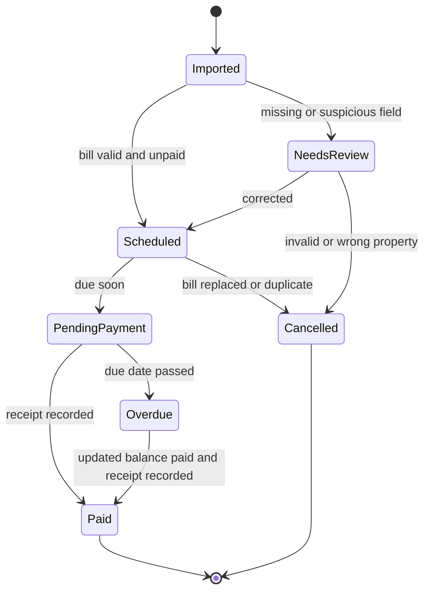

# API and Regulatory Reference

## Scope

Arnona payment reminders depend on local authority billing records, annual Arnona orders, payment provider pages, and receipt confirmations. Israel does not provide one uniform national Arnona payment API for all municipalities. Treat every municipality or council as a separate integration target unless a verified shared provider contract exists.

Use this reference to design adapters, validation layers, and user instructions. Verify current law, regulations, municipal orders, payment URLs, and privacy requirements before production deployment.

## Web-Validated Scope Notes

- Use municipal bills, official payment pages, or authenticated municipal personal areas as the source of truth for amounts.
- Do not add VAT to Arnona amounts or derive Arnona payment amounts from the VAT rate. The current Israeli VAT rate was verified as 18% from 01/01/2025 for accounting context only.
- No uniform national Arnona payment API, endpoint path, or webhook event vocabulary was confirmed. Treat any HTTP examples below as adapter design examples, not live endpoints.
- Keep a municipality-specific source URL and access timestamp for every payment page, balance lookup, and Arnona order used in production.

## Regulatory Sources to Verify

| Source | Hebrew name | Relevance | Required implementation behavior |
|---|---|---|---|
| Local authority annual Arnona order | צו ארנונה | Defines annual rates, classifications, zones, area methods, deadlines, and local payment details. | Store the order year and URL when using any amount-related logic. Do not infer a payment amount from stale rates. |
| Arrangements in the State Economy Law, 1992 | חוק ההסדרים במשק המדינה, תשנ"ג-1992 | Framework for local authority general Arnona, annual changes, and state controls. | Treat annual update rules as background only; rely on actual bill for payment reminders. |
| Arrangements in the State Economy Regulations: General Arnona in Local Authorities | תקנות הסדרים במשק המדינה (ארנונה כללית ברשויות המקומיות) | Supports definitions, property classifications, and annual Arnona procedures. | Use for terminology and validation. Do not provide legal conclusions. |
| Arrangements in the State Economy Regulations: Arnona Discounts, 1993 | תקנות הסדרים במשק המדינה (הנחה מארנונה), תשנ"ג-1993 | National framework for discount categories and municipal handling. | Add "check discount status" reminders when a discount request is pending. |
| Municipalities Ordinance [New Version] | פקודת העיריות [נוסח חדש] | Municipal authority, billing, service, and collection framework for municipalities. | Escalate disputes, collection, or enforcement questions to official channels. |
| Local Councils Ordinance | פקודת המועצות המקומיות | Similar authority framework for local councils. | Include councils and regional councils in the same reminder model. |
| Taxes (Collection) Ordinance | פקודת המסים (גביה) | Collection powers and enforcement context for overdue debts. | For overdue bills, instruct checking updated balance, interest, linkage, and collection costs. |
| Protection of Privacy Law, 1981 | חוק הגנת הפרטיות, תשמ"א-1981 | Personal data protection for ID numbers, addresses, account identifiers, and receipts. | Mask identifiers, minimize stored data, restrict receipt access, and avoid unverified links. |
| Electronic Signature Law, 2001 | חוק חתימה אלקטרונית, תשס"א-2001 | Digital records and signed confirmations may matter for receipts and approvals. | Preserve digital receipts and confirmation metadata. |
| Income Tax and VAT bookkeeping rules | הוראות ניהול ספרים, מע"מ ומס הכנסה | Business recordkeeping for deductible expenses and supporting documents. | Store receipt, amount, date, business relationship, and accountant handoff. Do not classify deductibility automatically. |

## Official Data and Service Source Types

| Source type | Typical access | Use | Risk |
|---|---|---|---|
| Municipal payment page | Browser form, sometimes embedded provider | Online payment by payer number, voucher number, ID/company number, amount | URLs and form fields vary; pages may change without notice. |
| Municipal personal area | Login with ID, SMS, or national identification | Current balance, receipt, standing-order status, discount status | Requires user authentication and authorization. |
| PDF or paper bill | Upload, OCR, manual entry | Primary source for reminders | OCR errors are common in Hebrew and numeric fields. |
| Municipal service center | Phone, email, online ticket | Resolve rejected vouchers, late balances, corrections, disputes | Manual SLA and documentation required. |
| Annual Arnona order | PDF/HTML on municipal site | Rate/classification reference | Updated annually; not a payment source. |
| Gov.il or Ministry of Interior publications | Web documents and databases | Regulatory context and local authority information | Not a universal payment API. |
| Accounting system | API, CSV, upload, email | Receipt archiving and expense workflow | Avoid sending sensitive identifiers to unauthorized users. |

## Adapter Contract

Implement each municipality or payment provider adapter behind a common interface.

### Request: Resolve Current Balance

```json
{
  "municipality": "Ramat Gan",
  "account_reference": "900112233",
  "bill_number": "ARN-2026-00077",
  "payer_id": "123456782",
  "property_address_hint": "Bialik 40",
  "period_start": "2026-03-01",
  "period_end": "2026-04-30"
}
```

### Response: Current Balance

```json
{
  "status": "ok",
  "municipality": "Ramat Gan",
  "account_reference": "900112233",
  "bill_number": "ARN-2026-00077",
  "balance_nis": "1288.90",
  "due_date": "2026-04-30",
  "is_overdue": false,
  "standing_order_active": false,
  "discount_pending": false,
  "payment_url": "https://payments.example.invalid/arnona",
  "source_timestamp": "2026-03-15T08:30:00+02:00",
  "warnings": []
}
```

### Request: Create Reminder Plan

```json
{
  "bill": {
    "municipality": "Ramat Gan",
    "account_reference": "900112233",
    "bill_number": "ARN-2026-00077",
    "taxpayer_name": "Example Studio",
    "property_address": "Bialik 40, Ramat Gan",
    "period_start": "2026-03-01",
    "period_end": "2026-04-30",
    "issue_date": "2026-03-03",
    "due_date": "2026-04-30",
    "amount_nis": "1288.90",
    "status": "unpaid"
  },
  "language": "he",
  "include_past": false,
  "reference_date": "2026-04-20"
}
```

### Response: Reminder Plan

```json
{
  "status": "due_soon",
  "events": [
    {
      "send_on": "2026-04-23",
      "title": "תזכורת ארנונה: 7 ימים לתשלום - רמת גן",
      "severity": "warning",
      "channel": "email"
    },
    {
      "send_on": "2026-04-27",
      "title": "תזכורת ארנונה: 3 ימים לתשלום - רמת גן",
      "severity": "urgent",
      "channel": "sms"
    },
    {
      "send_on": "2026-04-30",
      "title": "היום מועד תשלום הארנונה - רמת גן",
      "severity": "urgent",
      "channel": "calendar"
    }
  ],
  "instructions": {
    "summary": "הכן תשלום ארנונה לרמת גן עבור ביאליק 40, רמת גן, סכום ₪1,288.90.",
    "required_fields": [
      "payer/account number",
      "bill/voucher number",
      "ID number or company number",
      "סכום לתשלום",
      "תקופת חיוב"
    ]
  },
  "validation_warnings": []
}
```

### Request: Record Receipt

```json
{
  "municipality": "Ramat Gan",
  "account_reference": "900112233",
  "bill_number": "ARN-2026-00077",
  "paid_at": "2026-04-28T10:14:00+03:00",
  "amount_paid_nis": "1288.90",
  "confirmation_number": "987654321",
  "receipt_file": "2026-04-28_arnona_ramat-gan_bialik-40_2026-03-04_987654321.pdf",
  "payment_method": "credit_card"
}
```

### Response: Receipt Record

```json
{
  "status": "recorded",
  "bill_status": "paid",
  "receipt_required_for_accounting": true,
  "next_action": "cancel_future_reminders"
}
```

## Common Error Table

| Code | Meaning | Retry | User-facing instruction |
|---|---|---:|---|
| `MUNICIPALITY_NOT_SUPPORTED` | No configured adapter for the authority. | No | Use generic official-site instructions and store manual receipt. |
| `PAYMENT_URL_UNKNOWN` | No verified payment URL. | No | Open the link printed on the bill or official municipality site. |
| `BILL_NOT_FOUND` | Municipality could not locate the voucher. | Yes, after manual check | Re-enter payer/account and voucher number from the bill. |
| `BILL_REPLACED` | Voucher was superseded by a later bill. | No | Request or fetch the current voucher before payment. |
| `BALANCE_CHANGED` | Current balance differs from saved bill. | No automatic payment | Show both amounts and request confirmation from the municipality or payer. |
| `ALREADY_PAID` | Municipality reports paid status. | No | Request receipt and cancel future payment reminders. |
| `STANDING_ORDER_ACTIVE` | Direct debit exists. | No manual payment | Schedule debit verification rather than payment. |
| `DISCOUNT_PENDING` | Discount or exemption request is open. | No automatic full-payment advice | Check municipal status and decide whether payment is required before due date. |
| `OVERDUE_AMOUNT_UNKNOWN` | Original due date passed and current balance unavailable. | No | Request updated balance including interest, linkage, and collection costs. |
| `IDENTIFIER_REJECTED` | ID/company/account number validation failed. | Yes | Verify all digits manually; avoid OCR-only entry. |
| `PROPERTY_MISMATCH` | Returned property differs from saved bill. | No | Stop payment and contact municipality. |
| `UNOFFICIAL_LINK` | Payment link is not recognized as official. | No | Use official municipal site or printed voucher link. |
| `RATE_ORDER_STALE` | Annual order reference is older than the bill year. | No | Fetch current Arnona order before amount analysis. |
| `PRIVACY_BLOCKED` | User lacks authority to access bill details. | No | Request authorization or let the payer perform the action. |
| `RECEIPT_MISSING` | Payment attempt has no confirmation receipt. | Yes | Check municipal account and payment method statement. |

## HTTP Integration Pattern

Some municipalities or providers expose authenticated endpoints, but field names and authentication differ. Do not assume this example matches a real municipality. Use it as a safe adapter shape.

### Balance Lookup

```http
POST /api/arnona/balance HTTP/1.1
Host: payments.example.invalid
Content-Type: application/json
Authorization: Bearer <token>

{
  "accountReference": "900112233",
  "voucherNumber": "ARN-2026-00077",
  "payerId": "123456782"
}
```

Success:

```json
{
  "balance": {
    "amount": "1288.90",
    "currency": "ILS",
    "dueDate": "2026-04-30",
    "status": "OPEN"
  },
  "property": {
    "address": "Bialik 40, Ramat Gan",
    "assetNumber": "445566"
  },
  "payment": {
    "url": "https://payments.example.invalid/pay/abc123",
    "methods": ["credit_card", "bank_transfer"]
  }
}
```

Rejected voucher:

```json
{
  "error": {
    "code": "BILL_NOT_FOUND",
    "message": "Voucher number was not found for this account."
  }
}
```


## Webhooks

No official cross-municipality Arnona webhook event names were confirmed. If an implementation needs events, define internal names such as `bill.imported`, `reminder.scheduled`, `balance.review_required`, `receipt.recorded`, and `bill.cancelled`, then map each municipality or payment provider separately after a verified contract exists.

## Validation Rules

Apply these checks before generating payment instructions:

| Rule | Failure handling |
|---|---|
| Amount must be positive and have two decimal places. | Stop automation and request review. |
| Due date must be on or after issue date. | Warn and request current bill. |
| Period start must be on or before period end. | Stop automation and request corrected dates. |
| Municipality must be present. | Stop automation. |
| Account and voucher numbers must be present. | Stop automation. |
| Payer ID must not be shown unless required. | Mask in reminders. |
| Property address must match expected property. | Stop payment if mismatch exists. |
| Paid status must have receipt or confirmation evidence. | Keep status pending until receipt exists. |
| Overdue bills must use current balance. | Do not pay stale amount automatically. |

## Privacy and Audit Fields

Recommended event log:

```json
{
  "event_type": "reminder_sent",
  "created_at": "2026-04-23T09:00:00+03:00",
  "municipality": "Ramat Gan",
  "bill_number_hash": "sha256:...",
  "account_reference_hash": "sha256:...",
  "property_label": "Bialik 40 branch",
  "recipient_role": "bookkeeper",
  "channel": "email",
  "message_template": "due_in_7_days_he",
  "delivery_status": "sent"
}
```

Store hashes or masked values in operational logs. Keep raw identifiers only in restricted bill records.

## Recommended Status Machine



## Municipal Profile Schema

```json
{
  "tel-aviv": {
    "name": "Tel Aviv-Yafo",
    "hebrew_name": "תל אביב-יפו",
    "municipality_code": "5000",
    "payment_url": "https://tlvpay.tel-aviv.gov.il/he/s/arnona",
    "service_url": "https://www.tel-aviv.gov.il/en/Live/ArnonaAndCityTaxes/Pages/default.aspx",
    "arnona_order_url": "https://www.tel-aviv.gov.il/About/Pages/Payments.aspx",
    "payment_methods": ["credit_card", "bank_transfer", "standing_order"],
    "supports_online_payment": true,
    "supports_installments": true,
    "notes": ["Verify active payment page before sending instructions."]
  }
}
```

## Production Integration Checklist

- Maintain one adapter per municipality or provider.
- Capture source timestamp for every current-balance lookup.
- Detect bill replacement and duplicate import.
- Keep link validation separate from bill validation.
- Disable automatic payment instructions when the URL is unknown or unofficial.
- Mask identifiers in logs and reminder titles.
- Record receipt before cancelling future reminders.
- Keep an audit trail for manual overrides.
- Re-check current balance after due date.
- Review legal and municipal references annually.
