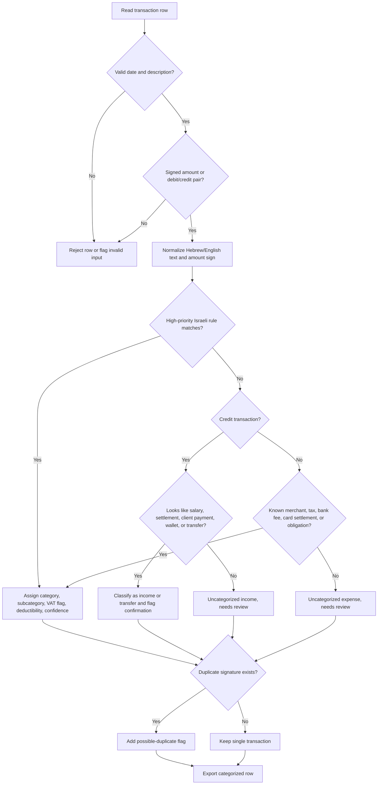

# Bank Transaction Categorizer

Categorize Israeli bank transactions from exported statements and produce review-ready summaries for small businesses, freelancers, households, and finance teams.

The skill accepts CSV-style statement exports, normalizes Israeli bank terminology, classifies debits and credits, flags transactions that need manual review, and exports CSV or JSON suitable for bookkeeping, budgeting, tax-preparation review, and reconciliation.


## Web-validated regulatory notes

Access date: 2026-06-02.

- The current general Israeli VAT rate is 18% from 01/01/2025 according to Tax Authority pages checked in the verification pass. Re-check the rate before filing or producing customer-facing tax output.
- Bank Hapoalim, Bank Leumi, Israel Discount Bank, Mizrahi-Tefahot, Mercantile, Yahav, Isracard, MAX and CAL are used as local examples because they appear on Bank of Israel supervised-entity pages. Their names do not imply endorsement, partnership, certified integration, or uniform export format.
- This package categorizes local CSV-style exports. It does not connect to live bank accounts, collect credentials, implement open-banking consent, define webhook event names, or provide official Bank of Israel API endpoints.

## Scope

Use this skill for exported statements from Bank Hapoalim, Bank Leumi, Discount Bank, Mizrahi-Tefahot, Mercantile, Yahav, and similar Israeli institutions. Use it for ₪ amounts, DD-MM-YYYY dates, Hebrew merchant descriptions, חובה/זכות columns, תאריך ערך, אסמכתא, and Israeli payment channels such as BIT and PayBox.

Do not use the output as legal, tax, accounting, or banking advice. Treat the output as a structured draft that requires review.

## Input examples

```csv
תאריך,תיאור,חובה,זכות,יתרה,אסמכתא
02/01/2026,מע"מ תקופתי,1200.00,,18450.20,99123
03/01/2026,העברה מלקוח - חשבונית 1042,,3500.00,21950.20,99124
04/01/2026,עמלת מסלול עסקים,29.90,,21920.30,99125
```

Supported aliases include `date`, `bookingDate`, `תאריך`, `תאריך עסקה`, `description`, `פרטים`, `מהות פעולה`, `amount`, `סכום`, `debit`, `חובה`, `credit`, `זכות`, `balance`, `יתרה`, `reference`, and `אסמכתא`.

## Quick start

```bash
python scripts/bank-transaction-categorizer-cli.py create-sample --env sandbox --output sample.csv > create-response.json
INPUT_ID=$(python -c "import json; print(json.load(open('create-response.json', encoding='utf-8'))['id'])")
python scripts/bank-transaction-categorizer-cli.py categorize --env sandbox --input-id "$INPUT_ID" --output categorized.csv
python scripts/bank-transaction-categorizer-cli.py summary --env sandbox categorized.csv
```

## Output fields

Each row contains `date`, `description`, `normalized_description`, `amount`, `direction`, `category`, `subcategory`, `vat_relevant`, `tax_deductibility`, `confidence`, `rule_id`, `flags`, `currency`, `balance`, `reference`, `bank`, and `source_file`.

## Category map

| Category | Examples | Default handling |
|---|---|---|
| Income | Client transfer, card settlement credit, invoice payment, salary deposit | Review; confirm source and invoice/receipt trail |
| Taxes & Government | VAT, income tax advances, National Insurance, municipal tax | Review; separate tax type |
| Bank Fees & Interest | Account fees, service charges, overdraft interest | Likely only when account is business-related |
| Software & Cloud | Google Cloud, AWS, Microsoft, Adobe, Zoom, GitHub | Likely with invoice and business use |
| Communications | Bezeq, Partner, Cellcom, Pelephone, HOT | Partial or likely depending on private/business allocation |
| Travel & Fuel | Paz, Sonol, Delek, Dor Alon, parking | Partial/review; vehicle rules may apply |
| Food & Meals | Wolt, restaurants, cafes, TenBis, Cibus | Review; often limited or non-deductible |
| Rent & Facilities | Office rent, coworking, management fees | Likely/review |
| Insurance | Professional liability, business insurance, Harel, Migdal, Menora | Likely/review |
| Payroll & Benefits | Salary, pension, provident fund, employee deductions | Review |
| Professional Services | Accountant, attorney, consultant | Likely with invoice |
| Marketing & Advertising | Google Ads, Meta, Taboola, Outbrain | Likely with invoice |
| Equipment & Office | KSP, Ivory, computer equipment, office supplies | Likely/review; capital items may need depreciation |
| Transfers & Wallets | Bank transfer, BIT, PayBox | Review; may be business, owner, reimbursement, or private |
| Personal/Review | Supermarket, pharmacy, household retail | Usually unlikely unless documented business purpose |
| Uncategorized | Unmatched lines | Review |

## Decision tree



## Rule design

Apply rules in this order: regulatory and tax payments, bank charges, loans, card settlements, specific suppliers, broad merchant groups, transfers/wallets, fallback review. Use direction filters. Let specific rules beat generic rules with higher priority. Keep mixed-use categories such as fuel, internet, phone, and meals reviewable.

## Custom rules

```json
[
  {
    "id": "client_acme_revenue",
    "category": "Income",
    "subcategory": "Client payment",
    "patterns": ["ACME LTD", "אקמי בע\"מ"],
    "direction": "credit",
    "vat_relevant": true,
    "tax_deductibility": "review",
    "confidence": 0.98,
    "priority": 200
  }
]
```

Run with:

```bash
python scripts/bank-transaction-categorizer-cli.py categorize statement.csv --rules custom-rules.json --output categorized.csv
```

## Israeli edge cases

### Debit/credit split columns

Israeli exports commonly separate `חובה` and `זכות`. Convert debit to negative and credit to positive.

### Credit-card aggregate debit

`ישראכרט 02/2026`, `MAX`, or `CAL` lines often represent aggregate settlements. Reconcile against detailed card exports.

### Wallet transfers

BIT and PayBox can represent client income, family transfers, reimbursements, or owner withdrawals. Flag for confirmation.

### Refunds and reversals

Preserve both debit and credit rows. Do not delete refunds automatically.

### Cash withdrawals

Classify as cash withdrawal and require receipts before assigning business purpose.

### Loans and financing

Separate principal, interest, and bank fees for accountant review.

### Foreign currency

Categorize merchant when possible; keep conversion fees separate.

### Encoding

Read UTF-8 with BOM and Windows-1255; preserve source text and normalize only for matching.


## Review workflow

1. Export statement for the required period.
2. Save the original file unchanged.
3. Run categorization.
4. Sort by `confidence` ascending.
5. Review `needs-review`, `possible-duplicate`, `confirm-business-income`, `partial`, and `review`.
6. Reconcile card settlements against detailed card exports.
7. Add custom rules for recurring business merchants.
8. Rerun categorization.
9. Export final CSV or JSON.
10. Share reviewed output and source documents with the accountant or bookkeeper.

## Troubleshooting

| Symptom | Likely cause | Action |
|---|---|---|
| Hebrew appears corrupted | Wrong encoding | Re-export as UTF-8 or Windows-1255; avoid spreadsheet resave |
| All amounts are positive | Debit/credit columns not mapped | Keep `חובה` and `זכות` headers or provide signed `סכום` |
| Many rows are uncategorized | Local abbreviations or aggregate lines | Add custom rules and import card detail |
| Date parsing fails | Mixed date formats | Normalize to DD-MM-YYYY or YYYY-MM-DD |
| VAT flag seems too broad | Flag means potential relevance only | Confirm with invoice/receipt and professional review |

## Anti-patterns

- Treating output as final tax filing.
- Uploading unredacted bank statements to unapproved services.
- Assuming every positive transfer is taxable revenue.
- Assuming every debit in a business account is deductible.
- Classifying aggregate credit-card settlements as supplier expenses.
- Deleting or overwriting original bank exports.
- Hard-coding client names in public rules.
- Mixing household and business statements without review flags.
- Ignoring low-confidence rows.
- Using online-banking credentials in scripts or examples.

## Production checklist

- Confirm statement period and bank account.
- Verify opening/closing balances against the bank export.
- Confirm every row has date, description, and signed amount.
- Review all low-confidence, wallet, duplicate, personal, and uncategorized rows.
- Reconcile aggregate card settlements against detailed card statements.
- Separate owner withdrawals, owner loans, personal transfers, and business income.
- Confirm VAT relevance with invoice/receipt evidence.
- Keep custom rules versioned.
- Store raw statements with access control and retention rules.
- Run pytest after code or rule-format changes.
