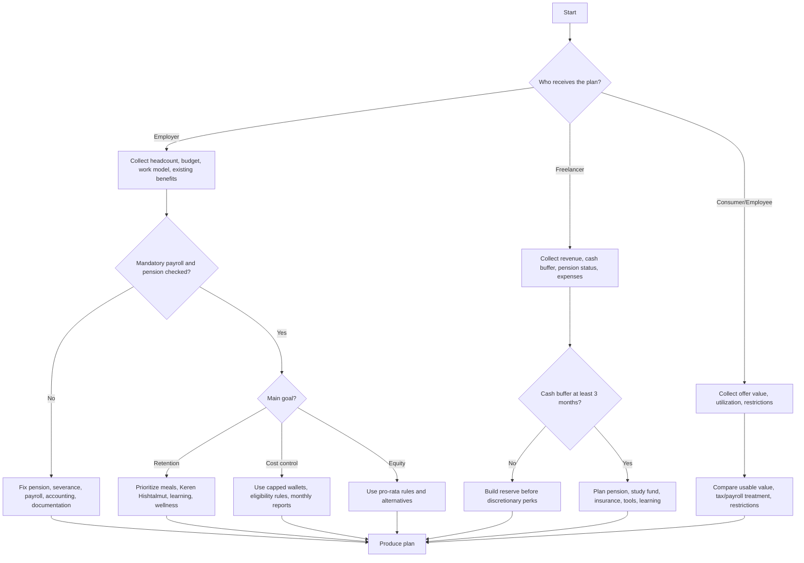

# Benefit & Perk Planner

Design practical benefit and perk packages for Israeli small businesses, freelancers, employees, and consumers. Build packages around meal benefits such as Cibus, Tenbis, and Sodexo-style cards, Keren Hishtalmut, pension and severance administration, gym and wellness budgets, commuting, equipment, learning, and home-office support.

Use this skill for structured planning and implementation support. Do not present the output as legal, tax, payroll, pension, insurance, or investment advice. Verify current statutory rates, annual ceilings, provider terms, and payroll treatment before implementation.

## When to use

Use this skill to create a benefit package for a small Israeli employer, a freelancer/self-employed perk plan, a consumer comparison between salary and benefits, a migration plan from informal reimbursements to a written policy, a budget comparison for basic/balanced/premium packages, or a troubleshooting plan for payroll, provider, accounting, privacy, or fairness issues.

## Required inputs

| Input | Why it matters | Default |
|---|---|---|
| Entity type | Employer, employee, freelancer, or consumer determines workflow | Infer from prompt |
| Monthly budget | Controls caps and scope | Provide three tiers |
| Employee count | Converts budget into per-person cost | 10 for a small employer |
| Gross salary or income | Needed for pension and study-fund modeling | Use placeholders and verify |
| Work model | On-site, hybrid, remote, shifts, or field work affects meals and commuting | Unspecified |
| Location | Provider coverage differs by city and periphery | Israel |
| Existing benefits | Prevents duplication and identifies compliance gaps | Treat as none |
| Goals | Retention, equity, cost control, wellbeing, tax efficiency, simplicity | Balance all |
| Cash buffer | Crucial for freelancers | Unknown; add warning |
| Payroll/accounting provider | Determines implementation | Generic payroll workflow |
| Date | Ceilings and rules change | Current planning date with verification note |

## Israeli benefit categories

### Meal benefits

Meal benefits can be delivered through Cibus, Tenbis, Sodexo/Pluxee-style cards, direct reimbursement, office groceries, or catered meals. Treat the benefit as an employee-utility decision first and a payroll/accounting decision second.

Design variables: daily cap, monthly cap, workday eligibility, hours threshold, remote-work rule, pro-rata rule, unpaid leave, parental leave, reserve duty, illness, termination, employee co-payment, expiry or carry-forward, invoice, VAT, utilization export, provider fees, cancellation terms, dietary needs, accessibility, kosher coverage, and geography.

#### Example: hybrid office

**Scenario:** 12 employees in Tel Aviv, hybrid schedule, monthly budget ₪15,000.

**Plan:** Set ₪35 daily cap and ₪770 monthly cap. Allow restaurant and supermarket use if supported by provider. Use active employee status and workday eligibility. Add pro-rata rule for part-time employees. Add reimbursement fallback for employees with poor provider coverage. Require monthly invoice and employee-level utilization CSV. Confirm payroll and tax treatment before launch.

#### Edge cases

- Field employees may need a receipt-based route.
- Employees outside dense urban areas may need supermarket coverage.
- Kosher, vegan, allergy, or accessibility needs may require alternate vendors.
- Cash replacement can be treated as salary and must pass payroll review.
- Contractors receiving employee-like meal benefits can create classification risk.
- A daily cap without a monthly cap can cause budget overruns.

### Pension and severance administration

For employees, pension and severance handling must be checked before optional perks. The exact start date, contribution rates, salary base, prior coverage, Section 14 treatment, and remittance workflow must be confirmed through payroll, a pension professional, and current legal sources.

Planning variables: existing pension arrangement, salary base, employee contribution, employer pension contribution, severance component, start date, prior coverage, fund details, employee choice, remittance confirmation, and payroll reconciliation.

#### Example: first employee

**Scenario:** Employee starts on 01-07-2026 and has an existing active pension fund.

1. Request fund details and recent confirmation.
2. Confirm legal start date with payroll/legal support.
3. Configure pension, employer contribution, and severance components.
4. Use the pension clearing or employer interface required by the payroll process.
5. Reconcile first remittance against payroll.
6. Store confirmations and employee forms.

### Keren Hishtalmut

Keren Hishtalmut can be highly valued by employees and freelancers, but contribution ceilings, deductibility, exemption rules, and liquidity rules depend on status and tax year. Never invent current ceilings.

Design variables: employee/self-employed/controlling-shareholder status, contribution split, salary or income base, current annual ceiling, eligibility criteria, tenure rule, payroll configuration, fund fees, investment track, employee consent, and documentation.

For a senior employee request, compare gross salary increase, employer cost, net value after payroll treatment, retention value, fairness to comparable employees, and administrative readiness. Recommend a documented eligibility rule rather than one-off negotiation.

### Wellness and gym benefits

Use a flexible wellness wallet unless a single gym membership is clearly better. A gym-only benefit can exclude remote employees, caregivers, disabled employees, injured employees, or employees with different personal preferences.

Recommended categories: gym, Pilates, yoga, swimming, sports classes, ergonomic equipment, mental wellbeing apps, coaching, and preventive health activities subject to payroll/accounting review. Do not collect diagnosis or treatment details.

### Transportation, mobility, equipment, and learning

Consider public transport, parking, bicycle support, home-office participation, equipment, and coworking. Company cars, cash car allowances, and charging benefits require careful payroll and tax review. Useful learning/equipment items include laptop, peripherals, phone, internet, cybersecurity tools, professional courses, books, subscriptions, coworking, chair, desk, and conferences. For freelancers, classify each item with an accountant before claiming it as a business expense.

## Decision tree



## Package framework

Use three layers. Layer 1 covers mandatory and risk-control items: pension, severance, payroll, tax, National Insurance for freelancers, written policies, privacy, and contractor classification. Layer 2 covers high-utility daily benefits: meals, transport, remote-work support, equipment, learning, and flexible wellness. Layer 3 covers retention and premium items: Keren Hishtalmut, expanded learning, health/insurance review, larger wellness budgets, family support, team events, and volunteering.

## Budget tiers

| Entity | Tier | Monthly budget per person | Suggested package |
|---|---|---:|---|
| Employer 1–5 | Basic | ₪150–₪350 | checks, small meal/wellness wallet, basic equipment |
| Employer 1–5 | Balanced | ₪350–₪800 | meal benefit, wellness, equipment reserve, learning |
| Employer 1–5 | Premium | ₪800–₪1,800+ | meal benefit, Keren Hishtalmut review, learning, wellness, insurance review |
| Employer 6–50 | Basic | ₪200–₪450 | meal arrangement, payroll-ready policies, accounting workflow |
| Employer 6–50 | Balanced | ₪450–₪1,000 | meal card, wellness, learning, selected Keren Hishtalmut |
| Employer 6–50 | Premium | ₪1,000–₪2,500+ | broad Keren Hishtalmut, higher meal caps, mobility, health, family support |
| Freelancer | Basic | ₪250–₪750 | pension check, accounting review, essential tools |
| Freelancer | Balanced | ₪750–₪2,000 | pension, Keren Hishtalmut, insurance, tools, equipment reserve |
| Freelancer | Premium | ₪2,000+ | expanded savings, professional development, coworking, advanced insurance |

## Comparison score

Rate each option 1–5 using these weights: legal/payroll confidence 25%, employee utility 25%, cost predictability 20%, administrative simplicity 15%, equity and inclusion 10%, vendor resilience 5%. Prefer the cheaper option if scores are within 0.25 points unless retention risk is high.

## Worked examples

### Café with 8 employees

Budget ₪3,200, shift model, retention and fairness goal. Confirm pension and payroll basics, add meal benefit up to ₪25 per eligible shift, add quarterly ₪250 shoes/workwear/wellness reimbursement, apply pro-rata rules, reconcile monthly, and review after 90 days.

### Startup with 22 employees

Budget ₪1,200 per employee, hybrid work, talent competition goal. Add meal card with remote-day support, add Keren Hishtalmut by transparent eligibility or broad rollout, add ₪150 wellness wallet, add annual learning budget, publish bilingual policy if needed, and review utilization and equity quarterly.

### Self-employed designer

Revenue ₪28,000 monthly, cash buffer two months, stability and tools goal. Build 3–6 month reserve, confirm pension obligation, evaluate Keren Hishtalmut, keep revenue-critical tools, budget equipment replacement, and review professional liability insurance.

### Employee choosing salary vs meal benefit

Gross salary alternative ₪600, meal benefit headline value ₪600, expected utilization 70%. Usable meal value is ₪420 before tax/payroll considerations. Compare to net value of ₪600 gross salary after payroll withholding and restrictions.

## Output template

```markdown
## Benefit plan

### Assumptions
- Entity:
- Date:
- Budget:
- Missing data handled as:

### Recommended package
| Benefit | Monthly cost | Eligibility | Rules | Admin owner |
|---|---:|---|---|---|

### Mandatory checks
- Pension/severance:
- Payroll/tax:
- VAT/accounting:
- National Insurance:
- Privacy:
- Contractor classification:

### Alternatives
| Option | Pros | Cons | Use when |
|---|---|---|---|

### Implementation checklist
1.
2.
3.

### Review metrics
- Budget variance:
- Utilization:
- Payroll corrections:
- Equity complaints:
```

## Troubleshooting quick table

| Symptom | Likely cause | Fix |
|---|---|---|
| Budget overrun | Missing monthly cap | Add daily and monthly caps |
| Payroll rejects benefit | Missing treatment or component code | Get accountant/payroll approval |
| Low use outside center | Provider coverage gap | Add reimbursement fallback |
| Wellness privacy issue | Health details collected | Request receipt category only |
| Contractor risk | Employee-style perks for contractors | Separate terms and obtain legal review |
| Study fund delay | Missing fund details | Add onboarding form and deadline |
| Accounting mismatch | Invoice not tied to utilization | Require monthly CSV |
| Inequity complaints | Rules exclude remote/part-time employees | Add pro-rata and alternative wallet |

## Anti-patterns

Avoid uncapped reimbursements, informal recurring cash payments, one-off Keren Hishtalmut promises without criteria, assumptions that popular perks are tax-free, provider launches before payroll/accounting approval, gym-only wellness design for a diverse team, employee-style contractor benefits without classification review, ignoring part-time/reserve duty/parental leave/unpaid leave/termination, valuing unused benefits at headline value, and storing health details for wellness reimbursement.

## Production checklist

Before launch: confirm pension and severance obligations, payroll and tax treatment, VAT and bookkeeping workflow, eligibility and caps, leave and termination rules, exception process, provider fees and data terms, payroll components, provider export, invoice reconciliation, employee communication, and review date. After launch: reconcile the first invoice, check payroll output, track utilization, collect feedback, fix edge cases, update policy version, and review annually or after legal/accounting changes.

## Localization rules

Use ₪ for Israeli shekels. Use DD-MM-YYYY in Hebrew materials. Use Keren Hishtalmut in English and קרן השתלמות in Hebrew. Use pension in English and הפקדות פנסיוניות in Hebrew. Use vendor-neutral wording unless comparing providers. Keep tone neutral and imperative.
