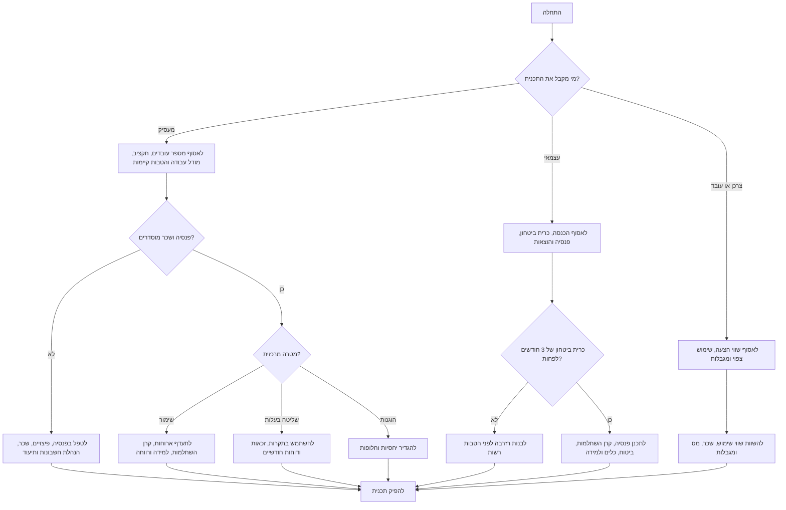

# מתכנן הטבות ורווחה בישראל

בנה חבילת הטבות מעשית לעסק קטן, לעצמאי, לעובד או לצרכן בישראל. כלול פתרונות ארוחות כגון סיבוס, תןביס וסודקסו/פלוקסי, קרן השתלמות, הפקדות פנסיוניות, חדר כושר, רווחה, נסיעות, ציוד, למידה ועבודה מהבית.

הפלט הוא כלי תכנון. אין להציג אותו כייעוץ משפטי, ייעוץ מס, ייעוץ שכר, ייעוץ פנסיוני, ייעוץ ביטוחי או ייעוץ השקעות. לפני יישום יש לאמת שיעורים, תקרות, תנאי ספקים, הסכמים, שכר ומיסוי מול גורם מקצועי מתאים.

## מתי להשתמש

השתמש במיומנות כדי ליצור חבילת הטבות למעסיק קטן בישראל, תכנית הטבות לעצמאי או פרילנסר, השוואה לצרכן בין שכר והטבה, תכנית מעבר מהחזרים לא רשמיים למדיניות כתובה, השוואת תקציב בין בסיסי/מאוזן/מורחבת, או תכנית טיפול בתקלה תפעולית, שכרית, חשבונאית או משפטית.

## נתוני פתיחה

| נתון | למה הוא חשוב | ברירת מחדל |
|---|---|---|
| סוג גורם | מעסיק, עובד, עצמאי או צרכן | להסיק מהבקשה |
| תקציב חודשי | קובע תקרות והיקף | להציג שלוש רמות |
| מספר עובדים | ממיר תקציב לעלות לאדם | 10 לעסק קטן |
| שכר ברוטו או הכנסה | דרוש להערכת פנסיה וקרן השתלמות | להשתמש בהנחת עבודה |
| מודל עבודה | משפיע על ארוחות, נסיעות ורווחה | לא צוין |
| מיקום | משפיע על כיסוי ספקים | ישראל |
| הטבות קיימות | מונע כפילות ומזהה פערי חובה | אין |
| מטרות | שימור, הוגנות, שליטה בעלות, רווחה, יעילות מס | איזון |
| כרית ביטחון | קריטי לעצמאים | לא ידוע; להוסיף אזהרה |
| מערכת שכר והנהלת חשבונות | קובעת יישום | תהליך כללי |
| תאריך | תקרות ושיעורים משתנים | לציין אימות לשנה הרלוונטית |

## קטגוריות הטבה בישראל

### הטבת ארוחות

אפשר להפעיל הטבת ארוחות דרך סיבוס, תןביס, סודקסו/פלוקסי, החזר הוצאות, מצרכים למשרד או ארוחה מסובסדת. התייחס להטבה קודם כול כשימושית לעובדים, ורק אחר כך כסוגיית מס ושכר.

משתני תכנון: תקרה יומית, תקרה חודשית, זכאות לפי יום עבודה, סף שעות, עבודה מהבית, יחסיות לעובדים חלקיים, חל"ת, חופשת לידה והורות, מילואים, מחלה, סיום העסקה, השתתפות עובד, יתרות, חשבונית, מע"מ, דוח ניצול, עמלות ספק, ביטול, כשרות, נגישות, אלרגיות וכיסוי בפריפריה.

#### דוגמה: משרד היברידי

**תרחיש:** 12 עובדים בתל אביב, עבודה היברידית, תקציב חודשי ₪15,000.

**תכנית:** לקבוע תקרה יומית ₪35 ותקרה חודשית ₪770. לאפשר מסעדות וסופרמרקט אם הספק תומך בכך. להגדיר זכאות לעובד פעיל ביום עבודה מזכה. להוסיף יחסיות לעובדים חלקיים. ליצור מסלול החזר חלופי למי שאין לו כיסוי ספק סביר. לדרוש חשבונית חודשית ודוח ניצול לפי עובד. לאשר טיפול שכר ומס לפני ההשקה.

#### מקרי קצה

- עובד שטח עשוי להזדקק להחזר הוצאות במקום כרטיס.
- עובד מחוץ למרכז עשוי להפיק ערך גבוה יותר מסופרמרקט.
- כשרות, טבעונות, אלרגיה או נגישות מחייבות חלופה.
- תשלום מזומן חוזר עלול להיחשב שכר.
- קבלן שמקבל הטבות עובדים יוצר סיכון סיווג.
- תקרה יומית בלי תקרה חודשית גורמת לחריגות.

### הפקדות פנסיוניות ופיצויים

לעובדים יש לבדוק פנסיה ופיצויים לפני הטבות רשות. מועד תחילה, שיעורים, שכר קובע, כיסוי קודם, סעיף 14 ותהליך הפקדה מחייבים בדיקה מול חשב שכר, גורם פנסיוני ומקורות דין עדכניים.

משתני תכנון: קופה קיימת, שכר קובע, ניכוי עובד, תגמולי מעסיק, רכיב פיצויים, מועד תחילת זכאות, בחירת עובד, אישור קליטת הפקדה והתאמה לדוח שכר.

#### דוגמה: עובד ראשון

**תרחיש:** עובד מתחיל ב-01/07/2026 ויש לו קרן פנסיה פעילה.

1. לקבל פרטי קופה ואישור עדכני.
2. לאמת מועד תחילת הפקדות.
3. להגדיר בשכר תגמולי עובד, תגמולי מעסיק ופיצויים.
4. להשתמש בממשק ההפקדות הרלוונטי.
5. להתאים הפקדה ראשונה לדוח שכר.
6. לשמור אישורים וטפסים.

### קרן השתלמות

קרן השתלמות היא הטבה משמעותית לעובדים ולעצמאים, אך תקרות, ניכוי, פטור ונזילות תלויים במעמד ובשנת המס. אין להמציא תקרות עדכניות.

משתני תכנון: שכיר, בעל שליטה או עצמאי; חלוקת הפקדה; שכר קובע או הכנסה; תקרה שנתית; קריטריוני זכאות; ותק; הגדרת רכיב בשכר; דמי ניהול; מסלול השקעה; טפסים והסכמות.

#### דוגמה: בקשת עובד בכיר

השווה העלאת שכר ברוטו, עלות מעסיק של קרן השתלמות, שווי נטו לעובד לאחר בדיקת שכר, תרומה לשימור, הוגנות מול עובדים דומים ויכולת יישום במערכת השכר. עדיף כלל זכאות כתוב על פני חריג אישי.

### חדר כושר ורווחה

העדף ארנק רווחה גמיש אם אין סיבה ברורה למנוי חדר כושר מסוים. הטבת חדר כושר בלבד עלולה להדיר עובדים מרוחקים, הורים, עובדים עם מגבלה, עובדים פצועים או עובדים שאינם משתמשים בחדר כושר.

קטגוריות מומלצות: חדר כושר, פילאטיס, יוגה, בריכה, חוגי ספורט, ציוד ארגונומי, אפליקציית רווחה נפשית או אימון ללא איסוף מידע רפואי, ופעילות מניעתית בכפוף לבדיקת שכר ומס.

### נסיעות, ציוד ולמידה

שקול תחבורה ציבורית, חניה, אופניים, השתתפות בעבודה מהבית, ציוד וחלל עבודה משותף. רכב חברה, אחזקת רכב וטעינת רכב חשמלי מחייבים בדיקת שכר ומס. פריטים שימושיים כוללים מחשב, ציוד היקפי, טלפון, אינטרנט, כלי אבטחת מידע, קורסים, ספרים, מנויים, כיסא, שולחן וכנסים מקצועיים. לעצמאים יש לסווג כל הוצאה מול רואה חשבון לפני דרישה כהוצאה מוכרת.

## עץ החלטה



## מסגרת בניית חבילה

שכבה 1 כוללת חובה וניהול סיכונים: פנסיה, פיצויים, שכר, מס, ביטוח לאומי לעצמאים, מדיניות כתובה, פרטיות ובדיקת סיווג קבלנים. שכבה 2 כוללת הטבות יומיומיות: ארוחות, נסיעות, עבודה מהבית, ציוד, למידה ורווחה גמישה. שכבה 3 כוללת שימור ומורחבת: קרן השתלמות, למידה מורחבת, בדיקת ביטוח, רווחה מוגדלת, תמיכה משפחתית, אירועי צוות והתנדבות.

## רמות תקציב

| סוג | רמה | תקציב חודשי לאדם | חבילה מוצעת |
|---|---|---:|---|
| מעסיק 1–5 | בסיסית | ₪150–₪350 | בדיקות חובה, ארנק קטן לארוחות/רווחה, ציוד בסיסי |
| מעסיק 1–5 | מאוזנת | ₪350–₪800 | ארוחות, רווחה, ציוד ולמידה |
| מעסיק 1–5 | מורחבת | ₪800–₪1,800+ | ארוחות, קרן השתלמות, למידה, רווחה ובדיקת ביטוח |
| מעסיק 6–50 | בסיסית | ₪200–₪450 | ארוחות, מדיניות מוכנה לשכר, תהליך חשבונאי |
| מעסיק 6–50 | מאוזנת | ₪450–₪1,000 | כרטיס ארוחות, רווחה, למידה וקרן השתלמות לפי זכאות |
| מעסיק 6–50 | מורחבת | ₪1,000–₪2,500+ | קרן השתלמות רחבה, ארוחות מוגדלות, ניידות ובריאות |
| עצמאי | בסיסית | ₪250–₪750 | פנסיה, בדיקת רואה חשבון וכלים חיוניים |
| עצמאי | מאוזנת | ₪750–₪2,000 | פנסיה, קרן השתלמות, ביטוח, ציוד ורזרבה |
| עצמאי | מורחבת | ₪2,000+ | חיסכון מוגבר, למידה, חלל עבודה וביטוח מתקדם |

## שיטת השוואה

דרג כל חלופה מ-1 עד 5 לפי ודאות משפטית ושכרית 25%, שימושיות 25%, שליטה בעלות 20%, פשטות תפעולית 15%, הוגנות והכלה 10%, יציבות ספק 5%. כאשר הפער קטן מ-0.25 נקודות, העדף את החלופה הזולה יותר, אלא אם קיים סיכון שימור משמעותי.

## דוגמאות מעשיות

**בית קפה עם 8 עובדים:** תקציב ₪3,200, משמרות, שימור והוגנות. לאמת פנסיה ושכר, להוסיף ארוחות עד ₪25 למשמרת מזכה, להוסיף החזר רבעוני ₪250 לנעליים/ביגוד/רווחה, להגדיר יחסיות, לבצע התאמה חודשית ולבדוק לאחר 90 יום.

**חברת הזנק עם 22 עובדים:** תקציב ₪1,200 לעובד, עבודה היברידית, תחרות על עובדים מבוקשים. להפעיל כרטיס ארוחות עם עבודה מהבית, להוסיף קרן השתלמות לפי זכאות שקופה או לכל העובדים, להוסיף ארנק רווחה ₪150, להגדיר למידה שנתית, לפרסם מדיניות בעברית ובאנגלית לפי הצורך ולבדוק ניצול רבעוני.

**מעצבת עצמאית:** הכנסה ₪28,000, כרית ביטחון חודשיים. לבנות רזרבה של 3–6 חודשים, לאמת פנסיה, לבדוק קרן השתלמות, להשאיר רק כלים שמייצרים הכנסה, לתקצב ציוד ולבדוק ביטוח אחריות מקצועית.

**עובד משווה שכר מול ארוחות:** שכר ברוטו ₪600 מול הטבה ₪600, שימוש צפוי 70%. שווי שימוש צפוי ₪420 לפני בדיקת שכר ומס. להשוות לשווי נטו של ₪600 ברוטו אחרי ניכויים ולמגבלות ההטבה.

## תבנית פלט

```markdown
## תכנית הטבות

### הנחות
- סוג גורם:
- תאריך:
- תקציב:
- מידע חסר:

### חבילה מומלצת
| הטבה | עלות חודשית | זכאים | כללים | אחראי |
|---|---:|---|---|---|

### בדיקות חובה
- פנסיה ופיצויים:
- שכר ומס:
- מע"מ והנהלת חשבונות:
- ביטוח לאומי:
- פרטיות:
- סיווג קבלנים:

### חלופות
| חלופה | יתרונות | חסרונות | מתי להשתמש |
|---|---|---|---|

### רשימת יישום
1.
2.
3.

### מדדי בקרה
- חריגה תקציבית:
- ניצול:
- תיקוני שכר:
- תלונות הוגנות:
```

## תקלות נפוצות

| סימפטום | סיבה סבירה | פתרון |
|---|---|---|
| חריגה תקציבית | חסרה תקרה חודשית | להוסיף תקרה יומית וחודשית |
| שכר לא מאשר הטבה | חסר טיפול מס או רכיב שכר | לקבל אישור שכר ורואה חשבון |
| שימוש נמוך בפריפריה | כיסוי ספק חלש | להוסיף מסלול החזר |
| פגיעה בפרטיות | נאסף מידע רפואי | לבקש קבלה וקטגוריה בלבד |
| סיכון קבלנים | קבלנים מקבלים הטבות עובדים | להפריד תנאים ולקבל בדיקה משפטית |
| עיכוב בקרן השתלמות | חסרים פרטי קופה | להוסיף טופס קליטה ותאריך יעד |
| חשבונית לא מתאימה לדוח | חסר דוח ניצול | לדרוש קובץ CSV חודשי |
| תלונות אי-הוגנות | אין מענה לעובדים חלקיים או מרוחקים | להוסיף יחסיות וחלופה |

## טעויות שכדאי להימנע מהן

הימנע מהחזרים ללא תקרה, תשלומי מזומן חוזרים ולא מתועדים, הבטחת קרן השתלמות בלי קריטריונים, הנחה שהטבה מקובלת פטורה ממס, הפעלת ספק לפני אישור שכר והנהלת חשבונות, חדר כושר בלבד לצוות מגוון, הטבות עובדים לקבלנים בלי בדיקת סיווג, התעלמות מעובדים חלקיים/מילואים/חופשת לידה והורות/חל"ת/סיום העסקה, הערכת הטבה שלא נוצלה לפי שווי מלא, ושמירת מידע רפואי לצורך החזר רווחה.

## רשימת בדיקה לפני השקה

לאמת פנסיה ופיצויים, טיפול שכר ומס, מע"מ והנהלת חשבונות, זכאות ותקרות, חופשות וסיום העסקה, חריגים, עמלות ספק ותנאי מידע, רכיבי שכר, דוח ספק, התאמה לחשבונית, תקשורת לעובדים ומועד בדיקה. לאחר ההשקה יש להתאים חשבונית ראשונה, לבדוק שכר, לעקוב אחרי ניצול, לאסוף משוב, לתקן מקרי קצה ולעדכן גרסת מדיניות.

## כללי לוקליזציה

להשתמש ב-₪. להשתמש בתאריכים בפורמט DD/MM/YYYY. להשתמש במונחים: קרן השתלמות, הפקדות פנסיוניות, פיצויים, ביטוח לאומי, הנהלת חשבונות. לשמור על טון ענייני ומעשי.
