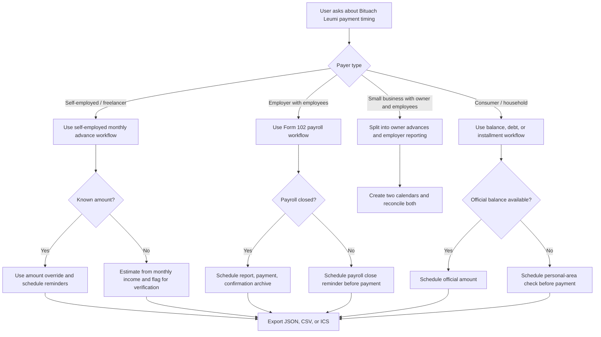

# Bituach Leumi Payment Scheduler

## Purpose

Use this skill to create practical schedules for Israeli National Insurance payments and reminders. Prioritize payment discipline, bookkeeping evidence, and early verification of amounts. Treat every calculated amount as a planning estimate until checked against an official voucher, personal-area balance, payroll system, accountant workpaper, or Bituach Leumi notice.

The scheduler is useful for self-employed workers, freelancers, small employers, mixed owner-and-employee businesses, consumers with payment arrangements, and bookkeepers preparing CSV or calendar exports.

## Operating assumptions

1. Use a monthly coverage period.
2. Use the 15th day of the following month as the default statutory payment target for monthly planning.
3. Move a non-business-day target to the next business day unless another policy is requested.
4. Treat Friday and Saturday as default Israeli weekend days.
5. Add Israeli bank holidays manually each year or import them from the accounting office calendar.
6. Use payment confirmations, Form 102 confirmations, standing-order records, and ledger entries as evidence.
7. Confirm amounts in official systems before payment.

## Not legal, accounting, or tax advice

Do not present the scheduler as a binding contribution assessment. Do not promise that a generated date prevents penalties. When the user faces debt collection, audit, legal proceedings, garnishment, employer insolvency, status disputes, or large arrears, direct the user to verify with Bituach Leumi, an accountant, payroll provider, or qualified adviser.

## Decision tree



## Minimal workflow

1. Identify payer type: `self-employed`, `employer`, `small-business`, or `consumer`.
2. Set the first coverage month, for example `2026-01`.
3. Choose a horizon, commonly 6, 12, or 18 months.
4. Enter either an official amount or a planning base: expected self-employed income, expected payroll, or official installment amount.
5. Add non-business dates that affect the 15th or reminder dates.
6. Generate the plan.
7. Export ICS for calendar reminders, CSV for bookkeeping workpapers, or JSON for automation and audit trail.
8. Add manual review tasks before each due date.
9. Pay only after confirming the official amount and payment channel.
10. Archive confirmation immediately.

## Concrete examples

### Self-employed freelancer with stable monthly income

```bash
python scripts/bituach-leumi-payment-scheduler-cli.py plan \
  --payer-name "Freelance Studio" \
  --payer-type self-employed \
  --start-month 2026-01 \
  --months 12 \
  --income 14000 \
  --format text
```

Use the output to create monthly payment tasks, review advance assessment when income changes, attach payment confirmation to the monthly bookkeeping file, and compare annual actual profit with advances before the annual return.

### Self-employed worker with official advance amount

```bash
python scripts/bituach-leumi-payment-scheduler-cli.py plan \
  --payer-name "Independent Designer" \
  --payer-type self-employed \
  --start-month 2026-01 \
  --months 12 \
  --amount 1240 \
  --format ics \
  --output bituach-leumi-2026.ics
```

Use an official amount override when the voucher, personal area, or accountant has supplied the amount. Prefer override values over local estimates.

### Employer preparing Form 102

```bash
python scripts/bituach-leumi-payment-scheduler-cli.py plan \
  --payer-name "Small Employer Ltd" \
  --payer-type employer \
  --start-month 2026-01 \
  --months 6 \
  --payroll 65000 \
  --reminder-days 10,5,1 \
  --format csv \
  --output form-102-calendar.csv
```

Add a payroll-close reminder before the payment reminder. The payment task is complete only after Form 102 reporting, payment, confirmation, and ledger posting.

### Holiday adjustment

```bash
python scripts/bituach-leumi-payment-scheduler-cli.py plan \
  --payer-type self-employed \
  --start-month 2026-05 \
  --months 2 \
  --income 9000 \
  --holiday 15/06/2026
```

The custom holiday forces adjustment from the target date to the configured business-day policy. Add real Israeli non-business dates annually.

### Consumer installment or debt arrangement

```bash
python scripts/bituach-leumi-payment-scheduler-cli.py plan \
  --payer-name "Household Account" \
  --payer-type consumer \
  --start-month 2026-01 \
  --months 8 \
  --amount 350
```

Use this for reminders only. Check the official balance before every payment because debt, linkage, collection fees, or interest can change.

## Edge cases

### Due date falls on Friday or Saturday

Default behavior moves the task to Sunday. For internal control, keep a reminder on the prior business day as well. For urgent payments, pay before the weekend rather than relying on a next-business-day assumption.

### Due date falls on a holiday

Pass holiday dates explicitly with `--holiday`. Maintain an annual non-business-day list in the accounting office calendar. Do not hardcode future holidays without review because Jewish holiday dates shift on the Gregorian calendar.

### Income changes during the year

Schedule a separate review reminder. For self-employed workers, update advances when expected profit changes materially. Overpaying hurts cash flow; underpaying can create arrears, linkage, interest, and year-end pressure.

### New self-employed registration

Create a first-month setup checklist: confirm status registration, confirm advance assessment, verify bank payment method, schedule first payment, save status-opening confirmation, and send documents to the accountant.

### Employer hires first employee

Create a payroll compliance checklist before the first Form 102 cycle: payroll file opened, employee details verified, salary components classified, National Insurance and health-insurance deductions checked, Form 102 workflow scheduled, and confirmation archive folder created.

### Multiple payer identities

Do not combine personal self-employed advances, company payroll obligations, and household debt into one schedule. Generate separate plans so confirmations and ledger entries remain clean.

### Standing order or bank permission

Still keep reminders. A standing order can fail due to bank changes, insufficient funds, account closure, changed amount, or expired bank permission.

### Arrears and collection proceedings

Do not rely on the normal monthly schedule. Prioritize direct balance verification, collection-status review, and written confirmation of any arrangement.

## Anti-patterns

- Estimating a payment and marking it final without checking an official voucher.
- Assuming every 15th is a business day.
- Mixing employer payroll payments with owner self-employed advances.
- Using last year's holiday calendar.
- Scheduling only the payment date and omitting preparation reminders.
- Treating the calendar entry as proof of payment.
- Saving confirmations in personal chat, email, or screenshots without an accounting file name.
- Waiting until the due date to discover a password, bank-card, or authentication problem.
- Ignoring mid-year income changes.
- Relying on a single reminder channel.

## Production checklist

- [ ] Confirm payer classification.
- [ ] Confirm Bituach Leumi file number or personal identity used for payment.
- [ ] Confirm the official payment channel.
- [ ] Confirm the amount source: official voucher, personal area, payroll report, or accountant workpaper.
- [ ] Add Israeli non-business dates for the year.
- [ ] Configure reminder offsets.
- [ ] Export ICS to the calendar used by the responsible person.
- [ ] Export CSV to the bookkeeping file.
- [ ] Store JSON output for audit trail when automation is used.
- [ ] Test one payment cycle from reminder through confirmation archive.
- [ ] Assign owner for each task.
- [ ] Define escalation for overdue status.
- [ ] Review schedule after registration changes, employee hiring, business closure, maternity leave, reserve duty, or income change.
- [ ] Re-check official rules after January and July updates or whenever Bituach Leumi publishes a rate change.

## Troubleshooting quick map

| Symptom | Likely cause | Action |
|---|---|---|
| Generated amount differs from voucher | estimate uses planning rates or stale assumptions | use `--amount` with official value |
| Due date lands on holiday | holiday not supplied | add `--holiday DD/MM/YYYY` |
| Employer schedule lacks payroll details | payroll not closed | schedule payroll-close task before payment |
| Consumer debt amount changes | interest, linkage, fees, or arrangement update | verify balance in personal area before payment |
| Calendar has too many events | reminders are exported as separate events | reduce reminder offsets or export CSV only |
| Accountant rejects schedule | missing source documents | attach vouchers, reports, and confirmations |

## Script inventory

- `scripts/bituach_leumi_payment_scheduler_client.py`: typed sync and async scheduling helper.
- `scripts/bituach-leumi-payment-scheduler-cli.py`: Click-based command-line interface.
- `scripts/test_bituach_leumi_payment_scheduler_client.py`: pytest suite.
- `scripts/examples/`: runnable examples for common scenarios.

## References

Use `references/api-reference.md`, `references/workflow-guide.md`, `references/troubleshooting.md`, `references/test-scenarios.md`, and `references/migration-checklist.md` for deeper operational guidance.


## Create/show command chain

Use the `create` command when a durable local plan record is needed. Extract `plan_id` from the JSON response, then pass it to `show`.

```bash
CREATE_RESPONSE=$(bituach-leumi-payment-scheduler --env sandbox create \
  --payer-type self-employed \
  --payer-name "Freelance Studio" \
  --start-month 2026-01 \
  --months 12 \
  --income 14000)

PLAN_ID=$(printf '%s' "$CREATE_RESPONSE" | python -c 'import json, sys; print(json.load(sys.stdin)["plan_id"])')
bituach-leumi-payment-scheduler show "$PLAN_ID" --format json
```

Use the Python API after installation:

```python
from bituach_leumi_payment_scheduler import BusinessProfile, BusinessType, ScheduleOptions, generate_payment_plan
```

## Web-validated 2026 planning defaults

Use these bundled defaults only for scheduling and cash-flow planning after checking the official amount:

| Item | 2026 planning default | Use with caution |
|---|---:|---|
| Self-employed standard adult reduced bracket | 7.70% up to ₪7,703 monthly income | Official Bituach Leumi calculation can adjust the base and annual reconciliation |
| Self-employed standard adult regular bracket | 18.00% above ₪7,703 and up to ₪51,910 | Use the official voucher or accountant workpaper for payment |
| Employer Form 102 resident-employee combined reduced bracket | 8.78% up to ₪7,703 monthly wage | Payroll-system totals override scheduler estimates |
| Employer Form 102 resident-employee combined regular bracket | 19.77% above ₪7,703 and up to ₪51,910 | Special employee columns and exceptions require payroll review |
| No-income consumer default | ₪266 per month | Verify personal-area balance before payment |

The usual planning due date is the 15th of the following month. A self-employed standing-order arrangement may debit on the 22nd instead of the 15th. Use `--due-day 22` only when the payer has such an arrangement and the official channel confirms it.
