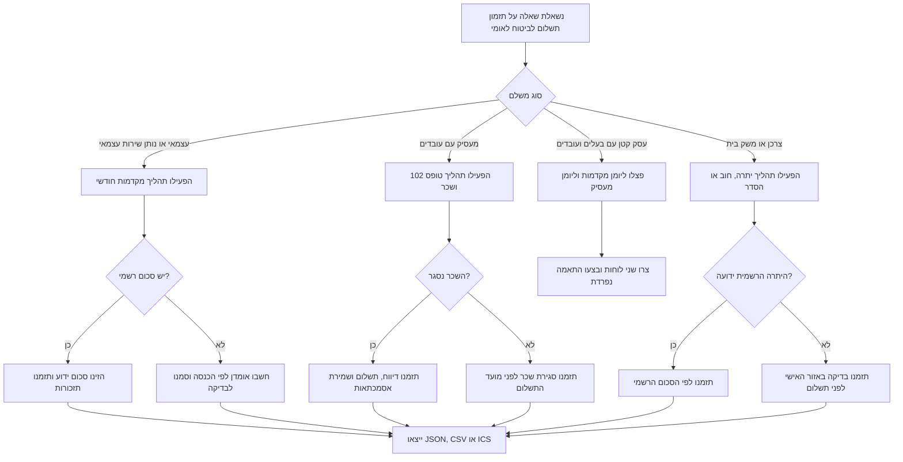

# מתזמן תשלומי ביטוח לאומי

## מטרה

השתמשו במיומנות זו כדי לבנות לוח תשלומים מעשי לביטוח לאומי: מועדי יעד, תזכורות, בדיקות מקדימות, ייצוא ליומן, ייצוא ל-CSV, ותיעוד להנהלת חשבונות. כל סכום מחושב הוא אומדן תזרימי בלבד עד לבדיקת שובר רשמי, יתרה באזור האישי, דוח שכר, נייר עבודה של רואה חשבון או הודעה מביטוח לאומי.

המיומנות מתאימה לעצמאים שמשלמים מקדמות חודשיות, נותני שירותים עצמאיים עם הכנסה משתנה, מעסיקים קטנים שמכינים טופס 102, עסקים קטנים שמשלבים מקדמות בעל עסק עם דיווח מעסיקים, צרכנים שמשלמים חוב או הסדר, ומנהלי חשבונות שמייצאים לוח משימות.

## הנחות עבודה

1. הגדירו חודש פעילות לכל חיוב.
2. הגדירו כברירת מחדל את ה-15 בחודש העוקב כמועד יעד לתכנון חודשי.
3. אם מועד היעד אינו יום עסקים, העבירו אותו ליום העסקים הבא, אלא אם נבחרה מדיניות אחרת.
4. הגדירו שישי ושבת כסוף שבוע ישראלי.
5. הוסיפו ידנית חגים וימי השבתה בנקאיים בכל שנה.
6. שמרו אסמכתאות: אישור תשלום, טופס 102, אישור הוראת קבע, פקודת יומן ותיק הנהלת חשבונות.
7. אמתו סכומים בערוצים הרשמיים לפני ביצוע תשלום.

## לא ייעוץ משפטי, חשבונאי או מס

אל תציגו את המתזמן כשומת דמי ביטוח מחייבת. אל תבטיחו שמועד שנוצר מונע קנסות. במקרה של חוב, עיקול, גבייה, ביקורת, מחלוקת סיווג, פשיטת רגל של מעסיק, חוב גדול או הליך משפטי, דרשו בדיקה מול ביטוח לאומי, רואה חשבון, חשב שכר או יועץ מוסמך.

## עץ החלטה



## תהליך בסיסי

1. זהו את סוג המשלם: `self-employed`, `employer`, `small-business`, או `consumer`.
2. קבעו חודש פעילות ראשון, למשל `2026-01`.
3. בחרו טווח תכנון: 6, 12 או 18 חודשים.
4. הזינו סכום רשמי או בסיס תזרימי: הכנסה חודשית צפויה, שכר חודשי צפוי או סכום הסדר.
5. הוסיפו ימי שבתון או חגים שמשפיעים על ה-15 בחודש ועל תזכורות.
6. צרו את הלוח.
7. ייצאו ICS ליומן, CSV להנהלת חשבונות או JSON לאוטומציה ונתיב ביקורת.
8. הגדירו תזכורת לבדיקה ידנית לפני כל תשלום.
9. שלמו רק אחרי אימות הסכום והערוץ הרשמי.
10. תייקו אסמכתה מיד לאחר התשלום.

## דוגמאות קונקרטיות

### עצמאי עם הכנסה חודשית יציבה

```bash
python scripts/bituach-leumi-payment-scheduler-cli.py plan \
  --payer-name "סטודיו עצמאי" \
  --payer-type self-employed \
  --start-month 2026-01 \
  --months 12 \
  --income 14000 \
  --format text
```

השתמשו בפלט ליצירת משימות תשלום חודשיות, בדיקת מקדמות כאשר ההכנסה משתנה, תיוק אישור תשלום בתיק הנהלת החשבונות החודשי, והשוואת רווח שנתי בפועל מול מקדמות לפני הדוח השנתי.

### עצמאי עם סכום מקדמה רשמי

```bash
python scripts/bituach-leumi-payment-scheduler-cli.py plan \
  --payer-name "מעצבת עצמאית" \
  --payer-type self-employed \
  --start-month 2026-01 \
  --months 12 \
  --amount 1240 \
  --format ics \
  --output bituach-leumi-2026.ics
```

כאשר קיימים שובר, הודעה באזור האישי או הנחיית רואה חשבון, הזינו סכום ידוע עם `--amount`. סכום רשמי עדיף על אומדן מקומי.

### מעסיק שמכין טופס 102

```bash
python scripts/bituach-leumi-payment-scheduler-cli.py plan \
  --payer-name "מעסיק קטן בעמ" \
  --payer-type employer \
  --start-month 2026-01 \
  --months 6 \
  --payroll 65000 \
  --reminder-days 10,5,1 \
  --format csv \
  --output form-102-calendar.csv
```

לפני תשלום, ודאו שסגירת השכר הושלמה. אל תסמנו משימה כהושלמה לפני דיווח טופס 102, תשלום, שמירת אישור ופקודת יומן.

### התאמה לחג או יום שבתון

```bash
python scripts/bituach-leumi-payment-scheduler-cli.py plan \
  --payer-type self-employed \
  --start-month 2026-05 \
  --months 2 \
  --income 9000 \
  --holiday 15/06/2026
```

התאריך `15/06/2026` מסומן כיום שאינו יום עסקים ולכן מועד היעד יזוז לפי מדיניות ההתאמה. עדכנו חגים וימי שבתון בכל שנה.

### צרכן עם הסדר תשלומים

```bash
python scripts/bituach-leumi-payment-scheduler-cli.py plan \
  --payer-name "חשבון משק בית" \
  --payer-type consumer \
  --start-month 2026-01 \
  --months 8 \
  --amount 350
```

השתמשו בכך לתזכורות בלבד. בדקו יתרה רשמית לפני כל תשלום כי הצמדה, ריבית, הוצאות גבייה או שינוי הסדר יכולים לשנות את הסכום.

## מקרי קצה

### מועד תשלום חל ביום שישי או שבת

ברירת המחדל מעבירה את המשימה ליום ראשון. לניהול שמרני, הוסיפו תזכורת ביום העסקים הקודם ושלמו מוקדם כאשר קיימת רגישות תזרימית או חשש לפיגור.

### מועד תשלום חל בחג

העבירו את תאריך החג עם `--holiday`. נהלו רשימת חגים שנתית בתיק הנהלת החשבונות. אל תשתמשו ברשימת חגים משנים קודמות בלי בדיקה.

### שינוי הכנסה במהלך השנה

הגדירו תזכורת לבדיקה מחדש. אצל עצמאים, עדכון מקדמות נדרש כאשר הרווח הצפוי משתנה מהותית. מקדמה גבוהה מדי פוגעת בתזרים; מקדמה נמוכה מדי עלולה ליצור חוב, הצמדה וריבית.

### פתיחת תיק עצמאי

בנו רשימת פתיחה: אישור פתיחת תיק, בדיקת סיווג עצמאי, קבלת מקדמות או שובר, אימות פרטי בנק ואמצעי תשלום, תזמון תשלום ראשון, תיוק מסמכי פתיחה ושליחת חומר לרואה החשבון.

### מעסיק שמעסיק עובד ראשון

בנו רשימת שכר לפני מחזור טופס 102 הראשון: פתיחת תיק ניכויים ושכר, אימות פרטי עובד, סיווג רכיבי שכר, בדיקת ניכויי דמי ביטוח ודמי ביטוח בריאות, תזמון דיווח ותשלום, ויצירת תיק אסמכתאות.

### כמה זהויות תשלום

אל תאחדו מקדמות עצמאי, תשלומי מעסיק וחוב אישי בלוח אחד. צרו לוח נפרד לכל זהות כדי לשמור על התאמות ואסמכתאות נקיות.

### הוראת קבע או הרשאה בנקאית

גם כאשר קיימת הוראת קבע, שמרו תזכורות. חיוב יכול להיכשל בגלל שינוי חשבון, חוסר כיסוי, שינוי סכום, פקיעת הרשאה או תקלה בנקאית.

### חוב וגבייה

אל תסתמכו על לוח חודשי רגיל. קודם בדקו יתרה רשמית, מצב גבייה והסדר כתוב. שמרו אישור על כל שינוי הסדר.

## דפוסי עבודה לא רצויים

- לחשב אומדן ולסמן אותו כסכום סופי בלי שובר רשמי.
- להניח שכל 15 בחודש הוא יום עסקים.
- לערבב תשלומי מעסיק עם מקדמות בעל עסק.
- להשתמש בלוח חגים של שנה קודמת.
- לתזמן רק את יום התשלום בלי תזכורת הכנה.
- לראות אירוע ביומן כהוכחת תשלום.
- לשמור אסמכתאות בצילום מסך לא מתויק.
- לחכות ליום האחרון ואז לגלות בעיית כניסה, כרטיס או הרשאה.
- להתעלם משינוי הכנסה באמצע שנה.
- להסתמך על ערוץ תזכורת אחד בלבד.

## רשימת בדיקה להפעלה שוטפת

- [ ] אמתו סיווג משלם.
- [ ] אמתו מספר תיק, מספר זהות או מספר חברה לתשלום.
- [ ] אמתו ערוץ תשלום רשמי.
- [ ] אמתו מקור סכום: שובר, אזור אישי, דוח שכר או נייר עבודה של רואה חשבון.
- [ ] הוסיפו חגים וימי שבתון בישראל לשנה הרלוונטית.
- [ ] הגדירו תזכורות.
- [ ] ייצאו ICS ליומן של האחראי.
- [ ] ייצאו CSV לתיק הנהלת החשבונות.
- [ ] שמרו JSON כאשר נעשה שימוש באוטומציה.
- [ ] בדקו מחזור אחד מקצה לקצה: תזכורת, תשלום, אישור, תיוק.
- [ ] הגדירו אחראי לכל משימה.
- [ ] הגדירו הסלמה במקרה של איחור.
- [ ] בדקו מחדש אחרי פתיחת עסק, סגירת עסק, העסקת עובד, לידה, מילואים, שינוי הכנסה או שינוי סיווג.
- [ ] בדקו עדכוני סכומים וכללים בינואר, ביולי ובכל הודעה רשמית.

## מפת תקלות מהירה

| סימפטום | סיבה נפוצה | פעולה |
|---|---|---|
| הסכום שונה מהשובר | האומדן מבוסס על שיעורים כלליים | השתמשו ב-`--amount` לפי הסכום הרשמי |
| התאריך נופל בחג | החג לא הוזן | הוסיפו `--holiday DD/MM/YYYY` |
| לוח מעסיק חסר נתוני שכר | השכר לא נסגר | תזמנו משימת סגירת שכר לפני התשלום |
| חוב צרכני השתנה | הצמדה, ריבית, הוצאות או שינוי הסדר | בדקו יתרה באזור האישי לפני תשלום |
| היומן עמוס באירועים | כל תזכורת מיוצאת כאירוע נפרד | צמצמו תזכורות או ייצאו CSV בלבד |
| מנהל החשבונות דוחה את הלוח | חסרות אסמכתאות | צרפו שוברים, דיווחים ואישורי תשלום |

## קבצים מרכזיים

- `scripts/bituach_leumi_payment_scheduler_client.py`: עזר תזמון מסונכרן ואסינכרוני עם טיפוסים.
- `scripts/bituach-leumi-payment-scheduler-cli.py`: ממשק שורת פקודה מבוסס Click.
- `scripts/test_bituach_leumi_payment_scheduler_client.py`: בדיקות pytest.
- `scripts/examples/`: תרחישים להרצה.

## חומרי עזר

- `references/api-reference.md`
- `references/workflow-guide.md`
- `references/troubleshooting.md`
- `references/test-scenarios.md`
- `references/migration-checklist.md`


## שרשרת יצירה והצגה

השתמשו בפקודת `create` כאשר נדרש רישום מקומי קבוע של תוכנית. חילצו את `plan_id` מתשובת ה-JSON והעבירו אותו לפקודת `show`.

```bash
CREATE_RESPONSE=$(bituach-leumi-payment-scheduler --env sandbox create \
  --payer-type self-employed \
  --payer-name "סטודיו עצמאי" \
  --start-month 2026-01 \
  --months 12 \
  --income 14000)

PLAN_ID=$(printf '%s' "$CREATE_RESPONSE" | python -c 'import json, sys; print(json.load(sys.stdin)["plan_id"])')
bituach-leumi-payment-scheduler show "$PLAN_ID" --format json
```

ייבאו את המודול לאחר התקנה:

```python
from bituach_leumi_payment_scheduler import BusinessProfile, BusinessType, ScheduleOptions, generate_payment_plan
```

## ברירות מחדל מאומתות לשנת 2026

השתמשו בברירות המחדל לצורך תזמון ותכנון תזרים בלבד, לאחר בדיקת הסכום הרשמי:

| פריט | ברירת מחדל לשנת 2026 | שימוש זהיר |
|---|---:|---|
| עצמאי רגיל מגיל 18 עד גיל פרישה, מדרגה מופחתת | 7.70% עד הכנסה חודשית של ₪7,703 | החישוב הרשמי עשוי להתחשב בבסיס מתואם ובהפרשים שנתיים |
| עצמאי רגיל מגיל 18 עד גיל פרישה, מדרגה רגילה | 18.00% מעל ₪7,703 ועד ₪51,910 לחודש | שלמו לפי שובר רשמי או נייר עבודה מקצועי |
| מעסיק, טופס 102, עובד תושב ישראל, מדרגה מופחתת משולבת | 8.78% עד שכר חודשי של ₪7,703 | סכומי מערכת השכר גוברים על אומדן המתזמן |
| מעסיק, טופס 102, עובד תושב ישראל, מדרגה רגילה משולבת | 19.77% מעל ₪7,703 ועד ₪51,910 לחודש | טורים מיוחדים וחריגים דורשים בדיקת שכר |
| צרכן ללא הכנסות חייבות | ₪266 לחודש | בדקו יתרה באזור האישי לפני תשלום |

מועד התכנון הרגיל הוא 15 בחודש העוקב. בהוראת קבע לעצמאי ייתכן חיוב ב-22 בחודש במקום ב-15. השתמשו ב-`--due-day 22` רק כאשר קיימת הוראת קבע והערוץ הרשמי מאשר זאת.
