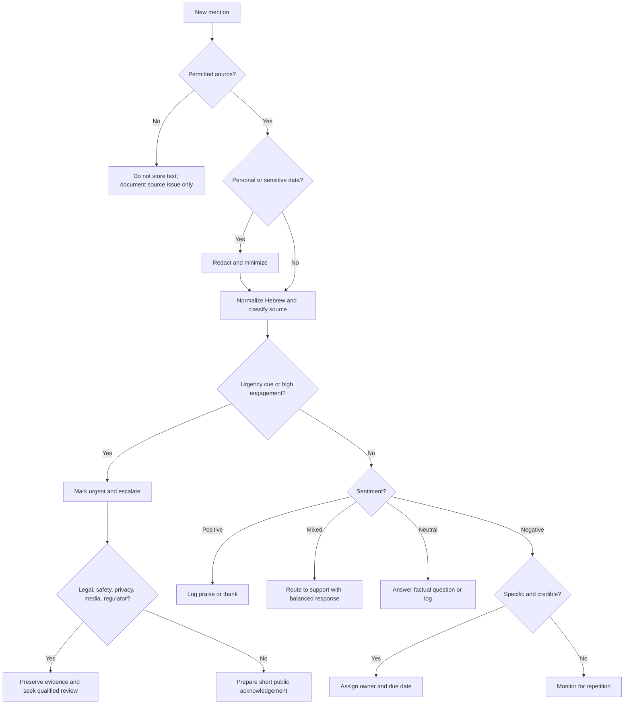
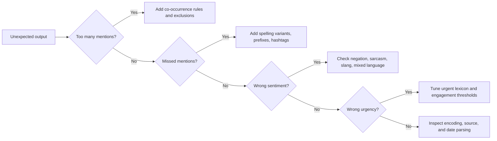

# Brand Reputation Monitor

Monitor Hebrew and mixed Hebrew-English brand mentions from permitted exports, public-page comment files, approved APIs, review exports, news-comment dumps, and manually collected evidence. Use the skill to classify sentiment, identify urgent risk, redact personal data, and produce practical response queues for Israeli small businesses, freelancers, local service providers, and consumer-facing teams.

Use official exports, public APIs, approved vendors, or user-provided files. Do not scrape private groups, bypass platform controls, evade rate limits, collect credentials, or automate harassment.

## Goals

- Find brand mentions in Hebrew, English, spelling variants, nicknames, hashtags, and local identifiers.
- Classify mentions as `positive`, `negative`, `mixed`, `neutral`, or `urgent`.
- Extract operational topics such as delivery, billing, campaign, pricing, safety, privacy, accessibility, staff, legal, and media.
- Score risk using severity, reach, credibility, and actionability.
- Recommend actions: log, reply, route to support, escalate, preserve evidence, or seek qualified review.
- Support Israeli localization with ₪, DD/MM/YYYY dates, Hebrew response templates, and Israeli consumer/accounting terminology.

## Inputs

Recommended columns:

| Column | Required | Example | Notes |
|---|---:|---|---|
| `date` | Recommended | `24/06/2026` | Prefer DD/MM/YYYY for local reports. |
| `source` | Recommended | `facebook`, `x`, `tiktok`, `news_comment`, `review` | Normalize aliases. |
| `brand` | Optional | `המאפייה של דנה` | Useful for multi-brand reports. |
| `author` | Optional | `@customer` | Store only when lawful and necessary. |
| `url` | Optional | `https://...` | Public link or internal evidence reference. |
| `text` | Required | `טעים אבל המשלוח איחר` | Main field for analysis. |
| `engagement` | Optional | `42` | Likes, replies, shares, comments, or views. |
| `topic` | Optional | `delivery` | Use pre-filled value when reliable. |
| `branch` | Optional | `חיפה` | Useful for chains and regional service teams. |

## Mention discovery

Start with a broad keyword map, run calibration, then narrow false positives.

| Category | Examples |
|---|---|
| Official Hebrew name | `המאפייה של דנה`, `סטודיו נועה`, `קליניקת אביב` |
| English name | `Dana Bakery`, `Noa Studio`, `Aviv Clinic` |
| Short name | `דנה`, `נועה סטודיו`, `אביב` |
| Misspellings | `דנא`, `נעה`, `אביבב` |
| Public professional name | `דנה כהן`, `נועה לוי`, `ד״ר אביב` |
| Product/service | `עוגת שמרים`, `שיעור פילאטיס`, `טיפול שורש` |
| Campaign phrase | `מבצע חורף`, `השקה חדשה`, `קוד קופון` |
| Location | `רחוב הרצל`, `שוק הכרמל`, `באר שבע`, `קניון איילון` |
| Business identifiers | Phone, domain, branded hashtag, Google review name |

### Hebrew normalization

- Strip niqqud for matching, but preserve original text for evidence.
- Normalize quote marks: `"` / `׳` / `״`.
- Handle prefixes: `ב`, `ל`, `כ`, `מ`, `ש`, `ה`, `ו`; for example `בסטודיו`, `להמאפייה`, `שהקליניקה`.
- Preserve emojis because they affect tone.
- Treat common names carefully. `דנה` alone is not enough unless it appears with product, city, domain, branch, phone, or campaign.
- Include gendered forms: `ממליץ`, `ממליצה`, `מאוכזב`, `מאוכזבת`, `מקצועי`, `מקצועית`.

## Sentiment labels

| Label | Meaning | Example |
|---|---|---|
| `positive` | Clear praise or recommendation | `שירות מצוין, אחזור שוב` |
| `negative` | Complaint, warning, frustration, boycott, or dissatisfaction | `לא להתקרב, חוויה מזעזעת` |
| `mixed` | Praise and criticism in the same mention | `המוצר טוב אבל השירות איטי` |
| `neutral` | Factual mention or question | `מישהו יודע מה שעות הפתיחה?` |
| `urgent` | Safety, legal, privacy, discrimination, media, regulator, fraud, or severe claim | `קיבלתי מוצר מסוכן והעסק מתעלם` |

### Useful Hebrew cues

Positive: `מעולה`, `מצוין`, `מדהים`, `ממליצה`, `ממליץ`, `אדיבים`, `טעים`, `נקי`, `מהיר`, `אמינים`, `מקצועית`, `הוגן`, `תודה`, `אחלה`, `וואו`.

Negative: `גרוע`, `זוועה`, `לא מומלץ`, `לא להתקרב`, `רמאים`, `איחור`, `מלוכלך`, `התעלמות`, `בושה`, `אכזבה`, `חיוב כפול`, `חוצפה`, `לא עובד`.

Urgent: `תביעה`, `עורך דין`, `חדשות`, `כתבה`, `חרם`, `מסוכן`, `אלרגיה`, `הרעלה`, `הטרדה`, `אפליה`, `פרטיות`, `דליפה`, `משטרה`, `משרד הבריאות`, `הרשות להגנת הצרכן`.

## Decision tree



## Risk scoring

| Dimension | Low | Medium | High |
|---|---|---|---|
| Severity | Mild annoyance | Concrete service failure | Safety, legal, discrimination, fraud, privacy |
| Reach | No engagement | Active thread | Viral, influencer, journalist, regulator |
| Credibility | Vague claim | Specific order/date/branch | Evidence, photos, repeated reports |
| Actionability | No owner | Support can resolve | Management/legal/PR required |

| Score | Action |
|---:|---|
| 0-24 | Log only; monitor trend |
| 25-49 | Reply if useful; route to support |
| 50-74 | Escalate to manager; respond within business day |
| 75-100 | Immediate escalation; preserve evidence; prepare formal response |

## Response playbook

Principles:

- Acknowledge the experience.
- Stay calm, factual, and concise.
- Do not admit unverified legal liability.
- Move private details to private support.
- Do not reveal customer details, employee discipline, payment data, address, health data, or internal logs.
- Do not threaten critics without qualified review.
- Do not copy-paste identical replies at scale.

Templates:

**Late delivery**

> מצטערים על ההמתנה. נשמח לבדוק את פרטי ההזמנה ולטפל בזה מולך ישירות. אפשר לשלוח לנו מספר הזמנה וטלפון בפרטי?

**Billing issue**

> תודה שהעלית את זה. חיוב או מסמך חשבונאי לא ברור צריכים להיבדק מיד. נא לשלוח לנו בפרטי מספר הזמנה או חשבונית, ונחזור אליך עם תשובה מסודרת.

**Praise**

> תודה רבה על הפרגון. שמחנו לתת שירות ונשמח לראות אותך שוב.

**Safety claim**

> תודה שעדכנת. אנחנו מתייחסים לנושא ברצינות ומבקשים לקבל פרטים מלאים בפרטי כדי לבדוק את האירוע באופן מיידי.

## Edge cases

- Sarcasm: `איזה שירות "מדהים", חיכיתי שעה` is negative.
- Slang: `אמאלה איזה טעים` is positive.
- Mixed language: `service אחלה אבל delivery disaster` is mixed or negative.
- Competitor comparison: `המתחרים יותר זולים` is a pricing signal, not necessarily a complaint.
- Same-name false positive: a first name alone must not count as brand match.
- Screenshots/OCR: mark low confidence and verify manually.
- Minors, health, billing, IDs, and medical details: redact and restrict access.
- News comments: lower confidence unless repeated, specific, or highly engaged.

## Anti-patterns

Avoid:

- Scraping closed groups or private profiles.
- Storing unnecessary personal profiles.
- Reporting only average sentiment while ignoring one severe incident.
- Auto-replying to safety, legal, privacy, discrimination, or media-risk claims.
- Treating every negative word as a complaint about the brand.
- Translating Hebrew sentiment mechanically without context.
- Publishing screenshots with personal data visible.
- Creating fake positive reviews or coordinated manipulation.
- Using collected mentions for unsolicited marketing.

## Troubleshooting map



## Production checklist

## 2026 validation note

Use the current Israeli VAT rate of 18% for complaint triage involving `₪`, `מע״מ`, receipts, refunds, and displayed prices. Treat platform data access as permission-bound: Facebook/Page comments, X/Twitter search, TikTok comments, Google reviews, and news comments each require the relevant official API scope, approved export, vendor agreement, or manual evidence workflow.

- [ ] Confirm lawful source and platform terms.
- [ ] Define keyword variants and false-positive rules.
- [ ] Define retention period and deletion process.
- [ ] Redact unnecessary personal data.
- [ ] Set escalation owners and response SLAs.
- [ ] Prepare Hebrew and English response templates.
- [ ] Test at least 20 scenarios.
- [ ] Review privacy, consumer, billing, and sector-specific obligations where needed.
- [ ] Verify DD/MM/YYYY and ₪ formatting.
- [ ] Create human-review fields for high-risk items.
- [ ] Document limitations and manual override process.

## Example report

```text
Period: 01/06/2026 to 07/06/2026
Mentions reviewed: 184
Positive: 61
Mixed: 24
Neutral: 72
Negative: 22
Urgent: 5

Main themes:
1. Delivery delays in Gush Dan after 18:00.
2. Praise for staff at the Haifa branch.
3. Coupon confusion on TikTok.

Immediate actions:
- Reply to 7 unresolved delivery complaints.
- Update coupon landing page.
- Escalate 2 safety-related claims for management review.
```
