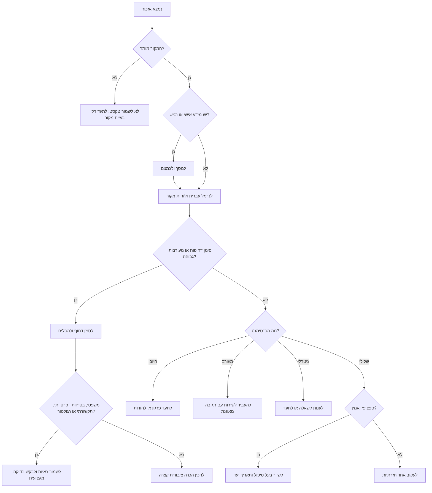
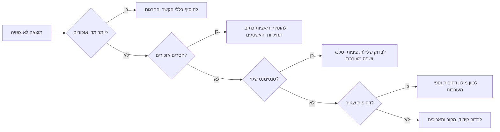

# ניטור מוניטין מותג

השתמשו במיומנות זו כדי לנטר אזכורים בעברית ובשילוב עברית-אנגלית מתוך יצוא נתונים מורשה, תגובות ציבוריות, ביקורות, תגובות באתרי חדשות וקבצים שנאספו ידנית. המטרה היא לזהות סנטימנט, לאתר סיכון דחוף, למסך מידע אישי ולהפיק תור טיפול ברור לעסקים קטנים, עצמאים, נותני שירותים וצוותים צרכניים בישראל.

יש לעבוד רק עם מקורות מותרים: יצוא רשמי, API מאושר, ספק ניטור מורשה או קובץ שהמשתמש סיפק. אין לעקוף הרשאות, אין לגרד קבוצות פרטיות, אין להתחמק ממגבלות קצב ואין לשלוח תגובות אוטומטיות שמציפות משתמשים.

## מטרות

- לזהות אזכורים של שם עסק, שם בעלים, מוצר, סניף, טלפון, דומיין, האשטג או שגיאת כתיב נפוצה.
- לסווג סנטימנט: `positive`, `negative`, `mixed`, `neutral`, `urgent`.
- לחלץ נושאים: משלוחים, חיובים, קמפיינים, מחיר, בטיחות, פרטיות, נגישות, צוות, משפטי ותקשורתי.
- לדרג סיכון לפי חומרה, חשיפה, אמינות ויכולת טיפול.
- להמליץ על פעולה: תיעוד, תגובה, העברה לשירות, הסלמה, שימור ראיות או בדיקה מקצועית.
- להפיק דוחות מקומיים עם ₪ ותאריכים בפורמט DD/MM/YYYY.

## מבנה קלט מומלץ

| שדה | חובה | דוגמה | הערות |
|---|---:|---|---|
| `date` | מומלץ | `24/06/2026` | בדוחות ישראליים עדיף DD/MM/YYYY. |
| `source` | מומלץ | `facebook`, `x`, `tiktok`, `news_comment`, `review` | יש לאחד שמות מקור. |
| `brand` | רשות | `המאפייה של דנה` | שימושי לדוח מרובה מותגים. |
| `author` | רשות | `@customer` | לשמור רק אם מותר ונדרש. |
| `url` | רשות | `https://...` | קישור ציבורי או מזהה ראיה פנימי. |
| `text` | חובה | `טעים אבל המשלוח איחר` | שדה הניתוח המרכזי. |
| `engagement` | רשות | `42` | לייקים, תגובות, שיתופים או צפיות. |
| `topic` | רשות | `delivery` | ערך ידני כאשר הוא אמין. |
| `branch` | רשות | `חיפה` | שימושי לרשתות ולשירות אזורי. |

## בניית מילות מפתח

| סוג | דוגמאות |
|---|---|
| שם רשמי בעברית | `המאפייה של דנה`, `סטודיו נועה`, `קליניקת אביב` |
| שם באנגלית | `Dana Bakery`, `Noa Studio`, `Aviv Clinic` |
| קיצור | `דנה`, `נועה סטודיו`, `אביב` |
| שגיאות כתיב | `דנא`, `נעה`, `אביבב` |
| שם איש מקצוע ציבורי | `דנה כהן`, `נועה לוי`, `ד״ר אביב` |
| מוצר או שירות | `עוגת שמרים`, `שיעור פילאטיס`, `טיפול שורש` |
| קמפיין | `מבצע חורף`, `השקה חדשה`, `קוד קופון` |
| מיקום | `רחוב הרצל`, `שוק הכרמל`, `באר שבע`, `קניון איילון` |
| מזהה עסקי | טלפון, דומיין, האשטג ממותג, שם ביקורת ב-Google |

## התאמות לעברית

- להסיר ניקוד לצורך התאמה, אך לשמור את הטקסט המקורי.
- לאחד גרשיים: `"` / `׳` / `״`.
- לבדוק תחיליות: `ב`, `ל`, `כ`, `מ`, `ש`, `ה`, `ו`.
- לשמור אימוג׳ים משום שהם משפיעים על הטון.
- לכלול צורות זכר ונקבה: `ממליץ`, `ממליצה`, `מאוכזב`, `מאוכזבת`, `מקצועי`, `מקצועית`.
- להיזהר משמות פרטיים נפוצים. `דנה` לבד אינו מספיק בלי מוצר, עיר, סניף, דומיין, טלפון או קמפיין.

## סיווג סנטימנט

| תווית | משמעות | דוגמה |
|---|---|---|
| `positive` | פרגון או המלצה ברורה | `שירות מצוין, נחזור שוב` |
| `negative` | תלונה, אזהרה, אכזבה או קריאה להתרחק | `לא להתקרב, חוויה מזעזעת` |
| `mixed` | גם פרגון וגם ביקורת | `המוצר טוב אבל השירות איטי` |
| `neutral` | אזכור עובדתי או שאלה | `מישהו יודע מה שעות הפתיחה?` |
| `urgent` | בטיחות, משפטי, פרטיות, אפליה, תקשורת, רגולטור או טענה חמורה | `המוצר גרם לתגובה אלרגית והעסק מתעלם` |

חיובי: `מעולה`, `מצוין`, `מדהים`, `ממליצה`, `ממליץ`, `אדיבים`, `טעים`, `נקי`, `מהיר`, `אמינים`, `מקצועית`, `הוגן`, `תודה`, `אחלה`, `וואו`.

שלילי: `גרוע`, `זוועה`, `לא מומלץ`, `לא להתקרב`, `רמאים`, `איחור`, `מלוכלך`, `התעלמות`, `בושה`, `אכזבה`, `חיוב כפול`, `חוצפה`, `לא עובד`.

דחוף: `תביעה`, `עורך דין`, `חדשות`, `כתבה`, `חרם`, `מסוכן`, `אלרגיה`, `הרעלה`, `הטרדה`, `אפליה`, `פרטיות`, `דליפה`, `משטרה`, `משרד הבריאות`, `הרשות להגנת הצרכן ולסחר הוגן`.

## עץ החלטה

## דירוג סיכון

| ממד | נמוך | בינוני | גבוה |
|---|---|---|---|
| חומרה | אי נוחות קלה | כשל שירות ברור | בטיחות, משפטי, אפליה, הונאה, פרטיות |
| חשיפה | ללא מעורבות | שרשור פעיל | ויראלי, משפיען, עיתונאי, רגולטור |
| אמינות | טענה כללית | הזמנה, תאריך או סניף | ראיות, תמונות, דיווחים חוזרים |
| יכולת טיפול | אין בעלים ברור | שירות יכול לפתור | הנהלה, ייעוץ משפטי או יח״צ |

| ציון | פעולה |
|---:|---|
| 0-24 | לתעד ולעקוב אחר מגמה |
| 25-49 | להשיב אם מועיל; להעביר לשירות |
| 50-74 | להסלים למנהל; לענות באותו יום עסקים |
| 75-100 | הסלמה מיידית; לשמור ראיות; להכין תגובה רשמית |

## תבניות תגובה

**איחור במשלוח**

> מצטערים על ההמתנה. נשמח לבדוק את פרטי ההזמנה ולטפל בזה מולך ישירות. אפשר לשלוח לנו מספר הזמנה וטלפון בפרטי?

**חיוב או מסמך חשבונאי**

> תודה שהעלית את זה. חיוב או מסמך חשבונאי לא ברור צריכים להיבדק מיד. נא לשלוח לנו בפרטי מספר הזמנה או חשבונית, ונחזור אליך עם תשובה מסודרת.

**פרגון**

> תודה רבה על הפרגון. שמחנו לתת שירות ונשמח לראות אותך שוב.

**בטיחות**

> תודה שעדכנת. אנחנו מתייחסים לנושא ברצינות ומבקשים לקבל פרטים מלאים בפרטי כדי לבדוק את האירוע באופן מיידי.

## מקרי קצה

- ציניות: `איזה שירות "מדהים", חיכיתי שעה` הוא שלילי.
- סלנג: `אמאלה איזה טעים` הוא חיובי.
- עברית-אנגלית: `service אחלה אבל delivery disaster` הוא מעורב או שלילי.
- השוואה למתחרים: `המתחרים יותר זולים` היא אות מחיר, לא בהכרח תלונה.
- שם נפוץ: אין לספור שם פרטי בלי סימן מותג נוסף.
- OCR מצילום מסך: לסמן ביטחון נמוך ולבדוק ידנית.
- קטינים, בריאות, חיובים, תעודות זהות ופרטים רפואיים: למסך ולהגביל גישה.
- תגובות באתרי חדשות: להפחית ביטחון אלא אם הטענה חוזרת, ספציפית או בעלת מעורבות גבוהה.

## דפוסים שגויים

אין לבצע:

- איסוף מקבוצות סגורות או פרופילים פרטיים.
- שמירת פרופילים אישיים שאינם נחוצים.
- דיווח ממוצע סנטימנט תוך התעלמות מאירוע חמור יחיד.
- תגובה אוטומטית לטענות בטיחות, משפט, פרטיות, אפליה או תקשורת.
- פירוש מכני של עברית ללא הקשר.
- פרסום צילומי מסך עם מידע אישי.
- יצירת ביקורות חיוביות מזויפות או קמפיין תגובות מתואם.
- שימוש באזכורים לצורך שיווק לא רצוי.

## מפת תקלות

## רשימת בדיקה להפעלה

- [ ] לוודא מקור חוקי ותנאי פלטפורמה.
- [ ] להגדיר וריאציות שם וכללי סינון.
- [ ] לקבוע תקופת שמירה ותהליך מחיקה.
- [ ] למסך מידע אישי שאינו נחוץ.
- [ ] להגדיר בעלי טיפול וזמני תגובה.
- [ ] להכין תבניות תגובה בעברית ובאנגלית.
- [ ] לבדוק לפחות 20 תרחישים.
- [ ] לבחון פרטיות, צרכנות, חיובים ורגולציה ענפית לפי הצורך.
- [ ] לוודא שימוש ב-DD/MM/YYYY וב-₪.
- [ ] להוסיף שדה בקרה אנושית לפריטים בסיכון גבוה.

## הערת אימות לשנת 2026

לטיפול בתלונות מחיר, קבלה, החזר, חשבונית או מע״מ, השתמשו בשיעור המע״מ הישראלי התקף: 18%. גישה לנתוני פייסבוק, X/טוויטר, TikTok, ביקורות Google ותגובות באתרי חדשות תלויה בהרשאות, יצוא מאושר, ספק מורשה או תיעוד ידני מותר.
