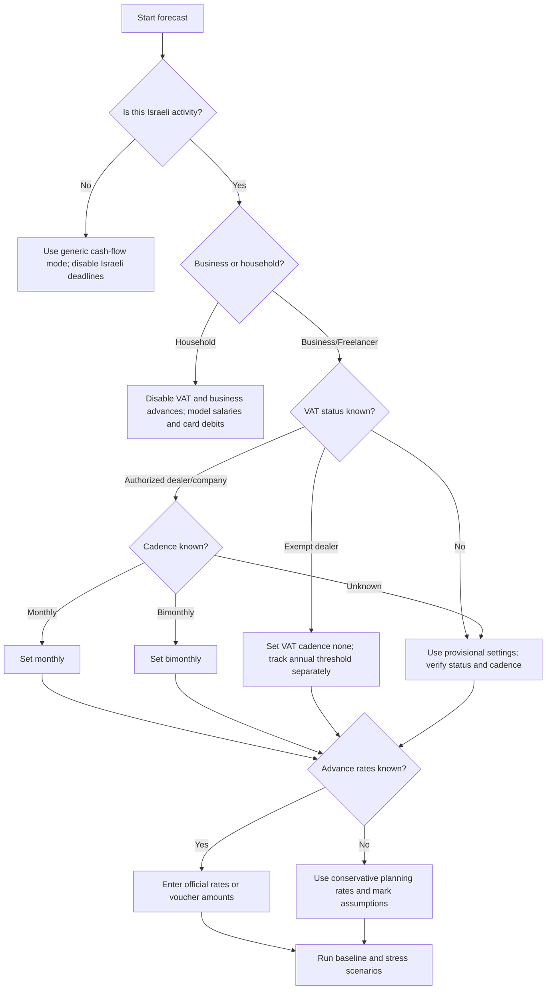

# Budget & Cash-Flow Forecaster

Forecast monthly cash flow for Israeli small businesses, freelancers, households, consumers, and micro-organizations. Use expected receipts, expected payments, Israeli tax-related reserves, deadline timing, and conservative scenarios to identify liquidity gaps before they occur.

This package is local-first and file-based. It does not file reports, determine legal status, or replace bookkeeping. Treat all tax rates and payment schedules as configurable assumptions. Verify current VAT, income-tax advance, and Bituach Leumi obligations with official sources or a licensed Israeli accountant before operational use.

---

## Outcomes

Use the skill to:

- Build a 1–60 month cash-flow forecast.
- Model cash-in dates rather than invoice dates.
- Model operating payments, owner draws, loan repayments, card debits, and annual costs.
- Reserve cash for VAT, income-tax advances, and Bituach Leumi.
- Estimate free cash after protected reserves.
- Detect negative-cash months and buffer warnings.
- Compare baseline, conservative, optimistic, and stress scenarios.
- Produce CSV outputs for review.

Do not use the skill to:

- File VAT, income tax, or Bituach Leumi reports.
- Decide whether an entity is עוסק פטור, עוסק מורשה, company, nonprofit, or household-only.
- Calculate final annual tax liability.
- Replace advice for legal classification, tax disputes, payroll, or bookkeeping.

---

## Core model

Cash flow depends on bank timing. Profit is not cash. A profitable business can still fail a cash-flow test if customers pay after supplier or tax deadlines.

| Layer | What it means | How to model it |
|---|---|---|
| Opening balance | Cash available at the start of the first month | Enter actual bank balance or planning balance |
| Cash in | Money expected to enter the bank | Use payment dates, not invoice dates |
| Cash out | Money expected to leave the bank | Use debit dates, supplier due dates, card billing dates |
| Tax reserve | Cash that should not be treated as free | Estimate from taxable receipts |
| Tax payment | Actual cash outflow to an authority | Use known dates when available; otherwise use cadence assumptions |
| Free cash | Closing balance minus protected reserve | Use this for spending decisions |

Recommended formula:

```text
for each forecast month:
    closing_balance = opening_balance + cash_in - cash_out - tax_paid
    protected_reserve = prior_protected_reserve + tax_reserved - tax_paid
    free_cash = closing_balance - protected_reserve
```

---

## Input structure

Minimal JSON:

```json
{
  "opening_balance": 35000,
  "start_month": "2026-01",
  "months": 6,
  "cash_in": [
    {"date": "2026-01-10", "amount": 23600, "description": "Consulting payment including VAT", "taxable": true, "gross": true}
  ],
  "cash_out": [
    {"date": "2026-01-01", "amount": 4200, "description": "Office rent"}
  ],
  "tax_profile": {
    "vat_rate": 0.18,
    "vat_cadence": "bimonthly",
    "income_tax_advance_rate": 0.08,
    "bituach_leumi_rate": 0.12,
    "reviewed_on": "2026-06-02"
  },
  "buffer": 15000
}
```

### Required fields

| Field | Type | Notes |
|---|---:|---|
| `opening_balance` | number | Cash at start of `start_month` |
| `start_month` | `YYYY-MM` | First forecast month |
| `months` | integer | Forecast length, 1–60 |
| `cash_in` | list | Receipts; use positive amounts |
| `cash_out` | list | Payments; use positive amounts |
| `tax_profile` | object | Configurable tax assumptions |
| `buffer` | number | Minimum desired free-cash level |

### Transaction fields

| Field | Required | Example | Notes |
|---|---:|---|---|
| `date` | yes | `2026-01-10` | Machine-readable ISO date |
| `amount` | yes | `23600` | Positive number |
| `description` | yes | `Client payment` | Human-readable note |
| `category` | no | `revenue` | Useful for review |
| `taxable` | no | `true` | Exclude gifts, transfers, or non-taxable items when appropriate |
| `gross` | no | `true` | `true` when receipt includes VAT |
| `notes` | no | `withholding at source` | Keep assumptions visible |

---

## Israeli planning assumptions

### VAT / מע״מ

For gross receipts that include VAT:

```text
VAT reserve = receipt × VAT rate ÷ (1 + VAT rate)
```

For net receipts that exclude VAT:

```text
VAT reserve = net taxable revenue × VAT rate
```

Set `vat_cadence` to `none`, `monthly`, `bimonthly`, or `manual`. Use `none` for household planning and for VAT-disabled scenarios. Do not treat `none` as legal confirmation of עוסק פטור status.

### Income-tax advances / מקדמות מס הכנסה

Use the official advance percentage when known:

```text
income tax reserve = taxable base × income_tax_advance_rate
```

If no official percentage is known, enter a conservative planning rate and mark the forecast provisional.

### Bituach Leumi / דמי ביטוח לאומי

Use exact voucher amounts when known. Use a planning percentage only when exact amounts are unavailable:

```text
Bituach Leumi reserve = taxable base × bituach_leumi_rate
```

Actual calculation can depend on classification, age, employment status, income bands, and annual reconciliation.

### Withholding tax / ניכוי מס במקור

If a customer withholds tax at source, enter the net bank receipt as cash-in. Track the withheld amount as a note or tax-credit item; do not count it as bank cash.

---

## Decision tree



---

## Concrete examples

### Freelancer with delayed client payment

Opening balance: ₪18,000. Expected monthly customer payment: ₪25,000 including VAT. Fixed monthly costs: ₪7,500. Owner draw: ₪9,000. VAT cadence: bimonthly. One customer pays 30 days late.

Interpretation:

- The business may look profitable while free cash is low.
- VAT reserve is not spending money.
- A bimonthly payment after a delayed receipt can create a shortfall.
- Reduce owner draw, collect a deposit, or shift supplier timing before the shortfall month.

### Small retailer

Enter supplier payments when bank debits occur. Enter card settlements when the acquirer credits the bank. Add rent, payroll, municipal taxes, utilities, delivery, and payment processing fees. Use a conservative sales scenario and a buffer of at least one month of fixed costs.

### Household consumer budget

Disable VAT and business advances. Enter salary by payment date, rent or mortgage by debit date, card bills by billing date, loan repayments, savings transfers, and irregular annual costs. A household can have enough monthly income and still face a mid-month shortage because billing dates cluster before salary.

---

## Edge cases

- **Input VAT refund:** Do not assume immediate refund. Add a dated cash-in only when realistic.
- **Foreign currency:** Convert to NIS using a conservative rate and keep the original currency in notes.
- **Deposits:** Enter cash when received. Verify accounting treatment separately.
- **Credit cards:** Use bank debit date for bank-balance forecasting; use purchase date for behavior analysis. Do not mix methods.
- **Payroll:** Model net salary, employer costs, withholding, and benefits separately when possible.
- **Loan repayments:** Use full cash outflow. Keep principal/interest split in notes if needed.
- **Owner draw:** Treat as cash-out even when not a deductible expense.
- **Seasonality:** Avoid annual averages. Enter actual expected months.
- **Manual authority payments:** When exact vouchers are known, add them as dated payments and set automatic reserve behavior accordingly.

---

## Anti-patterns

Avoid these mistakes:

- Treating profit as cash.
- Entering invoice dates instead of payment dates.
- Spending VAT reserves.
- Ignoring Bituach Leumi advances.
- Forgetting owner withdrawals.
- Averaging seasonal revenue.
- Ignoring card billing dates.
- Hard-coding rates without a review date.
- Running only one scenario.
- Assuming refunds arrive immediately.
- Mixing gross and net revenue without flags.
- Treating an overdraft limit as income.

---

## Troubleshooting quick table

| Symptom | Likely cause | Fix |
|---|---|---|
| Positive bank balance but low free cash | Protected tax reserve | Spend by `free_cash`, not `closing_balance` |
| VAT seems too high | Gross receipt taxed again | Check `gross` flags |
| VAT missing | `vat_cadence` is `none` or transactions are non-taxable | Check tax profile and `taxable` flags |
| Negative month appears suddenly | Annual cost or authority payment lands there | Build reserves earlier |
| CLI validation fails | Date or schema issue | Use ISO dates and positive amounts |
| Tests fail on imports | Wrong working directory | Run `python -m pytest scripts` from package root |

---

## Production checklist

Before relying on the forecast:

- Confirm entity type and VAT status.
- Confirm reporting cadence.
- Confirm current VAT rate.
- Confirm income-tax advance percentage.
- Confirm Bituach Leumi classification and exact voucher amounts when available.
- Confirm whether receipts include VAT.
- Enter payment dates, not invoice dates.
- Add owner draw, loan repayments, card debits, and annual costs.
- Add a cash buffer.
- Run baseline, conservative, and late-payment scenarios.
- Compare forecast to actual bank activity each month.
- Save assumptions with a review date.
- Keep real financial files out of public repositories.

---

## CLI quick start

```bash
python -m pip install -e .
budget-cashflow-forecaster forecast scripts/examples/baseline_scenario.json
budget-cashflow-forecaster compare scripts/examples/baseline_scenario.json scripts/examples/conservative_scenario.json
budget-cashflow-forecaster validate scripts/examples/baseline_scenario.json
```

---

## Response behavior

When using this skill in assistance:

- Use imperative, neutral wording.
- State assumptions before conclusions.
- Keep tax values configurable.
- Use free cash for spending decisions.
- Recommend verification for filing, status, rates, and disputes.
- Present Hebrew-facing outputs with ₪ and `DD/MM/YYYY` display dates.


---

## Web-validated 2026 planning notes

Use these current planning notes when building Israeli scenarios:

- Standard VAT is 18% from 01/01/2025. Keep `vat_rate` configurable.
- VAT online filing/payment may be treated as on time up to the 19th of the month when online reporting applies; the statutory baseline remains the 15th.
- Income-tax advances are user-specific. Use the official advance percentage from the Tax Authority notice or accountant.
- Bituach Leumi self-employed rates are bracketed in 2026. The reduced combined bracket is 7.7% up to ₪7,703 per month and the regular combined bracket is 18% up to ₪51,910. Use exact vouchers or a bracketed calculation for production planning.
- A flat `bituach_leumi_rate` is only a planning approximation. Use 18% as a conservative upper-bracket approximation, not a final calculation.
- Prefer the current Bank of Israel series API at `edge.boi.gov.il` for exchange-rate integrations. Treat `PublicApi/GetExchangeRates` as legacy/simple.
