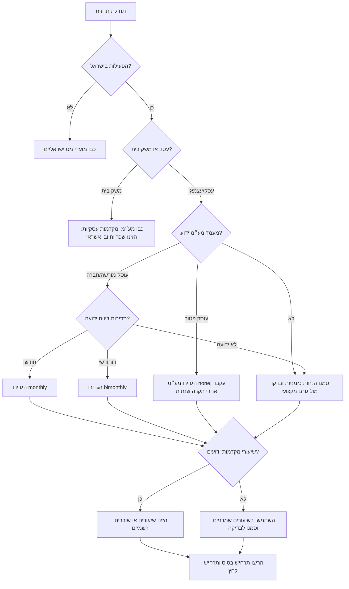

# תחזית תקציב ותזרים מזומנים

השתמשו במיומנות זו כדי לבנות תחזית תזרים חודשית לעסקים קטנים, עצמאים, משקי בית וצרכנים בישראל. התחזית משלבת תקבולים, תשלומים, רזרבות מס, מועדי דיווח ותשלום, כרית ביטחון ותרחישים שמרניים כדי לזהות מחסור במזומן לפני שהוא מתרחש.

הכלי מיועד לתכנון בלבד. הוא אינו מגיש דיווחים, אינו קובע סיווג משפטי או חשבונאי, ואינו מחליף הנהלת חשבונות, ייעוץ מס או רואה חשבון. יש לוודא שיעורי מס, מעמד עוסק, תדירות דיווח ומועדי תשלום מול גורם רשמי או איש מקצוע מוסמך לפני שימוש תפעולי.

---

## מטרות

השתמשו בכלי כדי:

- לבנות תחזית תזרים ל1 עד 60 חודשים.
- לתכנן לפי מועד כניסת כסף לבנק ולא לפי תאריך חשבונית בלבד.
- לתכנן תשלומים שוטפים, משיכת בעלים, החזרי הלוואות, חיובי אשראי והוצאות שנתיות.
- להפריד רזרבות למע״מ, מקדמות מס הכנסה ודמי ביטוח לאומי.
- לחשב מזומן חופשי אחרי רזרבות מוגנות.
- לזהות חודשים עם יתרה שלילית או ירידה מתחת לכרית הביטחון.
- להשוות תרחיש בסיסי, שמרני, אופטימי ותרחיש לחץ.
- להפיק קובץ CSV לבדיקה.

אין להשתמש בכלי כדי:

- להגיש דיווחי מע״מ, מס הכנסה או ביטוח לאומי.
- לקבוע אם הפעילות היא עוסק פטור, עוסק מורשה, חברה, עמותה או משק בית בלבד.
- לחשב חבות מס שנתית סופית.
- להחליף ייעוץ בסוגיות סיווג, מחלוקת, שכר או הנהלת חשבונות.

---

## מודל התזרים

תזרים מזומנים נקבע לפי תנועת הבנק בפועל. רווח אינו מזומן. עסק רווחי יכול להיקלע למצוקת מזומן אם לקוחות משלמים אחרי תשלומי ספקים או רשויות.

| שכבה | משמעות | אופן הזנה |
|---|---|---|
| יתרת פתיחה | מזומן בתחילת החודש הראשון | הזינו יתרת בנק או יתרה תכנונית |
| תקבולים | כסף שצפוי להיכנס לחשבון | לפי תאריך תשלום בפועל |
| תשלומים | כסף שצפוי לצאת מהחשבון | לפי תאריך חיוב בפועל |
| רזרבת מס | כסף שאינו פנוי לשימוש | חישוב מתוך תקבולים חייבים |
| תשלום לרשות | יציאת כסף בפועל | לפי שובר ידוע או תדירות דיווח |
| מזומן חופשי | יתרת סגירה פחות רזרבה מוגנת | בסיס להחלטות הוצאה |

נוסחת עבודה:

```text
עבור כל חודש:
    יתרת סגירה = יתרת פתיחה + תקבולים - תשלומים - תשלומי רשויות
    רזרבה מוגנת = רזרבה קודמת + רזרבה חדשה - תשלומי רשויות
    מזומן חופשי = יתרת סגירה - רזרבה מוגנת
```

---

## מבנה קלט

```json
{
  "opening_balance": 35000,
  "start_month": "2026-01",
  "months": 6,
  "cash_in": [
    {"date": "2026-01-10", "amount": 23600, "description": "תשלום מלקוח כולל מע״מ", "taxable": true, "gross": true}
  ],
  "cash_out": [
    {"date": "2026-01-01", "amount": 4200, "description": "שכירות משרד"}
  ],
  "tax_profile": {
    "vat_rate": 0.18,
    "vat_cadence": "bimonthly",
    "income_tax_advance_rate": 0.08,
    "bituach_leumi_rate": 0.12,
    "reviewed_on": "2026-06-02"
  },
  "buffer": 15000
}
```

בתוצרים בעברית הציגו סכומים בשקלים, למשל `₪12,500`, ותאריכים בפורמט `DD/MM/YYYY`, למשל `02/06/2026`. בקבצי קלט מכונה השתמשו תמיד ב`YYYY-MM-DD`.

---

## הנחות מס בישראל

### מע״מ

כאשר התקבול כולל מע״מ:

```text
רזרבת מע״מ = תקבול × שיעור מע״מ ÷ (1 + שיעור מע״מ)
```

כאשר התקבול לפני מע״מ:

```text
רזרבת מע״מ = הכנסה חייבת נטו × שיעור מע״מ
```

הגדירו `vat_cadence` כ`none`, `monthly`, `bimonthly` או `manual`. עבור משק בית או תרחיש ללא מע״מ השתמשו ב`none`. אין לראות בכך אישור משפטי למעמד עוסק פטור.

### מקדמות מס הכנסה

כאשר שיעור המקדמות ידוע, הזינו אותו:

```text
רזרבת מס הכנסה = בסיס חייב × שיעור מקדמות
```

כאשר שיעור המקדמות אינו ידוע, השתמשו בשיעור תכנוני שמרני וסמנו את ההנחה כזמנית.

### דמי ביטוח לאומי

כאשר שובר או מקדמה ידועים, הזינו תשלום מדויק לפי תאריך. כאשר אין סכום ידוע, השתמשו בשיעור תכנוני:

```text
רזרבת ביטוח לאומי = בסיס חייב × שיעור תכנוני
```

החיוב בפועל עשוי להשתנות לפי סיווג, גיל, מעמד תעסוקתי, מדרגות הכנסה והתחשבנות שנתית.

### ניכוי מס במקור

כאשר לקוח מנכה מס במקור, הזינו כתקבול את הסכום נטו שנכנס לחשבון. רשמו את הסכום שנוכה כהערת זיכוי מס, לא כמזומן בבנק.

---

## עץ החלטה



---

## דוגמאות

### עצמאי עם לקוח שמאחר בתשלום

יתרת פתיחה: ₪18,000. תקבול חודשי צפוי: ₪25,000 כולל מע״מ. הוצאות קבועות: ₪7,500. משיכת בעלים: ₪9,000. דיווח מע״מ: דוחודשי. לקוח אחד משלם באיחור של 30 יום.

פרשנות:

- העסק עשוי להיראות רווחי אך המזומן החופשי עלול להיות נמוך.
- מע״מ אינו כסף פנוי.
- תשלום דוחודשי אחרי איחור לקוח עלול ליצור פער תזרימי.
- הקדימו גבייה, בקשו מקדמה, דחו תשלום ספק או הקטינו משיכת בעלים לפני חודש הפער.

### חנות קטנה

הזינו תשלומי ספקים לפי מועד חיוב הבנק. הזינו תקבולי אשראי לפי מועד הזיכוי מהסולק. הוסיפו שכירות, שכר, ארנונה, חשמל, משלוחים ועמלות סליקה. הריצו תרחיש מכירות שמרני וכרית ביטחון של חודש הוצאות קבועות לפחות.

### תקציב משפחתי

כבו מע״מ ומקדמות עסקיות. הזינו משכורת לפי מועד כניסה, שכירות או משכנתה לפי מועד חיוב, כרטיסי אשראי לפי מועד חיוב, הלוואות, העברות לחיסכון והוצאות שנתיות. ייתכן מחסור באמצע החודש גם כאשר ההכנסה החודשית מספיקה, אם חיובים מרוכזים לפני המשכורת.

---

## מקרי קצה

- **החזר מע״מ:** אל תניחו החזר מיידי. הוסיפו תקבול רק כאשר קיים צפי סביר ותאריך.
- **מטבע חוץ:** המירו לשקלים לפי שער שמרני ושמרו הערה על המטבע המקורי.
- **מקדמות מלקוח:** הזינו כסף בתאריך קבלה בפועל. בדקו טיפול חשבונאי בנפרד.
- **כרטיס אשראי:** לתחזית בנק השתמשו במועד החיוב בבנק; לניתוח התנהגותי השתמשו במועד הרכישה. אל תערבבו שיטות.
- **שכר:** כאשר אפשר, הפרידו שכר נטו, עלויות מעסיק, ניכויים והטבות.
- **הלוואות:** הזינו את מלוא יציאת המזומן. רשמו פיצול קרן/ריבית בהערה.
- **משיכת בעלים:** זו יציאת מזומן גם כאשר אינה הוצאה מוכרת.
- **עונתיות:** אל תשתמשו בממוצע שנתי לעסק עונתי.

---

## טעויות נפוצות

- התייחסות לרווח כאל מזומן.
- הזנת תאריך חשבונית במקום תאריך תשלום.
- שימוש ברזרבת מע״מ לתפעול שוטף.
- התעלמות ממקדמות ביטוח לאומי.
- שכחת משיכת בעלים.
- שימוש בממוצעים בעסק עונתי.
- התעלמות ממועד חיוב כרטיס אשראי.
- שיעורי מס ללא תאריך בדיקה.
- תרחיש אחד בלבד.
- הנחה שהחזר מרשות יתקבל מיד.
- ערבוב סכומים ברוטו ונטו ללא סימון.

---

## פתרון תקלות מהיר

| סימפטום | סיבה אפשרית | תיקון |
|---|---|---|
| יתרת בנק חיובית אך מזומן חופשי נמוך | קיימת רזרבת מס מוגנת | קבלו החלטות לפי מזומן חופשי |
| מע״מ גבוה מדי | תקבול ברוטו חויב שוב | בדקו סימון `gross` |
| מע״מ חסר | `vat_cadence` הוא `none` או התקבולים לא חייבים | בדקו פרופיל מס וסימון `taxable` |
| חודש שלילי מופיע בפתאומיות | הוצאה שנתית או תשלום רשות מרוכז | צרו רזרבה מוקדמת |
| אימות CLI נכשל | תאריך או מבנה קובץ שגויים | השתמשו בתאריכי ISO ובסכומים חיוביים |

---

## רשימת בדיקה לשימוש שוטף

- ודאו סוג פעילות ומעמד מע״מ.
- ודאו תדירות דיווח.
- ודאו שיעור מע״מ עדכני.
- ודאו שיעור מקדמות מס הכנסה.
- ודאו סיווג ותשלום ביטוח לאומי.
- ודאו אם תקבולים כוללים מע״מ.
- הזינו תאריכי תשלום בפועל.
- הוסיפו משיכת בעלים, הלוואות, חיובי אשראי והוצאות שנתיות.
- הגדירו כרית ביטחון.
- הריצו תרחיש בסיס, שמרני ואיחור לקוח.
- השוו מדי חודש מול הבנק בפועל.
- שמרו הנחות עם תאריך בדיקה.
- שמרו קבצים פיננסיים במקום מאובטח.

---

## התחלה מהירה

```bash
python -m pip install -e .
budget-cashflow-forecaster forecast scripts/examples/baseline_scenario.json
budget-cashflow-forecaster compare scripts/examples/baseline_scenario.json scripts/examples/conservative_scenario.json
budget-cashflow-forecaster validate scripts/examples/baseline_scenario.json
```


---

## הערות תכנון מאומתות ל-2026

השתמשו בהערות אלה בעת בניית תרחישים בישראל:

- שיעור המע״מ הסטנדרטי הוא 18% מיום 01/01/2025. השאירו את `vat_rate` ניתן לשינוי.
- בדיווח ותשלום מע״מ מקוון, דיווח עד ה-19 בחודש עשוי להיחשב במועד כאשר הדיווח המקוון חל; נקודת הבסיס החוקית היא ה-15 בחודש.
- מקדמות מס הכנסה הן אישיות לכל תיק. הזינו את שיעור המקדמות הרשמי מהודעת רשות המסים או מרואה החשבון.
- דמי ביטוח לאומי לעצמאי מחושבים במדרגות בשנת 2026. המדרגה המופחתת המשולבת היא 7.7% עד ₪7,703 לחודש, והמדרגה הרגילה המשולבת היא 18% עד ₪51,910.
- השדה `bituach_leumi_rate` הוא קירוב תכנוני בלבד. השתמשו ב-18% כקירוב שמרני למדרגה הרגילה, לא כחישוב סופי.
- לשליפת שערי חליפין העדיפו את ממשק הסדרות העדכני של בנק ישראל ב-`edge.boi.gov.il`. התייחסו אל `PublicApi/GetExchangeRates` כאל נקודת קצה ותיקה או פשוטה.
