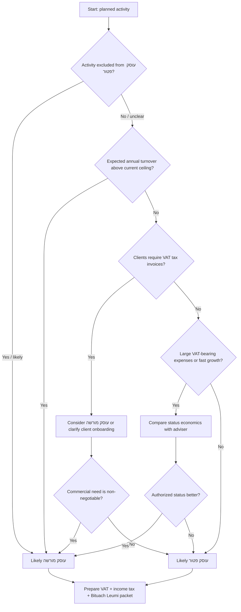

# Business Registration Assistant

## Purpose

Use this skill to help Israeli freelancers, small businesses, and consumers prepare for self-employed business registration as **עוסק פטור** or **עוסק מורשה**. The skill organizes the facts and documents needed for the Israel Tax Authority and **Bituach Leumi** and explains practical obligations after registration.

The skill is a preparation guide. It does not submit filings, authenticate with a government portal, or replace advice from a licensed accountant, tax adviser, attorney, VAT office, income tax office, or Bituach Leumi branch. Verify current thresholds, VAT rates, filing routes, and occupation restrictions before submission.

## Core outcomes

Produce one or more of these outputs:

1. A likely registration path: עוסק פטור, עוסק מורשה, or needs professional review.
2. A document checklist for VAT, income tax, and Bituach Leumi.
3. A risk list covering occupation restrictions, turnover thresholds, benefits, foreign clients, cash, licensing, and late registration.
4. An authority-by-authority action plan.
5. A handoff packet for an accountant or tax adviser.
6. A migration checklist from עוסק פטור to עוסק מורשה.

## Neutral operating rules

- Use imperative, practical wording.
- Separate VAT, income tax, and Bituach Leumi obligations.
- Treat current-year thresholds as facts that must be verified.
- Explain uncertainty and the next action.
- Refuse to help conceal income, fabricate records, backdate documents, split invoices artificially, or misuse another person's identity or bank account.

## Key terms

| Term | Hebrew | Meaning |
|---|---|---|
| Exempt dealer | עוסק פטור | VAT status for eligible small self-employed businesses below the annual turnover ceiling and not in excluded occupations. Not exempt from income tax or Bituach Leumi. |
| Authorized dealer | עוסק מורשה | VAT status requiring VAT collection, VAT invoices, and periodic VAT reporting. Input VAT may be deducted where legally recognized. |
| Turnover | מחזור עסקאות | Gross business revenue before expenses. Use this for the exempt dealer ceiling. |
| Profit | רווח | Revenue minus deductible business expenses. Important for income tax and Bituach Leumi estimates. |
| Tax invoice | חשבונית מס | VAT document issued by an authorized dealer, not by an exempt dealer. |
| Receipt | קבלה | Payment receipt; typical document for an exempt dealer. |
| Withholding certificate | אישור ניכוי מס במקור | Certificate used by clients to determine whether tax must be withheld from payments. |
| Bookkeeping certificate | אישור ניהול ספרים | Certificate requested by many business clients and public bodies. |

## Intake questions

Collect the following information before making a recommendation:

```yaml
person:
  full_name: ""
  id_or_passport_status: ""
  address: ""
  phone: ""
  email: ""
business:
  planned_start_date: "DD-MM-YYYY"
  actual_start_date_if_started: "DD-MM-YYYY"
  activity_description: ""
  products_or_services: []
  expected_annual_turnover_nis: 0
  expected_monthly_profit_nis: 0
  weekly_hours: 0
  clients: ["consumers", "companies", "public bodies", "foreign clients"]
  work_location: "home / rented office / client sites / online"
  regulated_profession: false
  clients_require_tax_invoice: false
  large_vat_bearing_expenses: false
  foreign_clients: false
  online_platforms: false
  import_export: false
  currently_employee: false
  receives_bituach_leumi_benefits: false
  prior_self_employment_file: false
  cash_payments: false
documents:
  id_card_and_appendix: false
  bank_ownership_confirmation: false
  lease_or_address_proof: false
  professional_license: false
  contracts_or_platform_reports: false
```

## Status decision tree



## עוסק פטור guidance

Use this path when the activity is eligible, expected annual turnover is below the current ceiling, clients do not need VAT invoices, and simple compliance is commercially suitable.

Explain these obligations:

- Issue receipts, not VAT tax invoices.
- Track gross turnover during the year.
- File the annual exempt dealer turnover declaration when required.
- File income tax reports when required.
- Register/update Bituach Leumi with profit and weekly hours.
- Keep records according to bookkeeping instructions.
- Change to עוסק מורשה if the ceiling is crossed or the activity changes.

### Example: private tutor

Facts: private English tutoring, consumers, expected turnover ₪72,000, expected profit ₪5,000 per month, no employees, no regulated license, planned start date 01/09/2026.

Likely path: עוסק פטור, subject to current ceiling and occupation confirmation.

Prepare: ID card and appendix, bank ownership confirmation, start date, Hebrew activity description, turnover estimate, profit estimate, weekly hours, receipt software, Bituach Leumi update.

## עוסק מורשה guidance

Use this path when turnover exceeds the current ceiling, the profession is excluded from עוסק פטור, clients require VAT tax invoices, or authorized status is commercially better.

Explain these obligations:

- Charge VAT on taxable transactions.
- Issue חשבונית מס or חשבונית מס/קבלה according to the transaction/payment timing.
- File periodic VAT reports.
- Deduct input VAT only with valid tax invoices and recognized business use.
- Keep books at the required level.
- File income tax and Bituach Leumi updates.

### Example: software consultant

Facts: B2B software consulting, expected turnover ₪220,000, corporate clients, equipment and software expenses, clients require tax invoices.

Likely path: עוסק מורשה. Configure invoice software, clarify whether prices are before VAT or including VAT, keep supplier tax invoices, and calendar VAT reports.

## Document workflow


### Required for most sole proprietors

- ID card and appendix, or valid passport/visa evidence where relevant.
- Bank ownership confirmation, cancelled check, or bank letter.
- Address and contact details.
- Planned start date.
- Exact activity description in Hebrew.
- Expected annual turnover and monthly profit.
- Weekly hours estimate.

### Conditional documents

- Lease or office agreement for non-home premises.
- Professional license or certificate for regulated professions.
- Marketplace statements for digital sellers.
- Contracts and customer location evidence for foreign clients.
- Import/export and customs records.
- Prior file numbers and closure confirmations.
- Benefit or unemployment details for Bituach Leumi.

## Authority-specific plan

### VAT / מע״מ

Prepare requested status, activity, turnover, address, start date, identity, bank document, and professional license if relevant. Confirm the annual עוסק פטור ceiling and excluded occupations. After registration, follow the document type and VAT reporting obligations for the status granted.

### Income Tax / מס הכנסה

Prepare expected profit and turnover, activity, start date, bookkeeping method, and client certificate needs. Check advance payments, annual return obligations, withholding tax certificate, and bookkeeping certificate.

### Bituach Leumi / ביטוח לאומי

Prepare expected monthly profit, weekly hours, employee status, and benefit status. VAT status does not determine Bituach Leumi status. Update estimates when income or hours change.

## Edge cases

### Salaried employee plus freelance business

Do not assume payroll deductions cover self-employed income. Collect salary, freelance profit, weekly hours, and benefit status. Update Bituach Leumi and check tax coordination.

### Benefits or unemployment

Self-employment can affect unemployment, disability, maternity, income support, pension supplements, and other benefits. Require direct Bituach Leumi confirmation before activity, invoices, or payments where benefits are material.

### Foreign clients

Foreign clients do not eliminate Israeli income tax or Bituach Leumi duties. VAT treatment can be complex. Zero-rate VAT can depend on recipient identity, place of benefit, service type, and documentation. Require professional review.

### Digital platforms

Use gross sales, not only net payouts. Keep platform statements, fees, refunds, payment processor reports, and currency conversion evidence.

### Cash payments

Cash income must be recorded. Issue receipts and observe cash-use restrictions. Do not suggest unrecorded cash activity.

### Home food, childcare, cosmetics, health, events, transport

Tax registration does not equal municipal or professional licensing. Flag separate licensing review.

### Prior closed file

Collect prior VAT, income tax, and Bituach Leumi file numbers, closure dates, debts/credits, and open reports. Reopening can differ from first registration.

### Late registration

Use the real activity and payment dates. Reconstruct records and obtain professional guidance. Do not advise a false later start date.

## Troubleshooting quick table

| Symptom | Likely issue | Action |
|---|---|---|
| User says עוסק פטור means no tax | VAT misconception | Explain income tax and Bituach Leumi still apply. |
| Client asks exempt dealer for חשבונית מס | Document mismatch | Explain exempt dealer cannot issue VAT tax invoice. Consider עוסק מורשה. |
| Turnover near ceiling | Migration risk | Forecast gross turnover and contact adviser/VAT office. |
| Profession sounds licensed | Occupation restriction | Verify official excluded occupation list. |
| Foreign-client service | VAT complexity | Collect contracts and recipient evidence; get review. |
| Missing bank proof | Incomplete packet | Obtain bank confirmation or cancelled check. |

## Anti-patterns

Do not:

- Describe עוסק פטור as fully tax-exempt.
- Treat turnover as profit.
- Use outdated thresholds without warning.
- Tell an exempt dealer to issue a VAT invoice.
- Suggest delaying receipts to stay under the ceiling.
- Split income among relatives without real business substance.
- Hide benefit-impacting income from Bituach Leumi.
- Use vague activity descriptions to bypass occupation restrictions.

## Production checklist

Before finalizing a response, include:

- Likely path and confidence level.
- Current-threshold verification warning.
- Occupation restriction check.
- Separate VAT, income tax, and Bituach Leumi steps.
- Document checklist.
- Post-registration bookkeeping obligations.
- Risk flags and escalation triggers.
- One concrete next action.

## Response skeleton

```markdown
### Likely path
עוסק פטור / עוסק מורשה / needs review

### Why
- ...

### Documents to prepare
- ...

### Steps by authority
VAT:
Income Tax:
Bituach Leumi:

### Watch-outs
- ...

### Next action
...
```


### Combined online opening routes

A live government announcement and a secondary procedural source confirm that some online routes can open a self-employed file across the Tax Authority and Bituach Leumi in one action. Still verify each resulting file separately: VAT status, income tax file, National Insurance classification, and contribution estimate.
