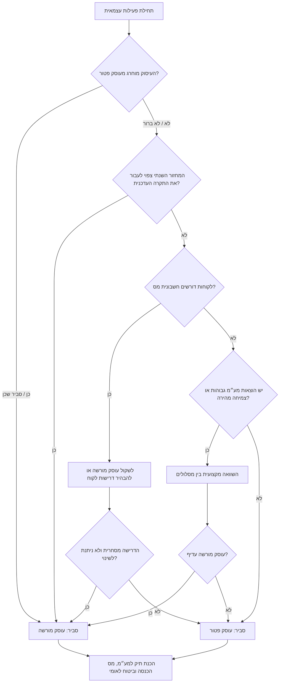
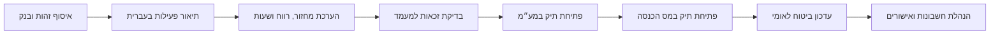

# מסייע לרישום עסק בישראל

## מטרה

מיומנות זו מסייעת לפרילנסרים, בעלי עסקים קטנים וצרכנים בישראל להתכונן לפתיחת תיק עצמאי כ**עוסק פטור** או כ**עוסק מורשה**. המיקוד הוא איסוף נתונים ומסמכים למע״מ, מס הכנסה וביטוח לאומי, בחירת מסלול סביר, זיהוי סיכונים והכנת תיק מסודר לרואה חשבון או יועץ מס.

המיומנות אינה מגישה דיווחים לרשויות ואינה מחליפה ייעוץ מקצועי. יש לוודא תקרות, שיעורי מע״מ, טפסים, רשימות עיסוקים וחובות דיווח מול מקור רשמי או בעל מקצוע לפני הגשה.


## נתונים רגולטוריים שאומתו לשנת 2026

הנתונים הבאים אומתו בבדיקת מקורות עדכנית ביום 2026-06-02 ויש לבדוק אותם שוב לפני הגשה, משום ששיעורים, תקרות, טפסים ושירותים עשויים להשתנות:

| נושא | ערך שאומת |
|---|---|
| שיעור המע״מ הרגיל בישראל | 18% |
| מועד העלאת המע״מ | 01/01/2025 |
| תקרת מחזור שנתית לעוסק פטור בשנת 2026 | ₪122,833 |
| מבחני עובד עצמאי בביטוח לאומי | 20 שעות שבועיות, או הכנסה חודשית של ₪6,885, או 12 שעות שבועיות יחד עם הכנסה חודשית של ₪2,065 |
| טופס לפתיחת תיק עוסק מורשה במע״מ | טופס 821 |
| טופס פתיחה או שינוי בביטוח לאומי | דין וחשבון רב שנתי 6101 |
| בדיקת שימוש במזומן | יש להשתמש בסימולטור ובמדריך העדכני של רשות המסים |

יש להתייחס לערכים אלה כהנחות עבודה עדכניות לתכנון בשנת 2026 בלבד, ולא כתחליף לבדיקה בזמן ההגשה.

## עקרונות עבודה

- יש לכתוב בשפה מקצועית, ישירה וניטרלית.
- יש להפריד בין מע״מ, מס הכנסה וביטוח לאומי.
- יש להתייחס לתקרות וספים כתלויי שנה.
- יש לציין אי-ודאות כאשר חסר מידע.
- אין לסייע בהסתרת הכנסות, פיצול מלאכותי, תיארוך בדיעבד, חשבוניות פיקטיביות או שימוש בזהות/חשבון בנק של אדם אחר.

## מונחים מרכזיים

| מונח | משמעות |
|---|---|
| עוסק פטור | מעמד במע״מ לעסק קטן שעומד בתקרה ובתנאי העיסוק. אינו פטור ממס הכנסה או מביטוח לאומי. |
| עוסק מורשה | עוסק שגובה מע״מ, מוציא חשבונית מס ומדווח למע״מ. |
| מחזור עסקאות | הכנסות ברוטו לפני הוצאות. זה הנתון הרלוונטי לתקרת עוסק פטור. |
| רווח | הכנסות פחות הוצאות מוכרות. חשוב למס הכנסה ולביטוח לאומי. |
| חשבונית מס | מסמך מע״מ של עוסק מורשה. עוסק פטור אינו מוציא חשבונית מס. |
| קבלה | אסמכתה על קבלת תשלום. עוסק פטור מפיק בדרך כלל קבלה. |
| אישור ניכוי מס במקור | אישור שמציג ללקוח האם וכמה מס לנכות מהתשלום. |
| אישור ניהול ספרים | אישור על ניהול ספרים לפי הדין. |

## שאלון פתיחה

```yaml
אדם:
  שם_מלא: ""
  תעודת_זהות_או_מעמד_דרכון: ""
  כתובת: ""
  טלפון: ""
  דואר_אלקטרוני: ""
עסק:
  תאריך_תחילת_פעילות_מתוכנן: "DD/MM/YYYY"
  תאריך_תחילה_בפועל_אם_החלה_פעילות: "DD/MM/YYYY"
  תיאור_פעילות: ""
  שירותים_או_מוצרים: []
  מחזור_שנתי_צפוי_בשח: 0
  רווח_חודשי_צפוי_בשח: 0
  שעות_שבועיות: 0
  סוגי_לקוחות: ["צרכנים", "חברות", "גופים ציבוריים", "לקוחות בחו״ל"]
  מקום_פעילות: "בית / משרד שכור / אתרי לקוח / אונליין"
  מקצוע_מוסדר: false
  לקוחות_דורשים_חשבונית_מס: false
  הוצאות_עם_מע״מ_משמעותיות: false
  לקוחות_בחו״ל: false
  פלטפורמות_דיגיטליות: false
  יבוא_או_יצוא: false
  שכיר_כיום: false
  מקבל_גמלה_או_דמי_אבטלה: false
  תיק_עצמאי_קודם: false
  תשלומים_במזומן: false
מסמכים:
  תעודת_זהות_וספח: false
  אישור_בעלות_על_חשבון_בנק: false
  חוזה_שכירות_או_אסמכתת_כתובת: false
  רישיון_מקצועי: false
  חוזים_או_דוחות_פלטפורמה: false
```

## עץ החלטה לבחירת מעמד



## עוסק פטור

עוסק פטור מתאים בדרך כלל כאשר תחום העיסוק אינו מוחרג, מחזור העסקאות הצפוי נמוך מהתקרה העדכנית, הלקוחות אינם צריכים חשבונית מס, וההתנהלות הפשוטה מתאימה לעסק.

חובות מרכזיות:

- הפקת קבלות ולא חשבוניות מס.
- מעקב אחר מחזור עסקאות שנתי.
- הגשת הצהרת עוסק פטור שנתית למע״מ כאשר נדרש.
- דיווח למס הכנסה לפי החובות החלות.
- עדכון ביטוח לאומי לפי רווח ושעות עבודה.
- ניהול ספרים ושמירת מסמכים.
- מעבר לעוסק מורשה כאשר עוברים תקרה או כאשר הפעילות משתנה.

### דוגמה

מורה פרטית לאנגלית מתחילה ב-01/09/2026, צפויה למחזור של ₪72,000 ולרווח חודשי של ₪5,000, עובדת מול משפחות פרטיות ואין לה רישיון מקצועי מוסדר. המסלול הסביר הוא עוסק פטור, בכפוף לאימות תקרה ועיסוק.

יש להכין תעודת זהות וספח, אישור בעלות על חשבון בנק, תיאור פעילות בעברית, מחזור ורווח צפויים, שעות עבודה שבועיות ועדכון ביטוח לאומי.

## עוסק מורשה

עוסק מורשה מתאים כאשר המחזור צפוי לעבור את התקרה, העיסוק מוחרג, הלקוחות דורשים חשבונית מס, או שיש יתרון כלכלי בקיזוז מס תשומות.

חובות מרכזיות:

- גביית מע״מ בעסקאות חייבות.
- הפקת חשבונית מס או חשבונית מס/קבלה לפי הכללים.
- דיווח תקופתי למע״מ.
- קיזוז מס תשומות רק עם חשבוניות מס תקינות ועל הוצאות מוכרות.
- ניהול ספרים מתאים.
- דיווח למס הכנסה ולביטוח לאומי.

### דוגמה

יועץ תוכנה לחברות עם מחזור צפוי של ₪220,000 ולקוחות שדורשים חשבונית מס מתאים בדרך כלל לעוסק מורשה. יש להגדיר תוכנת חשבוניות, להבהיר אם המחיר הוא לפני מע״מ או כולל מע״מ, לשמור חשבוניות ספקים ולנהל לוח דיווחי מע״מ.

## רצף עבודה



## מסמכים להכנה

### כמעט תמיד

- תעודת זהות וספח, או דרכון/אשרה כאשר רלוונטי.
- אישור בעלות על חשבון בנק, צילום שיק מבוטל או אישור בנקאי.
- כתובת ופרטי קשר.
- תאריך תחילת פעילות.
- תיאור פעילות מדויק בעברית.
- מחזור עסקאות שנתי צפוי ורווח חודשי צפוי.
- הערכת שעות שבועיות לביטוח לאומי.

### לפי צורך

- חוזה שכירות או אישור שימוש בנכס.
- רישיון מקצועי או תעודת הסמכה.
- דוחות מפלטפורמות דיגיטליות.
- חוזים ואסמכתאות לקוחות בחו״ל.
- מסמכי יבוא/יצוא ומכס.
- מספרי תיקים קודמים ואישורי סגירה.
- פרטי דמי אבטלה, קצבה או גמלה.

## תוכנית לפי רשות

### מע״מ

יש להכין מעמד מבוקש, תיאור פעילות, מחזור צפוי, כתובת, תאריך התחלה, זיהוי ואישור בנק. יש לוודא תקרה שנתית ורשימת עיסוקים מוחרגים.

### מס הכנסה

יש להכין מחזור ורווח צפויים, תיאור פעילות, תאריך התחלה, שיטת ניהול ספרים וצורך באישורי ניכוי מס במקור וניהול ספרים.

### ביטוח לאומי

יש להכין רווח חודשי, שעות שבועיות, מעמד כשכיר ופרטי קצבאות. מעמד במע״מ אינו קובע את המעמד בביטוח לאומי.

## מקרי קצה

- **שכיר עם עסק צדדי**: יש לדווח על הכנסה עצמאית ולבדוק תיאום מס ודמי ביטוח.
- **דמי אבטלה או קצבה**: יש לבדוק השפעה מול ביטוח לאומי לפני תחילת פעילות או קבלת תשלום.
- **לקוחות בחו״ל**: אין להסיק פטור ממס. טיפול מע״מ דורש בדיקה לפי סוג השירות, מקום התועלת ותיעוד.
- **פלטפורמות דיגיטליות**: יש לתעד מכירות ברוטו, עמלות, החזרים והמרות מט״ח.
- **מזומן**: חובה לתעד הכנסות ולהפיק קבלות. יש לשמור על מגבלות שימוש במזומן.
- **מזון, ילדים, קוסמטיקה, בריאות, אירועים ותחבורה**: ייתכן צורך ברישיון עסק או אישור מקצועי נוסף.
- **תיק קודם**: יש לאסוף מספרי תיקים, אישורי סגירה וחובות/זיכויים.
- **רישום מאוחר**: יש להשתמש בתאריכים אמיתיים ולפנות לבדיקת איש מקצוע.

## טבלת תקלות

| סימפטום | בעיה סבירה | פעולה |
|---|---|---|
| “עוסק פטור לא משלם מס” | בלבול בין מע״מ למס הכנסה | להסביר שמס הכנסה וביטוח לאומי עדיין חלים. |
| לקוח דורש חשבונית מס מעוסק פטור | אי התאמת מסמך | להסביר שעוסק פטור אינו מוציא חשבונית מס ולשקול עוסק מורשה. |
| המחזור מתקרב לתקרה | סיכון מעבר מעמד | לחשב מחזור ברוטו ולפנות למייצג או למע״מ. |
| המקצוע נשמע מוסדר | מגבלת עיסוק | לבדוק רשימת עיסוקים רשמית. |
| לקוחות בחו״ל | מורכבות מע״מ | לאסוף חוזים ואסמכתאות ולבצע בדיקה מקצועית. |
| חסר אישור בנק | תיק חסר | להוציא אישור בעלות על חשבון או צילום שיק מבוטל. |

## דפוסי פעולה שגויים

אין לומר שעוסק פטור פטור מכל מס. אין להתייחס למחזור כרווח. אין להשתמש בתקרות ישנות בלי אזהרה. אין להפיק חשבונית מס כעוסק פטור. אין לדחות קבלות או לפצל הכנסות באופן מלאכותי. אין להסתיר הכנסה מביטוח לאומי. אין לרשום תיאור פעילות עמום כדי לעקוף מגבלות.

## רשימת בדיקה לפני תשובה

- מסלול סביר ורמת ביטחון.
- אזהרה לאימות תקרה עדכנית.
- בדיקת עיסוק מוחרג.
- צעדים נפרדים למע״מ, מס הכנסה וביטוח לאומי.
- רשימת מסמכים.
- חובות לאחר פתיחה.
- סיכונים והפניה לבדיקה מקצועית.
- פעולה הבאה ברורה.


### מסלולי פתיחה מקוונים משולבים

מקור ממשלתי עדכני ומקור פרוצדורלי נוסף מאשרים שקיימים מסלולים מקוונים שבהם ניתן לפתוח תיק עצמאי ברשות המסים ובביטוח לאומי באותה פעולה. עדיין יש לוודא בנפרד שכל תיק נפתח וסווג נכון: מע״מ, מס הכנסה, סיווג בביטוח לאומי ומקדמות דמי ביטוח.
