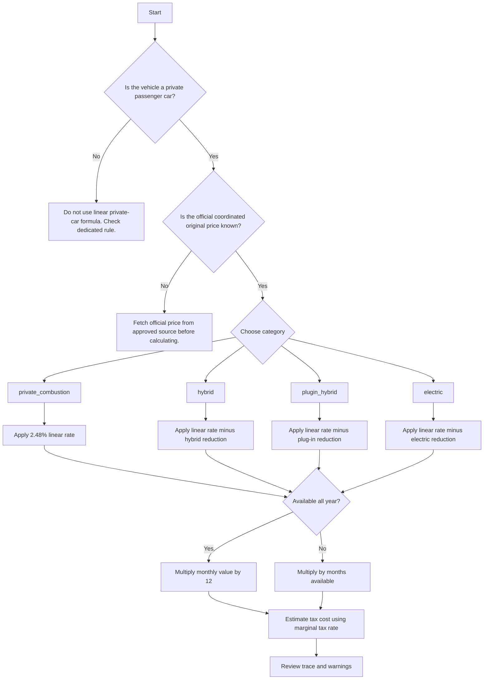

# Car Leasing Tax Benefit Calculator

Calculate Israeli **Shovi Rechev** (שווי שימוש ברכב) imputed value for company cars, estimate the employee-side tax cost, and produce a traceable calculation for payroll, bookkeeping, and tax-planning review.

Use this skill for Israeli small businesses, freelancers operating through a company, payroll coordinators, accountants, and consumers comparing company-car benefit terms with private alternatives.

> Professional-use note: Shovi Rechev amounts and green-vehicle reductions can change by tax year. Verify current rates against the Israel Tax Authority publication before payroll filing, annual reports, or client advice.

## What the skill does

- Calculates monthly imputed benefit from coordinated original vehicle price.
- Applies category-specific monthly reductions for hybrid, plug-in hybrid, and electric vehicles according to the included rule table.
- Supports partial-year availability, employee marginal-tax assumptions, and planning-only private-use ratios.
- Produces monthly value, annual value, estimated monthly tax cost, estimated annual tax cost, and a calculation trace.
- Exports batch calculations to CSV for payroll or accountant review.
- Supplies English and Hebrew documentation, troubleshooting, migration guidance, and a test suite.

## Core rule model

For a private passenger vehicle subject to the linear rule:

```text
monthly_imputed_value =
  max(original_price_ils × base_linear_rate − monthly_category_reduction, 0)
  × private_use_ratio
```

Default included linear rate: **2.48%**. Included annual category reductions are stored in `data/tax_authority_tables.json` and must be reviewed before production use.

## Required inputs

| Field | Meaning | Example | Notes |
|---|---:|---:|---|
| `original_price_ils` | Coordinated original price in ₪ | `180000` | Use the official coordinated original price, not invoice discount or lease payment. |
| `category` | Vehicle category key | `electric` | Supported: `private_combustion`, `hybrid`, `plugin_hybrid`, `electric`. |
| `tax_year` | Calendar tax year | `2026` | Must exist in the rule table. |
| `employee_marginal_tax_rate` | Planning estimate of tax rate | `0.35` | Use decimal form between 0 and 1. |
| `months_available` | Months available to employee | `12` | 1–12. Use partial year for joins/leaves/replacements. |
| `private_use_ratio` | Planning adjustment | `1` | Keep at 1 for payroll unless a qualified adviser approves a different treatment. |

## Quick start

```bash
python scripts/car_leasing_tax_benefit_client.py calculate \
  --price 180000 \
  --category private_combustion \
  --tax-rate 0.35 \
  --year 2026
```

JSON output:

```bash
python scripts/car_leasing_tax_benefit_client.py calculate \
  --price 220000 \
  --category electric \
  --tax-rate 0.47 \
  --json
```

Batch output:

```bash
python scripts/car_leasing_tax_benefit_client.py batch \
  scripts/examples/06_cli_batch_payload.json \
  --output-csv /tmp/shovi-rechev.csv
```

## Concrete examples

### 1. Regular company car

Inputs:

```json
{
  "original_price_ils": "180000",
  "category": "private_combustion",
  "employee_marginal_tax_rate": "0.35",
  "months_available": 12
}
```

Calculation:

```text
180,000 × 2.48% = ₪4,464.00 monthly imputed value
Estimated tax cost: ₪4,464.00 × 35% = ₪1,562.40 monthly
Annual imputed value: ₪53,568.00
```

Use for: standard petrol/diesel employee vehicle.

### 2. Electric vehicle with monthly reduction

Inputs:

```json
{
  "original_price_ils": "220000",
  "category": "electric",
  "employee_marginal_tax_rate": "0.47"
}
```

Calculation using included 2026 starter table:

```text
220,000 × 2.48% = ₪5,456.00
₪5,456.00 − ₪1,380.00 = ₪4,106.00 monthly imputed value
Estimated monthly tax cost at 47% = ₪1,929.82
```

Use for: comparison between a regular company vehicle and a green vehicle.

### 3. Partial-year availability

Inputs:

```json
{
  "original_price_ils": "165000",
  "category": "hybrid",
  "months_available": 5,
  "employee_marginal_tax_rate": "0.31"
}
```

Calculation:

```text
165,000 × 2.48% = ₪4,092.00
₪4,092.00 − category reduction = monthly imputed value
Annualized for this employment period = monthly value × 5
```

Use for: employee joined in August, left during the year, or replaced the vehicle mid-year.

## Decision tree



## Edge cases

### Vehicle switched during the year

Create one record for each vehicle and month span. Do not average prices unless payroll policy explicitly requires it.

Example:

```json
[
  {"original_price_ils": "160000", "category": "private_combustion", "months_available": 4},
  {"original_price_ils": "225000", "category": "electric", "months_available": 8}
]
```

### Vehicle available for part of a month

Keep a documented policy. Common internal approaches include full-month treatment, day-ratio treatment, or payroll-system default. Use the calculator only after deciding the number of months or prorated ratio.

### Price after discount is lower than official coordinated price

Use the official coordinated original price. Do not use negotiated lease payment, purchase discount, balloon payment, or monthly cash allowance.

### Electric reduction larger than gross value

The result is floored at ₪0.00. Negative Shovi Rechev is not created.

### Mixed personal/business use

For salaried employees, the default is full Shovi Rechev treatment. A private-use ratio below 1 is a planning assumption only and produces a warning.

### Freelancer without a company car

Use the workflow guide to compare private vehicle ownership, lease cost, VAT limitations, and deductible expenses. The Shovi Rechev calculation alone does not decide deductibility.

## Anti-patterns

- Do not calculate from monthly lease cost.
- Do not apply green-vehicle reductions without verifying the tax year.
- Do not reuse last year’s table after 01-01 without review.
- Do not suppress a company car from payroll because the employee “mostly uses it for business.”
- Do not mix shekel values and agorot in CSV import.
- Do not treat the estimated tax cost as final payroll withholding; payroll systems may apply credits, social security, health tax, and other adjustments.
- Do not use this skill for motorcycles, commercial trucks, special vehicles, or employer reimbursement policies without a dedicated rule.

## Production checklist

1. Update `data/tax_authority_tables.json` from the current Israel Tax Authority source.
2. Confirm the linear rate and every monthly category reduction.
3. Verify the effective date range for the tax year.
4. Confirm the official coordinated original price for each vehicle.
5. Validate employee marginal tax assumptions with payroll or accountant data.
6. Record vehicle availability dates.
7. Run `pytest scripts`.
8. Run a batch sample and review CSV encoding in Excel.
9. Preserve the JSON input and output trace with payroll workpapers.
10. Obtain professional review before filing or issuing tax advice.

## Troubleshooting snapshot

| Symptom | Likely cause | Fix |
|---|---|---|
| `No rules for tax_year` | Missing annual table | Add the tax year to `data/tax_authority_tables.json`. |
| `Unknown category` | Typo or unsupported vehicle | List categories with `categories` command. |
| Result looks too low for electric vehicle | Reduction table may be stale or wrong year | Re-check the official table and effective dates. |
| CSV Hebrew opens garbled | Wrong encoding in spreadsheet app | Use UTF-8-SIG output or import as UTF-8. |
| Accountant rejects calculation | Source or assumptions undocumented | Attach trace, source table, official price, and availability period. |

## Files to read next

- `README.md` for install and file index.
- `references/api-reference.md` for regulations, data schema, command examples, and error reference.
- `references/workflow-guide.md` for end-to-end workflows.
- `references/troubleshooting.md` for common failures.
- `references/test-scenarios.md` for 20+ validation scenarios.
- `references/migration-checklist.md` for moving from spreadsheet/manual calculations.


## Installable package usage

```bash
pip install -e .
python -c "from car_leasing_tax_benefit import CarLeasingTaxBenefitClient; print(CarLeasingTaxBenefitClient().available_years())"
```

Use the create-then-calculate workflow when an auditable request id is useful:

```bash
CREATE_RESPONSE="$(python scripts/car_leasing_tax_benefit_client.py --env sandbox create --price 180000 --category private_combustion)"
REQUEST_ID="$(python -c 'import json, os; print(json.loads(os.environ["CREATE_RESPONSE"])["id"])')"
python scripts/car_leasing_tax_benefit_client.py --env sandbox calculate --request-id "$REQUEST_ID" --json
```


## Web-validated 2026 rule corrections

For 2026, calculate the linear value from the lower of `original_price_ils` and the tax-year coordinated-price ceiling. The web-validated 2026 ceiling is ₪596,860. Current 2026 reductions are: hybrid ₪580, plug-in hybrid ₪1,150, electric ₪1,380. These values are stored in `data/tax_authority_tables.json` and reflected in calculation traces.

## Disclaimer / הבהרה

This skill is a preparation and automation aid only. It does not constitute tax, legal, financial, or other professional advice, and its output must be reviewed by a licensed professional (רו"ח / עו"ד / יועץ מס) before any filing, payment, or contractual use.

כלי זה מהווה שכבת הכנה ואוטומציה בלבד. אין בו ייעוץ מס, ייעוץ משפטי או ייעוץ מקצועי אחר, ויש לאמת כל פלט מול בעל מקצוע מורשה לפני הגשה, תשלום או שימוש חוזי.
