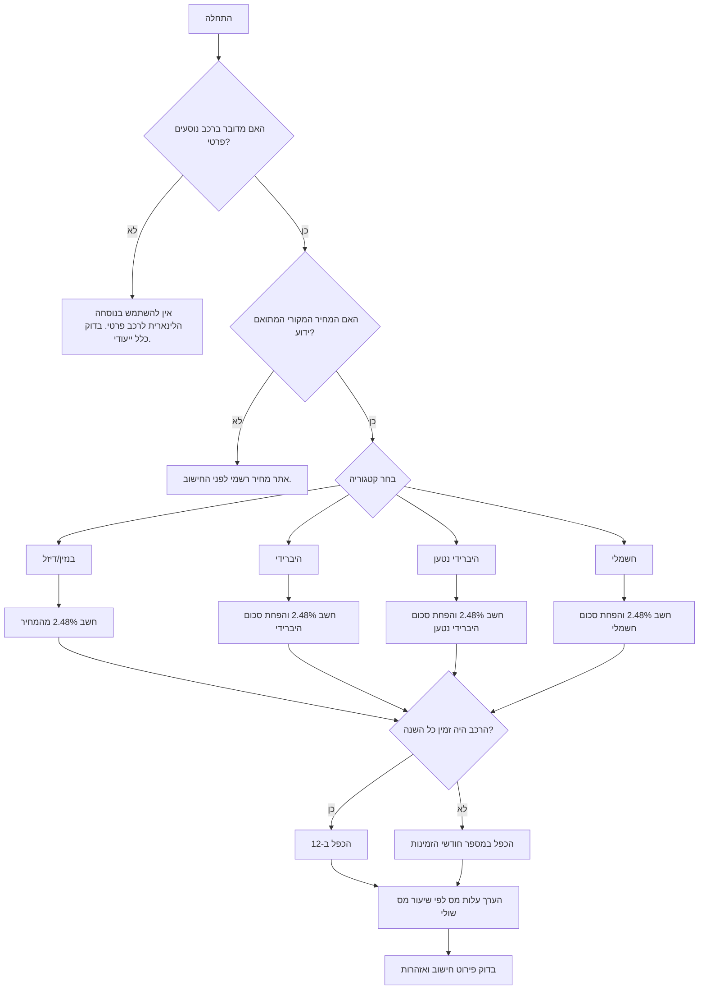

# מחשבון הטבת מס לרכב ליסינג — שווי שימוש ברכב

חשב שווי שימוש ברכב בישראל, הערך עלות מס משוערת לעובד, והפק פלט ניתן לבדיקה עבור שכר, הנהלת חשבונות ובדיקת כדאיות.

הכלי מתאים לעסקים קטנים, בעלי שליטה, עצמאים הפועלים באמצעות חברה, חשבי שכר, מנהלי כספים, רואי חשבון וצרכנים המשווים בין רכב חברה לבין חלופות פרטיות.

> הערת שימוש מקצועית: סכומי ההפחתה לרכב ירוק וכללי שווי שימוש עשויים להשתנות בכל שנת מס. אמת את השיעורים והסכומים מול פרסומי רשות המסים לפני דיווח שכר, דוח שנתי או ייעוץ ללקוח.

## מה הכלי עושה

- חשב שווי שימוש חודשי לפי מחיר מקורי מתואם של הרכב.
- הפחת סכום חודשי לפי קטגוריית רכב: היברידי, היברידי נטען או חשמלי.
- תמוך בזמינות חלקית במהלך השנה, שיעור מס שולי משוער והנחת תכנון לגבי שימוש פרטי.
- החזר שווי חודשי, שווי שנתי, עלות מס חודשית משוערת, עלות מס שנתית משוערת ופירוט חישוב.
- הפק קובץ CSV לחישוב מרובה עובדים או רכבים.
- שמור קלט ופלט לצורכי ביקורת שכר ובדיקת רואה חשבון.

## מודל החישוב

לרכב פרטי הכפוף לכלל הלינארי:

```text
שווי שימוש חודשי =
  max(מחיר מקורי מתואם × שיעור לינארי − הפחתה חודשית לפי קטגוריה, 0)
  × יחס שימוש פרטי
```

שיעור ברירת המחדל בקובץ הכללים המצורף: **2.48%**. סכומי ההפחתה לפי שנה וקטגוריה נמצאים בקובץ `data/tax_authority_tables.json`. אמת אותם לפני שימוש שכר בפועל.

## שדות חובה

| שדה | משמעות | דוגמה | הערות |
|---|---:|---:|---|
| `original_price_ils` | מחיר מקורי מתואם בש"ח | `180000` | אין להשתמש במחיר עסקה, הנחת יבואן או תשלום ליסינג חודשי. |
| `category` | קטגוריית רכב | `electric` | ערכים נתמכים: `private_combustion`, `hybrid`, `plugin_hybrid`, `electric`. |
| `tax_year` | שנת מס | `2026` | חייבת להופיע בטבלת הכללים. |
| `employee_marginal_tax_rate` | שיעור מס שולי משוער | `0.35` | ערך עשרוני בין 0 ל-1. |
| `months_available` | מספר חודשים שבהם הרכב היה זמין | `12` | ערך 1–12. |
| `private_use_ratio` | הנחת תכנון לגבי שימוש פרטי | `1` | לשכר בפועל השאר 1 אלא אם התקבל אישור מקצועי אחר. |

## התקנה

```bash
python -m venv .venv
source .venv/bin/activate
pip install -e .
pip install -r requirements-dev.txt
```

## התחלה מהירה עם מזהה בקשה

צור בקשה ושמור אותה מקומית:

```bash
CREATE_RESPONSE="$(python scripts/car_leasing_tax_benefit_client.py --env sandbox create \
  --price 180000 \
  --category private_combustion \
  --tax-rate 0.35)"
```

חלץ מזהה מהפלט:

```bash
REQUEST_ID="$(python -c 'import json, os; print(json.loads(os.environ["CREATE_RESPONSE"])["id"])')"
```

חשב לפי המזהה:

```bash
python scripts/car_leasing_tax_benefit_client.py --env sandbox calculate \
  --request-id "$REQUEST_ID" \
  --json
```

## דוגמאות מעשיות

### 1. רכב חברה רגיל

קלט:

```json
{
  "original_price_ils": "180000",
  "category": "private_combustion",
  "employee_marginal_tax_rate": "0.35",
  "months_available": 12
}
```

חישוב:

```text
180,000 × 2.48% = ₪4,464.00 שווי שימוש חודשי
עלות מס משוערת: ₪4,464.00 × 35% = ₪1,562.40 לחודש
שווי שימוש שנתי: ₪53,568.00
```

שימוש מתאים: עובד שכיר שקיבל רכב בנזין או דיזל רגיל מהמעסיק.

### 2. רכב חשמלי

קלט:

```json
{
  "original_price_ils": "220000",
  "category": "electric",
  "employee_marginal_tax_rate": "0.47"
}
```

חישוב לפי טבלת הפתיחה המצורפת לשנת 2026:

```text
220,000 × 2.48% = ₪5,456.00
₪5,456.00 − ₪1,380.00 = ₪4,106.00 שווי שימוש חודשי
עלות מס חודשית משוערת בשיעור 47% = ₪1,929.82
```

שימוש מתאים: בדיקת כדאיות בין רכב חשמלי לרכב בנזין רגיל.

### 3. עובד שהצטרף באמצע השנה

קלט:

```json
{
  "original_price_ils": "165000",
  "category": "hybrid",
  "months_available": 5,
  "employee_marginal_tax_rate": "0.31"
}
```

חישוב:

```text
165,000 × 2.48% = ₪4,092.00
₪4,092.00 − הפחתה לקטגוריה = שווי חודשי
שווי לתקופה = שווי חודשי × 5 חודשים
```

שימוש מתאים: עובד שהתחיל לעבוד ביום 01/08/2026, עובד שעזב באמצע שנה, או החלפת רכב במהלך השנה.

## עץ החלטה



## מקרי קצה חשובים

### החלפת רכב במהלך השנה

פתח רשומה נפרדת לכל רכב ולכל תקופת זמינות. אין לחשב ממוצע מחירים ללא מדיניות שכר מפורשת.

```json
[
  {"original_price_ils": "160000", "category": "private_combustion", "months_available": 4},
  {"original_price_ils": "225000", "category": "electric", "months_available": 8}
]
```

### רכב שהיה זמין בחלק מחודש

קבע מדיניות מתועדת: חודש מלא, יחס ימים או ברירת מחדל של מערכת השכר. לאחר מכן הזן את מספר החודשים או יחס השימוש המתאים.

### מחיר עסקה נמוך מהמחיר המקורי המתואם

הזן את המחיר המקורי המתואם. אין להשתמש בתשלום ליסינג, בהנחת יבואן, במחיר מבצע או במקדמה.

### ההפחתה לרכב חשמלי גבוהה מהשווי הגולמי

התוצאה לא תרד מתחת ל-₪0.00. לא נוצר שווי שימוש שלילי.

### שימוש מעורב עסקי ופרטי

לשכיר, ברירת המחדל היא שווי שימוש מלא. יחס שימוש פרטי נמוך מ-1 הוא הנחת תכנון בלבד ומייצר אזהרה.

### עצמאי בלי רכב חברה

השתמש במדריך התהליכים להשוואה בין בעלות פרטית, ליסינג, מגבלות מע"מ והוצאות מוכרות. חישוב שווי שימוש לבדו אינו קובע הכרה בהוצאה.

## דפוסי עבודה שגויים

- אין לחשב לפי תשלום הליסינג החודשי.
- אין להשתמש בסכומי הפחתה של שנה קודמת בלי אימות.
- אין להתעלם משווי שימוש מפני שהעובד משתמש בעיקר לצורכי עבודה.
- אין לערבב שקלים ואגורות בקובץ CSV.
- אין להציג את עלות המס המשוערת כניכוי שכר סופי; ייתכנו זיכויים, ביטוח לאומי, מס בריאות והתאמות נוספות.
- אין להשתמש בכלי לאופנועים, משאיות, רכבים מסחריים או החזר הוצאות ללא כלל ייעודי.

## רשימת בדיקה לשימוש בפועל

1. עדכן את `data/tax_authority_tables.json` לפי פרסום רשות המסים לשנת המס.
2. אמת את השיעור הלינארי ואת סכומי ההפחתה לכל קטגוריה.
3. בדוק את תאריכי התחולה: `01/01/YYYY` עד `31/12/YYYY`.
4. אמת מחיר מקורי מתואם לכל רכב.
5. בדוק שיעור מס שולי משוער מול נתוני שכר.
6. תעד תאריכי זמינות רכב.
7. הרץ `pytest scripts`.
8. בדוק שקובץ CSV נפתח תקין בגיליון אלקטרוני בעברית.
9. שמור קלט, פלט ופירוט חישוב בתיק השכר.
10. קבל סקירה מקצועית לפני דיווח או ייעוץ מס.

## פתרון תקלות מהיר

| סימפטום | סיבה סבירה | פתרון |
|---|---|---|
| `No rules for tax_year` | אין טבלת כללים לשנה המבוקשת | הוסף את השנה לקובץ הכללים. |
| `Unknown category` | שגיאת הקלדה או קטגוריה לא נתמכת | הרץ פקודת `categories`. |
| שווי חשמלי נראה נמוך מדי | סכום ההפחתה או השנה שגויים | אמת מול פרסום רשמי. |
| עברית ב-CSV נפתחת משובשת | קידוד שגוי בגיליון האלקטרוני | השתמש ב-UTF-8-SIG או בייבוא UTF-8. |
| רואה החשבון מבקש אסמכתאות | חסר תיעוד הנחות | צרף פירוט חישוב, מקור טבלה, מחיר רשמי ותקופת זמינות. |


## תיקון כללי 2026 לאחר אימות מקוון

לשנת 2026 חשב את הערך הלינארי לפי הנמוך מבין `original_price_ils` לבין תקרת המחיר המתואם לצרכן. התקרה המאומתת לשנת 2026 היא ₪596,860. סכומי ההפחתה לשנת 2026 הם: רכב משולב מנוע ₪580, רכב פלאג-אין ₪1,150, רכב חשמלי ₪1,380. הערכים נשמרו בקובץ `data/tax_authority_tables.json` ומופיעים בפירוט החישוב.
