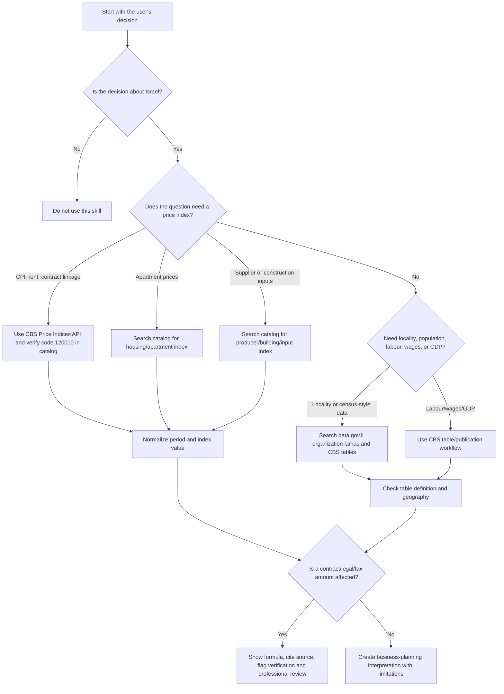

# CBS Data Analyzer

## Purpose

Use this skill to retrieve, normalize, and explain public statistical data from the Israeli Central Bureau of Statistics (CBS / הלשכה המרכזית לסטטיסטיקה) for practical decisions by Israeli small businesses, freelancers, and consumers.

Prioritize decisions that need current or historical public data:

- price indexation for rent, supplier contracts, maintenance agreements, or retainers;
- small-business demand checks by locality, population group, household profile, and economic sector;
- freelance pricing reviews using CPI, wage, and labour-market context;
- retail or service pricing reviews using CPI, producer prices, building input costs, or category-level indices;
- housing-market checks using apartment price indices and regional context;
- market reports that need source names, reference periods, limitations, and reproducible calculations.

Never present a CBS figure without a reference period. Never treat an index as a forecast. Never treat a statistical result as legal, accounting, tax, investment, or valuation advice.

## Data-source map

| User need | Primary source | API availability | Typical update pattern | Notes |
|---|---|---:|---|---|
| CPI / "the index" / rent linkage | CBS Price Indices API | Yes | Monthly | Use code `120010` for general CPI when the live catalog confirms it. |
| Apartment price trend | CBS Price Indices API | Yes | Monthly with reporting lag | Use housing index codes from the catalog; do not infer city-level prices unless the dataset supports that cut. |
| Producer prices / input costs | CBS Price Indices API | Yes | Monthly | Useful for manufacturers, importers, contractors, and suppliers. |
| Building input costs | CBS Price Indices API | Yes | Monthly | Useful for renovation, construction, maintenance, and contractor agreements. |
| Population and locality profile | CBS publications and selected data.gov.il datasets | Partial | Annual or periodic | Search data.gov.il organization `lamas`; verify table definitions. |
| GDP, labour force, unemployment, wages | CBS publications and tables | Partial | Monthly, quarterly, or annual | Some tables are downloadable rather than API-first. |
| Open government dataset discovery | data.gov.il CKAN API | Yes | Dataset-dependent | Search `organization:lamas`; CPI is not primarily served from data.gov.il. |
| Interest and exchange-rate context | Bank of Israel | Separate API/site | Daily or decision-date | Use only as context, not as a CBS statistic. |

## Core workflow

1. Identify the business question, geography, period, and decision type.
2. Pick the narrowest CBS source that directly supports the question.
3. Fetch or search the source. Prefer the CBS Price Indices API for price-index series.
4. Normalize dates, units, bases, and currency. Localize Israeli currency as `₪` and dates as `DD/MM/YYYY` when preparing Hebrew-facing output.
5. Calculate only what the data supports: index change, percentage change, moving average, or descriptive comparison.
6. State limitations: lag, seasonality, sampling, geography, base-year changes, and missing segments.
7. Attach source URL, retrieval date, reference period, and calculation formula.
8. Recommend a verification step before action when a contract, payment, filing, or consumer dispute depends on the number.

## Decision tree



## Common user intents and routing

| User wording | Interpret as | Action |
|---|---|---|
| "כמה המדד עלה?" | CPI change | Fetch latest CPI and show monthly/annual movement with reference period. |
| "עדכון שכר דירה לפי מדד" | Contract indexation | Use base CPI and target CPI; apply only if the contract has an indexation clause. |
| "Should prices be raised?" | Pricing review | Combine CPI or relevant input-cost index with margin, competitor, and demand assumptions. |
| "Is there demand in Rishon LeZion?" | Local market sizing | Use population, household, age, locality, and business-sector datasets where available. |
| "Apartment prices in the center" | Housing trend | Use housing index; clarify that index movement differs from a valuation for one property. |
| "Freelance rate adjustment" | Retainer or hourly-rate review | Use CPI and wage context; avoid tax or legal conclusions. |
| "Supplier contract linked to construction index" | Non-CPI indexation | Search index catalog for the exact input-cost series named in the agreement. |
| "Dataset from lamas" | Open dataset discovery | Use data.gov.il CKAN search filtered to `organization:lamas`. |

## Concrete examples

### Example 1: Rent adjustment linked to CPI

User request: "My rent was ₪5,200 when the CPI was 103.1. The current CPI is 106.4. What is the linked rent?"

Calculation:

```text
New rent = 5,200 × (106.4 / 103.1)
Index change = (106.4 / 103.1 - 1) × 100 = 3.20%
New rent = ₪5,366.44
Difference = ₪166.44
```

Response pattern:

- State the formula.
- State the old CPI, new CPI, and reference periods.
- State whether rounding was applied.
- Add: "Apply only if the signed agreement includes this linkage and no cap/floor changes the result."

### Example 2: Freelance retainer review

User request: "A graphic designer charges ₪4,000 per month. The retainer has not changed for 18 months. Use CPI context."

Action:

1. Fetch CPI at the contract start month and the latest published CPI.
2. Calculate CPI-linked value.
3. Compare the CPI-linked amount with the current retainer.
4. Present a negotiation range, not a legal entitlement.
5. Add commercial context: customer retention, scope creep, hours, and VAT status.

Safe output:

```text
The CPI-linked equivalent of ₪4,000 is ₪4,184 if the index rose by 4.6%.
Use this as an inflation-maintenance benchmark, not as a mandatory price.
Check whether VAT is added separately and whether the scope changed.
```

### Example 3: Café location screening

User request: "Check whether a small café near a residential area in Haifa has enough demand."

Action:

1. Search CBS/data.gov.il for locality demographics, age distribution, households, commuting, and income proxies.
2. Use CBS business-demography or labour data if available.
3. Avoid estimating exact revenue from population alone.
4. Produce a demand screen:

| Factor | CBS measure | Interpretation |
|---|---|---|
| Resident base | Population and households | Footfall ceiling for local demand. |
| Daytime presence | Employment or commuting proxy | Lunch and coffee demand. |
| Age profile | Age groups | Product mix and opening hours. |
| Housing density | Households per area, buildings | Convenience demand. |
| Competition | Not CBS-only | Must add field research or map data. |

### Example 4: Supplier price clause

User request: "A cleaning supplier wants a 7% increase. CPI rose less. Is that reasonable?"

Action:

1. Fetch CPI for broad inflation context.
2. Search CBS catalog for relevant producer or wage/input series.
3. Explain that CPI measures household consumption prices, not necessarily the supplier's labour, fuel, insurance, or chemical costs.
4. Suggest a clause using a named index and fixed review dates.

### Example 5: Apartment-price trend for a consumer

User request: "Are apartment prices falling in my district?"

Action:

1. Use the CBS housing price index for the relevant district if available.
2. Present monthly and annual movement.
3. Flag lag and mix effects.
4. Avoid saying what one apartment is worth.
5. Add: "Use transactions, appraisal, mortgage constraints, and property condition for a purchase decision."

## Edge cases

| Edge case | Risk | Handling |
|---|---|---|
| Latest month not published yet | User may expect today's number | Explain the publication lag and use the latest published reference period. |
| Contract names "the index" without code | Wrong index may be used | Ask for the exact clause when available; default to CPI only when the wording clearly means consumer price index. |
| Contract has cap/floor | Pure formula overstates amount | Apply cap/floor if provided; otherwise show uncapped result and caveat. |
| Base index equals zero or missing | Division invalid | Stop and request or fetch a valid base value. |
| Deflation | Rent or fee may decrease mathematically | Apply only if the contract permits decreases; show floor-zero option separately. |
| Index base-year changed | Apparent discontinuity | Use CBS-linked values from the same series; avoid mixing base versions manually. |
| Series discontinued | Silent stale data | Search catalog for replacement series and cite the change. |
| Seasonal series | Short-term movement misread | Use annual change or seasonally adjusted series where appropriate. |
| Hebrew/English name mismatch | Search misses dataset | Search both Hebrew terms and numeric codes. |
| data.gov.il result is not a CBS price index | Wrong source | Use data.gov.il for datasets; use CBS Price Indices API for index time series. |
| API returns HTML or maintenance page | Parser failure | Retry, show source URL, and suggest manual CBS verification. |
| Personal data request | Privacy issue | Use aggregated public statistics only. Do not infer protected traits about individuals. |

## Anti-patterns

Avoid these mistakes:

- quoting a CPI number without a month and year;
- using CPI as a wage-law, tax, or legal entitlement calculation without the governing document;
- using national averages for a neighbourhood-level decision without warning;
- treating a CBS index as a forecast;
- mixing nominal shekel values and real/index-adjusted values without labeling;
- comparing a monthly change with an annual rate as if both use the same period;
- using a housing price index as a property appraisal;
- using data.gov.il search results without reading metadata and update date;
- adding VAT, income tax, or national insurance treatment without current official tax guidance;
- presenting "latest" values from memory when a live fetch is possible.

## Output templates

### CPI-linked amount

```text
Source: CBS Price Indices API
Series: Consumer Price Index, code 120010
Base period: <DD/MM/YYYY or month-year>, index <base>
Target period: <DD/MM/YYYY or month-year>, index <target>

Formula:
<amount> × (<target> / <base>) = <adjusted amount>

Result:
Original amount: ₪<amount>
Adjusted amount: ₪<adjusted>
Change: <percent>%
Difference: ₪<difference>

Limitations:
Use only if the relevant agreement links the amount to this exact index and does not set a cap, floor, minimum notice period, or special rounding rule.
```

### Market-analysis summary

```text
Question: <business decision>
Geography: <locality/district>
CBS sources checked: <sources>
Reference periods: <periods>

Signals:
1. Demand base: <population/households/age>
2. Price pressure: <CPI/input index>
3. Labour context: <wages/employment if relevant>
4. Housing or construction context: <if relevant>

Decision use:
Use the results to size the market and define assumptions. Do not treat them as revenue, valuation, tax, or legal conclusions.
```

## Troubleshooting quick guide

| Symptom | Likely cause | Fix |
|---|---|---|
| `404` from CBS API | Wrong endpoint path or obsolete code | Fetch catalog first, then use `mainCode`. |
| Empty search results | Search language mismatch | Try Hebrew, English, and known category words. |
| JSON decode error | Maintenance page, proxy, missing `User-Agent`, or non-JSON response | Retry with `format=json`, `download=false`, and a `User-Agent`; inspect response text. |
| Unexpected date order | API order changed | Sort points before analysis or explicitly choose latest by year/month. |
| Huge result set | Broad data.gov.il query | Add `organization:lamas`, locality, period, or dataset type. |
| Calculation looks too high | Percent entered as index value | Use index levels, not percentage changes, in the formula. |
| User asks "is it legal?" | Legal conclusion requested | Explain the calculation and recommend reviewing the contract or professional advice. |

## Production checklist

Before returning a final answer that may affect money:

- [ ] Confirm that the user question is Israel-specific.
- [ ] Confirm the exact statistic or index name.
- [ ] Fetch from an official endpoint where possible.
- [ ] Record retrieval date.
- [ ] Show the reference period for every value.
- [ ] Use the same series and base for all index values.
- [ ] State the formula and rounding.
- [ ] Flag publication lag and later revisions.
- [ ] Separate CBS data from assumptions.
- [ ] Avoid legal, tax, accounting, and investment conclusions.
- [ ] Preserve Hebrew terms correctly: מדד המחירים לצרכן, הצמדה למדד, הלשכה המרכזית לסטטיסטיקה.
- [ ] Localize consumer-facing Hebrew output with `₪`, comma-separated amounts, and `DD/MM/YYYY`.
- [ ] Save raw API payloads for audit-sensitive workflows.
- [ ] Add fallback instructions when the API is unavailable.
- [ ] Verify current official rates when VAT, tax, minimum wage, or statutory thresholds are mentioned. The v3 verification log confirms `18%` VAT in 2026, but check again before giving tax guidance.

## Development assets

- `scripts/cbs_data_analyzer_client.py` contains typed synchronous and asynchronous client classes.
- `scripts/cbs_data_analyzer_cli.py` provides a Typer CLI for catalog search, index fetch, indexation, and brief generation.
- `scripts/test_cbs_data_analyzer_client.py` contains offline pytest coverage with mocked HTTP responses.
- `scripts/examples/` contains runnable scenarios for rent linkage, CPI fetch, catalog search, market brief, async fetch, and CSV export.
- `references/api-reference.md` documents endpoints, request examples, response examples, and error handling.
- `references/verification-log.md` records two-pass web validation of official/API/regulatory claims.
- `references/workflow-guide.md` documents end-to-end business workflows.
- `references/troubleshooting.md` expands operational fixes.
- `references/test-scenarios.md` lists concrete validation scenarios.
- `references/migration-checklist.md` supports migration from manual spreadsheets or basic scripts.
