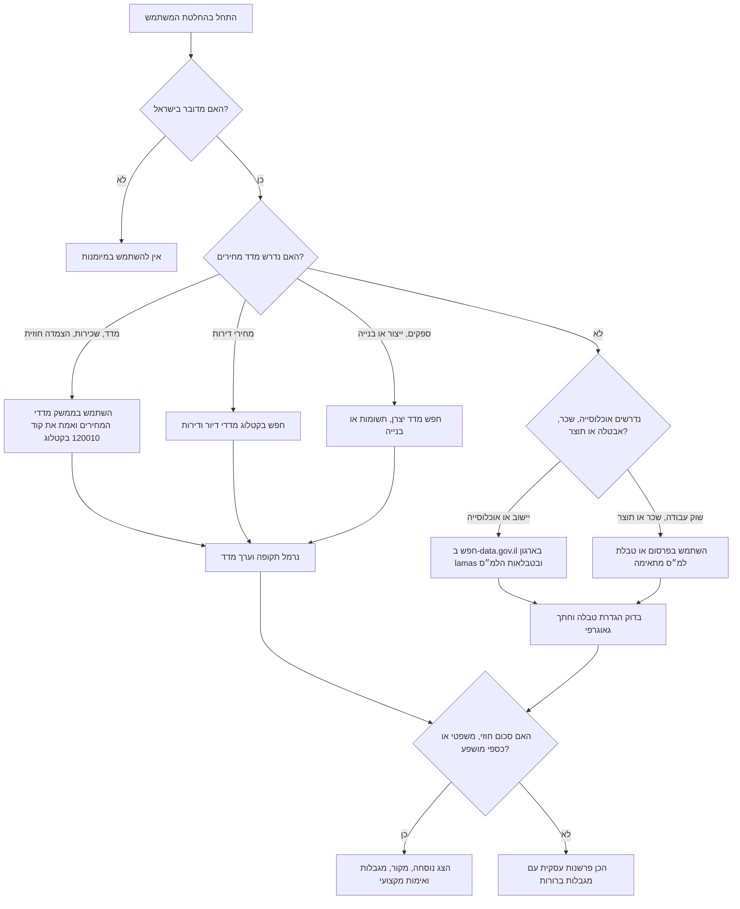

# מנתח נתוני הלמ״ס

## מטרה

השתמש במיומנות זו כדי לשלוף, לנרמל ולהסביר נתונים פומביים של הלשכה המרכזית לסטטיסטיקה לצרכים מעשיים של עסקים קטנים, עצמאים וצרכנים בישראל.

הפעל את המיומנות במקרים כגון:

- חישוב הצמדה למדד המחירים לצרכן עבור שכר דירה, חוזה ספקים, דמי תחזוקה או תשלום חודשי קבוע;
- בדיקת ביקוש מקומית לפי יישוב, אוכלוסייה, משקי בית ומאפיינים כלכליים;
- עדכון תמחור לעצמאים ולנותני שירותים לפי מדדים ונתוני שכר;
- בחינת העלאת מחירים בעסק קמעונאי או שירותי בעזרת מדד מחירים, מדד תשומות או מדד מחירי יצרן;
- בדיקת מגמה בשוק הדיור לפי מדדי מחירי דירות;
- הכנת תקציר שוק עם מקור, תקופת ייחוס, מגבלות וחישוב שניתן לשחזר.

אין להציג נתון מהלמ״ס ללא תקופת ייחוס. אין להציג מדד כתחזית. אין להפוך תוצאה סטטיסטית לייעוץ משפטי, חשבונאי, מיסויי, השקעות או שומה.

## מפת מקורות נתונים

| צורך | מקור עיקרי | זמינות ממשק | דפוס עדכון טיפוסי | הערות |
|---|---|---:|---|---|
| מדד המחירים לצרכן / "המדד" / הצמדה לשכר דירה | ממשק מדדי המחירים של הלמ״ס | כן | חודשי | השתמש בקוד `120010` למדד הכללי רק לאחר אימות בקטלוג החי. |
| מגמת מחירי דירות | ממשק מדדי המחירים של הלמ״ס | כן | חודשי עם פיגור פרסום | חפש את קוד המדד המתאים בקטלוג; אל תסיק מחיר עירוני אם החתך אינו קיים. |
| מדדי מחירי יצרן ותשומות | ממשק מדדי המחירים של הלמ״ס | כן | חודשי | שימושי ליצרנים, יבואנים, קבלנים וספקים. |
| מדד תשומות הבנייה | ממשק מדדי המחירים של הלמ״ס | כן | חודשי | שימושי לשיפוצים, בנייה, תחזוקה וחוזי קבלנות. |
| אוכלוסייה ופרופיל יישוב | פרסומי הלמ״ס ומאגרי data.gov.il נבחרים | חלקי | שנתי או תקופתי | חפש בארגון `lamas` ובדוק את הגדרות הטבלה. |
| תוצר, כוח עבודה, אבטלה ושכר | פרסומים וטבלאות הלמ״ס | חלקי | חודשי, רבעוני או שנתי | חלק מהטבלאות זמינות להורדה ולא כממשק ייעודי. |
| איתור מאגרי מידע ממשלתיים | ממשק CKAN של data.gov.il | כן | תלוי מאגר | חפש עם `organization:lamas`; מדד המחירים אינו מנוהל בעיקר דרך data.gov.il. |
| ריבית ושערי חליפין להקשר | בנק ישראל | אתר או ממשק נפרד | יומי או לפי מועד החלטה | השתמש כהקשר בלבד, לא כנתון למ״ס. |

## תהליך עבודה בסיסי

1. זהה את השאלה העסקית, האזור הגאוגרפי, התקופה וסוג ההחלטה.
2. בחר את מקור הלמ״ס הצר ביותר שתומך ישירות בשאלה.
3. שלוף או חפש את המקור. למדדי מחירים העדף את ממשק מדדי המחירים של הלמ״ס ושלח כותרת `User-Agent`.
4. נרמל תאריכים, יחידות, בסיסי מדד ומטבע. בעברית הצג סכומים כ־`₪` ותאריכים כ־`DD/MM/YYYY`.
5. חשב רק את מה שהנתונים תומכים בו: שינוי מדד, שינוי באחוזים, ממוצע נע או השוואה תיאורית.
6. ציין מגבלות: פיגור פרסום, עונתיות, דגימה, גאוגרפיה, שינוי בסיס ומקטעים חסרים.
7. צרף כתובת מקור, תאריך שליפה, תקופת ייחוס ונוסחת חישוב.
8. הוסף בדיקת אימות לפני פעולה כספית, חוזית או צרכנית שתלויה במספר.

## עץ החלטה



## כוונות נפוצות וניתוב

| ניסוח משתמש | פירוש | פעולה |
|---|---|---|
| "כמה המדד עלה?" | שינוי במדד המחירים לצרכן | שלוף את המדד האחרון והצג שינוי חודשי ושנתי עם תקופת ייחוס. |
| "עדכון שכר דירה לפי מדד" | הצמדה חוזית | השתמש במדד בסיס ובמדד יעד; בצע רק אם יש סעיף הצמדה בהסכם. |
| "כדאי להעלות מחירים?" | בדיקת תמחור | שלב מדד מחירים או מדד תשומות עם רווחיות, תחרות וביקוש. |
| "יש ביקוש בראשון לציון?" | גודל שוק מקומי | השתמש באוכלוסייה, משקי בית, גילאים ונתונים ענפיים ככל שקיימים. |
| "מחירי דירות במחוז מרכז" | מגמת שוק דיור | השתמש במדד מחירי דירות; הדגש שמדד אינו שמאות לדירה ספציפית. |
| "עדכון תעריף לעצמאי" | בדיקת תשלום חודשי קבוע או מחיר לשעה | השתמש במדד ובנתוני שכר כהקשר; הימנע מקביעה משפטית או מיסויית. |
| "הספק צמוד למדד תשומות בנייה" | הצמדה למדד שאינו מדד המחירים לצרכן | חפש את הסדרה המדויקת ששמה מופיע בהסכם. |
| "מאגר של הלמ״ס ב-data.gov.il" | איתור מאגר פתוח | חפש בממשק CKAN עם סינון `organization:lamas`. |

## דוגמאות מעשיות

### דוגמה 1: עדכון שכר דירה צמוד למדד

בקשה: "שכר הדירה היה ₪5,200 כשהמדד היה 103.1. המדד הנוכחי הוא 106.4. מה שכר הדירה הצמוד?"

חישוב:

```text
שכר דירה חדש = 5,200 × (106.4 / 103.1)
שינוי במדד = (106.4 / 103.1 - 1) × 100 = 3.20%
שכר דירה חדש = ₪5,366.44
הפרש = ₪166.44
```

תבנית תשובה:

- הצג את הנוסחה.
- ציין מדד בסיס, מדד יעד ותקופות ייחוס.
- ציין אם בוצע עיגול לשקל.
- הוסף: "יש ליישם רק אם ההסכם החתום כולל סעיף הצמדה למדד זה ואין בו תקרה, רצפה או כלל עיגול אחר."

### דוגמה 2: עדכון תשלום חודשי קבוע לעצמאי

בקשה: "מעצבת גרפית גובה ₪4,000 בחודש. התשלום חודשי קבוע לא עודכן 18 חודשים. השתמש בהקשר של המדד."

פעולה:

1. שלוף את מדד המחירים לצרכן בחודש תחילת ההתקשרות ואת המדד האחרון שפורסם.
2. חשב את הסכום המקביל לפי המדד.
3. השווה לסכום הנוכחי.
4. הצג טווח משא ומתן ולא זכאות משפטית.
5. ציין הקשר עסקי: שימור לקוחות, שינוי היקף עבודה, שעות בפועל ומע״מ.

תשובה בטוחה:

```text
אם המדד עלה ב־4.6%, הערך המקביל של ₪4,000 הוא ₪4,184.
השתמש בסכום כמדד לשחיקת מחיר, לא כחובה אוטומטית.
בדוק אם מע״מ מתווסף בנפרד ואם היקף העבודה השתנה.
```

### דוגמה 3: בדיקת מיקום לבית קפה

בקשה: "בדוק אם יש מספיק ביקוש לבית קפה קטן ליד שכונת מגורים בחיפה."

פעולה:

1. חפש נתוני אוכלוסייה, משקי בית, גילאים, תעסוקה ויוממות בפרסומי הלמ״ס או data.gov.il.
2. השתמש בנתוני דמוגרפיה ועסקים אם קיימים.
3. אל תחשב הכנסה צפויה מאוכלוסייה בלבד.
4. הפק מסך ביקוש:

| גורם | מדד למ״ס | פירוש |
|---|---|---|
| בסיס תושבים | אוכלוסייה ומשקי בית | גבול עליון לביקוש מקומי. |
| נוכחות יומית | תעסוקה או יוממות | ביקוש לקפה וארוחות קלות בשעות עבודה. |
| גילאים | קבוצות גיל | התאמת תפריט ושעות פתיחה. |
| צפיפות מגורים | משקי בית ויחידות דיור | ביקוש נוחות. |
| תחרות | לא נתון למ״ס מלא | נדרש סקר שטח או נתוני מפות. |

### דוגמה 4: בקשת העלאה מספק

בקשה: "ספק ניקיון מבקש העלאה של 7%. המדד עלה פחות. זה סביר?"

פעולה:

1. שלוף את מדד המחירים לצרכן להקשר אינפלציוני כללי.
2. חפש בקטלוג מדד יצרן, שכר או תשומות שרלוונטי לענף.
3. הסבר שמדד המחירים לצרכן מודד סל צריכה של משקי בית, לא בהכרח שכר עובדים, דלק, ביטוח או חומרי ניקוי של הספק.
4. הצע סעיף עדכון שמבוסס על מדד מוגדר ומועדי בדיקה קבועים.

### דוגמה 5: מגמת מחירי דירות לצרכן

בקשה: "מחירי הדירות במחוז שלי יורדים?"

פעולה:

1. השתמש במדד מחירי דירות למחוז המתאים אם קיים.
2. הצג שינוי חודשי ושנתי.
3. ציין פיגור פרסום והשפעת תמהיל עסקאות.
4. הימנע מקביעת שווי לדירה ספציפית.
5. הוסף: "לקבלת החלטת רכישה יש לשלב עסקאות דומות, שמאות, תנאי משכנתה ומצב הנכס."

## מקרי קצה

| מקרה קצה | סיכון | טיפול |
|---|---|---|
| החודש האחרון טרם פורסם | המשתמש מצפה למספר של היום | הסבר את פיגור הפרסום והשתמש בתקופת הייחוס האחרונה שפורסמה. |
| חוזה כותב "המדד" ללא קוד | שימוש במדד שגוי | בקש את נוסח הסעיף אם אפשר; ברירת מחדל למדד המחירים לצרכן רק כשהנוסח ברור. |
| קיימת תקרה או רצפה בחוזה | חישוב רגיל מנפח סכום | יישם תקרה/רצפה אם נמסרה; אחרת הצג תוצאה ללא תקרה עם הסתייגות. |
| מדד בסיס חסר או שווה לאפס | חלוקה לא חוקית | עצור ושלוף או בקש ערך בסיס תקף. |
| ירידת מדד | הסכום יורד מתמטית | יישם ירידה רק אם ההסכם מאפשר זאת; הצג אפשרות רצפה בנפרד. |
| שינוי בסיס מדד | נוצר שבר מלאכותי בסדרה | השתמש בערכים מקושרים מאותה סדרה; אל תערבב בסיסים ידנית. |
| סדרה הופסקה | נתון מיושן נראה תקף | חפש סדרה מחליפה בקטלוג וציין את השינוי. |
| סדרה עונתית | שינוי קצר טווח מפורש לא נכון | השתמש בשינוי שנתי או בסדרה מנוכה עונתיות אם קיימת. |
| חיפוש בעברית ובאנגלית מחזיר תוצאות שונות | פספוס מאגר | חפש גם מונחים עבריים וגם מספרי קוד. |
| data.gov.il מחזיר מאגר שאינו מדד מחירים | מקור שגוי | למדדי מחירים השתמש ב־ממשק מדדי המחירים של הלמ״ס. |
| הממשק מחזיר HTML או תקלה | כשל פענוח | נסה שוב עם `format=json`, בדוק את כתובת המקור והצע אימות ידני באתר הלמ״ס. |
| בקשה על אדם מסוים | פגיעה בפרטיות | השתמש רק בנתונים מצרפיים פומביים. אל תסיק תכונות מוגנות על אדם. |

## טעויות שיש להימנע מהן

- ציטוט ערך מדד ללא חודש ושנה;
- שימוש במדד המחירים כזכאות משפטית, מיסויית או של שכר עבודה ללא מסמך מחייב;
- שימוש בממוצע ארצי להחלטה שכונתית בלי אזהרה;
- הצגת מדד כתחזית;
- ערבוב סכומים נומינליים וסכומים ריאליים ללא תיוג ברור;
- השוואת שינוי חודשי לשיעור שנתי כאילו מדובר באותה תקופה;
- שימוש במדד מחירי דירות כשמאות לנכס מסוים;
- שימוש בתוצאת data.gov.il בלי לקרוא נתוני מקור ותאריך עדכון;
- הוספת מע״מ, מס הכנסה או ביטוח לאומי בלי בדיקת מקור רשמי עדכני;
- הצגת "הנתון האחרון" מהזיכרון כאשר אפשר לבצע שליפה חיה.

## תבניות פלט

### סכום צמוד למדד

```text
מקור: ממשק מדדי המחירים של הלמ״ס
סדרה: מדד המחירים לצרכן, קוד 120010
תקופת בסיס: <DD/MM/YYYY או חודש/שנה>, מדד <base>
תקופת יעד: <DD/MM/YYYY או חודש/שנה>, מדד <target>

נוסחה:
<amount> × (<target> / <base>) = <adjusted amount>

תוצאה:
סכום מקורי: ₪<amount>
סכום צמוד: ₪<adjusted>
שינוי: <percent>%
הפרש: ₪<difference>

מגבלות:
השתמש רק אם ההסכם הרלוונטי מצמיד את הסכום למדד זה בדיוק ואינו קובע תקרה, רצפה, מועד הודעה מינימלי או כלל עיגול מיוחד.
```

### תקציר שוק

```text
שאלה: <החלטה עסקית>
אזור: <יישוב/מחוז>
מקורות למ״ס שנבדקו: <מקורות>
תקופות ייחוס: <תקופות>

איתותים:
1. בסיס ביקוש: <אוכלוסייה/משקי בית/גיל>
2. לחץ מחירים: <מדד מחירים/מדד תשומות>
3. שוק עבודה: <שכר/תעסוקה אם רלוונטי>
4. דיור או בנייה: <אם רלוונטי>

שימוש בהחלטה:
השתמש בתוצאות לבניית הנחות וגודל שוק. אין לראות בהן תחזית הכנסות, שומה, ייעוץ מס או חוות דעת משפטית.
```

## פתרון תקלות מקוצר

| סימפטום | סיבה סבירה | תיקון |
|---|---|---|
| `404` מממשק הלמ״ס | נתיב שגוי או קוד סדרה לא קיים | שלוף קודם את הקטלוג ואז השתמש ב־`mainCode`. |
| אין תוצאות חיפוש | פער בין עברית לאנגלית | נסה עברית, אנגלית ומילות קטגוריה מוכרות. |
| שגיאת פענוח JSON | דף תחזוקה, חסימה, חסר `User-Agent` או תשובה שאינה JSON | נסה `format=json`, `download=false` וכותרת `User-Agent`; בדוק את גוף התשובה. |
| סדר תאריכים מפתיע | סדר התשובה השתנה | מיין נקודות לפי שנה וחודש או בחר מפורשות את התקופה האחרונה. |
| תוצאה גדולה מדי | שאילתת data.gov.il רחבה | הוסף `organization:lamas`, יישוב, תקופה או סוג מאגר. |
| החישוב גבוה מדי | אחוז הוזן במקום ערך מדד | בנוסחה השתמש בערכי מדד, לא בשינויי אחוזים. |
| המשתמש שואל "זה חוקי?" | נדרשת מסקנה משפטית | הסבר את החישוב והפנה לבדיקה של ההסכם או איש מקצוע. |

## רשימת בדיקה לפני תשובה כספית

- [ ] ודא שהשאלה מתייחסת לישראל.
- [ ] ודא את שם המדד או הנתון הסטטיסטי המדויק.
- [ ] שלוף ממקור רשמי כאשר אפשר.
- [ ] רשום תאריך שליפה.
- [ ] הצג תקופת ייחוס לכל ערך.
- [ ] השתמש באותה סדרה ובאותו בסיס לכל ערכי המדד.
- [ ] הצג נוסחה וכלל עיגול.
- [ ] ציין פיגור פרסום ותיקונים אפשריים.
- [ ] הפרד נתוני למ״ס מהנחות עסקיות.
- [ ] הימנע ממסקנות משפטיות, מס, חשבונאות והשקעות.
- [ ] שמור על מונחים עבריים מדויקים: מדד המחירים לצרכן, הצמדה למדד, הלשכה המרכזית לסטטיסטיקה.
- [ ] הצג סכומים כ־`₪`, עם מפריד אלפים ותאריכים בפורמט `DD/MM/YYYY`.
- [ ] שמור תשובות מקור גולמיות בתהליכים רגישים לביקורת.
- [ ] הוסף חלופה לאימות ידני אם הממשק אינו זמין.
- [ ] אמת מקורות רשמיים עדכניים כאשר מוזכרים מע״מ, מס, שכר מינימום או סף סטטוטורי. יומן האימות בגרסת v3 מאשר מע״מ `18%` בשנת 2026, אך יש לבדוק שוב לפני מתן הנחיית מס.
