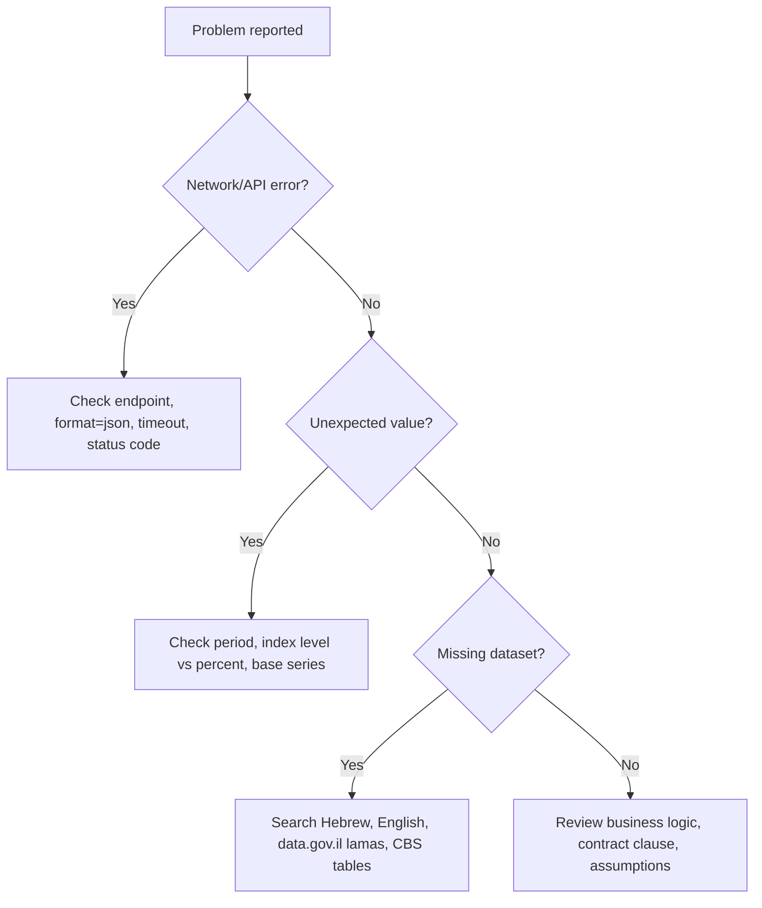

# Troubleshooting

## Fast diagnostic path



## API and network failures

| Symptom | Cause | Resolution |
|---|---|---|
| Connection timeout | CBS or network slow | Increase timeout to 30 seconds, retry once, then provide manual URL. |
| `404` | Wrong endpoint or index code | Fetch catalog first; use `mainCode`. |
| `format=json` ignored | Endpoint or proxy changed response | Inspect content type and body before parsing. |
| TLS/proxy failure | Corporate firewall | Use browser download or another network; keep the source URL in the report. |
| Empty response | Temporary maintenance | Retry later; do not invent values. |

## Data quality issues

| Symptom | Cause | Resolution |
|---|---|---|
| Latest month missing | Publication lag | Use latest published period and state the lag. |
| Duplicate periods | Revisions or base changes | Preserve raw records and document which value was used. |
| Large jump | Base change, error, or actual shock | Check table notes and compare adjacent periods. |
| Negative monthly change | Deflation or category-specific decline | Do not floor unless the contract specifies a floor. |
| No locality match | Spelling, Hebrew form, or administrative boundary | Search Hebrew names, municipality names, and district-level alternatives. |
| CPI differs from user's source | Different base, revision, or period | Compare source URL, series code, base, and date. |

## Calculation failures

| Error | Prevention |
|---|---|
| Divide by zero | Validate base index is positive. |
| Using percent instead of index level | Label inputs clearly as "index value" or "percent change". |
| Applying annual change to monthly amount incorrectly | Use the index-ratio formula for linked amounts. |
| Rounding too early | Calculate with decimals and round at the final step. |
| Ignoring cap/floor | Ask for the clause when possible; otherwise state that no cap/floor was applied. |
| Mixing indices | Use one series throughout the calculation. |

## Hebrew output pitfalls

Use natural professional Hebrew:

| Prefer | Avoid |
|---|---|
| מדד המחירים לצרכן | ראשי תיבות בלבד ללא שם המדד |
| הצמדה למדד | מונח לועזי שאינו נחוץ |
| תקופת ייחוס | תקופת ייחוס |
| מדד בסיס / מדד יעד | תוויות באנגלית בתוך הסבר עברי |
| הלשכה המרכזית לסטטיסטיקה | ראשי תיבות באנגלית כאשר יש מונח עברי ברור |
| ₪5,200 או 5,200 ש״ח | סימון מטבע לועזי בטקסט צרכני בעברית |

## Escalation language

Use this when the result can affect money:

```text
החישוב מתאר את ההצמדה המתמטית לפי הנתונים שנמסרו. יש לוודא שההסכם מפנה למדד זה, שאין בו תקרה או רצפה, ושערכי המדד נשלפו מהמקור הרשמי לתקופות הייחוס הנכונות.
```

## When to stop

Stop and request or fetch missing facts when:

- the base index is missing;
- the target period is not published;
- the index series named in the contract is not known;
- the user asks for enforceability, liability, tax treatment, or legal strategy;
- the dataset is about identifiable individuals rather than aggregates;
- the source has no reference period or metadata.
