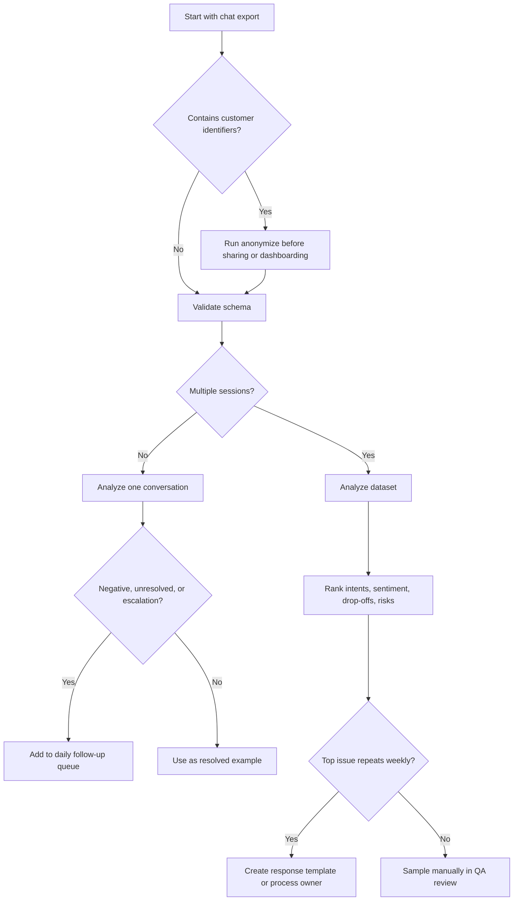
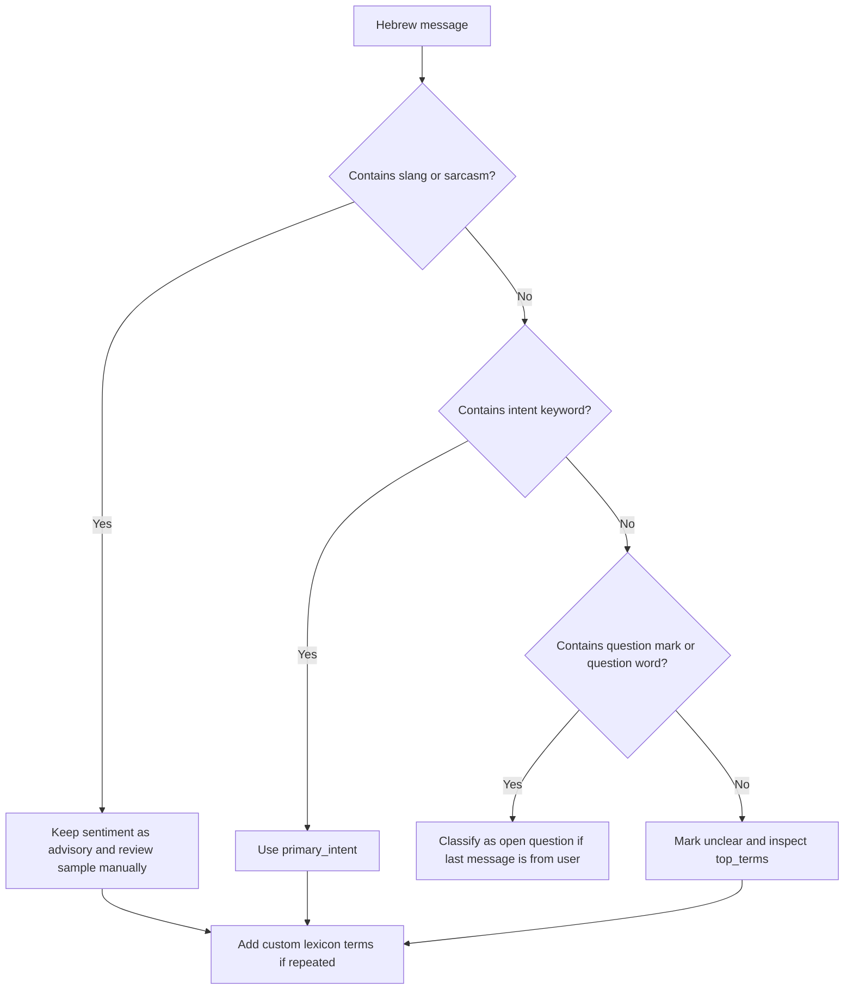

# Chat Data Analyzer

Analyze customer conversations for actionable insights: recurring issues, Hebrew sentiment, intent clusters, escalation demand, drop-offs, unresolved chats, sensitive-data exposure, and operational trends. Apply the skill to WhatsApp Business exports, web-chat logs, chatbot transcripts, support inbox exports, marketplace messages, and CRM notes.

The package is designed for Israeli small businesses, freelancers, clinics, stores, service providers, studios, accountants, e-commerce sellers, and consumer-facing teams that receive Hebrew or mixed Hebrew-English messages.

## Use this skill when

Use this skill when the task involves one or more of these goals:

- Analyze Hebrew customer chats for sentiment, intent, drop-offs, complaint trends, and unresolved conversations.
- Summarize support issues for a weekly business review.
- Detect chats that contain phone numbers, emails, Israeli ID-like values, or card-like numbers before sharing examples.
- Classify common Israeli business intents: invoices, receipts, VAT, appointments, deliveries, cancellations, refunds, product availability, technical issues, legal/privacy concerns, and human-agent requests.
- Build repeatable workflows for chat-quality review, escalation, and reporting.
- Prepare a privacy-conscious dataset for further analysis or dashboarding.

Do not use this skill as a substitute for legal, tax, accounting, medical, or regulated professional advice. Use the results as triage and operational intelligence.

## Core analysis model

The included client uses transparent heuristics instead of opaque model calls. This makes it practical for small teams that need explainable outputs and low setup overhead.

Primary outputs:

| Output | Meaning | Typical action |
|---|---|---|
| `language` | `he`, `en`, `mixed`, or `unknown` | Route mixed-language chats to bilingual templates. |
| `primary_intent` | Highest-scoring intent | Assign an owner or workflow. |
| `sentiment.label` | `positive`, `neutral`, or `negative` | Review negative chats first. |
| `risk_flags` | Sensitive-data pattern counts | Mask before export or sharing. |
| `drop_off` | Customer sent the last message after a prior exchange | Review the last bot/business response. |
| `escalation_requested` | Customer asked for a person, manager, or representative | Bypass further automation. |
| `unresolved` | Conversation appears open, negative, or escalated | Add to daily follow-up queue. |
| `recommendations` | Practical next actions | Turn analysis into workflow changes. |

## Expected input schema

Prefer JSON, JSONL, or CSV with a stable session identifier.

### JSON dataset

```json
[
  {
    "session_id": "whatsapp-2026-05-18-001",
    "messages": [
      {
        "sender": "user",
        "text": "שלום, אפשר לקבל חשבונית מס על 350 ₪?",
        "timestamp": "2026-05-18T09:00:00"
      },
      {
        "sender": "bot",
        "text": "כן. נא לשלוח שם עסק ומספר עוסק.",
        "timestamp": "2026-05-18T09:00:08"
      },
      {
        "sender": "user",
        "text": "תודה רבה, הסתדר.",
        "timestamp": "2026-05-18T09:01:30"
      }
    ]
  }
]
```

### CSV dataset

Required columns:

```csv
session_id,sender,text,timestamp
s1,user,"המשלוח לא הגיע ואני רוצה נציג",18/05/2026 10:30:00
s1,bot,"אפשר לבדוק לפי מספר הזמנה",18/05/2026 10:31:15
```

Supported sender values:

- `user`, `customer`, `client`
- `bot`, `assistant`, `agent`, `business`
- `system` for non-customer events

Supported timestamp formats include ISO-8601 and Israeli `DD/MM/YYYY HH:MM:SS`.

## Quick start

```bash
cd chat-data-analyzer

python scripts/chat-data-analyzer-cli.py sample /tmp/chats.json
python scripts/chat-data-analyzer-cli.py analyze /tmp/chats.json --format summary
python scripts/chat-data-analyzer-cli.py analyze /tmp/chats.json --format json -o /tmp/analysis.json
python scripts/chat-data-analyzer-cli.py anonymize /tmp/chats.json /tmp/chats.masked.json
```

Use the client directly:

```python
import importlib.util
from pathlib import Path

client_path = Path("scripts/chat-data-analyzer-client.py")
spec = importlib.util.spec_from_file_location("chat_data_analyzer_client", client_path)
module = importlib.util.module_from_spec(spec)
spec.loader.exec_module(module)

analyzer = module.ChatDataAnalyzerClient()
result = analyzer.analyze_text("המשלוח לא הגיע ואני רוצה החזר דחוף")
print(result["sentiment"]["label"])
print(result["intents"][0]["intent"])
```

## Decision tree: choose the workflow



## Decision tree: treat Hebrew ambiguity



## Concrete examples

### Example 1: invoice and receipt demand

Input:

```text
אפשר לקבל חשבונית מס וקבלה על 1,250 ₪? שילמתי בביט.
```

Expected output:

```json
{
  "language": "he",
  "primary_intent": "billing_tax",
  "sentiment": "neutral",
  "risk_action": "Route to finance workflow; avoid requesting unnecessary identifiers."
}
```

Recommended handling:

1. Ask only for fields needed to issue the document.
2. Confirm the date in `DD/MM/YYYY` format.
3. Use `₪` in customer-facing totals.
4. Avoid exposing tax identifiers in dashboard screenshots.

### Example 2: refund and cancellation

Input:

```text
אני רוצה לבטל את העסקה ולקבל החזר. קניתי אתמול.
```

Expected output:

```json
{
  "primary_intent": "cancellation_refund",
  "unresolved": true,
  "recommendation": "Show cancellation policy and next refund action."
}
```

Recommended handling:

- Check transaction date and channel.
- Provide the cancellation path in plain Hebrew.
- Escalate if the customer uses legal terms, threats, or repeated complaints.

### Example 3: delivery complaint

Input:

```text
המשלוח לא הגיע ואני מחכה כבר שבוע. זה שירות גרוע.
```

Expected output:

```json
{
  "primary_intent": "delivery",
  "sentiment": "negative",
  "resolution_status": "at_risk"
}
```

Recommended handling:

- Reply with a specific tracking action.
- Avoid generic apologies without a next step.
- Track delivery complaints by carrier and region.

### Example 4: appointment scheduling

Input:

```text
אפשר להזיז את התור ל-24/06/2026 בשעה 15:00?
```

Expected output:

```json
{
  "primary_intent": "appointment",
  "date_format": "DD/MM/YYYY"
}
```

Recommended handling:

- Confirm date and time.
- Send a reminder.
- For clinics and regulated services, avoid unnecessary clinical details in analytics exports.

### Example 5: sensitive-data masking

Input:

```text
המייל שלי dana@example.co.il והטלפון 052-123-4567
```

Output after masking:

```text
המייל שלי [EMAIL] והטלפון [PHONE]
```

## Intent taxonomy

Default intents can be customized in the client constructor.

| Intent | Hebrew indicators | Use case |
|---|---|---|
| `billing_tax` | חשבונית, קבלה, מע״מ, עוסק פטור, עוסק מורשה, חיוב, זיכוי | Finance and accounting triage |
| `appointment` | תור, פגישה, לקבוע, להזיז, לדחות, להקדים | Calendar and service scheduling |
| `delivery` | משלוח, שליח, מסירה, מספר מעקב, חבילה | Logistics and e-commerce |
| `cancellation_refund` | ביטול, החזר, זיכוי, עסקה, התחרטתי | Consumer cancellation workflow |
| `product_info` | מידה, צבע, מלאי, אחריות, דגם, מפרט | Sales and pre-sale support |
| `complaint` | תלונה, לא מרוצה, חוצפה, פיצוי, מנהל | Quality and escalation |
| `technical_support` | תקלה, שגיאה, סיסמה, התחברות, אפליקציה | Support and bug triage |
| `sales_lead` | הצעת מחיר, דמו, מחירון, מעוניין, לרכוש | Sales follow-up |
| `legal_privacy` | פרטיות, הסכמה, מאגר מידע, ספאם, הסר | Compliance review |
| `human_agent` | נציג, בן אדם, מנהל, שירות לקוחות | Immediate human handling |

## Edge cases

### Mixed Hebrew-English messages

Treat mixed messages as normal. Example:

```text
ה-login לא עובד, reset password please
```

Expected intent: `technical_support`.

Action: keep Hebrew and English keywords in custom dictionaries for recurring business-specific terms.

### Hebrew spelling variants

Include common variants in custom terms:

```python
custom = {
    "membership": ["מנוי", "מינוי", "חידוש מנוי", "מסלול חודשי"]
}
analyzer = ChatDataAnalyzerClient(custom_intents=custom)
```

### Slang and sarcasm

Sentiment rules can miss sarcasm:

```text
איזה יופי, שוב האתר נפל.
```

Action: add sarcasm-prone phrases to the negative lexicon only after sampling real chats.

### Voice transcription errors

Speech-to-text may create variants such as `מעמ`, `מהם`, or `מס הכנסה` in unexpected places. Use manual sampling before process changes.

### Short chats

A one-message chat can still produce useful intent and sentiment, but response-time and drop-off calculations need at least two turns.

### Bot handover messages

When the bot says “נציג יחזור אליך”, do not count that as escalation demand unless the customer asked for a person. Use `human_agent` intent for customer-side demand.

### WhatsApp export noise

Remove system lines such as encryption notices, group member joins, and media placeholders unless those events are part of the analysis question.

### Legal or tax terminology

Do not infer legal validity from a keyword. Treat terms such as `מע״מ`, `חשבונית מס`, `זיכוי`, `ביטול עסקה`, and `ספאם` as routing signals.

## Quality review workflow

1. Validate input shape.
2. Mask identifiers when examples leave the secure workspace.
3. Analyze the dataset.
4. Sort conversations by negative sentiment, unresolved status, and escalation request.
5. Sample at least 10 conversations per top intent before changing templates.
6. Create one owner per recurring intent.
7. Track weekly trend changes after template or workflow updates.
8. Review false positives and add custom terms.

## Production checklist

- [ ] Confirm lawful basis and business purpose for analyzing customer chats.
- [ ] Minimize exported fields: keep `session_id`, sender, timestamp, text, channel, and relevant metadata only.
- [ ] Mask or remove phone numbers, emails, Israeli ID-like values, and card-like values before broad sharing.
- [ ] Store raw exports in a restricted folder.
- [ ] Use DD/MM/YYYY in Israeli-facing reports.
- [ ] Use ₪ for currency examples and avoid hard-coded tax rates unless verified by the finance owner.
- [ ] Define response-time targets per channel.
- [ ] Define escalation criteria for complaints, legal/privacy terms, and human-agent demand.
- [ ] Keep custom intent dictionaries under version control.
- [ ] Run `pytest scripts` before distributing code changes.
- [ ] Compare automated labels with manual samples before relying on weekly trend charts.
- [ ] Document retention periods for raw chat logs and derived reports.
- [ ] Review accessibility needs for customer-facing follow-up messages.
- [ ] Avoid training external systems on raw chats without appropriate review and minimization.
- [ ] Re-check current Israeli legal, tax, and privacy obligations before using outputs for compliance decisions.

## Troubleshooting quick table

| Symptom | Likely cause | Fix |
|---|---|---|
| Many `unknown` intents | Business-specific vocabulary missing | Add custom keywords and rerun. |
| Sentiment too negative | Urgent operational words over-weighted | Sample false positives and tune lexicon. |
| Response time missing | Timestamps absent or unparsable | Normalize timestamps to ISO-8601 or DD/MM/YYYY HH:MM:SS. |
| CSV fails validation | Missing `session_id`, `sender`, or `text` | Add required columns. |
| Hebrew appears escaped | JSON was printed with ASCII escaping | Use `ensure_ascii=False`. |
| Sensitive flags look high | Order numbers resemble IDs or cards | Review examples; keep only Luhn-valid card flags and valid Israeli ID checks. |
| Drop-off rate looks inflated | Imports include one-way broadcast messages | Filter campaign broadcasts from support conversations. |

## Anti-patterns

Avoid these patterns:

- Exporting raw WhatsApp chats into shared spreadsheets without masking identifiers.
- Treating sentiment labels as facts instead of triage signals.
- Changing a bot script based on one angry message.
- Mixing sales leads, support chats, and marketing broadcasts in one trend chart without channel labels.
- Hard-coding tax rates, cancellation rules, or legal obligations in the analyzer.
- Translating Hebrew chats into English before analysis when Hebrew wording carries the business meaning.
- Using customer names or phone numbers as stable analytics IDs.
- Counting “תודה” as full resolution when the customer still asks a question in the final turn.
- Ignoring messages that request a human representative.
- Sending legal/privacy chats back into a generic bot loop.

## When to escalate immediately

Escalate to a person when a chat includes:

- Repeated anger or complaint terms.
- A demand for a human representative, manager, refund, or cancellation.
- Threats, legal terms, privacy deletion requests, or unsubscribe issues.
- Possible card details, Israeli ID-like values, medical details, or child-related information.
- A final unanswered question from the customer.

## Output interpretation

Use rankings rather than single examples. A useful weekly review contains:

- Top 5 intents by volume.
- Negative sentiment rate by intent.
- Drop-off rate by channel.
- Escalation rate by channel.
- Median and average first response time.
- Sample anonymized conversations for each recurring issue.
- Recommended owner and next action.

## Related references

- `references/workflow-guide.md`: end-to-end operating workflows.
- `references/api-reference.md`: Israeli regulatory and optional API reference.
- `references/troubleshooting.md`: deeper troubleshooting guide.
- `references/test-scenarios.md`: scenario library with expected results.
- `references/migration-checklist.md`: migration path from old chat exports or ad-hoc spreadsheets.
- `scripts/chat-data-analyzer-client.py`: typed sync and async client.
- `scripts/chat-data-analyzer-cli.py`: Click-based CLI.
- `scripts/test_chat_data_analyzer_client.py`: pytest suite.
