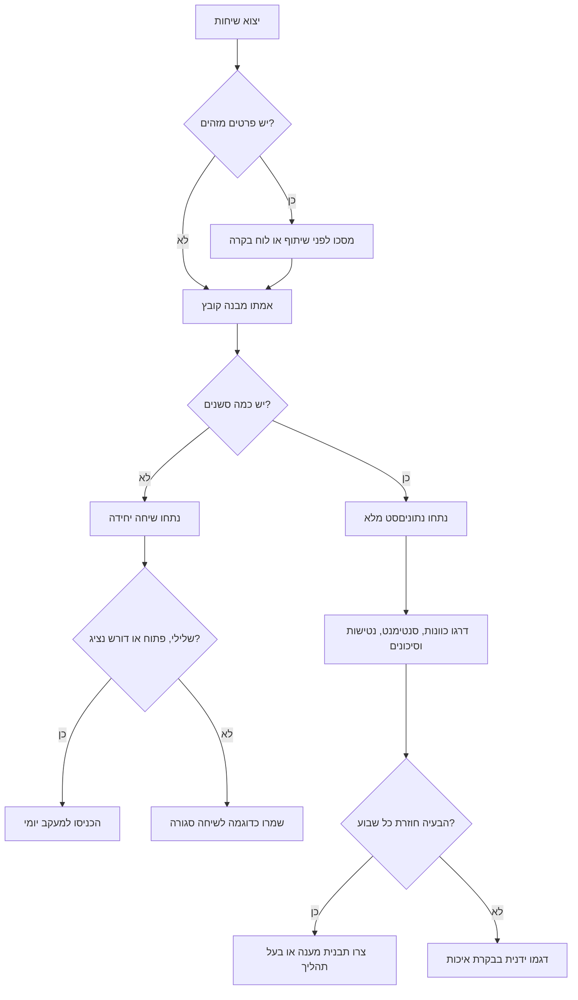
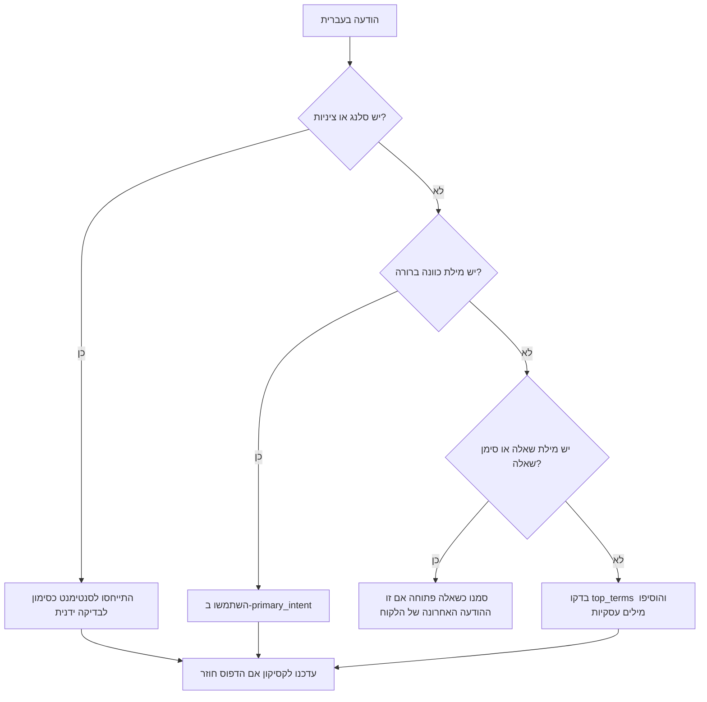

# מנתח נתוני צ׳אט

נתחו שיחות לקוחות בעברית ובשילוב עברית-אנגלית כדי לזהות בעיות חוזרות, סנטימנט, כוונות, נטישות, בקשות לנציג אנושי, שיחות שלא נסגרו, חשיפה אפשרית של פרטים מזהים ומגמות תפעוליות.

החבילה מתאימה לעסקים קטנים בישראל, עצמאים, חנויות אונליין, קליניקות, נותני שירות, רואי חשבון, יועצים, סטודיו לעיצוב, שירותי משלוחים, תמיכה טכנית ומוקדי שירות קטנים.

## מתי להשתמש

הפעילו את המיומנות כאשר צריך:

- לנתח שיחות לקוחות בעברית מ-WhatsApp Business, צ׳אט באתר, מערכת CRM, תיבת תמיכה או בוט.
- לזהות סנטימנט שלילי, בקשות החזר, תלונות, בעיות משלוח, שאלות על חשבונית/קבלה/מע״מ ובקשות לנציג.
- להכין סקירה שבועית: כוונות נפוצות, שיחות פתוחות, נטישות, זמן תגובה ראשון וסיכוני פרטיות.
- למסך פרטים מזהים לפני שיתוף דוגמאות עם ספק, עובד, יועץ או כלי לוח בקרה.
- להפריד בין שיחות מכירה, תמיכה, גבייה, ביטול עסקה ותיאום תורים.
- לבנות תהליך עבודה עקבי במקום גיליונות ידניים לא אחידים.

אין להשתמש בפלט כתחליף לייעוץ משפטי, חשבונאי, מס, רפואי או מקצועי מוסדר. השתמשו בפלט ככלי תיעדוף, בקרה ושיפור תהליכים.

## פלט מרכזי

| שדה | פירוש | פעולה מומלצת |
|---|---|---|
| `language` | עברית, אנגלית, מעורב או לא ידוע | התאימו תבניות מענה לשפה. |
| `primary_intent` | הכוונה המרכזית בשיחה | העבירו לאחראי מתאים. |
| `sentiment.label` | חיובי, ניטרלי או שלילי | בדקו קודם שיחות שליליות. |
| `risk_flags` | ספירת דפוסי פרטים מזהים | מסכו לפני יצוא או שיתוף. |
| `drop_off` | הלקוח שלח את ההודעה האחרונה אחרי חילופי הודעות | בדקו מה חסם את ההתקדמות. |
| `escalation_requested` | הלקוח ביקש נציג, מנהל או מענה אנושי | העבירו לטיפול אנושי. |
| `unresolved` | השיחה נראית פתוחה, שלילית או דורשת הסלמה | הכניסו לתור מעקב. |
| `recommendations` | פעולות מעשיות להמשך | הפכו תובנות לשינוי תהליך. |

## מבנה קלט מומלץ

### JSON

```json
[
  {
    "session_id": "whatsapp-18/05/2026-001",
    "messages": [
      {
        "sender": "user",
        "text": "שלום, אפשר לקבל חשבונית מס על 350 ₪?",
        "timestamp": "2026-05-18T09:00:00"
      },
      {
        "sender": "bot",
        "text": "כן. נא לשלוח שם עסק ומספר עוסק.",
        "timestamp": "2026-05-18T09:00:08"
      },
      {
        "sender": "user",
        "text": "תודה רבה, הסתדר.",
        "timestamp": "2026-05-18T09:01:30"
      }
    ]
  }
]
```

### CSV

```csv
session_id,sender,text,timestamp
s1,user,"המשלוח לא הגיע ואני רוצה נציג",18/05/2026 10:30:00
s1,bot,"אפשר לבדוק לפי מספר הזמנה",18/05/2026 10:31:15
```

עמודות חובה: `session_id`, `sender`, `text`.

ערכי שולח נתמכים:

- לקוח: `user`, `customer`, `client`
- עסק/בוט: `bot`, `assistant`, `agent`, `business`
- אירוע מערכת: `system`

תאריכים נתמכים: ISO-8601 וגם פורמט ישראלי `DD/MM/YYYY HH:MM:SS`. בדוחות ללקוחות ישראלים העדיפו `DD/MM/YYYY` וסכומים ב-₪.

## התחלה מהירה

```bash
cd chat-data-analyzer

python scripts/chat-data-analyzer-cli.py sample /tmp/chats.json
python scripts/chat-data-analyzer-cli.py analyze /tmp/chats.json --format summary
python scripts/chat-data-analyzer-cli.py analyze /tmp/chats.json --format json -o /tmp/analysis.json
python scripts/chat-data-analyzer-cli.py anonymize /tmp/chats.json /tmp/chats.masked.json
```

ניתוח טקסט יחיד:

```bash
python scripts/chat-data-analyzer-cli.py text "המשלוח לא הגיע ואני רוצה החזר דחוף"
```

שימוש מתוך Python:

```python
import importlib.util
from pathlib import Path

client_path = Path("scripts/chat-data-analyzer-client.py")
spec = importlib.util.spec_from_file_location("chat_data_analyzer_client", client_path)
module = importlib.util.module_from_spec(spec)
spec.loader.exec_module(module)

analyzer = module.ChatDataAnalyzerClient()
result = analyzer.analyze_text("אפשר חשבונית מס וקבלה על 250 ₪?")
print(result["intents"][0]["intent"])
```

## עץ החלטה: בחירת תהליך



## עץ החלטה: עמימות בעברית



## דוגמאות קונקרטיות

### חשבונית, קבלה ומע״מ

קלט:

```text
אפשר לקבל חשבונית מס וקבלה על 1,250 ₪? שילמתי בביט.
```

פלט צפוי:

```json
{
  "language": "he",
  "primary_intent": "billing_tax",
  "sentiment": "neutral"
}
```

פעולה מומלצת:

1. בקשו רק פרטים שנדרשים להפקת המסמך.
2. אשרו תאריך בפורמט `DD/MM/YYYY`.
3. הציגו סכום ב-₪.
4. אל תציגו מספרי עוסק או ח.פ. בצילום מסך של לוח בקרה.

### ביטול עסקה והחזר

קלט:

```text
אני רוצה לבטל את העסקה ולקבל החזר. קניתי אתמול.
```

פלט צפוי:

```json
{
  "primary_intent": "cancellation_refund",
  "unresolved": true
}
```

פעולה מומלצת:

- בדקו תאריך רכישה וערוץ רכישה.
- הציגו מדיניות ביטול בשפה פשוטה.
- הסלימו כאשר מופיעים איום, תלונה חוזרת או מונח משפטי.

### תלונת משלוח

קלט:

```text
המשלוח לא הגיע ואני מחכה כבר שבוע. זה שירות גרוע.
```

פלט צפוי:

```json
{
  "primary_intent": "delivery",
  "sentiment": "negative",
  "resolution_status": "at_risk"
}
```

פעולה מומלצת:

- בדקו מספר מעקב וחברת שילוח.
- תנו פעולה ספציפית ולא מענה כללי.
- עקבו אחרי תלונות לפי אזור וחברת משלוח.

### תיאום תור

קלט:

```text
אפשר להזיז את התור ל-24/06/2026 בשעה 15:00?
```

פלט צפוי:

```json
{
  "primary_intent": "appointment"
}
```

פעולה מומלצת:

- אשרו תאריך ושעה.
- שלחו תזכורת.
- בקליניקות ובשירותים רגישים, הימנעו מיצוא פרטים רפואיים או אישיים שאינם דרושים לניתוח.

### מסוך פרטים מזהים

קלט:

```text
המייל שלי dana@example.co.il והטלפון 052-123-4567
```

פלט לאחר מסוך:

```text
המייל שלי [EMAIL] והטלפון [PHONE]
```

## טקסונומיית כוונות

| כוונה | ביטויים אופייניים | שימוש עסקי |
|---|---|---|
| `billing_tax` | חשבונית, קבלה, מע״מ, עוסק פטור, עוסק מורשה, חיוב, זיכוי | ניתוב להנהלת חשבונות או גבייה |
| `appointment` | תור, פגישה, לקבוע, להזיז, לדחות, להקדים | יומן ותיאום שירות |
| `delivery` | משלוח, שליח, מסירה, מספר מעקב, חבילה | לוגיסטיקה ומסחר מקוון |
| `cancellation_refund` | ביטול, החזר, זיכוי, עסקה, התחרטתי | ביטול עסקה ושירות לקוחות |
| `product_info` | מידה, צבע, מלאי, אחריות, דגם, מפרט | מכירות ומידע לפני רכישה |
| `complaint` | תלונה, לא מרוצה, חוצפה, פיצוי, מנהל | טיפול איכות והסלמה |
| `technical_support` | תקלה, שגיאה, סיסמה, התחברות, אפליקציה | תמיכה טכנית |
| `sales_lead` | הצעת מחיר, דמו, מחירון, מעוניין, לרכוש | מכירה והמשך קשר |
| `legal_privacy` | פרטיות, הסכמה, מאגר מידע, ספאם, הסר | בדיקת פרטיות וציות |
| `human_agent` | נציג, בן אדם, מנהל, שירות לקוחות | מענה אנושי מיידי |

## מקרי קצה

### עברית ואנגלית באותה הודעה

```text
ה-login לא עובד, reset password please
```

כוונה צפויה: `technical_support`.

הוסיפו מילים באנגלית ללקסיקון כאשר לקוחות משתמשים במונחים קבועים.

### כתיב משתנה

הוסיפו וריאציות:

```python
custom = {
    "membership": ["מנוי", "מינוי", "חידוש מנוי", "מסלול חודשי"]
}
```

### סלנג וציניות

```text
איזה יופי, שוב האתר נפל.
```

הסנטימנט עלול לצאת ניטרלי או חיובי בגלל הביטוי “איזה יופי”. דגמו ידנית והוסיפו ביטויים רק אם הם חוזרים.

### תמלול קול

תמלול עלול להפוך `מע״מ` ל-`מעמ`, `מהם` או ניסוחים דומים. בדקו מדגם לפני שינוי תהליך עסקי.

### שיחה קצרה מאוד

הודעה אחת מספיקה לסיווג ראשוני, אך לא לחישוב זמן תגובה או נטישה מדויקת.

### הודעות מערכת מ-WhatsApp

מחקו שורות הצפנה, הצטרפות לקבוצה, “המדיה הושמטה” ואירועים שאינם חלק מהשיחה עם הלקוח.

### מונחים משפטיים או חשבונאיים

התייחסו ל-`מע״מ`, `חשבונית מס`, `זיכוי`, `ביטול עסקה`, `ספאם` ו-`מאגר מידע` כאותות ניתוב בלבד. אל תסיקו מסקנה משפטית או חשבונאית אוטומטית.

## תהליך בקרת איכות שבועי

1. ייצאו שיחות ממערכת המקור.
2. מחקו או מסכו פרטים מזהים שאינם דרושים.
3. הריצו ניתוח נתוניםסט.
4. מיינו לפי סנטימנט שלילי, שיחות פתוחות ובקשות נציג.
5. דגמו לפחות 10 שיחות מכל כוונה מובילה.
6. הגדירו בעל תהליך לכל בעיה חוזרת.
7. עדכנו תבנית מענה או ניתוב.
8. בדקו בשבוע הבא אם שיעור הנטישה או התלונות ירד.

## רשימת בדיקה לסביבת ייצור

- [ ] הגדירו מטרה עסקית ברורה לניתוח.
- [ ] שמרו רק שדות נדרשים: `session_id`, שולח, זמן, טקסט, ערוץ ומטא-נתונים רלוונטי.
- [ ] מסכו טלפונים, מיילים, מספרי זהות דמויי ת״ז ומספרי כרטיס דמויי אשראי לפני שיתוף רחב.
- [ ] אחסנו יצואים גולמיים בתיקייה מוגבלת הרשאות.
- [ ] השתמשו בתאריכים בפורמט `DD/MM/YYYY` בדוחות עבריים.
- [ ] הציגו סכומים ב-₪.
- [ ] אל תקבעו שיעורי מס או כללי ביטול בקוד בלי אימות מול גורם מקצועי.
- [ ] הגדירו יעד זמן תגובה ראשון לכל ערוץ.
- [ ] הגדירו מתי שיחה עוברת לנציג אנושי.
- [ ] שמרו מילוני כוונות מותאמים תחת בקרת גרסאות.
- [ ] הריצו `pytest scripts` לפני הפצת שינוי.
- [ ] השוו תיוג אוטומטי למדגם ידני לפני החלטות עסקיות.
- [ ] הגדירו תקופות שמירה ליצואי צ׳אט ולדוחות נגזרים.
- [ ] בדקו התאמות נגישות בהודעות המשך ללקוחות.
- [ ] בדקו מחדש חובות פרטיות, מס וצרכנות עדכניות לפני שימוש לצורכי ציות.

## תקלות נפוצות

| סימפטום | סיבה אפשרית | תיקון |
|---|---|---|
| הרבה כוונות `unknown` | חסרים מונחים עסקיים | הוסיפו מילים מותאמות והריצו שוב. |
| סנטימנט שלילי מדי | מילים כמו “דחוף” מקבלות משקל גבוה | בדקו דוגמאות שגויות ועדכנו לקסיקון. |
| חסר זמן תגובה | אין חותמות זמן או פורמט לא נתמך | נרמלו ל-ISO-8601 או `DD/MM/YYYY HH:MM:SS`. |
| CSV לא עובר | חסרות עמודות חובה | הוסיפו `session_id`, `sender`, `text`. |
| עברית מופיעה כקידוד | JSON הודפס עם ASCII escaping | השתמשו ב-`ensure_ascii=False`. |
| יותר מדי סיכוני פרטיות | מספרי הזמנה דומים לת״ז או אשראי | בדקו מדגם והוסיפו כללי סינון. |
| נטישה גבוהה מדי | קמפיינים חד-כיווניים נכנסו לניתוח | הפרידו הודעות שיווק משיחות שירות. |

## דפוסים שכדאי להימנע מהם

- שיתוף יצוא WhatsApp מלא בגיליון פתוח ללא מסוך.
- קבלת החלטה על שינוי בוט לפי הודעה אחת.
- ערבוב שיחות מכירה, תמיכה, גבייה וקמפיינים ללא תווית ערוץ.
- תרגום שיחות לעברית/אנגלית לפני שמירת המקור.
- שימוש בטלפון לקוח כמזהה אנליטי.
- ספירת “תודה” כסגירה כאשר הלקוח שואל שאלה אחרונה.
- החזרת שיחת פרטיות או תלונה משפטית ללולאת בוט רגילה.
- שמירת פרטים מזהים בדוגמאות הדרכה או בלוח בקרה ציבורי.

## מתי להסלים מיד

העבירו לטיפול אנושי כאשר מופיעים:

- כעס חוזר או מילות תלונה חריפות.
- בקשה לנציג, מנהל, החזר או ביטול.
- איום, מונחים משפטיים, בקשת מחיקה, הסרה מדיוור או טענת ספאם.
- מספר כרטיס, מספר זהות דמוי ת״ז, מידע רפואי או מידע על קטינים.
- שאלה אחרונה של הלקוח שלא קיבלה מענה.

## פירוש דוח שבועי

דוח שימושי יכלול:

- חמש הכוונות המובילות לפי נפח.
- שיעור סנטימנט שלילי לפי כוונה.
- שיעור נטישה לפי ערוץ.
- שיעור בקשות נציג לפי ערוץ.
- זמן תגובה ראשון ממוצע וחציוני.
- דוגמאות ממוסכות לכל בעיה חוזרת.
- בעל תהליך והפעולה הבאה.

## קבצים קשורים

- `references/workflow-guide.md`: תהליכי עבודה מקצה לקצה.
- `references/api-reference.md`: רגולציה ישראלית וממשקים אופציונליים.
- `references/troubleshooting.md`: פתרון תקלות מפורט.
- `references/test-scenarios.md`: תרחישי בדיקה עם תוצאה צפויה.
- `references/migration-checklist.md`: מעבר מיצואים וגיליונות קיימים.
- `scripts/chat-data-analyzer-client.py`: לקוח סינכרוני וא-סינכרוני.
- `scripts/chat-data-analyzer-cli.py`: CLI מבוסס Click.
- `scripts/test_chat_data_analyzer_client.py`: בדיקות pytest.
