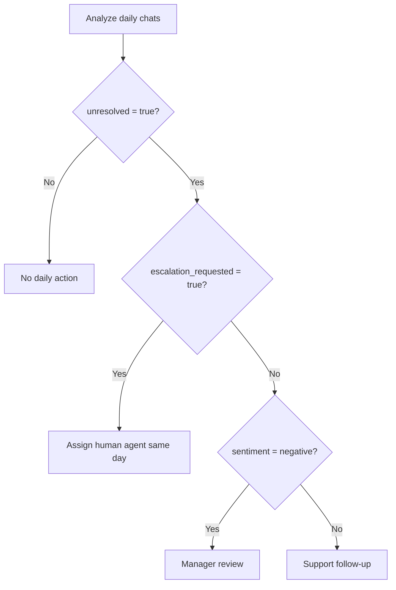

# Workflow Guide

Use these workflows to turn raw customer chats into operational decisions without overexposing personal data.

## Workflow 1: Weekly small-business support review

**Goal:** identify the top recurring issues and choose one process improvement per week.

### Inputs

- Chat export from WhatsApp Business, website chat, CRM, or support inbox.
- Fields: `session_id`, `sender`, `text`, `timestamp`, optional `channel`.
- Date range: last 7 days, displayed as `DD/MM/YYYY`.
- Currency in examples: ₪.

### Steps

1. Export chat data from the source system.
2. Remove campaign broadcasts and internal staff messages.
3. Run validation:

   ```bash
   python scripts/chat-data-analyzer-cli.py validate chats.json
   ```

4. Mask identifiers before sharing samples:

   ```bash
   python scripts/chat-data-analyzer-cli.py anonymize chats.json chats.masked.json
   ```

5. Generate a summary:

   ```bash
   python scripts/chat-data-analyzer-cli.py analyze chats.masked.json --format summary
   ```

6. Generate a JSON file for dashboarding:

   ```bash
   python scripts/chat-data-analyzer-cli.py analyze chats.masked.json --format json -o weekly-analysis.json
   ```

7. Review the top 5 intents.
8. Open all negative, unresolved, and escalated conversations.
9. Pick one workflow change:
   - Add a response template.
   - Change routing.
   - Update a product page.
   - Add delivery tracking language.
   - Add a finance handoff for invoice questions.
10. Track the same metrics next week.

### Output template

```text
Period: 27/05/2026 to 02/06/2026
Chats analyzed: 184
Top intent: delivery
Negative sentiment rate: 18%
Drop-off rate: 23%
Escalation rate: 9%
Recommended action: add tracking status before asking for order details.
Owner: operations
Review date: 09/06/2026
```

### Acceptance criteria

- Raw examples are masked.
- At least 10 conversations from the top issue are manually sampled.
- One owner is assigned.
- Follow-up date is set.

## Workflow 2: Daily unresolved-chat queue

**Goal:** avoid losing customers who asked a final question or requested a person.

### Decision logic



### Steps

1. Run daily dataset analysis.
2. Filter conversations where `unresolved` is `true`.
3. Sort by:
   1. `escalation_requested`
   2. negative sentiment
   3. latest timestamp
4. Assign owner by `primary_intent`.
5. Follow up with a short message in Hebrew.
6. Mark the conversation as resolved only after the customer receives a direct answer.

### Follow-up message patterns

For delivery:

```text
שלום, בדיקת נושא המשלוח הושלמה. מספר המעקב הוא ______. עדכון נוסף יישלח עד __:__ בתאריך DD/MM/YYYY.
```

For billing/tax:

```text
שלום, כדי להפיק חשבונית/קבלה נא לשלוח רק את הפרטים הנדרשים: שם העסק, מספר עוסק/ח.פ. וסכום העסקה ב-₪.
```

For appointment:

```text
שלום, אפשר לתאם ל-DD/MM/YYYY בשעה __:__ או ל-DD/MM/YYYY בשעה __:__. איזה מועד נוח?
```

## Workflow 3: Finance and tax document triage

**Goal:** route invoice, receipt, VAT, and refund questions without exposing unnecessary identifiers.

### Trigger intents

- `billing_tax`
- `cancellation_refund`
- `complaint` with finance terms

### Steps

1. Filter `primary_intent` in `billing_tax` or `cancellation_refund`.
2. Mask raw identifiers when examples are reviewed outside the finance role.
3. Add each chat to one of these queues:
   - invoice/receipt issue
   - correction or credit note
   - refund request
   - payment failed or duplicate charge
   - unclear finance question
4. Ask only for the minimum data required.
5. Confirm dates in `DD/MM/YYYY`.
6. Show amounts in ₪.
7. Avoid hard-coded tax rules in automated replies.
8. Route exceptions to a bookkeeper/accountant.

### Quality checks

- Verify that no report screenshot displays a full Israeli ID-like value, phone number, card-like value, or personal email.
- Check whether customers repeat the same invoice question; repeated questions may indicate a missing checkout instruction.
- Compare billing questions before and after changing checkout or invoice text.

## Workflow 4: Bot response improvement

**Goal:** reduce drop-off and negative sentiment by improving bot answers.

### Steps

1. Run dataset analysis.
2. Filter by `drop_off = true`.
3. Group by `primary_intent`.
4. Read the last bot/business message before drop-off.
5. Label the failure mode:
   - answer too long
   - asked for unnecessary details
   - did not answer the question
   - no human handoff
   - unclear policy
   - missing link or tracking number
6. Rewrite the response in plain Hebrew.
7. Test the new response on 10 sample chats.
8. Deploy.
9. Track drop-off rate for the same intent next week.

### Rewrite checklist

- Start with the answer.
- Use one next action.
- Avoid legal/tax promises unless approved.
- Offer a human handoff when the customer asks.
- Use `DD/MM/YYYY` for dates.
- Use ₪ for amounts.
- Avoid asking for sensitive data unless necessary.

## Workflow 5: Privacy-conscious vendor sharing

**Goal:** share useful examples with a consultant, developer, or external support vendor without exposing unnecessary personal data.

### Steps

1. Run:

   ```bash
   python scripts/chat-data-analyzer-cli.py anonymize raw.json masked.json
   ```

2. Inspect `risk_flags` in the analysis.
3. Remove free-text fields that are not needed for the vendor task.
4. Share only:
   - masked conversation text
   - intent label
   - sentiment label
   - issue category
   - channel
   - date bucket, not exact timestamp, unless required
5. Add a retention instruction to the vendor task.
6. Avoid sending raw chats to external APIs.

### Minimum useful vendor record

```json
{
  "session_id": "sample-007",
  "date": "03/06/2026",
  "channel": "whatsapp",
  "primary_intent": "delivery",
  "sentiment": "negative",
  "masked_messages": [
    {"sender": "user", "text": "המשלוח לא הגיע. הטלפון שלי [PHONE]"},
    {"sender": "bot", "text": "אפשר מספר הזמנה?"}
  ],
  "failure_mode": "asked for more details without giving tracking action"
}
```

## Workflow 6: Custom intent rollout

**Goal:** add business-specific categories without breaking existing labels.

### Steps

1. Export 50–100 recent chats.
2. Run baseline analysis.
3. List `unknown` conversations and top terms.
4. Choose 3–8 recurring business terms.
5. Add a custom intent dictionary:

   ```python
   custom = {
       "subscription": ["מנוי", "חידוש מנוי", "מסלול חודשי"],
       "course_registration": ["הרשמה לקורס", "שיעור ניסיון", "סדנה"]
   }
   analyzer = ChatDataAnalyzerClient(custom_intents=custom)
   ```

6. Rerun analysis.
7. Compare old and new intent distribution.
8. Manually review false positives.
9. Keep the custom dictionary under version control.

### Do not

- Add one-off customer names as keywords.
- Add extremely broad words such as “בעיה” to a narrow intent.
- Replace the default taxonomy without a migration review.
- Add legal or tax conclusions as classifier labels.

## Workflow 7: Dashboard preparation

**Goal:** create a clean dataset for BI tools.

### Recommended fields

| Field | Keep? | Notes |
|---|---|---|
| `session_id` | Yes | Use a random or hashed ID. |
| `channel` | Yes | WhatsApp, web, email, app. |
| `date` | Yes | Prefer date bucket; use `DD/MM/YYYY`. |
| `primary_intent` | Yes | Main grouping field. |
| `sentiment.label` | Yes | Use as triage, not fact. |
| `unresolved` | Yes | Follow-up metric. |
| `drop_off` | Yes | Bot/process quality metric. |
| `risk_flags` | Yes | Aggregate only. |
| raw text | Usually no | Keep only masked samples for QA. |
| phone/email/ID | No | Remove or mask. |

### Metric definitions

- **Drop-off rate:** conversations where the final message came from the customer after a prior exchange.
- **Escalation rate:** conversations where the customer asked for a person, representative, or manager.
- **Unresolved rate:** conversations with open question, negative sentiment, or escalation.
- **Negative sentiment rate:** share of conversations labeled negative.
- **Top intent share:** share of conversations in the most common primary intent.

## Workflow 8: Incident review after a complaint spike

**Goal:** understand what changed when complaints increased.

### Steps

1. Define the incident window using exact dates.
2. Analyze chats from the incident window.
3. Analyze chats from the previous comparable window.
4. Compare:
   - top intents
   - negative sentiment rate
   - drop-off rate
   - escalation rate
   - top terms
5. Sample the top negative intent manually.
6. Identify the likely driver:
   - shipping delay
   - payment issue
   - app bug
   - unclear campaign
   - missing stock
   - finance document delay
7. Assign action and owner.
8. Create a short summary for the business owner.

### Incident summary template

```text
Incident window: DD/MM/YYYY to DD/MM/YYYY
Compared with: DD/MM/YYYY to DD/MM/YYYY
Main change: delivery complaints increased from 11% to 26%
Most common phrase: "לא הגיע"
Likely driver: carrier delay in central region
Action: add proactive tracking update and escalation path
Owner: operations
Review: DD/MM/YYYY
```

## Workflow 9: Consumer-facing cancellation path audit

**Goal:** make sure customers requesting cancellation or refund are not trapped in a bot loop.

### Steps

1. Filter `primary_intent = cancellation_refund`.
2. Separate:
   - cancellation before service/product delivery
   - refund after payment
   - damaged/missing product
   - duplicate charge
   - unclear request
3. Check whether the first business reply:
   - acknowledges the request
   - asks for the minimum required details
   - gives a clear next step
   - avoids unapproved legal promises
4. Escalate high-risk conversations.
5. Update the approved cancellation response template.

## Workflow 10: Freelancer lead-quality review

**Goal:** identify which chats are sales leads and which questions block conversion.

### Steps

1. Filter `primary_intent = sales_lead`.
2. Group by top terms:
   - מחיר
   - דמו
   - זמינות
   - תיק עבודות
   - חבילה
3. Mark each lead as:
   - ready to buy
   - needs price
   - needs availability
   - needs trust proof
   - not a fit
4. Update FAQ or proposal template.
5. Track conversion by chat source.

## Operational cadence

| Cadence | Action |
|---|---|
| Daily | Review unresolved, negative, and escalated chats. |
| Weekly | Analyze trends and choose one process improvement. |
| Monthly | Review taxonomy, custom intents, retention, and access controls. |
| Quarterly | Re-check legal, accounting, privacy, and accessibility obligations. |

## Practical limits

- Heuristics are explainable but not perfect.
- Sarcasm, very short messages, transcription errors, and domain-specific jargon need manual sampling.
- The tool flags possible personal data but cannot guarantee complete anonymization.
- Compliance questions require current professional review.
