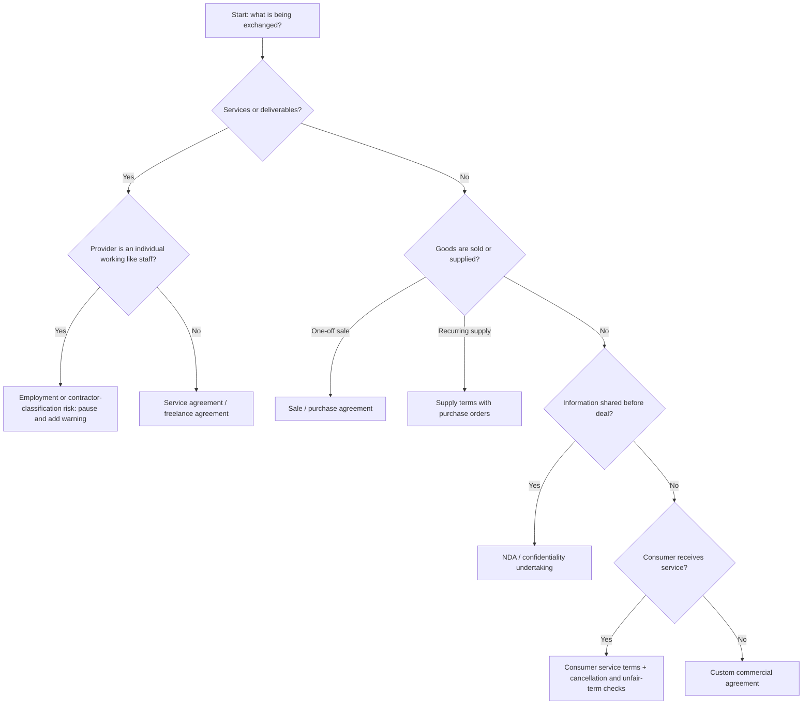
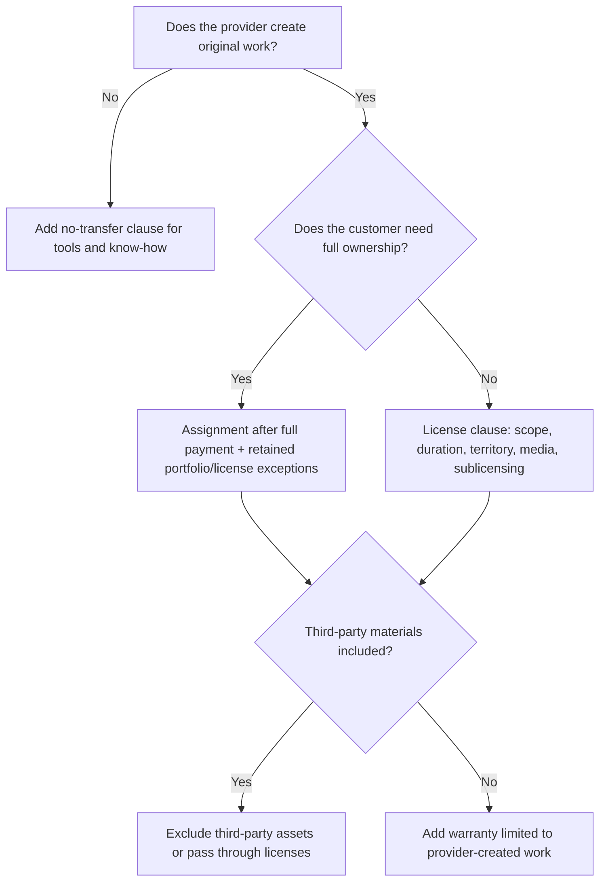
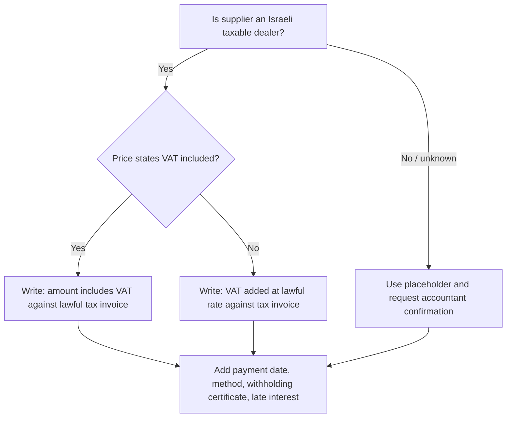
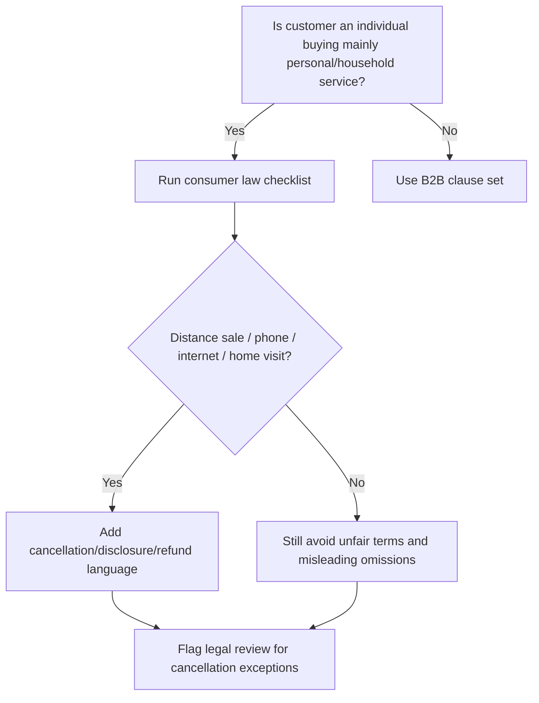

# Contract Drafting Assistant

Draft practical Israeli agreement drafts in Hebrew or English for small businesses, freelancers, and consumers. Produce neutral, plain-language documents that preserve commercial clarity, align with current core Israeli contract principles, and flag legal issues requiring professional review.

## Operating principles

1. **Classify the transaction before drafting.** Select the contract family, the party profile, and the risk level before choosing clauses.
2. **Ask only for missing essentials.** If the user supplied enough facts, draft with bracketed placeholders and a concise assumptions section.
3. **Use Israeli localization.** Use ₪, DD/MM/YYYY, Israeli identification terms, Israeli invoice terminology, and Israeli governing-law clauses.
4. **Keep Hebrew natural.** Prefer "הסכם למתן שירותים", "עוסק מורשה", "חשבונית מס", "מע״מ", "ניכוי מס במקור", "הודעה מוקדמת", "קניין רוחני", "סודיות", "הגנת הפרטיות".
5. **Draft enforceable, not aggressive.** Avoid one-sided penalties, blanket liability exclusions, impossible cancellation limits, and unfair standard-form terms.
6. **Separate legal facts from commercial choices.** Mark statutory constraints as "legal guardrail"; mark business choices as "negotiation point".
7. **Do not present a draft as legal advice.** Add a short review note for high-value, consumer-facing, privacy-heavy, finance, real-estate, medical, construction, or employment-adjacent agreements.

## Fast intake checklist

| Topic | Required facts | Israeli drafting note |
|---|---|---|
| Parties | Full legal names, ID / company / business number, address, contact email, role | Use ת.ז., ח.פ., ע.מ., or nonprofit number as applicable |
| Type | Services, sale of goods, freelance, consumer service, NDA, license, supply, loan, settlement | Determines statutory clauses and risk warnings |
| Date | Signing date, effective date, duration | Use DD/MM/YYYY in Hebrew drafts |
| Scope | Deliverables, specifications, exclusions, milestones | Attach a statement of work for technical projects |
| Price | Fixed fee, hourly, retainer, milestone, expenses, VAT | State whether ₪ amount includes or excludes מע״מ |
| Tax docs | Invoice type, receipt, withholding certificate, payment method | Use "חשבונית מס כדין" where applicable |
| Timing | Delivery dates, acceptance period, late delivery consequences | Avoid automatic forfeiture unless proportionate |
| Cancellation | Termination for convenience/cause, cure period, consumer cancellation | Consumer-facing deals require extra caution |
| IP | Who owns work product, license scope, pre-existing materials | Do not transfer third-party materials |
| Confidentiality | What is confidential, exclusions, duration, permitted disclosures | Include privacy/data terms when personal data is processed |
| Liability | Direct damages, cap, exclusions, insurance, indemnity | Do not exclude fraud, willful misconduct, bodily injury, or mandatory consumer rights |
| Disputes | Negotiation, mediation, court venue, governing law | Israeli law and competent Israeli courts unless justified |

## Contract family decision tree



## Drafting workflow

### Step 1 — Identify legal posture

| Situation | Use | Avoid |
|---|---|---|
| Freelancer designs a visual identity asset for a business | Freelance services agreement with IP assignment or license | Employment-style control language |
| Small store sells equipment to another business | Sale agreement with delivery, warranty, retention of title if needed | Consumer cancellation wording if not consumer-facing |
| Consumer hires a renovation contractor | Consumer service agreement with scope, permits, schedule, staged payments, cancellation note | Broad waiver of statutory remedies |
| Startup shares confidential deck with consultant | NDA with permitted purpose and return/destruction clause | Unlimited non-compete |
| Consultant processes customer data | Service agreement + data processing, security, breach notice | Ignoring Privacy Protection Regulations |
| Monthly marketing retainer | Service agreement with monthly deliverables, approval process, termination | Vague "all marketing services" scope |

### Step 2 — Select clause set

Minimum clause set for most Israeli service agreements:

1. Parties and definitions.
2. Background and purpose.
3. Services and deliverables.
4. Work schedule and milestones.
5. Fees, VAT, invoice, withholding tax, expenses.
6. Acceptance and change requests.
7. Customer cooperation and dependencies.
8. Representations and legal compliance.
9. Confidentiality.
10. Privacy and data security, when personal data is involved.
11. Intellectual property.
12. Warranties and disclaimers.
13. Liability cap and excluded losses.
14. Insurance, if relevant.
15. Term and termination.
16. Consequences of termination.
17. Dispute resolution, governing law, competent courts.
18. Notices.
19. Miscellaneous boilerplate.
20. Signature blocks.

### Step 3 — Insert Israeli legal guardrails

Use guardrails as comments or warnings near the draft, not as long lectures inside the contract.

| Guardrail | Add when | Drafting action |
|---|---|---|
| Contracts (General Part) Law, 1973 | Every agreement | Ensure offer, acceptance, certainty, good faith, capacity |
| Contracts (Remedies for Breach) Law, 1970 | Remedies, breach, termination | State cure periods, damages limits, specific performance if intended |
| Standard Contracts Law, 1982 | Reusable terms / standard form | Avoid unfairly prejudicial terms and hidden one-sided changes |
| Consumer Protection Law, 1981 | Business-to-consumer | Add cancellation, disclosure, distance-sale, refund, and fair-practice checks |
| VAT Law, 1975 | Israeli taxable business pricing | State if amounts include/exclude VAT and invoice timing |
| Income Tax withholding practice | B2B supplier payment | Refer to valid withholding certificate; avoid giving tax advice |
| Privacy Protection Law, 1981 | Personal data processing | Add purpose limitation, security, confidentiality, breach cooperation |
| Privacy Protection Regulations (Data Security), 2017 | Databases / personal data | Add security duties, access controls, incident notice, subcontractor limits |
| Copyright Law, 2007 | Creative, code, design, text, photos | Distinguish assignment, exclusive license, non-exclusive license, moral rights |
| Electronic Signature Law, 2001 | Digital execution | Allow electronic signatures unless wet signature is required by context |
| Arbitration Law, 1968 | Arbitration clause | State seat, language, appointment method, interim relief, costs |
| Courts Law / civil procedure considerations | Venue clause | Avoid oppressive venue for consumers |

## Clause decision trees

### IP ownership



### 2026 contract-interpretation check

For Israeli business contracts signed after the 2026 amendment to section 25 of the Contracts (General Part) Law, include a deliberate interpretation structure. Use an entire-agreement clause only when it matches the transaction, avoid vague appendices, and make material commercial terms explicit in the document body or signed schedules. Do not assume that consumer contracts, standard contracts, employment contracts, or collective agreements will be interpreted only by literal wording.

### VAT and payment wording

As of 02/06/2026, the standard Israeli VAT rate used by the helper is 18%. Keep the contract clause tied to the lawful rate instead of embedding a permanent number unless the user needs a calculation exhibit.



### Consumer-facing contract



## Concrete examples

### Example A — Hebrew freelancer service agreement intake

**User facts**

- Provider: דנה כהן, עוסק מורשה 123456789, graphic designer.
- Customer: רשת בתי קפה בע״מ, ח.פ. 515000000.
- Scope: visual identity refresh, menu templates, five social media templates.
- Fee: ₪12,000 plus VAT, 40% advance, 60% after delivery.
- Deadline: 15/07/2026.
- IP: customer owns final approved designs after full payment; provider keeps drafts, know-how, portfolio right.

**Drafting output pattern**

- Title: "הסכם למתן שירותי עיצוב גרפי".
- Payment: "לכל סכום יתווסף מע״מ כדין כנגד חשבונית מס כדין".
- IP: transfer conditioned on full payment; exclude preliminary sketches and provider tools.
- Acceptance: 7 business days to approve or provide consolidated comments.
- Change requests: out-of-scope work billed hourly or by written quote.

### Example B — Consumer appliance repair

**User facts**

- Technician repairs household refrigerator.
- Consumer pays ₪650 including VAT.
- Visit scheduled for 20/06/2026.
- Parts warranty 3 months; labor warranty 30 days.

**Drafting output pattern**

- Use plain Hebrew.
- State price includes VAT unless otherwise specified.
- Include cancellation and rescheduling terms.
- Avoid blanket "no responsibility" language.
- Include description of parts, warranty, and service record.
- Flag that mandatory consumer rights cannot be waived.

### Example C — NDA before business collaboration

**User facts**

- Two businesses exchange supplier pricing and client lists.
- Purpose: evaluating joint tender.
- Term: 2 years.
- Exclusions: public info, independently developed info, legally compelled disclosure.

**Drafting output pattern**

- Use mutual NDA.
- Do not include broad non-compete unless separately justified.
- Add return/destruction clause.
- Add permitted disclosures to employees/advisers on need-to-know basis.

## Edge cases and handling

| Edge case | Risk | Drafting response |
|---|---|---|
| Freelancer works full-time for one customer, fixed hours, customer equipment | Misclassification as employee | Add warning; avoid drafting employment-disguised service agreement without review |
| Contract amount says "₪10,000" only | VAT dispute | Ask whether VAT included; if unknown, use placeholder and warning |
| Consumer cancellation is "non-refundable in all cases" | Unfair or unlawful term | Replace with statutory-rights savings clause and reasonable cancellation fee |
| Customer asks for unlimited liability | Supplier risk | Offer cap tied to fees, insurance, or direct damages; carve out fraud and IP misuse |
| Provider asks to keep all IP while customer expects ownership | Business mismatch | Choose license/assignment decision tree; highlight negotiation point |
| Personal data includes health/children/payment data | Privacy risk | Add enhanced security, limited access, incident notice, subcontractor approval |
| Work includes open-source code | License contamination | Add OSS disclosure, compliance, and exclusion from ownership warranty |
| Signing party is not registered company officer | Authority issue | Add representation of authority and request signatory title |
| Late payment interest requested | Enforceability/proportionality | Use reasonable interest, cure notice, suspension right |
| Standard online terms for consumers | Standard Contracts Law and Consumer Protection Law | Add prominent disclosures and avoid unilateral changes without notice |
| Cross-border customer | Tax, jurisdiction, service of process | Add governing law, venue, language precedence, tax gross-up only after review |
| Minor enters agreement | Capacity issue | Require guardian or legal review |
| Real estate / residential lease | Special law | Use dedicated lease workflow or legal review |
| Medical, financial, insurance, credit, crypto | Regulated activity | Do not draft as ordinary service terms; add professional review requirement |

## Anti-patterns

Avoid these patterns in Israeli contracts:

- "All payments are non-refundable under all circumstances."
- "The provider has no liability for any damage of any kind."
- "The customer waives every legal right."
- "The business may change the terms at any time without notice."
- "The freelancer is an independent contractor" while the facts describe employee-like control.
- "VAT included/excluded" left unstated.
- Broad non-compete in an NDA where confidentiality is enough.
- IP transfer before payment without supplier protection.
- Acceptance deemed automatic immediately on delivery.
- Penalty amounts unrelated to foreseeable damage.
- Venue chosen to burden a consumer unfairly.
- Silence on privacy where personal data is processed.
- Mixed Hebrew and English terms without precedence clause.
- Missing signature authority representation for companies.

## Troubleshooting quick guide

| Symptom | Likely cause | Fix |
|---|---|---|
| Draft feels generic | Scope is too vague | Add deliverables, exclusions, milestones, acceptance criteria |
| Payment clause conflicts with invoice clause | VAT status unknown | Use one VAT convention and add accountant-verification note |
| Hebrew sounds translated | English structure copied too closely | Use Israeli terms: "הלקוח", "נותן השירותים", "תמורה", "חשבונית מס" |
| Liability clause too harsh | Overbroad waiver | Limit to direct damages and carve out mandatory exclusions |
| Consumer terms too short | Missing disclosure/cancellation | Add consumer checklist and legal-review note |
| IP clause contradicts portfolio right | Assignment too broad | Add retained materials and portfolio carve-out |
| NDA blocks ordinary work | Purpose too broad or duration unlimited | Narrow purpose; add standard exclusions |

## Production checklist

Before delivering a draft:

- Confirm contract type and party roles.
- Confirm legal names and numbers.
- Confirm date format and language.
- Confirm price, VAT treatment, payment schedule, and invoice type.
- Confirm scope, deliverables, milestones, and acceptance criteria.
- Confirm termination rights and cure periods.
- Confirm IP ownership or license.
- Confirm confidentiality and privacy/data processing.
- Confirm liability cap and carve-outs.
- Confirm consumer status and cancellation rights.
- Confirm governing law and venue.
- Add assumptions and placeholders.
- Add risk notes outside the contract.
- Add signature blocks with signatory names and titles.
- Recommend legal/accounting review for high-risk terms.
- Keep the draft free of branding, visual identity assets, and promotional text.

## Output structure

For a full drafting response, use this structure:

1. **Assumptions and missing facts.**
2. **Risk notes.**
3. **Draft agreement.**
4. **Optional negotiation alternatives.**
5. **Production checklist.**

## Hebrew drafting conventions

| English | Hebrew |
|---|---|
| Agreement | הסכם |
| Service provider | נותן השירותים |
| Customer / Client | הלקוח |
| Consideration / Fees | התמורה |
| VAT | מע״מ |
| Tax invoice | חשבונית מס |
| Receipt | קבלה |
| Withholding tax | ניכוי מס במקור |
| Deliverables | תוצרים |
| Acceptance | אישור התוצרים |
| Change request | בקשת שינוי |
| Confidential information | מידע סודי |
| Personal data | מידע אישי |
| Intellectual property | קניין רוחני |
| Limitation of liability | הגבלת אחריות |
| Termination for convenience | סיום ללא סיבה |
| Termination for cause | סיום עקב הפרה |
| Cure period | תקופת תיקון |
| Governing law | הדין החל |
| Competent court | בית המשפט המוסמך |

## Contract skeleton: Hebrew service agreement

```markdown
# הסכם למתן שירותים

נחתם ביום [DD/MM/YYYY]

בין:
[שם נותן השירותים], [ת.ז./ע.מ./ח.פ.] [מספר], מכתובת [כתובת] ("נותן השירותים")

לבין:
[שם הלקוח], [ת.ז./ע.מ./ח.פ.] [מספר], מכתובת [כתובת] ("הלקוח")

## 1. מהות ההתקשרות
נותן השירותים יספק ללקוח את השירותים והתוצרים המפורטים בנספח א׳, בהתאם להוראות הסכם זה.

## 2. התמורה ותנאי התשלום
בתמורה לביצוע השירותים ישלם הלקוח לנותן השירותים סך של ₪[סכום] [בתוספת/כולל] מע״מ כדין. התשלום יבוצע כנגד חשבונית מס כדין בתוך [מספר] ימים ממועד [אבן דרך/מסירה/אישור].

## 3. תוצרים ואישור
הלקוח יבדוק כל תוצר בתוך [מספר] ימי עסקים ממועד מסירתו. אי מסירת הערות ענייניות בתוך התקופה תיחשב כאישור התוצר, אלא אם הדין מחייב אחרת.

## 4. קניין רוחני
בכפוף לתשלום מלוא התמורה, הזכויות בתוצרים הסופיים שאושרו יועברו ללקוח, למעט ידע מקצועי, שיטות עבודה, כלים, תבניות, רכיבים קודמים וחומרים של צדדים שלישיים.

## 5. סודיות והגנת מידע
כל צד ישמור בסוד מידע סודי שקיבל מהצד השני וישתמש בו רק לצורך ביצוע ההסכם. אם השירותים כוללים עיבוד מידע אישי, יחולו הוראות נספח הגנת המידע.

## 6. אחריות והגבלת אחריות
אחריות נותן השירותים מוגבלת לנזקים ישירים בלבד ובכל מקרה לא תעלה על סך התמורה ששולמה בפועל ב-[מספר] החודשים שקדמו לאירוע, למעט אחריות שאינה ניתנת להגבלה לפי דין.

## 7. תקופה וסיום
ההסכם ייכנס לתוקף ביום [תאריך] ויימשך עד [תאריך/השלמת השירותים]. כל צד רשאי לסיים את ההסכם בהודעה מוקדמת של [מספר] ימים, בכפוף לתשלום עבור שירותים שבוצעו בפועל.

## 8. דין וסמכות שיפוט
על ההסכם יחולו דיני מדינת ישראל. סמכות השיפוט הבלעדית נתונה לבית המשפט המוסמך ב[עיר/מחוז], בכפוף לכל דין קוגנטי.
```

## Quality standard

Deliver drafts that a practical Israeli small business can edit, negotiate, and send for review. Keep the language direct, specific, balanced, and locally correct.
