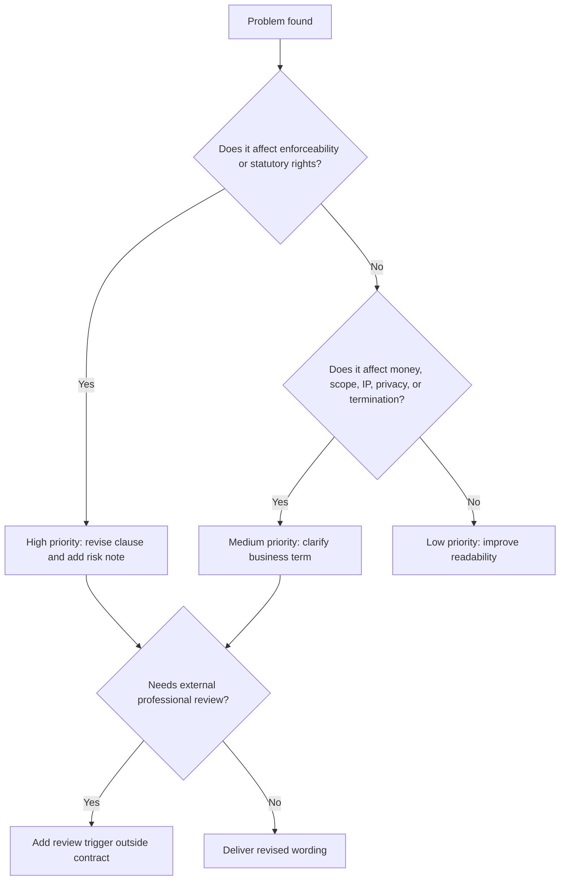

# Troubleshooting guide

Use this guide when a draft becomes inconsistent, overbroad, incomplete, or unsuitable for Israeli use.

## Triage decision tree



## Common drafting failures

### 1. VAT ambiguity

**Symptom:** The draft says "the fee is ₪10,000" and later says "against tax invoice" without stating whether VAT is included.

**Why it matters:** Israeli business parties often dispute whether VAT is included in the stated price.

**Fix:**

- "לסכום יתווסף מע״מ כדין כנגד חשבונית מס כדין."
- "הסכום כולל מע״מ כדין וישולם כנגד מסמך חשבונאי כדין."
- "סוג המסמך החשבונאי ושיעור המע״מ יאומתו מול רואה החשבון של הצדדים לפני חתימה."

### 2. Scope creep

**Symptom:** The provider agrees to "marketing services" without deliverables.

**Fix:** Add deliverables, monthly hours or units, exclusions, acceptance process, change-request procedure, and response-time assumptions.

### 3. Consumer waiver overreach

**Symptom:** The contract says the consumer waives all claims or refunds.

**Fix:** Add a statutory-rights savings clause and a fair cancellation mechanism. Flag professional review if the transaction is distance-sale, home-visit, subscription, or subject to cancellation exceptions.

### 4. Freelancer misclassification

**Symptom:** The draft says "independent contractor" but requires fixed full-time hours, exclusivity, direct management, and customer equipment.

**Fix:** Pause ordinary service drafting. Add an employment-classification warning and request review. If proceeding with commercial drafting, remove employment-style control terms and document business independence only if true.

### 5. IP contradiction

**Symptom:** One clause gives the customer all IP; another allows the provider to reuse all materials.

**Fix:** Split final approved deliverables, pre-existing provider tools and know-how, third-party materials, drafts/rejected concepts, portfolio display right, and open-source components.

### 6. Overbroad confidentiality

**Symptom:** Confidentiality covers all information forever with no exceptions.

**Fix:** Add standard exclusions: public information, already-known information, independently developed information, information received lawfully from a third party, and legally compelled disclosure. Define a duration aligned with sensitivity.

### 7. Privacy missing

**Symptom:** The service provider receives customer lists, support tickets, employee details, or user data, but no privacy clause exists.

**Fix:** Add a privacy schedule covering data categories, purpose, access, security, subprocessors, breach notice, return/deletion, and audit/cooperation.

### 8. Unclear termination

**Symptom:** Either party may terminate immediately for any reason, but payment for work already performed is not addressed.

**Fix:** Specify termination for convenience with notice, immediate termination for severe breach if appropriate, cure period, payment for completed work, return/deletion of confidential information, and surviving clauses.

### 9. One-sided standard terms

**Symptom:** Reusable website terms let the business change price, scope, liability, and cancellation rights at any time without notice.

**Fix:** Add prior notice, material-change rights, cancellation option where appropriate, and statutory-rights savings.

### 10. Wrong language hierarchy

**Symptom:** Hebrew and English versions conflict.

**Fix:**

> In case of contradiction between the Hebrew version and the English version, the [Hebrew/English] version shall prevail, unless mandatory law requires otherwise.

Hebrew:

> במקרה של סתירה בין הנוסח העברי לבין הנוסח האנגלי, יגבר הנוסח [העברי/האנגלי], אלא אם דין קוגנטי מחייב אחרת.

## Severity model

| Severity | Meaning | Action |
|---|---|---|
| High | May affect enforceability, statutory rights, worker classification, regulated activity, privacy-sensitive data, or large liability | Revise and add professional-review note |
| Medium | May create money, scope, IP, termination, or operational dispute | Clarify and offer alternatives |
| Low | Drafting quality or readability issue | Improve language |
| Info | Useful commercial reminder | Add optional note |

## Red flags requiring professional review

- Consumer cancellation exceptions.
- Standard online terms used at scale.
- Personal data at scale, sensitive data, children, health, finance, or biometric data.
- Construction, renovation permits, safety, or professional licensing.
- Real estate, lending, insurance, investment, crypto, medical, or telecom.
- Personal guarantees, liens, pledges, or debt collection.
- Cross-border taxation and withholding.
- Employee/contractor classification ambiguity.
- High-value IP assignment.
- Indemnity for third-party claims.
- Arbitration clause in a consumer context.

## Replacement clause snippets

### Balanced late payment

```text
If an undisputed amount is not paid on time, the provider may give written notice and suspend further services until payment. Late interest may accrue at the rate stated in the agreement, provided it is reasonable and permitted by law.
```

### Hebrew version

```text
אם סכום שאינו שנוי במחלוקת לא שולם במועד, נותן השירותים רשאי למסור הודעה בכתב ולהשהות שירותים נוספים עד לתשלום. ריבית איחורים תחול בשיעור שנקבע בהסכם, ככל שהוא סביר ומותר לפי דין.
```

### Statutory-rights savings

```text
Nothing in this agreement limits rights or remedies that cannot be limited under applicable law.
```

```text
אין בהסכם זה כדי לגרוע מזכויות או סעדים שלא ניתן להתנות עליהם לפי דין.
```

### Authority representation

```text
Each signatory represents that they are authorized to sign this agreement on behalf of the party named above.
```

```text
כל חותם מצהיר כי הוא מוסמך לחתום על הסכם זה בשם הצד המפורט לעיל.
```

## Final troubleshooting checklist

- Read the payment clause and invoice clause together.
- Read the scope and acceptance clauses together.
- Read IP transfer and payment timing together.
- Read termination and consequences of termination together.
- Read liability cap and indemnity together.
- Read confidentiality and privacy together.
- Read language-precedence and governing-law clauses together.
- Confirm every placeholder is intentional.


## Live-source mismatch

Symptom: an official rate, threshold, form number, or endpoint differs from the package examples.

Cause: Israeli tax, invoice-allocation, regulator, and public-data pages may change after publication.

Fix:

1. Treat the official source as controlling for the live value.
2. Replace hardcoded numbers with "at the lawful rate" unless the contract needs a calculation exhibit.
3. Add an outside-the-contract note identifying the source and access date.
4. Re-run the test suite after changing helper defaults.
