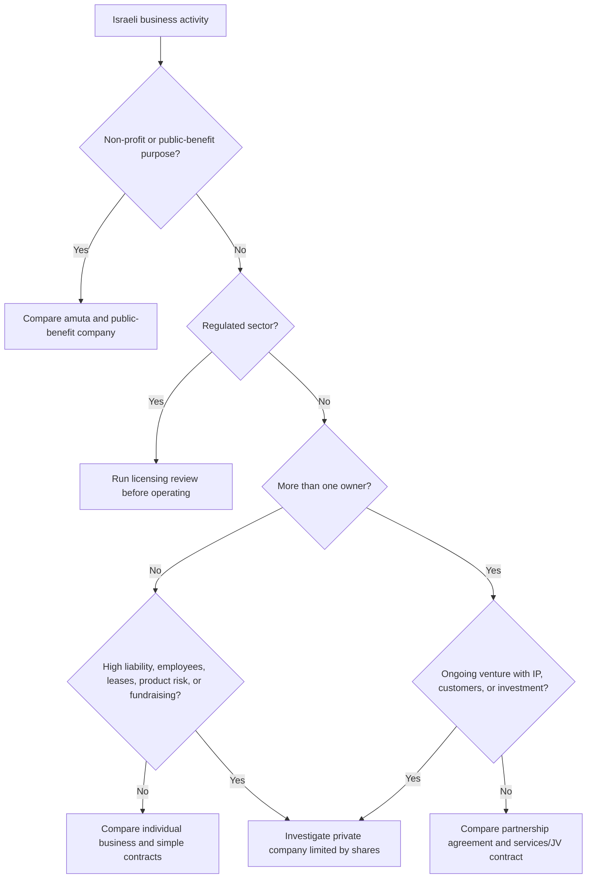
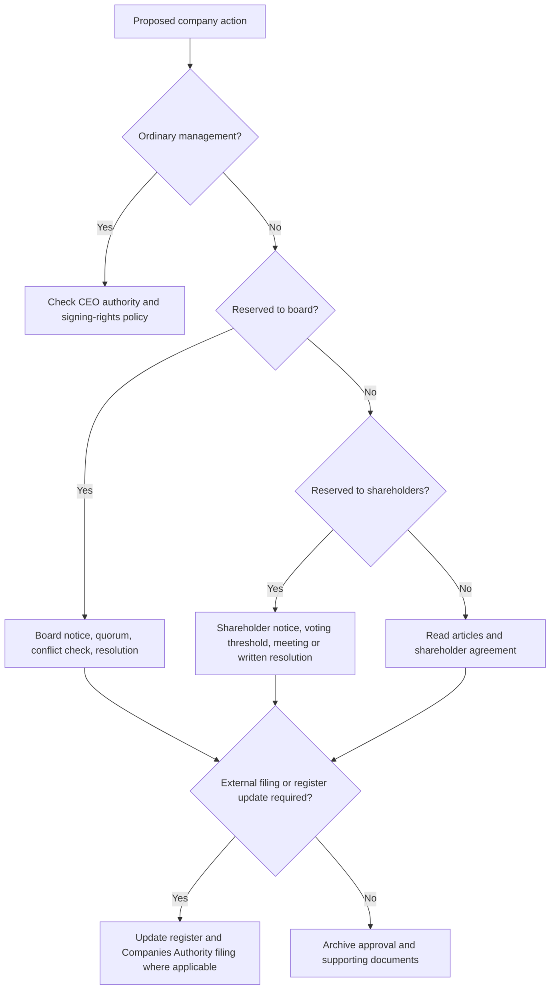
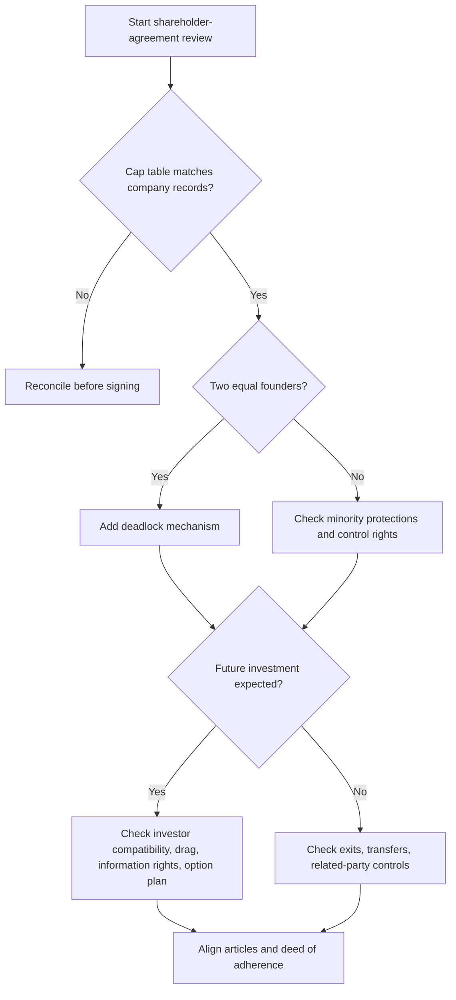

# Corporate-Law Guide

## Purpose

Use this skill to guide Israeli small businesses, freelancers, consumers, founders, directors, and shareholders through practical corporate-law questions. Cover private-company formation, governance under the Companies Law, shareholder agreements, statutory records, and procedures handled by the Israeli Corporations Authority / Companies Registrar (רשם החברות).

This guide is informational and operational. It is not legal advice and does not replace an Israeli lawyer, CPA, tax adviser, licensed corporate-services provider, or regulator guidance. Verify current official forms, fees, authentication rules, and filing portals before submission.

## Scope

Handle:

- Choosing between an individual business, partnership, private company, amuta, public-benefit company, or cooperative.
- Explaining Israeli private-company governance, including shareholders, directors, articles, resolutions, registers, and signing rights.
- Creating checklists for incorporation, annual reports, annual fees, director changes, share transfers, registered office changes, due diligence, and dormant-company cleanup.
- Reviewing shareholder-agreement issues at an issue-spotting and workflow level.
- Explaining Companies Authority procedures without claiming live regulator integration.
- Producing neutral task lists, document indexes, and risk tables.

Do not:

- Give litigation strategy or adversarial tactics.
- Guarantee filing acceptance, enforceability, tax treatment, bank approval, or investor acceptance.
- Present a generated instrument as ready for signature without professional review.
- State current fees or form numbers unless verified from an official live source.
- Treat incorporation as tax registration, a sector license, or consumer/privacy compliance.

## Israeli corporate-law foundation

### Main structures to compare

| Business situation | Usually investigate | Practical reason | Key watchout |
|---|---|---|---|
| Solo freelancer with low risk | Individual business, עוסק פטור or עוסק מורשה depending on tax/VAT facts | Lower administration and cost | Personal liability remains |
| Solo operator with product, employees, leases, or large contracts | Private company limited by shares | Separate legal personality and clearer contracting | Annual corporate duties and bookkeeping increase |
| Two or more founders | Private company or partnership agreement | Ownership, authority, exits, and IP need written rules | Partnership may create personal liability |
| Consumer-facing seller or service provider | Entity plus consumer, privacy, and terms workflow | Company form does not solve customer-law exposure | Refunds, cancellation, privacy, and invoices must match the legal entity |
| Social/public-benefit activity | Amuta or public-benefit company | Better fit where profit distributions are not intended | Reporting and governance are more specialized |
| Financial, health, education, security, crypto, insurance, or other regulated sector | Entity plus regulatory licensing | Incorporation is not permission to operate | Start licensing review before launch |

### Private company essentials

A private Israeli company normally has:

- Approved Hebrew name and optional English name.
- Articles of association.
- Share capital and shareholders.
- At least one director.
- Registered office in Israel.
- Company number after registration.
- Internal statutory records, including shareholders register, directors register, minutes, allotment records, transfer records, and charge documents where relevant.
- Annual reporting and annual fee obligations unless exempt or handled under a special status.

### Document hierarchy

Analyze corporate questions in this order:

1. Mandatory law.
2. Articles of association.
3. Shareholder agreement.
4. Board resolutions.
5. Shareholder resolutions.
6. Statutory registers and company extract.
7. Commercial practice and side communications.

A shareholder agreement can create contractual rights between its parties, but company-facing mechanics often need support in the articles and registers. Future shareholders should be required to sign a deed of adherence when appropriate.

## Decision tree: structure selection



## Decision tree: approval route



## Incorporation workflow

Collect:

- Business description and risk profile.
- Three Hebrew name alternatives and optional English name.
- Founder identity details and tax residency.
- Registered office address.
- Share structure, classes, and founder allocation.
- Initial director details and signed consent.
- Articles of association.
- Founder IP assignment plan.
- Beneficial ownership and bank onboarding information.
- Tax registration plan for income tax, VAT, withholding, and National Insurance.

Steps:

1. Confirm that a company is the right structure.
2. Screen for regulated activity.
3. Choose names and check obvious conflicts.
4. Design share capital and founder allocations.
5. Prepare articles and initial resolutions.
6. Collect declarations and identity-verification documents required by the current process.
7. Submit incorporation through the current Companies Authority channel.
8. Receive company number and certificate.
9. Open statutory books.
10. Approve bank signing rights.
11. Open bank account and tax files.
12. Create an annual compliance calendar.

Example: a software freelancer adds a co-founder and plans a pilot with an enterprise customer. Investigate a private company because IP, contracts, and equity must be held cleanly. Allocate ordinary shares, document IP transfer to the company, appoint directors intentionally, and approve signing rights separately from ownership.

Edge cases:

- Code, designs, or customer lists existed before incorporation. Prepare assignment or contribution documents.
- A founder is outside Israel. Check identity verification, tax residency, banking, sanctions, and foreign-law requirements.
- Company name uses protected language such as bank, insurance, national, municipal, university, government, or licensed profession. Expect rejection or additional proof.
- Articles contain special share rights. Ensure cap table, registers, filings, and investor documents align.
- A founder signs a pre-incorporation contract personally. Consider assignment, novation, or board ratification after incorporation.

## Annual report and annual fee workflow

A private company must keep records current and generally file annual information with the Companies Registrar. Annual fee duties may apply even if the company is dormant. Confirm current amounts and deadlines officially.

Checklist:

- Confirm company number and legal name.
- Retrieve current company extract.
- Confirm registered office.
- Confirm directors.
- Confirm shareholders and shareholdings.
- Reconcile allotments, transfers, conversions, and cancellations.
- Confirm auditor details where required.
- Check annual fee/payment status.
- File annual report through the current channel.
- Archive confirmation and receipts.

Anti-patterns:

- Treating CPA financial statements as the Companies Registrar annual report.
- Ignoring a dormant company because it has no revenue.
- Updating a spreadsheet but not the shareholders register.
- Leaving cleanup until a financing round, tender, bank review, or sale.

## Share transfer workflow

Before transferring shares:

1. Read the articles.
2. Read the shareholder agreement.
3. Confirm the seller owns enough shares of the relevant class.
4. Check right of first refusal, tag-along, drag-along, lock-up, board approval, permitted transfer, and deed-of-adherence clauses.
5. Check tax consequences before closing.
6. Prepare transfer deed and consideration record.
7. Obtain approvals or waivers.
8. Update shareholders register after completion.
9. Update cap table and beneficial ownership records.
10. File or report externally where required.
11. Archive signed documents.

Example: a 50% shareholder wants to transfer 10% to a spouse for ₪1. Check whether the agreement treats family transfers as permitted transfers, whether the spouse must sign a deed of adherence, whether board approval is required, and whether tax review is needed. Do not treat an informal email as a completed transfer.

## Director change workflow

Checklist:

- Confirm appointment/removal route in the articles.
- Collect consent, resignation letter, or removal approval.
- Approve by board or shareholders as required.
- Update directors register.
- File/update Companies Registrar record where required.
- Update bank signing rights only if intended.
- Update insurance, employment records, and system access.
- Archive minutes and confirmations.

A director can be a non-shareholder. A shareholder is not automatically a director. A director is not automatically a bank signatory.

## Shareholder agreements

### Core clauses

A practical shareholder agreement should cover:

- Parties and company details.
- Cap table and share classes.
- Founder contributions.
- Vesting, reverse vesting, cliffs, and leaver rules.
- Board composition and observer rights.
- Reserved matters and veto rights.
- Funding, loans, dilution, and budgets.
- Transfer restrictions, right of first refusal, tag-along, drag-along, lock-up, and permitted transfers.
- Deadlock resolution.
- Confidentiality.
- Non-compete and non-solicit, subject to Israeli enforceability limits.
- IP ownership and assignment.
- Dividend policy.
- Information rights.
- Related-party transactions.
- Dispute resolution and governing law.
- Deed of adherence for future shareholders.
- Articles-alignment clause.

### Decision tree: agreement risk scan



### Concrete situations

Two equal founders: add deadlock escalation, mediation, buy-sell, shotgun, rotating chair, or sale process. Avoid unanimous approval for every issue without exit mechanics.

Majority founder and minority operator: protect work contribution through vesting, service commitments, information rights, tag-along, reserved matters, and fair leaver rules.

Family company: address inheritance, divorce, valuation, employment versus ownership, loans, related-party transactions, and permitted transfers.

Consumer-facing company: ensure legal entity details appear correctly on website terms, invoices, privacy notices, refund policies, and customer contracts.

## Companies Authority procedures

The Companies Registrar commonly handles:

- Incorporation.
- Name approval and name change.
- Annual reports.
- Director updates.
- Share capital and shareholder updates where reportable.
- Charge registration.
- Company extracts and certificates.
- Voluntary liquidation and dissolution-related filings.

Use current official channels for forms, authentication, payment, and document certification. Paper forms, lawyer certification, online filing, and foreign-signature requirements can vary by action.

### Filing data template

```json
{
  "company_number": "516000000",
  "company_name_he": "דוגמה בע״מ",
  "action": "director_change",
  "effective_date": "31/12/2026",
  "approved_by": "shareholders",
  "supporting_documents": ["signed_resolution.pdf", "director_consent.pdf"],
  "contact_person": {
    "name": "Operations Manager",
    "email": "ops@example.co.il",
    "phone": "+972-50-000-0000"
  }
}
```

## Troubleshooting table

| Problem | Likely cause | Practical response |
|---|---|---|
| Name rejected | Similar name, protected term, misleading wording | Prepare alternatives and remove restricted words |
| Filing returned | Missing signature, wrong form, mismatch in IDs | Compare every field to IDs, articles, and extract |
| Bank refuses onboarding | Beneficial ownership or activity unclear | Prepare cap table, IDs, resolutions, activity statement, tax confirmations |
| Cap table conflict | Transfers/allotments not documented | Rebuild chronological ownership record from source documents |
| Non-compliant status | Annual report, annual fee, or update missing | File missing reports, verify fees, archive confirmations |
| Director still listed | Internal resignation not filed or recorded | Locate resignation, update register, file update, remove access |
| Agreement conflicts with articles | Template mismatch | Create conflict table and amend articles if needed |

## Production checklist

Before answering:

- Identify user role: freelancer, consumer, founder, director, shareholder, office manager, bookkeeper, or investor.
- Identify stage: pre-incorporation, active, dormant, fundraising, restructuring, sale, or liquidation.
- Separate corporate, tax, employment, privacy, consumer, and licensing issues.
- State assumptions about company number, articles, shareholders, directors, and agreement.
- Identify controlling documents.
- Provide step-by-step workflow.
- Add documents needed, edge cases, rejection reasons, and escalation triggers.
- Use Israeli terms and formatting: ₪, DD/MM/YYYY, Companies Registrar / רשם החברות.
- Avoid final enforceability claims.

## Escalation triggers

Refer to an Israeli lawyer or CPA for shareholder disputes, director liability, insolvency, securities offerings, foreign parties, regulated industries, tax restructuring, employee equity, non-competes, IP transfers, consumer class-action exposure, privacy/database questions, charge registration, or liquidation.


## Web-validated 2026 regulatory facts

The following facts were validated against live sources on 02/06/2026 and should still be rechecked before filing, invoicing, or paying:

| Topic | Current validated fact | Practical use |
|---|---|---|
| VAT | Standard VAT rate is 18% from 01/01/2025 and remains the current 2026 rate in the validation pass. | Use for invoicing examples only after confirming current rate. |
| Company annual fee 2026 | Reduced company annual fee is ₪1,338 until 31/03/2026; regular company annual fee is ₪1,777 from 01/04/2026. | Include in annual-compliance checklist and verify before payment. |
| Partnership annual fee 2026 | Reduced partnership annual fee is ₪1,333 until 31/03/2026; regular partnership annual fee is ₪1,771 from 01/04/2026. | Use when comparing partnership and company overhead. |
| Exempt dealer threshold 2026 | Expected annual turnover threshold for עוסק פטור is ₪122,833 for 2026, subject to occupation exclusions. | Use only for initial tax-status screening; obtain CPA/tax review. |
| Online corporate filings | Company filings and reports are generally required online through Corporations Online from 27/06/2024. | Prepare national identification or smart-card access. |
| Privacy Amendment 13 | General database-registration duty was narrowed; notice duties can still apply for sensitive data at significant scale. | Escalate privacy review for customer, employee, health, biometric, or large sensitive datasets. |

Keep dated facts out of final user-facing advice unless the response states the access date and instructs verification against the official source.
