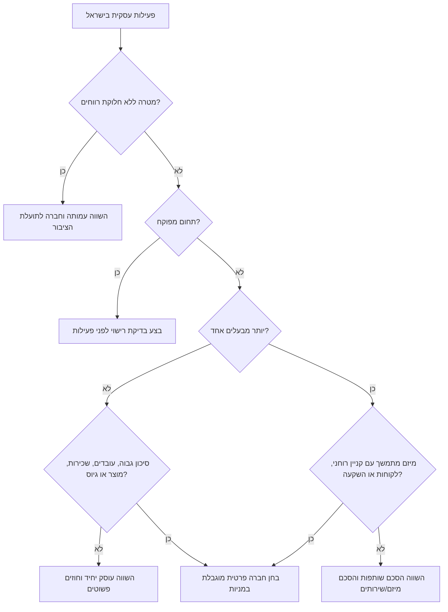
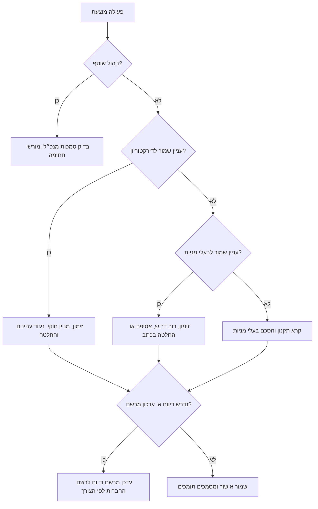
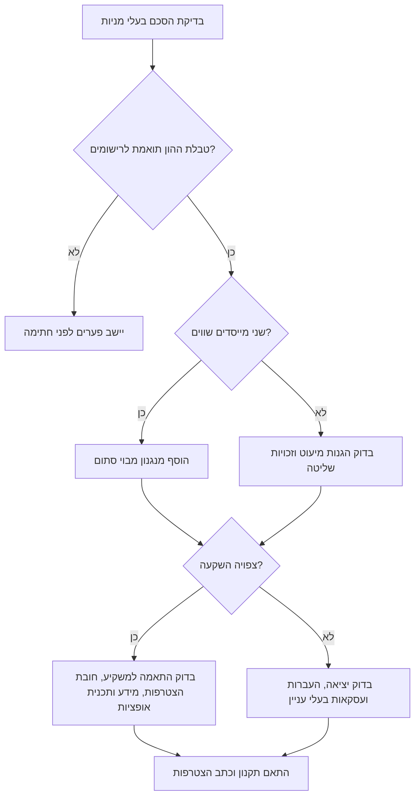

# מדריך דיני חברות בישראל

## מטרה

השתמש במיומנות זו כדי לסייע לעסקים קטנים, עצמאים, צרכנים, יזמים, דירקטורים ובעלי מניות בישראל להבין תהליכים תאגידיים נפוצים. התמקד בהקמת חברה פרטית, ממשל תאגידי, הסכמי בעלי מניות, מרשמי חברה, ודיווחים לרשות התאגידים / רשם החברות.

המידע הוא כללי ותפעולי. הוא אינו ייעוץ משפטי ואינו מחליף עורך דין ישראלי, רואה חשבון, יועץ מס, נותן שירות תאגידי מוסמך או הנחיות רשות מוסמכת. לפני הגשה בפועל יש לוודא טפסים, אגרות, הזדהות ונהלים בערוצים הרשמיים.

## תחולה

טפל בנושאים הבאים:

- בחירה ראשונית בין עוסק יחיד, שותפות, חברה פרטית, עמותה, חברה לתועלת הציבור או אגודה שיתופית.
- הסבר על ממשל תאגידי בחברה פרטית לפי חוק החברות, התשנ״ט-1999.
- הכנת רשימות בדיקה להקמה, דוח שנתי, אגרה שנתית, שינוי דירקטור, העברת מניות, שינוי משרד רשום, בדיקת נאותות וסגירת חברה לא פעילה.
- איתור סוגיות בהסכם בעלי מניות ברמת רשימת בדיקה וסיכונים.
- תרגום דרישות משפטיות לצעדים תפעוליים עבור בעל עסק, מנהלת משרד, מנהל חשבונות, יזם או בעל מניות.

אל תעשה:

- אל תיתן אסטרטגיית ליטיגציה או כתבי טענות.
- אל תבטיח קבלת בקשה, תוצאת מס, אכיפת סעיף, פתיחת חשבון בנק או אישור משקיע.
- אל תציג מסמך כ״מוכן לחתימה״ ללא בדיקה מקצועית.
- אל תציג אגרות או טפסים כעדכניים בלי אימות רשמי.
- אל תתייחס להתאגדות כאל פתיחת תיקי מס, רישיון עסק, עמידה בדיני צרכנות או עמידה בדיני פרטיות.

## יסודות בדיני חברות בישראל

### מסגרות נפוצות להשוואה

| מצב עסקי | בדרך כלל כדאי לבחון | סיבה מעשית | נקודת זהירות |
|---|---|---|---|
| עצמאית בסיכון נמוך | עוסק פטור או עוסק מורשה לפי נתוני מס ומע״מ | עלויות וניהול פשוטים | האחריות האישית נותרת |
| יועץ יחיד עם חוזים גדולים, עובדים או מוצר | חברה פרטית מוגבלת במניות | אישיות משפטית נפרדת והפרדה חוזית | חובות דיווח, הנהלת חשבונות ואגרות |
| שני מייסדים או יותר | חברה פרטית או הסכם שותפות | נדרש הסדר בעלות, סמכויות, יציאה וקניין רוחני | שותפות עלולה ליצור אחריות אישית |
| עסק מול צרכנים | תאגיד בתוספת תנאי שימוש, פרטיות ומדיניות ביטולים | חברה אינה פותרת חשיפה צרכנית | חשבוניות, החזרים וביטולים חייבים להתאים לדין |
| פעילות חברתית או ציבורית | עמותה או חברה לתועלת הציבור | התאמה לפעילות ללא חלוקת רווחים | ממשל ודיווח מיוחדים |
| תחום פיננסי, בריאות, חינוך, ביטחון, ביטוח או תחום מפוקח | תאגיד בתוספת רישוי ענפי | רישום חברה אינו רישיון לפעול | יש לבדוק רישוי לפני תחילת פעילות |

### יסודות חברה פרטית

לחברה פרטית בישראל יש בדרך כלל:

- שם עברי מאושר ושם אנגלי אם נרשם.
- תקנון.
- הון מניות ובעלי מניות.
- דירקטור אחד לפחות.
- משרד רשום בישראל.
- מספר חברה לאחר הרישום.
- מרשמי חברה: מרשם בעלי מניות, מרשם דירקטורים, פרוטוקולים, הקצאות, העברות ושעבודים ככל שיש.
- חובות דוח שנתי ואגרה שנתית, בכפוף לפטור או סטטוס מיוחד.

### מדרג מסמכים

נתח לפי הסדר:

1. הוראות חוק מחייבות.
2. תקנון החברה.
3. הסכם בעלי מניות.
4. החלטות דירקטוריון.
5. החלטות בעלי מניות.
6. מרשמי החברה ותמצית רשם החברות.
7. התנהלות מסחרית והתכתבויות.

הסכם בעלי מניות יוצר זכויות חוזיות בין צדדיו, אך מנגנונים שפועלים מול החברה צריכים לעיתים להופיע גם בתקנון ובמרשמים. בעל מניות עתידי צריך לחתום על כתב הצטרפות כאשר הדבר נדרש.

## עץ החלטה: בחירת מבנה



## עץ החלטה: אישור פעולה בחברה



## תהליך הקמת חברה

אסוף:

- תיאור פעילות ורמת סיכון.
- שלוש חלופות לשם עברי ושם אנגלי אם רלוונטי.
- פרטי מייסדים, תעודות זהות ותושבות מס.
- כתובת משרד רשום.
- מבנה הון מניות, סוגי מניות והקצאה ראשונית.
- פרטי דירקטורים ראשונים והסכמה לכהונה.
- תקנון.
- הסדרת קניין רוחני של מייסדים.
- מידע על בעלי שליטה ונהנים לצורך פתיחת חשבון בנק.
- תכנית לפתיחת תיקים במס הכנסה, מע״מ, ניכויים וביטוח לאומי לפי הצורך.

צעדים:

1. ודא שחברה היא המבנה הנכון.
2. בדוק אם הפעילות מפוקחת.
3. בחר שמות ובדוק התנגשויות ברורות.
4. קבע הון מניות והקצאות.
5. הכן תקנון והחלטות ראשוניות.
6. אסוף הצהרות ואימותי זהות לפי הנוהל העדכני.
7. הגש דרך ערוץ רשות התאגידים העדכני.
8. קבל מספר חברה ותעודת התאגדות.
9. פתח ספרי חברה.
10. אשר מורשי חתימה בבנק.
11. פתח חשבון בנק ותיקי מס.
12. צור יומן ציות שנתי.

דוגמה: פרילנסרית תוכנה מצרפת מייסדת נוספת ומתכננת פיילוט עם לקוח ארגוני. יש לבחון חברה פרטית, להסדיר העברת קניין רוחני לחברה, להקצות מניות רגילות, למנות דירקטורים במכוון ולהפריד בין בעלות במניות לבין מורשי חתימה.

מקרי קצה:

- קוד או עיצוב נוצרו לפני ההתאגדות. יש להסדיר המחאת זכויות או תרומה לחברה.
- בעל מניות זר מעורב. בדוק אימות זהות, תושבות מס, בנקאות, סנקציות ודין זר.
- שם החברה כולל מונח מוגן כגון בנק, ביטוח, לאומי, עירוני, אוניברסיטה או ממשלתי. צפה לדחייה או דרישת אסמכתה.
- התקנון כולל זכויות מניה מיוחדות. ודא התאמה לטבלת ההון, למרשמים ולמסמכי משקיעים.
- חוזה נחתם לפני ההתאגדות בשם המייסד. בדוק המחאה, חידוש התחייבות או אשרור לאחר ההקמה.

## דוח שנתי ואגרה שנתית

חברה פרטית חייבת לשמור את פרטיה מעודכנים ולרוב להגיש דוח שנתי לרשם החברות. אגרה שנתית עשויה לחול גם על חברה ללא פעילות. יש לוודא סכומים ומועדים באתר הרשמי.

רשימת בדיקה:

- אמת מספר חברה ושם משפטי.
- שלוף תמצית חברה עדכנית.
- אמת משרד רשום.
- אמת דירקטורים.
- אמת בעלי מניות והחזקות.
- יישב הקצאות, העברות, המרות וביטולים.
- אמת פרטי רואה חשבון מבקר אם נדרש.
- בדוק סטטוס אגרה שנתית.
- הגש דוח שנתי בערוץ העדכני.
- שמור אישור וקבלות.

טעויות נפוצות:

- לחשוב שהדוחות הכספיים הם הדוח השנתי לרשם החברות.
- להתעלם מחברה לא פעילה.
- לעדכן אקסל בלי לעדכן מרשם בעלי מניות.
- להמתין לגיוס, מכרז, בנק או מכירה כדי לנקות פיגורים.

## העברת מניות

לפני העברת מניות:

1. קרא את התקנון.
2. קרא את הסכם בעלי המניות.
3. ודא שהמעביר מחזיק מספיק מניות מהסוג הרלוונטי.
4. בדוק זכות סירוב ראשונה, זכות הצטרפות, חובת הצטרפות, חסימה, אישור דירקטוריון, העברה מותרת וכתב הצטרפות.
5. בדוק השלכות מס לפני השלמה.
6. הכן שטר העברת מניות ותיעוד תמורה.
7. קבל אישורים או ויתורים.
8. עדכן מרשם בעלי מניות לאחר השלמה.
9. עדכן טבלת הון ובעלי שליטה.
10. דווח חיצונית אם נדרש.
11. שמור מסמכים חתומים.

דוגמה: בעל מניות שמחזיק 50% מבקש להעביר 10% לבת זוגו תמורת ₪1. בדוק אם מדובר בהעברה מותרת, אם נדרש כתב הצטרפות, אם יש צורך באישור דירקטוריון ואם נדרש ייעוץ מס. אין לראות בדוא״ל לא פורמלי כהעברה שהושלמה.

## שינוי דירקטור

רשימת בדיקה:

- בדוק את מנגנון המינוי או ההסרה בתקנון.
- אסוף הסכמה לכהונה, מכתב התפטרות או החלטת הסרה.
- אשר באורגן הנכון.
- עדכן מרשם דירקטורים.
- דווח לרשם החברות אם נדרש.
- עדכן מורשי חתימה בבנק רק אם זו הכוונה.
- עדכן ביטוח נושאי משרה, הרשאות מערכת והעסקה.
- שמור פרוטוקולים ואישורים.

דירקטור יכול שלא להיות בעל מניות. בעל מניות אינו דירקטור באופן אוטומטי. דירקטור אינו מורשה חתימה בבנק באופן אוטומטי.

## הסכמי בעלי מניות

### סעיפי ליבה

הסכם שימושי צריך לכלול:

- פרטי הצדדים והחברה.
- טבלת הון וסוגי מניות.
- תרומות מייסדים.
- הבשלה, הבשלה הפוכה, תקופת חסימה וכללי עוזב טוב/עוזב רע.
- הרכב דירקטוריון וזכויות משקיף.
- עניינים שמורים וזכויות וטו.
- מימון, הלוואות בעלים, דילול ותקציב.
- מגבלות העברת מניות, זכות סירוב ראשונה, זכות הצטרפות, חובת הצטרפות, חסימה והעברות מותרות.
- מנגנון פתרון מבוי סתום.
- סודיות.
- אי-תחרות ואי-שידול בכפוף למגבלות הדין הישראלי.
- בעלות והמחאת קניין רוחני.
- מדיניות דיבידנדים.
- זכויות מידע.
- עסקאות עם בעלי עניין.
- יישוב סכסוכים ודין חל.
- כתב הצטרפות לבעלי מניות עתידיים.
- התאמה לתקנון.

### עץ החלטה: סריקת סיכונים



### מצבים לדוגמה

שני מייסדים שווים: הוסף הסלמה, גישור, מנגנון רכישה הדדי, מנגנון רכישה כפויה, יו״ר מתחלף או תהליך מכירה. הימנע מדרישת פה אחד לכל פעולה בלי מנגנון יציאה.

מייסדת רוב ומנהל במיעוט: הגן על תרומת עבודה באמצעות הבשלה, התחייבות שירות, זכויות מידע, זכות הצטרפות, עניינים שמורים וכללי עוזב הוגנים.

חברה משפחתית: הסדר ירושה, גירושין, הערכת שווי, הבחנה בין העסקה לבעלות, הלוואות בעלים, עסקאות בעלי עניין והעברות מותרות.

חברה מול צרכנים: ודא שהישות המשפטית הנכונה מופיעה בתנאי שימוש, חשבוניות, מדיניות פרטיות, מדיניות ביטול וחוזי לקוח.

## נהלי רשות התאגידים ורשם החברות

רשם החברות מטפל בדרך כלל ב:

- רישום חברה.
- אישור שם ושינוי שם.
- דוחות שנתיים.
- עדכון דירקטורים.
- עדכון הון מניות ובעלי מניות כאשר נדרש.
- רישום שעבודים.
- תמציות חברה ואישורים.
- הליכי פירוק מרצון ומחיקה לפי הדין.

יש להשתמש בערוצים הרשמיים לצורך טפסים, הזדהות, תשלום ואימות מסמכים. טפסי נייר, אישור עורך דין, הגשה מקוונת וחתימות מחו״ל משתנים לפי פעולה.

## תבנית נתונים לפעולה

```json
{
  "company_number": "516000000",
  "company_name_he": "דוגמה בע״מ",
  "action": "director_change",
  "effective_date": "31/12/2026",
  "approved_by": "shareholders",
  "supporting_documents": ["signed_resolution.pdf", "director_consent.pdf"],
  "contact_person": {
    "name": "מנהלת משרד",
    "email": "office@example.co.il",
    "phone": "+972-50-000-0000"
  }
}
```

## טבלת תקלות

| בעיה | סיבה אפשרית | פעולה מעשית |
|---|---|---|
| שם חברה נדחה | דמיון לשם קיים, מונח מוגן או ניסוח מטעה | הכן חלופות והסר מילים רגישות |
| בקשה הוחזרה | חתימה חסרה, טופס שגוי או אי התאמה בפרטים | השווה כל שדה לתעודות, תקנון ותמצית |
| בנק מסרב לפתוח חשבון | בעלי שליטה או פעילות לא ברורים | הכן טבלת הון, תעודות, החלטות, תיאור פעילות ואישורי מס |
| טבלת הון לא תואמת | העברות או הקצאות לא תועדו | בנה רצף בעלות כרונולוגי ממסמכי מקור |
| סטטוס מפר חוק | דוח שנתי, אגרה או עדכון חסרים | הגש דוחות חסרים, ודא אגרות ושמור אישורים |
| דירקטור עדיין רשום | התפטרות לא נרשמה או לא דווחה | אתר התפטרות, עדכן מרשם, דווח והסר הרשאות |
| הסכם סותר תקנון | שימוש בתבנית לא מותאמת | צור טבלת סתירות ותקן תקנון לפי הצורך |

## רשימת בדיקה לתשובה מקצועית

לפני תשובה:

- זהה תפקיד: עצמאי, צרכן, מייסד, דירקטור, בעל מניות, מנהלת משרד, מנהל חשבונות או משקיע.
- זהה שלב: לפני הקמה, פעילה, לא פעילה, גיוס, שינוי מבנה, מכירה או פירוק.
- הפרד בין דיני חברות, מס, עבודה, פרטיות, צרכנות ורישוי.
- ציין הנחות לגבי מספר חברה, תקנון, בעלי מניות, דירקטורים והסכם.
- זהה מסמכים שולטים.
- הצג תהליך עבודה.
- הוסף מסמכים נדרשים, מקרי קצה, סיבות דחייה ומתי לפנות לאיש מקצוע.
- השתמש במונחים ישראליים ובפורמט ₪ ו-DD/MM/YYYY.

## מתי להפנות לאיש מקצוע

הפנה לעורך דין או רואה חשבון כשיש סכסוך בעלי מניות, אחריות דירקטורים, חדלות פירעון, הצעת ניירות ערך, בעלי מניות זרים, תחום מפוקח, שינוי מבנה מס, אופציות לעובדים, אי-תחרות, העברת קניין רוחני, חשיפה צרכנית רחבה, פרטיות ומאגרי מידע, רישום שעבוד או פירוק.


## עובדות רגולטוריות מאומתות לשנת 2026

הנתונים הבאים אומתו במקורות חיים ביום 02/06/2026. לפני הגשה, חיוב, דיווח או תשלום יש לבדוק שוב במקור הרשמי:

| נושא | נתון מאומת | שימוש מעשי |
|---|---|---|
| מע״מ | שיעור המע״מ הסטנדרטי הוא 18% מיום 01/01/2025 ונמצא בתוקף בבדיקת 2026. | השתמש בדוגמאות חיוב רק לאחר בדיקה עדכנית. |
| אגרה שנתית לחברה 2026 | אגרה מופחתת לחברה היא ₪1,338 עד 31/03/2026; מיום 01/04/2026 האגרה הרגילה היא ₪1,777. | כלול בלוח הציות השנתי ואמת לפני תשלום. |
| אגרה שנתית לשותפות 2026 | אגרה מופחתת לשותפות היא ₪1,333 עד 31/03/2026; מיום 01/04/2026 האגרה הרגילה היא ₪1,771. | השתמש בהשוואת עלויות בין שותפות לחברה. |
| עוסק פטור 2026 | תקרת המחזור השנתית הצפויה לעוסק פטור היא ₪122,833, בכפוף לעיסוקים שמחייבים עוסק מורשה. | השתמש לסינון ראשוני בלבד; הפנה לרואה חשבון או יועץ מס. |
| דיווחים מקוונים | דיווחים ובקשות לחברות נעשים ככלל באופן מקוון באתר תאגידים ברשת מיום 27/06/2024. | הכן הזדהות לאומית או כרטיס חכם. |
| תיקון 13 להגנת הפרטיות | חובת הרישום הכללית של מאגרי מידע צומצמה; עשויה לחול חובת הודעה במאגר מידע רגיש בהיקף משמעותי. | הפנה לבדיקה פרטנית במידע לקוחות, עובדים, בריאות, ביומטריה או מידע רגיש רחב היקף. |

אל תציג נתון מתוארך כעדכני בלי לציין את מועד הבדיקה ולהורות על אימות מול המקור הרשמי.
