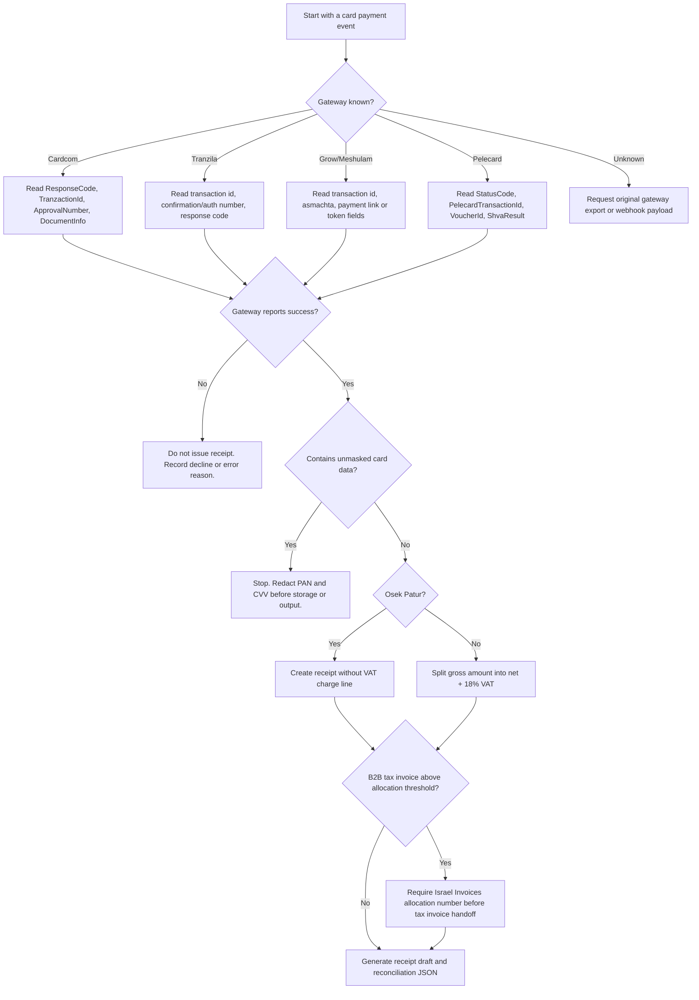

# Credit-Card Receipt Generator

## Purpose

Generate receipt drafts and reconciliation records from real Israeli credit-card gateway data. Accept Cardcom, Tranzila, Grow/Meshulam, or Pelecard payloads, normalize payment fields, calculate Israeli VAT presentation, and produce Markdown, HTML, or JSON output suitable for bookkeeping review.

Use this skill for legitimate transactions only. A generated receipt is not proof of payment unless it is backed by a gateway transaction ID, approval reference, settlement evidence, and the business accounting system. For tax invoices, verify the required Israel Tax Authority allocation number when the transaction crosses the current B2B threshold.

## Current Israeli defaults

- Currency: ILS / ₪.
- Default VAT rate: 18% for standard VAT-chargeable Israeli transactions from 01-01-2025 onward.
- Osek Patur ceiling for 2026: ₪122,833 annual turnover.
- Israel Invoices allocation threshold: ₪10,000 before VAT from 01-01-2026, then ₪5,000 before VAT from 01-06-2026.
- Receipt date format in Israeli customer output: DD-MM-YYYY.

## Decision tree



## Concrete examples

### Example 1: Create a receipt from a Cardcom result

```bash
python scripts/credit_card_receipt_generator_cli.py from-json cardcom-result.json \
  --gateway cardcom \
  --business-name "Kinneret Studio" \
  --business-tax-id 515123453 \
  --format markdown \
  --output receipt.md
```

Input fields can include `ResponseCode`, `TranzactionId`, `ApprovalNumber`, `DocumentNumber`, `DocumentUrl`, `Amount`, `Last4`, and `CardBrand`. The client rejects raw card numbers that pass a Luhn check.

### Example 2: Create an exempt dealer receipt

```bash
python scripts/credit_card_receipt_generator_cli.py sample --gateway grow --exempt-dealer
```

Use this mode for an Osek Patur receipt. Do not display VAT as charged. Keep the gross amount as the receipt amount and include the business tax ID.

### Example 3: Produce bookkeeping JSON

```bash
python scripts/credit_card_receipt_generator_cli.py from-json pelecard.json \
  --gateway pelecard \
  --business-name "North Clinic" \
  --business-tax-id 012345674 \
  --format json \
  --output receipt.json
```

Store JSON output next to the gateway export. Keep the gateway payload hash for reconciliation and audit trail matching.

### Example 4: Show a provider endpoint reference

```bash
python scripts/credit_card_receipt_generator_cli.py endpoint tranzila payment_request
```

Use endpoint references for integration planning only. Send live requests only from a secured backend with merchant credentials.

## Output policy

Include these fields in each receipt draft:

| Field | Requirement |
|---|---|
| Business name | Required |
| Business tax ID | Required, 9 digits |
| Receipt number | Required; use an accounting-system number when available |
| Gateway | Required |
| Transaction ID | Required |
| Approval/reference number | Required when the gateway supplies it |
| Payment date | Required, DD-MM-YYYY for display |
| Amount | Required, ₪ with two decimals |
| Card display | Masked only, for example `****1234` |
| VAT breakdown | Standard VAT line or exempt-dealer statement |
| Source hash | Recommended for reconciliation |

## Implementation notes

- Treat gateway success status as necessary but not sufficient. Match the amount, currency, transaction ID, and settlement report before final bookkeeping closure.
- Keep gateway credentials out of generated files.
- Store only masked card data or gateway tokens. Never store CVV.
- Generate customer-facing receipts in Hebrew or English according to the business workflow.
- Use the gateway document URL only when the provider issued the official accounting document.
- Add an Israel Invoices allocation number to tax invoice handoff records when required by the threshold.

## Troubleshooting

| Symptom | Likely cause | Action |
|---|---|---|
| Receipt rejected by validation | Missing transaction ID or business tax ID | Re-export the gateway event and add business details |
| VAT amount looks off by one agora | Decimal rounding issue | Calculate from gross amount with `Decimal` and round to 0.01 |
| Customer asks for invoice | Receipt is not always a tax invoice | Use certified accounting software or provider document generation |
| Raw card number detected | Unsafe payload export | Redact PAN/CVV and re-run generation |
| Allocation number missing | B2B tax invoice above threshold | Request allocation through the Tax Authority flow or accounting system |
| Gateway success but no settlement | Authorization not captured or pending settlement | Check settlement/broadcast report before marking paid |

## Anti-patterns

- Do not create receipts for payments that did not occur.
- Do not edit amounts, dates, approval numbers, or transaction IDs to match a desired story.
- Do not display a raw PAN, CVV, magnetic stripe data, or full token in output.
- Do not label a draft as an official tax invoice unless the accounting system or gateway issued it.
- Do not split one B2B transaction into smaller documents to avoid an allocation-number threshold.
- Do not treat an HTTP 200 response as payment success without checking the gateway response code.
- Do not use screenshot-only evidence when a gateway export is available.

## Handoff checklist

1. Validate gateway success and transaction ID.
2. Verify amount and currency against settlement or payment report.
3. Confirm business tax ID and customer name.
4. Select VAT mode: standard VAT or Osek Patur.
5. Check allocation-number threshold for B2B tax invoices.
6. Generate receipt draft.
7. Save JSON and source hash for audit trail.
8. Send the customer only the final approved document.
