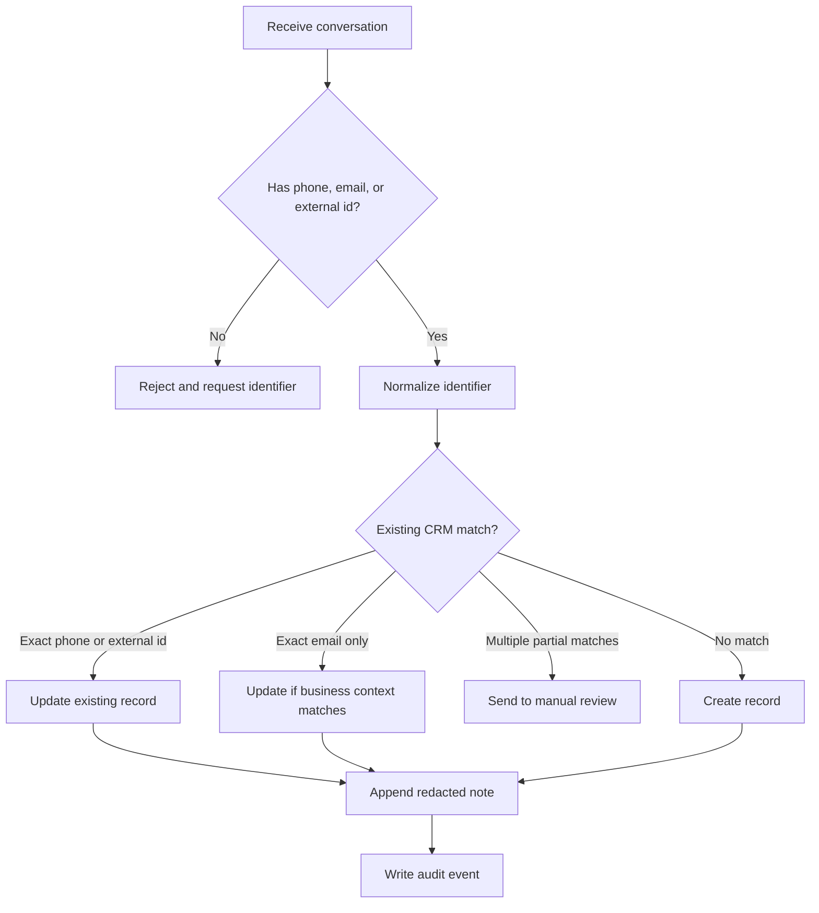
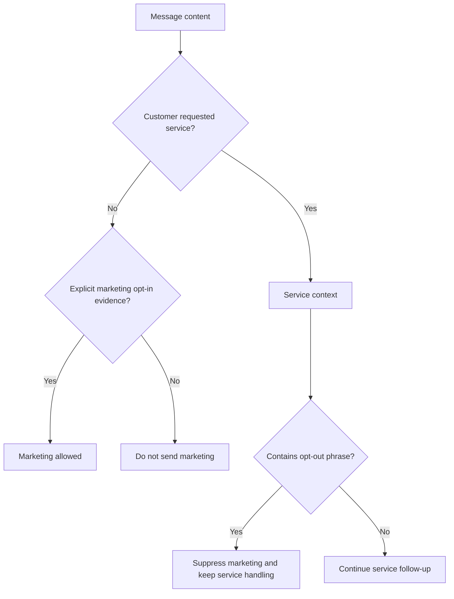

# CRM Integration Agent

Use this skill to sync WhatsApp, email, and SMS conversations into Monday, HubSpot, or Salesforce for Israeli small businesses, freelancers, and consumer-support teams. Treat the CRM as a customer-service record, not as an unrestricted message archive.

## Outcomes

- Create or update a CRM contact or lead from a conversation thread.
- Normalize Israeli phone numbers to E.164 format.
- Preserve service context such as quote requests, invoices, appointments, warranties, complaints, and follow-up tasks.
- Record marketing consent only when explicit evidence exists.
- Redact unnecessary sensitive data before sending notes into CRM.
- Produce an audit trail for retries, troubleshooting, and privacy review.

## Source channels

| Channel | Common source | Stable identifier | Notes |
|---|---|---|---|
| WhatsApp | WhatsApp Business export, gateway webhook, shared inbox | `source_thread_id` and `source_message_id` | Store attachment metadata. Avoid storing private images unless required for the service case. |
| Email | Gmail, Microsoft 365, helpdesk inbox | message id or thread id | Keep subject, sender, sent time, and summarized body. |
| SMS | Provider webhook or CSV export | provider message id | Treat opt-out words such as `הסר` and `STOP` as immediate suppression signals. |

## Destination systems

| CRM | Best fit | Default object |
|---|---|---|
| Monday | Small teams managing boards and service queues | item |
| HubSpot | Sales and service pipeline with email/marketing separation | contact |
| Salesforce | Formal lead management and custom compliance fields | lead |

## Data model

Minimum thread input:

```json
{
  "source_channel": "whatsapp",
  "source_thread_id": "wa-1001",
  "subject": "בקשה להצעת מחיר",
  "contact": {
    "full_name": "דנה כהן",
    "phone": "050-123-4567",
    "company": "כהן עיצוב"
  },
  "messages": [
    {
      "id": "wa-1001-1",
      "sent_at": "18/02/2026 09:44:00",
      "direction": "inbound",
      "body": "אפשר לקבל הצעת מחיר עד ₪2,500?"
    }
  ],
  "consent": {
    "marketing_opt_in": false,
    "evidence": "פנייה יזומה של לקוחה"
  },
  "business_purpose": "sales"
}
```

Use DD/MM/YYYY timestamps for localized manual files. Use ISO 8601 when receiving webhook timestamps.

## Decision tree: choose write action



## Decision tree: service or marketing



## Field mapping

### Common normalized fields

| Field | Rule |
|---|---|
| `full_name` | Trim whitespace. Keep Hebrew spelling as written. |
| `phone` | Convert `050-123-4567` to `+972501234567`. |
| `email` | Lowercase and trim. |
| `business_purpose` | Classify as `sales`, `support`, `appointment`, `admin`, or `service`. |
| `consent.marketing_opt_in` | Set to true only with explicit evidence. |
| `message.body` | Redact ID numbers, payment-card numbers, and verification codes. |

### Monday

- Use `create_item` for new board items.
- Store contact details in phone and email columns.
- Store the last redacted message in a text column.
- Store `source_thread_id` for idempotency.

### HubSpot

- Use contacts for consumer and small-business contacts.
- Store custom properties such as `crm_source_channel`, `crm_source_thread_id`, and `crm_marketing_opt_in`.
- Keep marketing subscription status separate from service notes.

### Salesforce

- Use Lead for new prospects and Contact for known customers when the org model supports it.
- Store custom fields such as `Source_Channel__c`, `Source_Thread_ID__c`, and `Marketing_Opt_In__c`.
- Require a production `base_url` such as `https://example.my.salesforce.com`.

## Concrete examples

### Freelancer receiving a WhatsApp quote request

Input phrase: `אפשר לקבל הצעת מחיר עד ₪2,500?`

Action:

1. Classify as `sales`.
2. Normalize phone.
3. Create or update CRM record.
4. Add a note with the redacted conversation summary.
5. Add a task for follow-up within business hours.

### Clinic receiving an SMS appointment request

Input phrase: `אפשר לקבוע תור ל-21/02/2026?`

Action:

1. Classify as `appointment`.
2. Avoid marketing status changes.
3. Add appointment request note.
4. Route to scheduling owner.

### Retailer receiving an email complaint

Input phrase: `המוצר תקול ולא הגיע בזמן`

Action:

1. Classify as `support`.
2. Add warranty or delivery case note.
3. Avoid sending promotional follow-up.
4. Keep delivery documents only when required for the complaint.

## Edge cases

| Case | Handling |
|---|---|
| Phone exists and email belongs to a different person | Do not merge automatically. Send to manual review. |
| Same phone used by family members | Keep one household record only when the business process supports it. Otherwise create separate records with external ids. |
| Customer writes `הסר` during a service thread | Continue service handling. Suppress marketing. |
| Message contains Israeli ID number | Redact before CRM note. Store full value only in a controlled system when legally required. |
| Customer sends payment-card details | Redact immediately. Instruct staff to use a compliant payment page. |
| Attachment contains medical, legal, or financial data | Store metadata and link to approved storage. Avoid copying the file into CRM by default. |
| Duplicate webhook delivery | Use `source_channel`, `source_thread_id`, `source_message_id`, and provider as idempotency key. |
| Provider rate limit | Retry with exponential backoff and keep a pending audit event. |

## Anti-patterns

- Do not sync entire inboxes without filtering by business purpose.
- Do not treat a service conversation as marketing consent.
- Do not store private images in CRM unless required for the case.
- Do not use name-only matching for automatic merges.
- Do not overwrite existing CRM fields with blank values from message exports.
- Do not keep verification codes, payment-card numbers, or Israeli ID numbers in CRM notes.
- VAT is not calculated by this skill. When showing service examples, use the 18% Israeli VAT rate from 01/01/2025 only as current context and verify accounting output in the accounting system.
- Do not run production sync before dry-run review.

## Troubleshooting summary

| Symptom | Likely cause | Fix |
|---|---|---|
| `Contact requires phone, email, or external_id` | Missing identifier | Add phone, email, or a source-system customer id. |
| `Marketing action requires explicit opt-in` | Missing consent evidence | Add clear evidence or run as service context only. |
| Salesforce base URL error | Missing instance URL | Set `SALESFORCE_BASE_URL` or pass `--base-url`. |
| Duplicate CRM contacts | Weak matching rule | Prefer external id or normalized phone. Run migration dedupe. |
| Hebrew appears escaped | JSON output not using UTF-8 settings | Use `json.dumps(..., ensure_ascii=False, indent=2)`. |
| Provider 429 | Rate limit | Retry later and batch smaller chunks. |

## Production checklist

- Confirm the lawful purpose for storing each conversation category.
- Map source identifiers to CRM fields before the first live run.
- Create custom CRM fields for channel, source thread id, consent status, and consent evidence.
- Run sandbox dry-runs on at least 20 representative scenarios.
- Review duplicate contacts manually before enabling automatic merge.
- Verify opt-out handling for `הסר`, `בטל`, `STOP`, and `unsubscribe`.
- Configure token storage through environment variables or a secrets manager.
- Enable audit JSONL output for every production run.
- Define retention rules for attachments and sensitive notes.
- Test provider rate limits and retry behavior.
- Document owner handoff for unresolved conflicts.

## CLI commands

```bash
crm-integration-agent normalize-phone "050-123-4567"
crm-integration-agent dry-run --provider hubspot --input thread.json --env sandbox
crm-integration-agent sync --provider hubspot --input thread.json --env production --live --audit-log audit.jsonl
crm-integration-agent classify "אפשר לקבל הצעת מחיר?"
```

## Python usage

```python
from crm_integration_agent import CRMIntegrationClient, load_thread_file, result_to_dict

thread = load_thread_file("thread.json")
client = CRMIntegrationClient.from_env("hubspot", environment="sandbox")
result = client.sync_thread(thread)
print(result_to_dict(result))
```

## Acceptance criteria

A production-ready run must produce a CRM object, a redacted note, a deterministic contact key, and an audit event for each source message. Failed writes must keep enough context for retry without exposing unnecessary personal data.
