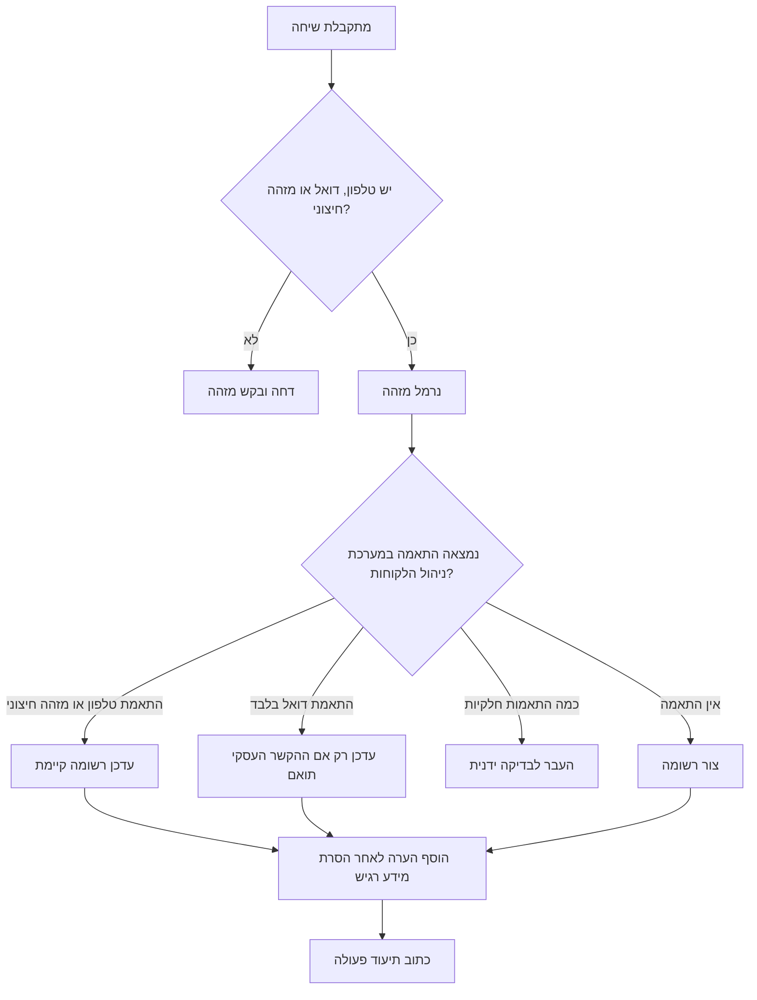
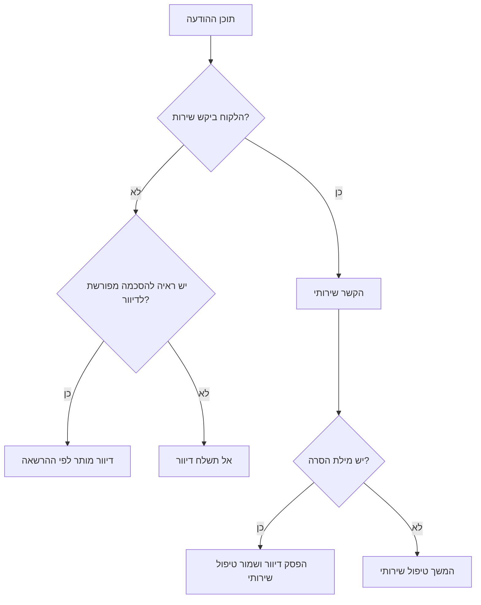

# סוכן חיבור למערכת ניהול לקוחות

השתמש במיומנות זו כדי להעביר שיחות וואטסאפ, דוא"ל ומסרונים אל Monday, HubSpot או Salesforce עבור עסקים קטנים, עצמאים, נותני שירות ועסקים המטפלים בפניות צרכנים בישראל. התייחס למערכת ניהול הלקוחות כרישום שירותי ממוקד, לא כארכיון בלתי מוגבל של כל ההודעות.

## תוצרים

- צור או עדכן רשומת לקוח או מתעניין מתוך שרשור שיחה.
- המר מספרי טלפון ישראליים למבנה בינלאומי תקין.
- שמור הקשר שירותי כגון הצעת מחיר, חשבונית מס, קבלה, תיאום פגישה, אחריות, תלונה או משימת המשך.
- תעד הסכמה לדיוור שיווקי רק כאשר קיימת ראיה מפורשת.
- הסר מידע רגיש שאינו נחוץ לפני כתיבת הערה במערכת ניהול הלקוחות.
- צור תיעוד פעולות לצורך בקרה, טיפול בתקלות ובדיקת פרטיות.

## ערוצי מקור

| ערוץ | מקור נפוץ | מזהה יציב | הערות |
|---|---|---|---|
| וואטסאפ | יצוא מוואטסאפ עסקי, שער הודעות, תיבת שירות משותפת | `source_thread_id` ו-`source_message_id` | שמור מטא-נתונים של קבצים מצורפים. אל תשמור תמונות פרטיות אלא אם הן דרושות לטיפול בפנייה. |
| דוא"ל | Gmail, Microsoft 365, תיבת שירות | מזהה הודעה או מזהה שרשור | שמור נושא, שולח, מועד שליחה וסיכום גוף ההודעה. |
| מסרון | שער מסרונים או קובץ יצוא | מזהה הודעה מספק השירות | התייחס למילים כגון `הסר`, `בטל` ו-`STOP` כסימן מיידי להפסקת דיוור שיווקי. |

## מערכות יעד

| מערכת | שימוש מתאים | רשומת ברירת מחדל |
|---|---|---|
| Monday | צוותים קטנים המנהלים לוחות עבודה ותורי טיפול | פריט |
| HubSpot | מכירות ושירות עם הפרדה בין שירות לדיוור | איש קשר |
| Salesforce | ניהול מתעניינים ותהליכי ציות עם שדות מותאמים | מתעניין |

## מבנה נתונים

קובץ קלט מינימלי:

```json
{
  "source_channel": "whatsapp",
  "source_thread_id": "wa-1001",
  "subject": "בקשה להצעת מחיר",
  "contact": {
    "full_name": "דנה כהן",
    "phone": "050-123-4567",
    "company": "כהן עיצוב"
  },
  "messages": [
    {
      "id": "wa-1001-1",
      "sent_at": "18/02/2026 09:44:00",
      "direction": "inbound",
      "body": "אפשר לקבל הצעת מחיר עד ₪2,500?"
    }
  ],
  "consent": {
    "marketing_opt_in": false,
    "evidence": "פנייה יזומה של לקוחה"
  },
  "business_purpose": "sales"
}
```

השתמש בתאריכים בפורמט DD/MM/YYYY בקבצים ידניים. השתמש ב-ISO 8601 כאשר השעה מתקבלת ממערכת מקור.

## עץ החלטה: בחירת פעולת כתיבה



## עץ החלטה: שירות או דיוור שיווקי



## מיפוי שדות

| שדה | כלל |
|---|---|
| `full_name` | הסר רווחים מיותרים. שמור את האיות העברי כפי שנמסר. |
| `phone` | המר `050-123-4567` ל-`+972501234567`. |
| `email` | המר לאותיות קטנות והסר רווחים. |
| `business_purpose` | סווג ל-`sales`, `support`, `appointment`, `admin` או `service`. |
| `consent.marketing_opt_in` | סמן אמת רק כאשר קיימת ראיה מפורשת. |
| `message.body` | הסר מספרי תעודת זהות, מספרי כרטיסי תשלום וקודי אימות. |

## דוגמאות עסקיות

### עצמאי שמקבל בקשת הצעת מחיר בוואטסאפ

הודעה: `אפשר לקבל הצעת מחיר עד ₪2,500?`

פעולה:

1. סווג כבקשת מכירה.
2. נרמל מספר טלפון.
3. צור או עדכן רשומה במערכת ניהול הלקוחות.
4. הוסף הערת שיחה לאחר הסרת מידע רגיש.
5. צור משימת מעקב בשעות פעילות.

### קליניקה שמקבלת בקשת תור במסרון

הודעה: `אפשר לקבוע תור ל-21/02/2026?`

פעולה:

1. סווג כתיאום פגישה.
2. אל תשנה סטטוס דיוור שיווקי.
3. הוסף הערת בקשת תור.
4. העבר לבעל התפקיד האחראי על היומן.

### חנות שמקבלת תלונה בדוא"ל

הודעה: `המוצר תקול ולא הגיע בזמן`

פעולה:

1. סווג כתמיכה.
2. הוסף הערת אחריות או משלוח.
3. אל תשלח הודעת קידום מכירות בעקבות התלונה.
4. שמור מסמכי משלוח רק אם הם דרושים לטיפול.

## מקרי קצה

| מצב | טיפול |
|---|---|
| טלפון קיים והדוא"ל שייך לאדם אחר | אל תמזג אוטומטית. העבר לבדיקה ידנית. |
| אותו טלפון משמש כמה בני משפחה | השתמש ברשומת בית אב רק אם תהליך העסק תומך בכך. אחרת צור רשומות נפרדות עם מזהה חיצוני. |
| לקוח כותב `הסר` בתוך פנייה שירותית | המשך טיפול שירותי. הפסק דיוור שיווקי. |
| הודעה כוללת מספר תעודת זהות | הסר לפני כתיבה למערכת ניהול הלקוחות. שמור ערך מלא רק במערכת מאושרת כאשר קיימת חובה עסקית או חוקית. |
| לקוח שולח פרטי כרטיס תשלום | הסר מיד. הפנה את הצוות לעמוד תשלום מאובטח. |
| קובץ מצורף מכיל מידע רפואי, משפטי או פיננסי | שמור מטא-נתונים וקישור לאחסון מאושר. אל תעתיק את הקובץ למערכת ניהול הלקוחות כברירת מחדל. |
| התקבלה אותה הודעה פעמיים | השתמש במזהה ערוץ, מזהה שרשור, מזהה הודעה וספק יעד כמפתח מניעת כפילות. |
| ספק היעד מגביל קצב | המתן, הקטן אצוות ושמור אירוע ממתין לתיעוד. |

## פעולות שגויות שיש להימנע מהן

- אל תעביר תיבות דואר שלמות ללא סינון לפי מטרה עסקית.
- אל תתייחס לשיחת שירות כהסכמה לדיוור שיווקי.
- אל תשמור תמונות פרטיות במערכת ניהול הלקוחות אלא אם הן דרושות לטיפול.
- אל תמזג רשומות לפי שם בלבד.
- אל תדרוס שדות קיימים בערכים ריקים מקובצי יצוא.
- אל תשמור קודי אימות, מספרי כרטיסי תשלום או מספרי תעודת זהות בהערות.
- אל תריץ כתיבה בסביבת ייצור לפני בדיקת הרצה יבשה.

## תקלות נפוצות

| סימן | סיבה אפשרית | פתרון |
|---|---|---|
| `Contact requires phone, email, or external_id` | חסר מזהה | הוסף טלפון, דוא"ל או מזהה לקוח ממערכת המקור. |
| `Marketing action requires explicit opt-in` | חסרה ראיה להסכמה | הוסף ראיה ברורה או הרץ בהקשר שירותי בלבד. |
| שגיאת כתובת Salesforce | חסרה כתובת מופע | הגדר `SALESFORCE_BASE_URL` או העבר `--base-url`. |
| נוצרים כפולים | כלל התאמה חלש | העדף מזהה חיצוני או טלפון מנורמל. בצע ניקוי לפני מעבר. |
| עברית מוצגת כקודי Unicode | פלט JSON אינו מוגדר לעברית | השתמש ב-`json.dumps(..., ensure_ascii=False, indent=2)`. |
| ספק מחזיר 429 | הגבלת קצב | המתן ונסה שוב באצוות קטנות יותר. |

## רשימת בדיקה לפני ייצור

- אשר מטרה חוקית ועסקית לכל סוג שיחה.
- מפה מזהי מקור לשדות במערכת ניהול הלקוחות לפני הרצה חיה.
- צור שדות ייעודיים לערוץ, מזהה שרשור, סטטוס הסכמה וראיית הסכמה.
- הרץ בדיקת סביבת ניסוי על לפחות 20 תרחישים מייצגים.
- בדוק כפילויות ידנית לפני הפעלת מיזוג אוטומטי.
- ודא טיפול ב-`הסר`, `בטל`, `STOP` ו-`unsubscribe`.
- שמור אסימוני גישה במשתני סביבה או במנהל סודות.
- הפעל תיעוד פעולות בכל הרצת ייצור.
- קבע כללי שמירה ומחיקה לקבצים מצורפים ולהערות רגישות.
- בדוק הגבלות קצב והתנהגות ניסיון חוזר.
- הגדר בעל תפקיד לטיפול בהתאמות לא ודאיות.

## פקודות

```bash
crm-integration-agent normalize-phone "050-123-4567"
crm-integration-agent dry-run --provider hubspot --input thread.json --env sandbox
crm-integration-agent sync --provider hubspot --input thread.json --env production --live --audit-log audit.jsonl
crm-integration-agent classify "אפשר לקבל הצעת מחיר?"
```

## שימוש בפייתון

```python
from crm_integration_agent import CRMIntegrationClient, load_thread_file, result_to_dict

thread = load_thread_file("thread.json")
client = CRMIntegrationClient.from_env("hubspot", environment="sandbox")
result = client.sync_thread(thread)
print(result_to_dict(result))
```

## תנאי קבלה

הרצת ייצור תקינה חייבת ליצור רשומת יעד, הערה לאחר הסרת מידע רגיש, מפתח לקוח עקבי ואירוע תיעוד לכל הודעת מקור. כשל כתיבה חייב לשמור מספיק מידע לניסיון חוזר בלי לחשוף מידע אישי שאינו נחוץ.
