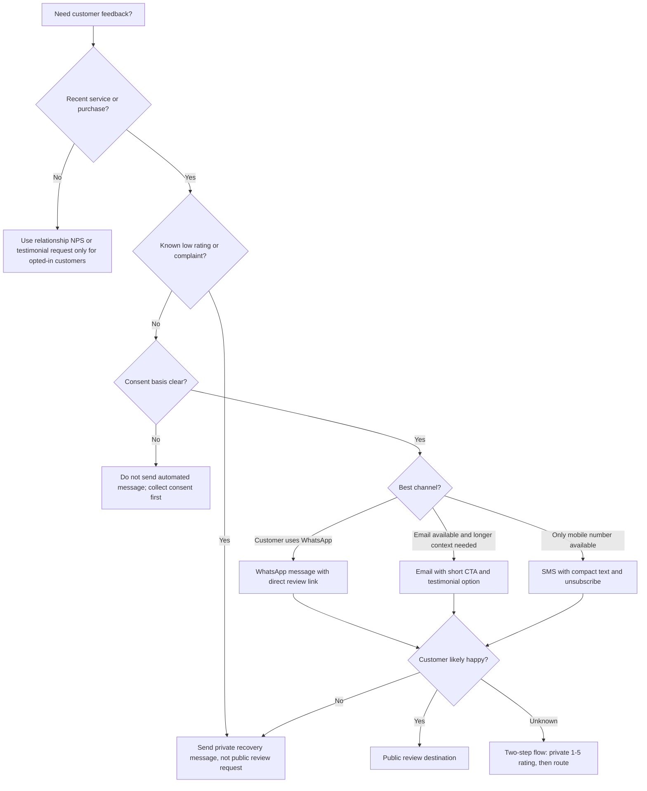

# Customer-Feedback Collector

## Purpose

Use this skill to collect customer feedback in natural Hebrew and route each customer to the right destination:

- Happy customers: public review link or testimonial approval flow.
- Neutral customers: short private feedback form plus optional follow-up.
- Unhappy customers: private service-recovery channel, not a public-review prompt.
- No-consent or unclear-consent contacts: no automated send until lawful basis is confirmed.

The skill is built for Israeli small businesses, freelancers, clinics, salons, tradespeople, tutors, coaches, local ecommerce stores, B2B service providers, and consumers managing personal service feedback.

## Core outcomes

1. Generate Hebrew WhatsApp, email, or SMS review requests.
2. Select the right review platform for the business category.
3. Validate Israeli phone numbers, Hebrew wording, consent status, timing, and unsubscribe text.
4. Prevent manipulative review collection, fake testimonials, incentive traps, and privacy mistakes.
5. Produce a delivery plan that can be sent manually, exported to a CRM, or executed through the Python helper.

## Required inputs

Collect these details before generating a campaign:

| Input | Required | Example |
|---|---:|---|
| Business name | Yes | `קליניקת הדר` |
| Business type | Recommended | physiotherapy clinic, mobile dog groomer, accountant |
| City/service area | Recommended | `חיפה`, `גוש דן` |
| Review destination | Yes | Google, Facebook, Zap, Easy, Midrag, B144, custom |
| Customer name | Recommended | `דנה כהן` |
| Channel | Yes | WhatsApp, email, SMS |
| Recent interaction | Recommended | appointment, repair, delivery, consultation |
| Consent basis | Yes | transaction follow-up, explicit opt-in, existing customer |
| Private feedback URL | Recommended | form, CRM ticket link, support email |
| Google Place ID or platform URL | Required by platform | `ChIJ...` or profile URL |

## Decision tree



## Platform selection

| Business type | Preferred review destination | Backup |
|---|---|---|
| Local shop, salon, clinic, tradesperson | Google review link | Facebook Page reviews |
| Price-comparison retail/ecommerce | Zap profile, Google | Custom post-purchase form |
| Service marketplace presence | Easy, Midrag, B144 profile URL | Google |
| B2B freelancer or consultant | Testimonial approval email | LinkedIn recommendation request manually |
| Regulated professional | Private feedback first | Public review only after careful review of professional rules |
| Consumer complaint tracking | Private evidence log | No public solicitation until facts are verified |

## Channel guidance

### WhatsApp

Use when the relationship is personal, the customer already communicated by WhatsApp, or the business is service-oriented.

Good for:

- Clinics and appointments.
- Home services and repair visits.
- Freelancers after project delivery.
- Small local businesses with direct customer contact.

Avoid:

- Cold lists.
- Long messages.
- Attachments unless expected.
- Sending during Shabbat or very late hours.

Example:

```text
שלום דנה, תודה שבחרת בקליניקת הדר.
אפשר להשאיר חוות דעת קצרה כאן?
https://www.google.com/maps/search/?api=1&query={BUSINESS_NAME}&query_place_id=ChIJ...
זה עוזר לאנשים באזור למצוא שירות אמין.
להסרה: השב/י הסר
```

### Email

Use when the business needs a polished testimonial, invoice context, project summary, or approval trail.

Example:

```text
Subject: אפשר לבקש חוות דעת קצרה?

שלום דנה,

תודה על האמון בקליניקת הדר.
אם הטיפול היה מועיל, אפשר להשאיר חוות דעת קצרה כאן:
https://www.google.com/maps/search/?api=1&query={BUSINESS_NAME}&query_place_id=ChIJ...

לחלופין, אפשר להשיב למייל הזה עם משפט קצר לשימוש כהמלצה באתר.
לא תפורסם המלצה עם שם מלא בלי אישור מפורש.

להסרה מרשימת הודעות כאלה, אפשר להשיב "הסרה".
```

### SMS

Use only when SMS is the normal operational channel or no WhatsApp/email route exists. Keep it short.

```text
דנה, תודה שבחרת בקליניקת הדר. חוות דעת קצרה תעזור ללקוחות באזור: https://x.co/rev להסרה: הסר
```

## Timing rules for Israel

| Situation | Send time |
|---|---|
| Completed appointment Sunday-Thursday | Same day, 1-3 hours after completion |
| Completed appointment Thursday evening | Sunday 09:30-11:00 |
| Ecommerce delivery | 24-48 hours after confirmed delivery |
| Professional service milestone | After acceptance or invoice payment, not during a dispute |
| Event feedback | Within 24 hours, except Friday/Shabbat |
| Complaint or refund | Private recovery flow only |
| Holiday week | Avoid major holiday windows; schedule after normal activity resumes |

Quiet-time defaults:

- Avoid Friday after 13:00.
- Avoid Shabbat from Friday evening through Saturday evening.
- Avoid before 08:30 and after 20:30.
- Avoid memorial days and emotionally sensitive national periods for non-urgent requests.

## Hebrew phrasing rules

Use direct, warm, Israeli phrasing. Keep messages short and specific.

Prefer:

- `אפשר להשאיר חוות דעת קצרה כאן?`
- `זה עוזר ללקוחות באזור למצוא שירות אמין.`
- `לא תפורסם המלצה עם שם מלא בלי אישור מפורש.`
- `להסרה: השב/י הסר`

Avoid:

- Literal English-like phrasing: `המשוב שלך חשוב לנו` as a default.
- Pressure: `חייבים שתדרגו אותנו 5 כוכבים`.
- Incentives tied to rating: `קבלו הנחה על דירוג 5 כוכבים`.
- Manipulation: `רק אם הייתם מרוצים, לחצו כאן`.
- Over-formality: `נודה לכם עד מאוד על מילוי חוות דעתכם`.

## Routing rules

| Customer signal | Action |
|---|---|
| Rating 5/5 or NPS 9-10 | Send public review link. |
| Rating 4/5 or NPS 7-8 | Ask one private improvement question; optional public link after response. |
| Rating 1-3/5 or NPS 0-6 | Open private recovery path. |
| No rating known | Use two-step private rating first for sensitive businesses. |
| Recent complaint | No public review prompt. |
| Refund/chargeback pending | No public review prompt. |
| Employee, family, or supplier | Do not solicit public review unless platform rules permit and relationship is disclosed. |

## Concrete workflows

### Workflow A: one-message Google review request

1. Confirm customer had a recent successful interaction.
2. Confirm consent or expected transactional context.
3. Create Google review link from Place ID.
4. Send concise WhatsApp or SMS message.
5. Stop after one reminder unless explicit opt-in allows more.
6. Record delivery, opt-out, and review status.

### Workflow B: private-first flow

Use for clinics, regulated services, expensive projects, complaints, or uncertain satisfaction.

1. Send private 1-5 rating form.
2. If 5: show public review link on thank-you page.
3. If 4: ask what could improve.
4. If 1-3: create service-recovery ticket.
5. Never route low scores to public review pressure.

### Workflow C: testimonial approval

1. Ask for one sentence about the result.
2. Draft a clean testimonial from the customer's words.
3. Ask for explicit approval before publishing.
4. Offer name display choices: first name only, initials, company name, anonymous.
5. Store approval date, exact text, and publication location.

## Edge cases

| Edge case | Correct handling |
|---|---|
| Customer replied `הסר` | Mark opted out immediately and suppress future sends. |
| Shared family phone number | Use neutral wording; avoid sensitive details. |
| Medical or therapy appointment | Avoid treatment details in message body; use private-first flow. |
| Minor customer | Contact parent/guardian only when appropriate. |
| Customer paid cash and no contact consent was recorded | Send manually only if lawful basis is clear; otherwise do not automate. |
| Public platform has no API | Use verified profile URL and manual link checks. |
| Customer writes a negative public review | Do not request deletion; respond professionally and invite private resolution. |
| Customer offers paid review | Decline and document. |
| Competitor or fake review suspected | Use platform reporting tools; do not retaliate. |
| Bilingual audience | Use Hebrew by default; switch to Arabic, English, or Russian when customer preference is known. |

## Compliance guardrails

Treat these as implementation guardrails, not legal advice:

- Send only when the contact source and consent basis are documented.
- Include opt-out instructions for email/SMS/WhatsApp campaigns.
- Do not disguise advertising as service feedback.
- Do not buy, fake, gate, or pressure reviews.
- Do not condition discounts, gifts, or service priority on positive reviews.
- Do not expose sensitive customer details in public review prompts.
- Store only required personal data.
- Limit access to campaign files and exports.
- Honor deletion and opt-out requests quickly.
- Review current Israeli law, regulator guidance, and platform terms before launch.

See `references/api-reference.md` for cited Israeli laws and platform references.

## Troubleshooting quick map

| Symptom | Likely cause | Fix |
|---|---|---|
| WhatsApp messages fail | Template not approved, phone not E.164, token expired | Validate phone, use approved template, refresh token. |
| SMS links look broken | Long URL split by carrier | Use branded short link with HTTPS and tracking controls. |
| Hebrew appears left-to-right | Link or digit starts the message | Start with Hebrew text; isolate URL on separate line. |
| Review link opens Maps but not review box | Wrong Place ID or unsupported device flow | Verify Place ID and test on Android, iOS, desktop. |
| Low response | Message too long, bad timing, weak CTA | Shorten text, send Sunday-Wednesday morning, use direct link. |
| Opt-out ignored | No suppression list | Create central suppression list before sending. |
| Platform profile changed | Directory URL moved | Add monthly link verification. |

## Anti-patterns

Do not:

- Ask every customer for a 5-star review.
- Hide opt-out text.
- Send during Shabbat or major holidays for non-urgent feedback.
- Mix complaint handling and public review solicitation in the same message.
- Import old contact lists without consent records.
- Publish testimonials without explicit approval.
- Add customer names, treatments, addresses, order details, or private facts into a public prompt.
- Route only satisfied customers to a public page while burying all others without a fair private path.
- Use fake scarcity, guilt, or emotional pressure.
- Reuse American review templates without Hebrew localization.

## Production checklist

Before sending:

- [ ] Business profile name and destination URL verified.
- [ ] Google Place ID or directory URL tested on mobile and desktop.
- [ ] Hebrew text reviewed by a native speaker.
- [ ] Consent basis recorded per contact.
- [ ] Opt-out phrase included.
- [ ] Suppression list loaded.
- [ ] Quiet-time rules configured for Israel.
- [ ] Low-rating private path tested.
- [ ] Sensitive-service wording reviewed.
- [ ] API credentials stored outside source control.
- [ ] Rate limits configured.
- [ ] Delivery logs contain timestamp, channel, message version, and destination.
- [ ] Test send completed to internal Israeli mobile number.
- [ ] Data retention period documented.
- [ ] Current law and platform terms verified.

## Use the Python helper

Create a sample message:

```bash
python scripts/customer_feedback_collector_cli.py sample-message \
  --business-name "קליניקת הדר" \
  --customer-name "דנה כהן" \
  --channel whatsapp \
  --platform google \
  --google-place-id "ChIJexample"
```

Plan a CSV campaign:

```bash
python scripts/customer_feedback_collector_cli.py plan \
  --contacts customers.csv \
  --business-name "המספרה של מיכל" \
  --platform google \
  --google-place-id "ChIJexample" \
  --channel whatsapp \
  --output plan.json
```

Run tests:

```bash
pytest -q
```
