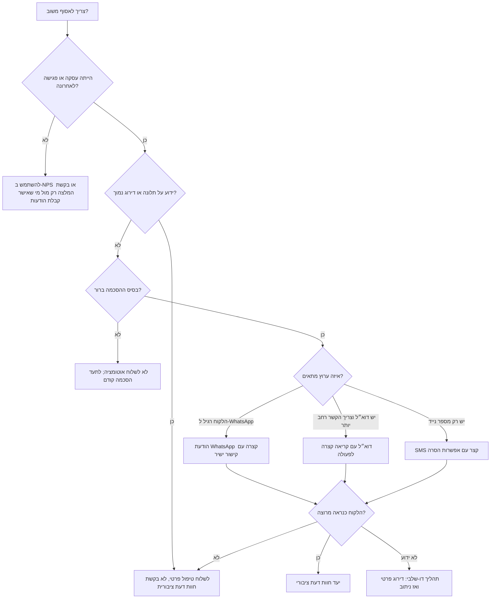

# איסוף משוב וחוות דעת מלקוחות

## מטרה

להשתמש במיומנות הזאת כדי לאסוף משוב לקוחות בעברית טבעית ולנתב כל לקוח ליעד הנכון:

- לקוח מרוצה: קישור לחוות דעת ציבורית או תהליך אישור המלצה.
- לקוח ניטרלי: שאלת שיפור קצרה בערוץ פרטי.
- לקוח לא מרוצה: טיפול שירות פרטי, לא בקשת דירוג ציבורית.
- אישור דיוור לא ברור: לא לשלוח אוטומציה עד לבירור בסיס חוקי מתאים.

המיומנות מתאימה לעסקים קטנים, עצמאים, קליניקות, מספרות, טכנאים, יועצים, מורים פרטיים, מאמנים, חנויות מקומיות, חנויות אונליין קטנות ונותני שירות בישראל.

## תוצרים מרכזיים

1. ניסוח בקשת חוות דעת בעברית ל-WhatsApp, דוא״ל או SMS.
2. בחירת פלטפורמת דירוג מתאימה לפי סוג העסק.
3. בדיקת מספרי טלפון ישראליים, ניסוח בעברית, הסכמה, תזמון והסרה.
4. מניעת ביקורות מזויפות, תמריצים בעייתיים, לחץ על לקוחות וטעויות פרטיות.
5. יצירת תוכנית שליחה לייצוא ל-CRM, לשליחה ידנית או להפעלה דרך סקריפט Python.

## קלט נדרש

| שדה | חובה | דוגמה |
|---|---:|---|
| שם העסק | כן | `קליניקת הדר` |
| סוג העסק | מומלץ | קליניקה, טכנאי מזגנים, רואה חשבון |
| עיר או אזור שירות | מומלץ | `חיפה`, `גוש דן` |
| יעד חוות הדעת | כן | Google, Facebook, זאפ, איזי, מידרג, B144, יעד מותאם |
| שם הלקוח | מומלץ | `דנה כהן` |
| ערוץ | כן | WhatsApp, דוא״ל, SMS |
| אינטראקציה אחרונה | מומלץ | תור, תיקון, משלוח, פגישת ייעוץ |
| בסיס הסכמה | כן | המשך טיפול בעסקה, הצטרפות מפורשת, לקוח קיים |
| קישור למשוב פרטי | מומלץ | טופס, פתיחת פנייה, כתובת תמיכה |
| Place ID של Google או כתובת פרופיל | לפי יעד | `ChIJ...` או URL |

## עץ החלטה



## בחירת פלטפורמה

| סוג עסק | יעד מומלץ | גיבוי |
|---|---|---|
| חנות מקומית, מספרה, קליניקה, טכנאי | Google | ביקורות Facebook |
| חנות אונליין או מוצרי צריכה | זאפ, Google | טופס משוב פרטי |
| נותן שירות שמופיע במדריכים | איזי, מידרג, B144 | Google |
| פרילנסר B2B או יועץ | אישור המלצה במייל | בקשת המלצה ידנית בלינקדאין |
| מקצוע רגיש או מפוקח | משוב פרטי קודם | חוות דעת ציבורית רק אחרי בדיקה |
| צרכן שמתעד התנהלות מול ספק | תיעוד פרטי | לא לשלוח בקשה ציבורית לפני בירור העובדות |

## בחירת ערוץ

### WhatsApp

להשתמש כשקיים קשר אישי, כשהלקוח כבר התכתב עם העסק ב-WhatsApp או כשהשירות אישי ומהיר.

מתאים במיוחד ל:

- תורים בקליניקה.
- טכנאי בבית הלקוח.
- פרילנסר אחרי מסירת פרויקט.
- עסק מקומי שמכיר את הלקוח.

להימנע מ:

- רשימות קרות.
- הודעות ארוכות.
- קבצים מצורפים בלי ציפייה מוקדמת.
- שליחה בשבת, בחגים או בשעות מאוחרות.

דוגמה:

```text
שלום דנה, תודה שבחרת בקליניקת הדר.
אפשר להשאיר חוות דעת קצרה כאן?
https://www.google.com/maps/search/?api=1&query={BUSINESS_NAME}&query_place_id=ChIJ...
זה עוזר לאנשים באזור למצוא שירות אמין.
להסרה: השב/י הסר
```

### דוא״ל

להשתמש כשצריך ניסוח מסודר, הקשר של חשבונית/פרויקט או אישור מפורש לפרסום המלצה.

```text
נושא: אפשר לבקש חוות דעת קצרה?

שלום דנה,

תודה על האמון בקליניקת הדר.
אם הטיפול היה מועיל, אפשר להשאיר חוות דעת קצרה כאן:
https://www.google.com/maps/search/?api=1&query={BUSINESS_NAME}&query_place_id=ChIJ...

אפשר גם להשיב למייל הזה עם משפט קצר לשימוש כהמלצה באתר.
לא תפורסם המלצה עם שם מלא בלי אישור מפורש.

להסרה מרשימת הודעות כאלה, אפשר להשיב "הסרה".
```

### SMS

להשתמש רק כשה-SMS הוא ערוץ תפעולי רגיל או כשאין WhatsApp/דוא״ל. לשמור על הודעה קצרה.

```text
דנה, תודה שבחרת בקליניקת הדר. חוות דעת קצרה תעזור ללקוחות באזור: https://x.co/rev להסרה: הסר
```

## תזמון בישראל

| מצב | מועד שליחה |
|---|---|
| תור שהסתיים בימים א׳-ה׳ | באותו יום, 1-3 שעות אחרי הסיום |
| תור שהסתיים ביום ה׳ בערב | יום א׳ 09:30-11:00 |
| משלוח אונליין | 24-48 שעות אחרי אישור מסירה |
| אבן דרך בפרויקט | אחרי אישור מסירה או תשלום חשבונית, לא בזמן מחלוקת |
| משוב אחרי אירוע | עד 24 שעות, למעט שישי/שבת |
| תלונה או החזר כספי | טיפול פרטי בלבד |
| שבוע חג | להימנע; לשלוח אחרי חזרה לשגרה |

ברירת מחדל לשעות שקטות:

- לא לשלוח ביום שישי אחרי 13:00.
- לא לשלוח בשבת.
- לא לשלוח לפני 08:30 או אחרי 20:30.
- להימנע מימי זיכרון ומתקופות רגישות כשאין צורך תפעולי.

## ניסוח עברי מומלץ

להשתמש בעברית ישירה, קצרה וטבעית.

מומלץ:

- `אפשר להשאיר חוות דעת קצרה כאן?`
- `זה עוזר ללקוחות באזור למצוא שירות אמין.`
- `לא תפורסם המלצה עם שם מלא בלי אישור מפורש.`
- `להסרה: השב/י הסר`

להימנע מ:

- ניסוח מתורגם מדי: `המשוב שלך חשוב לנו`.
- לחץ: `חייבים דירוג 5 כוכבים`.
- תמריץ מותנה בדירוג: `10 ₪ הנחה על 5 כוכבים`.
- סינון מניפולטיבי: `רק אם הייתם מרוצים, לחצו כאן`.
- ניסוח כבד: `נודה לכם עד מאוד על מילוי חוות דעתכם`.

## כללי ניתוב

| אות מהלקוח | פעולה |
|---|---|
| דירוג 5/5 או NPS 9-10 | לשלוח קישור לחוות דעת ציבורית. |
| דירוג 4/5 או NPS 7-8 | לשאול שאלה פרטית אחת לשיפור; אפשר להציע קישור ציבורי בהמשך. |
| דירוג 1-3/5 או NPS 0-6 | לפתוח תהליך שירות פרטי. |
| אין דירוג ידוע | להשתמש בדירוג פרטי קצר לפני קישור ציבורי בעסקים רגישים. |
| תלונה פעילה | לא לשלוח בקשת חוות דעת ציבורית. |
| החזר כספי או הכחשת עסקה | לא לשלוח בקשת חוות דעת ציבורית. |
| עובד, בן משפחה או ספק | לא לבקש חוות דעת ציבורית אלא אם כללי הפלטפורמה מאפשרים וגילוי הקשר ברור. |

## דוגמאות עם תאריכים וסכומים

- טיפול הסתיים בתאריך 03/06/2026 בשעה 15:30: לשלוח WhatsApp בתאריך 03/06/2026 בין 17:00 ל-18:30.
- משלוח בסך 249 ₪ נמסר ב-02-06-2026: לשלוח דוא״ל ב-04-06-2026 בבוקר.
- פרויקט ייעוץ בסך 4,500 ₪ הסתיים עם מחלוקת פתוחה: לא לשלוח חוות דעת; לפתוח טיפול פרטי.
- לקוח כתב `הסר` ב-01-06-2026: לעצור שליחות עתידיות בכל הערוצים.

## תרחישי עבודה

### תרחיש א׳: בקשת חוות דעת ב-Google

1. לוודא שהלקוח קיבל שירות לאחרונה.
2. לוודא בסיס הסכמה או הקשר תפעולי מתאים.
3. ליצור קישור Google לפי Place ID.
4. לשלוח WhatsApp או SMS קצר.
5. לשלוח תזכורת אחת בלבד, אם מותר.
6. לתעד שליחה, הסרה וסטטוס תגובה.

### תרחיש ב׳: משוב פרטי לפני קישור ציבורי

מתאים לקליניקות, שירותים יקרים, תלונות ושירותים רגישים.

1. לשלוח טופס דירוג פרטי 1-5.
2. דירוג 5: להציג קישור לחוות דעת ציבורית בעמוד תודה.
3. דירוג 4: לשאול מה אפשר לשפר.
4. דירוג 1-3: לפתוח פנייה לשירות לקוחות.
5. לא להפעיל לחץ לכתיבת ביקורת חיובית.

### תרחיש ג׳: אישור המלצה לאתר

1. לבקש משפט אחד על התוצאה.
2. לערוך את המשפט לניסוח נקי בלי לשנות משמעות.
3. לבקש אישור מפורש לפרסום.
4. להציע אפשרויות תצוגה: שם פרטי בלבד, ראשי תיבות, שם חברה, אנונימי.
5. לשמור את תאריך האישור, הנוסח המדויק ומיקום הפרסום.

## מקרי קצה

| מקרה | טיפול נכון |
|---|---|
| לקוח כתב `הסר` | לסמן הסרה מיד ולעצור שליחות עתידיות. |
| מספר טלפון משפחתי | לנסח בלי פרטים רגישים. |
| טיפול רפואי או רגשי | לא לציין פרטי טיפול; להעדיף משוב פרטי. |
| לקוח קטין | לפנות להורה/אפוטרופוס רק כשמתאים. |
| אין תיעוד הסכמה | לא להפעיל שליחה אוטומטית. |
| לפלטפורמה אין API ציבורי | להשתמש בכתובת פרופיל מאומתת ולבדוק ידנית. |
| פורסמה ביקורת שלילית | להשיב במקצועיות ולהזמין טיפול פרטי; לא לבקש מחיקה. |
| הוצעה ביקורת בתשלום | לסרב ולתעד. |
| חשד לביקורת מזויפת | לדווח דרך כלי הפלטפורמה. |
| קהל רב-לשוני | עברית כברירת מחדל; לעבור לערבית, אנגלית או רוסית לפי העדפת הלקוח. |

## כללי ציות

לראות ברשימה כלי עבודה, לא ייעוץ משפטי:

- לשלוח רק כשמקור הפרטים ובסיס ההסכמה מתועדים.
- לכלול אפשרות הסרה בדוא״ל, SMS ו-WhatsApp.
- לא להסוות פרסום כמשוב שירות.
- לא לקנות, לזייף או ללחוץ על ביקורות.
- לא להתנות הנחה, מתנה או עדיפות שירות בביקורת חיובית.
- לא לחשוף פרטים רגישים בהודעה.
- לשמור רק מידע אישי נחוץ.
- להגביל גישה לקבצי קמפיין וייצוא.
- לכבד בקשות הסרה ומחיקה במהירות.
- לבדוק דין ישראלי עדכני ותנאי פלטפורמה לפני הפעלה.

## תקלות נפוצות

| סימפטום | סיבה אפשרית | תיקון |
|---|---|---|
| הודעת WhatsApp נכשלה | תבנית לא מאושרת, מספר לא בפורמט E.164, אסימון פג | לבדוק מספר, להשתמש בתבנית מאושרת, לחדש אסימון. |
| קישור SMS נשבר | URL ארוך מדי | להשתמש בקישור מקוצר ממותג ב-HTTPS. |
| עברית מיושרת לשמאל | ההודעה מתחילה בספרה או קישור | להתחיל במילה עברית ולהעביר URL לשורה נפרדת. |
| קישור Google לא פותח חלון ביקורת | Place ID שגוי או בעיית מכשיר | לבדוק Place ID באנדרואיד, iOS ודסקטופ. |
| מעט תגובות | הודעה ארוכה, תזמון חלש, קריאה לא ברורה | לקצר, לשלוח בבוקר א׳-ד׳, להשתמש בקישור ישיר. |
| הסרות לא נשמרות | אין רשימת דיכוי מרכזית | ליצור רשימת הסרה לפני שליחה. |
| פרופיל פלטפורמה השתנה | כתובת מדריך עודכנה | לבצע בדיקת קישורים חודשית. |

## מה לא לעשות

- לא לבקש מכל לקוח דירוג 5 כוכבים.
- לא להסתיר אפשרות הסרה.
- לא לשלוח בשבת או בחגים בקשות לא דחופות.
- לא לערבב טיפול בתלונה עם בקשת חוות דעת ציבורית.
- לא לייבא רשימות ישנות בלי תיעוד הסכמה.
- לא לפרסם המלצה בלי אישור מפורש.
- לא להכניס שמות, טיפולים, כתובות או פרטים פרטיים לבקשת דירוג.
- לא לסנן רק לקוחות מרוצים לעמוד ציבורי בצורה מטעה.
- לא להשתמש באשמה, לחץ או מניפולציה רגשית.
- לא להשתמש בתבניות אמריקאיות בלי התאמה לעברית ישראלית.

## רשימת בדיקה לפני הפעלה

- [ ] שם העסק וכתובת היעד אומתו.
- [ ] Place ID או כתובת פרופיל נבדקו במובייל ובדסקטופ.
- [ ] הטקסט בעברית נבדק על ידי דובר עברית.
- [ ] בסיס הסכמה נשמר לכל איש קשר.
- [ ] נוסח הסרה כלול.
- [ ] רשימת הסרה נטענה.
- [ ] שעות שקטות בישראל מוגדרות.
- [ ] מסלול דירוג נמוך נבדק.
- [ ] שירות רגיש עבר בדיקת ניסוח.
- [ ] מפתחות API נשמרים מחוץ לקוד.
- [ ] מגבלות קצב מוגדרות.
- [ ] לוגים כוללים תאריך, שעה, ערוץ, גרסת הודעה ויעד.
- [ ] נשלחה בדיקת ניסיון למספר ישראלי פנימי.
- [ ] נקבעה תקופת שמירת מידע.
- [ ] הדין ותנאי הפלטפורמות נבדקו מחדש.

## שימוש בכלי Python

יצירת הודעה לדוגמה:

```bash
python scripts/customer_feedback_collector_cli.py sample-message \
  --business-name "קליניקת הדר" \
  --customer-name "דנה כהן" \
  --channel whatsapp \
  --platform google \
  --google-place-id "ChIJexample"
```

יצירת תוכנית שליחה מקובץ CSV:

```bash
python scripts/customer_feedback_collector_cli.py plan \
  --contacts customers.csv \
  --business-name "המספרה של מיכל" \
  --platform google \
  --google-place-id "ChIJexample" \
  --channel whatsapp \
  --output plan.json
```
