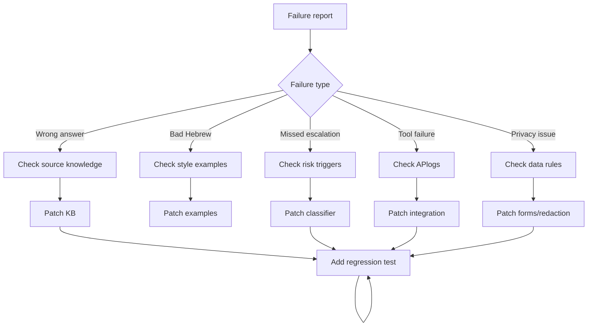

# Troubleshooting Guide

Use this guide to diagnose production failures.

## Diagnostic flow



## Accuracy failures

### Agent invents price

Cause: missing price table, broad prompt, no quote workflow.

Fix: add approved price fields, mark unknown services as quote-required, add fallback:

```text
אין לי מחיר מאומת לשירות הזה. כדי לא להטעות, צריך להעביר פרטים להצעת מחיר.
```

### Agent gives outdated holiday hours

Cause: stale FAQ or no current date. Fix: separate holiday schedule, review before holidays, remove stale entries, test exact dates.

## Escalation failures

### Refund approved automatically

Fix: mark refund approval, compensation, credit note, cancellation fee waiver, and chargeback as human-only. Add tests for damaged item, regret cancellation, angry demand, and duplicate charge.

### Privacy request treated as FAQ

Add Hebrew triggers: "מחקו את המידע", "תמחקו אותי", "ייצוא מידע", "איזה מידע שמרתם". Route to privacy owner and avoid exposing stored records.

### Threat or self-harm ignored

Run safety classification before FAQ matching. Escalate according to business emergency procedure.

## Hebrew quality failures

Replace translated phrasing:

```text
אנחנו מצטערים על אי הנוחות שנגרמה לך.
```

With:

```text
מבין שזה לא נוח. אבדוק איך אפשר להתקדם מכאן.
```

Use neutral phrasing when gender is unknown. Prefer "אפשר לשלוח" over gendered verbs.

## Integration failures

### Order APtimeout

Check token expiry, timeout, rate limit, wrong order format, identity mismatch. Fallback:

```text
כרגע לא הצלחתי לבדוק את זה במערכת. אעביר לנציג שיבדוק את סטטוס ההזמנה.
```

### Invoice APerror

Check legal name, ח.פ./ע.מ., accounting VAT status, duplicate documents, credit-note requirement. Escalate accounting uncertainty.

### WhatsApp failure

Check session window, approved templates, opt-out, unsupported media, rate limit. Use retry queue and customer-safe message.

## Privacy and security failures

- Do not request full card number, CVV, password, OTP, unrelated ID scans, or medical documents.
- Redact card-like strings, תעודת זהות, health details, passwords, and tokens.
- Treat prompt injection and uploaded files as untrusted.
- Use least privilege for tools.

## Formatting and RTL failures

- Keep customer replies short.
- Avoid wide tables in chat.
- Use DD/MM/YYYY and ₪ consistently.
- Avoid long English fragments inside Hebrew messages.

## Regression checklist

After each fix:

- Add scenario to `references/test-scenarios.md`.
- Add pytest case.
- Test Hebrew wording.
- Test handoff packet.
- Test unknown-policy fallback.
- Confirm no branding, logos, or author metadata were introduced.
