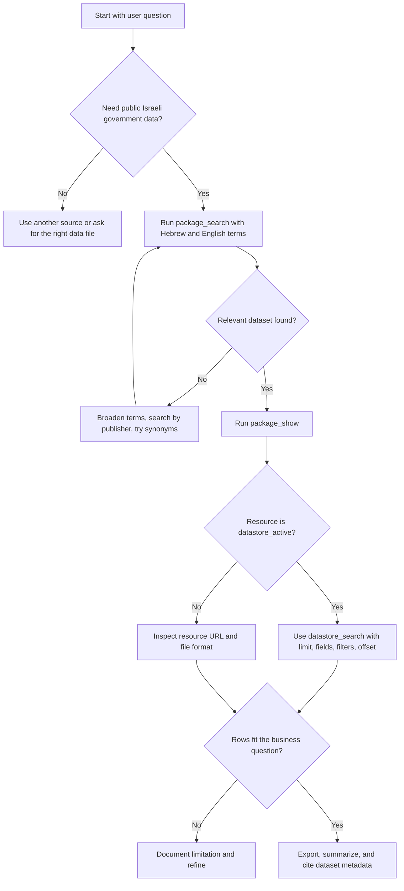

# Data.gov.il Explorer Skill

## Purpose

Retrieve, inspect, query, export, and analyze public datasets from data.gov.il through the CKAN API. Apply the skill when a user needs practical evidence from Israeli open-government data, especially for small-business, freelance, or consumer decisions.

The portal exposes CKAN actions under `https://data.gov.il/api/3/action/`. Most discovery tasks use `package_search`, metadata review uses `package_show` and `resource_show`, and tabular data retrieval uses `datastore_search` when `datastore_active` is true. Verify endpoint behavior against `references/verification-log.md` before relying on a long-running workflow.

## Operating principles

Use neutral, imperative guidance. Verify the dataset before analyzing it. Separate discovery, metadata review, row retrieval, transformation, and interpretation. Preserve Hebrew text using UTF-8. Use DD/MM/YYYY dates and ₪ for Israeli user-facing examples.

## When to use this skill

Use it for questions such as:

- Find public datasets about public transport near a store location.
- Export a government table to CSV for bookkeeping or due diligence.
- Check whether a dataset includes city-level records for a freelancer proposal.
- Compare published education, health, transportation, or municipal data before choosing a service provider or location.
- Build a repeatable evidence trail from public sources before making a consumer complaint or business request.

Avoid using it for confidential records, personal data harvesting, non-public systems, legal conclusions, or live facts that require a current source outside CKAN.

## Decision tree



## Core workflow

1. Translate the business question into dataset terms. Include Hebrew terms, official terms, and common public wording.
2. Search datasets with `package_search`. Start with 5 to 10 rows and sort by `metadata_modified desc` when freshness matters.
3. Inspect the chosen dataset with `package_show`. Record title, name, publisher, metadata modification date, license, and resources.
4. Select a resource. Prefer `datastore_active=true`; otherwise use tabular file resources such as CSV or XLSX.
5. Query a small sample with `datastore_search`. Confirm field names, Hebrew encoding, date formats, and value ranges.
6. Add filters only after field names are confirmed. CKAN filters require exact field names and exact values.
7. Page through records with `offset` and `limit` or use `datastore_search_all` from the client.
8. Export CSV with UTF-8 signature when spreadsheet users need to open Hebrew text.
9. Explain limitations: publication date, missing records, units, geographic level, and whether the data is official enough for the decision.

## Concrete examples

### Search for public transport datasets

```bash
datagovil-explorer search "תחבורה ציבורית" --rows 5 --json-output
```

### Chain dataset and resource identifiers

```bash
datagovil-explorer search "תחבורה ציבורית" --rows 3 --json-output > create-response.json
DATASET_ID=$(python - <<'PY'
import json
with open("create-response.json", encoding="utf-8") as handle:
    print(json.load(handle)["results"][0]["name"])
PY
)
datagovil-explorer dataset "$DATASET_ID" --json-output > dataset.json
RESOURCE_ID=$(python - <<'PY'
import json
with open("dataset.json", encoding="utf-8") as handle:
    payload = json.load(handle)
print(next(item["id"] for item in payload.get("resources", []) if item.get("id")))
PY
)
datagovil-explorer query "$RESOURCE_ID" --limit 10 --json-output
```

### Python sample for a small business location screen

```python
from datagovil_explorer import DatagovClient

client = DatagovClient()
for term in ["רישוי עסקים", "ארנונה", "תחבורה ציבורית"]:
    result = client.package_search(term, rows=3, sort="metadata_modified desc")
    print(term, result.get("count"))
```

## Edge cases

| Case | Symptom | Action |
|---|---|---|
| Dataset title is relevant but resources are missing | `resources` is empty | Search for the same topic under the publisher name and document the limitation |
| Resource is a file, not datastore | `datastore_active=false` | Use the resource URL, inspect format, and avoid `datastore_search` |
| Hebrew filter returns no rows | Exact field/value mismatch | Query a sample first, copy field names and values exactly |
| Freshness is unclear | Metadata date differs from file date | Prefer the resource `last_modified` value and state uncertainty |
| Large table times out | HTTP 504 or slow response | Reduce `limit`, page with `offset`, add filters, retry later |
| CSV opens as gibberish | Spreadsheet encoding issue | Export with UTF-8 signature or import using UTF-8 explicitly |
| Numeric columns arrive as text | CKAN stores strings | Normalize after retrieval, keep original values for audit |
| City names differ | `תל אביב-יפו`, `תל אביב יפו`, `תל אביב` | Test synonyms and document matching logic |

## Anti-patterns

Do not treat the first search result as authoritative. Do not filter before inspecting exact fields. Do not mix rows from different resources without checking schema and publication dates. Do not hide empty results. Do not present public data as legal, tax, medical, or planning advice. Do not collect personal data beyond the stated legitimate need.

## Troubleshooting summary

- `success=false`: inspect the CKAN error payload and validate the action name and parameters.
- `404`: confirm the dataset or resource identifier.
- `429`: reduce request rate and add retry backoff. No fixed public quota was confirmed during the final web validation pass, so treat this as defensive handling rather than an official limit.
- `500` or `504`: reduce page size and query again later.
- Empty `records`: confirm `datastore_active`, field names, filters, and offset.
- Broken Hebrew: enforce UTF-8 and use `ensure_ascii=False` when printing JSON.

## Verified-source checklist

- Confirm `https://data.gov.il/docs` still lists the action paths used by the workflow.
- Confirm the selected dataset metadata through `package_show` before exporting records.
- Confirm statutory facts outside data.gov.il, such as VAT rates or reporting thresholds, against the responsible Israeli authority on the day of use.
- Record the URL, access date, dataset id, resource id, and query parameters.
- Treat unconfirmed limits, quotas, and webhook behavior as not applicable unless official documentation says otherwise.

## Production checklist

- Record dataset name, title, publisher, and metadata modification date.
- Save raw JSON for search, dataset metadata, resource metadata, and sample rows.
- Confirm whether the resource is datastore-backed or file-backed.
- Validate field names, value units, dates, and geographic coverage.
- Use deterministic filters and store the exact query parameters.
- Page through data with bounded limits and retry policy.
- Export with UTF-8 signature when spreadsheet users are involved.
- Include a limitation note in the final analysis.
- Avoid storing unnecessary personal data.
- Re-run the retrieval before time-sensitive decisions.
