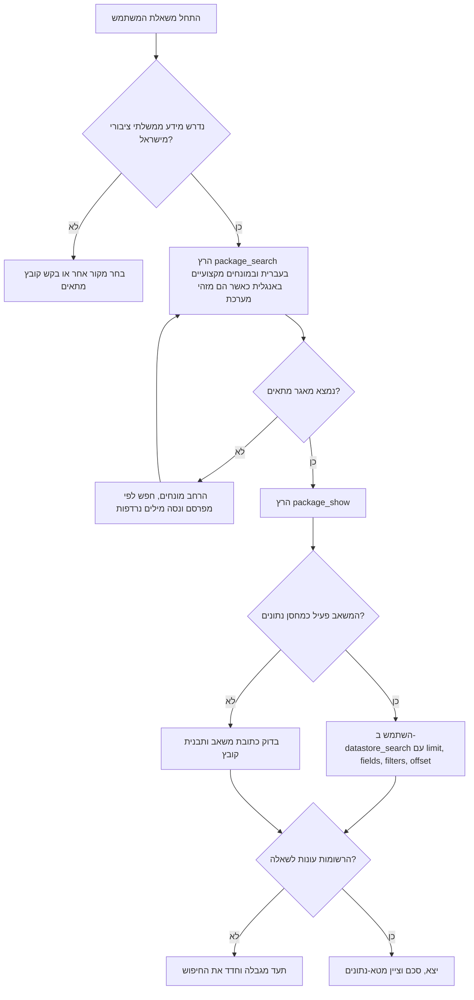

# מיומנות סייר data.gov.il

## מטרה

אתר, בדוק, בצע שאילתות, יצא ונתח מאגרי מידע ציבוריים מ-data.gov.il באמצעות ממשק CKAN. השתמש במיומנות כאשר נדרש בסיס נתונים ציבורי לקבלת החלטה עסקית, צרכנית או תפעולית בישראל.

הממשק המרכזי זמין תחת `https://data.gov.il/api/3/action/`. גילוי מאגרים מתבצע בדרך כלל עם `package_search`, בדיקת מטא-נתונים עם `package_show` ו-`resource_show`, ושליפת רשומות מטבלאות פעילות עם `datastore_search`. אמת התנהגות ממשקים מול `references/verification-log.md` לפני הפעלת תהליך קבוע.

## עקרונות עבודה

פעל בלשון ציווי ניטרלית. אמת את המאגר לפני ניתוח. הפרד בין איתור, בדיקת מטא-נתונים, שליפת רשומות, עיבוד והסקת מסקנה עסקית. שמור עברית בקידוד UTF-8. הצג תאריכים במבנה DD/MM/YYYY והצג סכומים עם ₪.

## מתי להשתמש

הפעל את המיומנות עבור בקשות כגון:

- איתור מאגרי תחבורה ציבורית לפני בחירת מיקום לחנות.
- ייצוא טבלה ממשלתית לקובץ CSV לצורך בדיקת כדאיות או תיעוד.
- בדיקת נתוני חינוך, בריאות, תחבורה או רשות מקומית לפני פנייה עסקית.
- איסוף ראיות ציבוריות לפני פנייה צרכנית מסודרת.
- בדיקת זמינות נתונים עירוניים עבור הצעת מחיר של עצמאי.

אל תשתמש במיומנות עבור מידע חסוי, נתונים אישיים שאינם נחוצים, מערכות ממשלתיות שאינן פתוחות לציבור, ייעוץ משפטי או עובדות עדכניות שאינן זמינות דרך ממשק CKAN.

## עץ החלטה



## תהליך עבודה בסיסי

1. המר את שאלת העסק למונחי מאגר. כלול מונחים רשמיים, מונחים נפוצים ומילים נרדפות בעברית.
2. חפש מאגרים עם `package_search`. התחל ב-5 עד 10 תוצאות והוסף `metadata_modified desc` כאשר עדכניות חשובה.
3. בדוק מאגר נבחר עם `package_show`. תעד שם, כותרת, מפרסם, תאריך עדכון מטא-נתונים, רישיון ומשאבים.
4. בחר משאב. העדף `datastore_active=true`. אם אין, העדף קובץ טבלאי כגון CSV או XLSX.
5. שלוף מדגם קטן עם `datastore_search`. אמת שמות שדות, עברית, מבנה תאריכים וטווחי ערכים.
6. הוסף מסננים רק לאחר אימות שמות שדות. מסנני CKAN דורשים שם שדה מדויק וערך מדויק.
7. עבור על רשומות עם `offset` ו-`limit` או השתמש ב-`datastore_search_all` בלקוח.
8. יצא CSV בקידוד UTF-8 עם חתימה כאשר הקובץ מיועד לגיליון אלקטרוני.
9. הסבר מגבלות: תאריך פרסום, רשומות חסרות, יחידות מידה, רמת פירוט גאוגרפית והתאמה להחלטה.

## דוגמאות

```bash
datagovil-explorer search "תחבורה ציבורית" --rows 5 --json-output
```

```bash
datagovil-explorer search "תחבורה ציבורית" --rows 3 --json-output > create-response.json
DATASET_ID=$(python - <<'PY'
import json
with open("create-response.json", encoding="utf-8") as handle:
    print(json.load(handle)["results"][0]["name"])
PY
)
datagovil-explorer dataset "$DATASET_ID" --json-output > dataset.json
RESOURCE_ID=$(python - <<'PY'
import json
with open("dataset.json", encoding="utf-8") as handle:
    payload = json.load(handle)
print(next(item["id"] for item in payload.get("resources", []) if item.get("id")))
PY
)
datagovil-explorer query "$RESOURCE_ID" --limit 10 --json-output
```

## מקרי קצה

| מקרה | סימן | פעולה |
|---|---|---|
| הכותרת מתאימה אך אין משאבים | `resources` ריק | חפש שוב לפי שם המפרסם ותעד את המגבלה |
| המשאב אינו פעיל כמחסן נתונים | `datastore_active=false` | בדוק את כתובת המשאב ותבנית הקובץ |
| מסנן בעברית מחזיר אפס רשומות | שם שדה או ערך אינם מדויקים | שלוף מדגם והעתק שמות וערכים בדיוק |
| העדכניות אינה ברורה | תאריך מטא-נתונים שונה מתאריך הקובץ | העדף `last_modified` של המשאב וציין אי-ודאות |
| טבלה גדולה נכשלת | שגיאת 504 או זמן תגובה ארוך | הקטן `limit`, עבור עם `offset`, הוסף מסנן |
| עברית נפתחת כגיבריש | בעיית קידוד בגיליון | יצא UTF-8 עם חתימה או יבא כ-UTF-8 |
| עמודות מספריות הן טקסט | הערכים נשמרו כמחרוזות | המר לאחר השליפה ושמור את הערך המקורי לתיעוד |
| שמות יישובים אינם אחידים | לדוגמה תל אביב-יפו מול תל אביב יפו | בדוק חלופות ותעד את כלל ההתאמה |

## דפוסי פעולה שגויים

אל תניח שהתוצאה הראשונה היא המקור המתאים ביותר. אל תסנן לפני בדיקת שמות השדות. אל תשלב משאבים שונים לפני בדיקת מבנה, תאריך פרסום ויחידות מידה. אל תסתיר תוצאה ריקה. אל תציג מידע ציבורי כייעוץ משפטי, מס, רפואי או תכנוני. אל תשמור מידע אישי שאינו דרוש לבקשת המשתמש.

## פתרון תקלות קצר

- `success=false`: בדוק את הודעת השגיאה של CKAN ואת שמות הפרמטרים.
- `404`: ודא שמזהה המאגר או המשאב נכון.
- `429`: האט את קצב הבקשות והוסף השהיה בין ניסיונות. בבדיקת המקורות הסופית לא אומתה מכסה ציבורית קבועה, לכן התייחס לכך כמנגנון הגנה ולא כמגבלה רשמית.
- `500` או `504`: הקטן את גודל הדף ונסה שוב מאוחר יותר.
- `records` ריק: ודא שהמשאב פעיל, שהשדות נכונים, שהמסננים מדויקים ושה-offset אינו גדול מדי.
- עברית שבורה: השתמש ב-UTF-8 וב-`ensure_ascii=False` בעת הדפסת JSON.

## רשימת בדיקה לפני שימוש עסקי

- תעד שם מאגר, כותרת, מפרסם ותאריך עדכון מטא-נתונים.
- שמור JSON גולמי של חיפוש, מטא-נתוני מאגר, מטא-נתוני משאב ומדגם רשומות.
- ודא אם המשאב פעיל כמחסן נתונים או זמין כקובץ בלבד.
- אמת שמות שדות, יחידות, תאריכים וכיסוי גאוגרפי.
- השתמש במסננים עקביים ושמור את פרמטרי השאילתה.
- עבור על הנתונים בדפים עם מגבלת רשומות ומדיניות ניסיונות חוזרים.
- יצא בקידוד UTF-8 עם חתימה כאשר משתמשים בגיליון אלקטרוני.
- כלול מגבלות בניתוח הסופי.
- הימנע משמירת מידע אישי שאינו נחוץ.
- הרץ שוב שליפה לפני החלטה רגישה לזמן.
