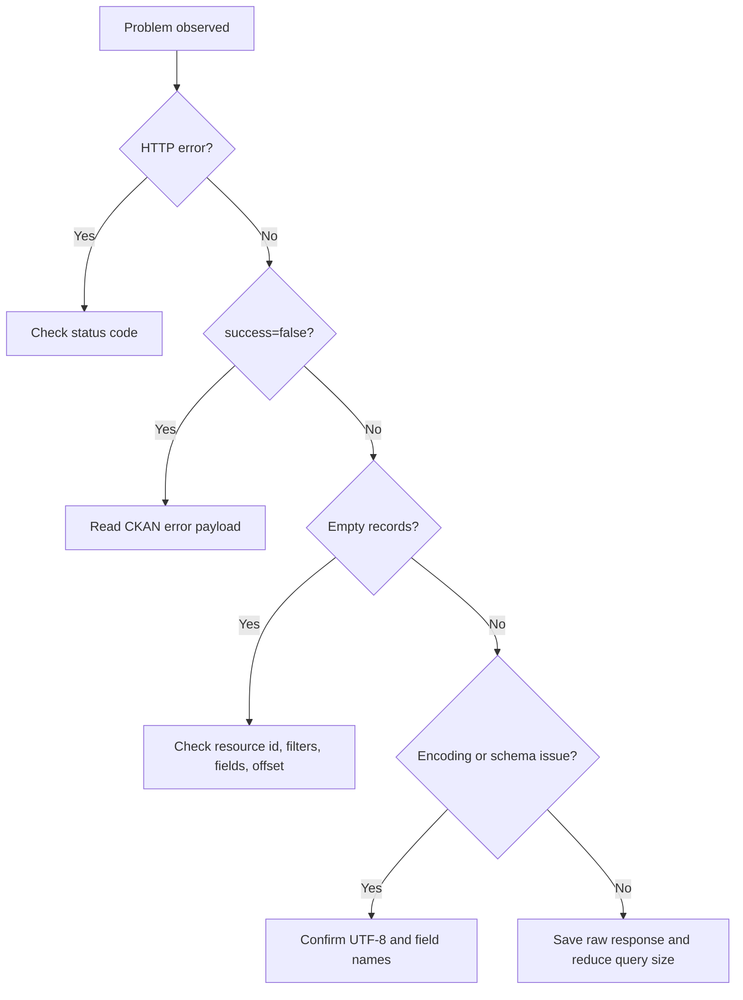

# Troubleshooting Guide

## Fast diagnostic path



## Symptoms and fixes

| Symptom | Likely cause | Fix |
|---|---|---|
| `DatagovAPIError` | CKAN returned `success=false` | Inspect the error object and required parameters |
| `DatagovHTTPError` with 404 | Wrong dataset or resource id | Search again and copy `name` or `id` from the response |
| `DatagovHTTPError` with 429 | Possible throttling or temporary blocking | Reduce rate and retry with backoff; verify any published quota before documenting it as official |
| `DatagovHTTPError` with 500 or 504 | Temporary service issue or large query | Reduce page size, remove broad full-text search, retry later |
| `DatagovDecodeError` | Response was not valid JSON | Save raw body and retry; check that the URL is an API action |
| Empty `records` | Exact filter mismatch or wrong resource | Query without filters and inspect field names and sample values |
| Hebrew appears escaped | JSON was printed with ASCII escaping | Use `json.dumps(data, ensure_ascii=False, indent=2)` |
| Hebrew appears corrupted in spreadsheet | Spreadsheet guessed the wrong encoding | Export with UTF-8 signature or import as UTF-8 |
| Missing columns after export | Resource schema changed | Run `resource_show` and compare fields before analysis |
| Duplicate or inconsistent city names | Source data has alternate spelling | Build a mapping table and state the rule used |

## Recovery recipes

```python
from datagovil_explorer import DatagovClient
client = DatagovClient()
print(client.action_url("package_search", {"q": "חינוך", "rows": 2}))
```

```bash
datagovil-explorer query RESOURCE_ID --limit 5 --json-output
datagovil-explorer export RESOURCE_ID --out sample.csv --page-size 200 --max-records 1000
```

Capture action name, parameters, HTTP status, CKAN error payload, dataset id, resource id, datastore status, time of failure in DD/MM/YYYY HH:MM, and a small reproducible command.
