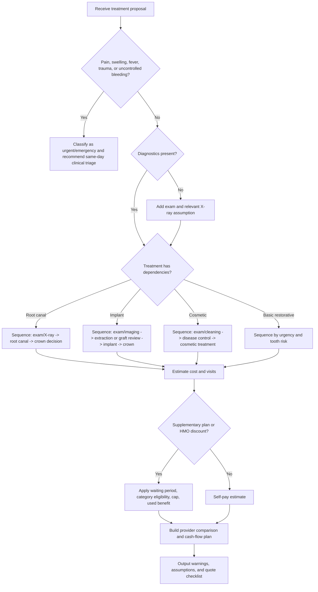

# Dental Treatment Planner

Use this skill to convert a proposed dental-treatment list into a practical Israeli-context plan: treatment phases, likely visits, cash-flow estimate in ₪, provider comparison, clinic questions, and warnings requiring licensed dental review.

The skill is planning support only. Do not diagnose, prescribe, override a dentist, or present an estimate as a binding quote.

## Core outcomes

Produce:

1. A normalized treatment list with tooth numbers, urgency, missing diagnostics, and dependencies.
2. A cost estimate in ₪ with explicit assumptions.
3. A comparison across private dentist, Maccabident, Clalit Smile, and selected alternatives.
4. A visit schedule and payment phasing plan.
5. A consumer checklist for written quotes and eligibility checks.
6. A risk section covering medical, financial, administrative, and timing uncertainty.

## Required inputs

| Input | Example | Use |
|---|---:|---|
| Patient type | adult, child, senior, employee-supported | Eligibility and scheduling |
| Provider route | private, maccabident, clalit_smile | Provider cost factor |
| Region | tel_aviv, center, jerusalem, haifa, north, south, periphery | Local price assumption |
| Treatment items | exam, cleaning, filling, root canal, crown, implant | Cost and sequence |
| Tooth number | 16, 46, 11 | Procedure mapping |
| Urgency | routine, soon, urgent, emergency | Triage and urgency factor |
| Insurance | discount %, annual cap, waiting period, covered categories | Coverage model |
| Start date | 15/07/2026 | Schedule generation |
| Budget constraints | max visits/month, payment ceiling | Cash-flow phasing |

When information is missing, use conservative assumptions and label them clearly.

## Treatment-code examples

Basic restorative plan:

```json
[
  {"code": "exam"},
  {"code": "xray_bitewing"},
  {"code": "cleaning"},
  {"code": "filling_small", "tooth": "16"},
  {"code": "root_canal_molar", "tooth": "46", "urgency": "soon"},
  {"code": "crown_porcelain", "tooth": "46"}
]
```

Implant planning:

```json
[
  {"code": "exam"},
  {"code": "panoramic_xray"},
  {"code": "extraction_surgical", "tooth": "36"},
  {"code": "implant", "tooth": "36"},
  {"code": "implant_crown", "tooth": "36"}
]
```

Child prevention:

```json
[
  {"code": "exam"},
  {"code": "cleaning"},
  {"code": "fluoride_child"},
  {"code": "sealant_child", "quantity": 4}
]
```

## Decision tree



## Cost-estimation method

Use transparent arithmetic:

```text
gross = catalog_midpoint × quantity × provider_factor × region_factor × urgency_factor
coverage = min(gross × eligible_discount_pct, remaining_annual_cap)
patient_before_vat = gross - coverage
vat = patient_before_vat × vat_rate only when include_vat=true; default vat_rate is 18% as verified on 04/06/2026
patient_total = patient_before_vat + vat
```

Planning provider factors:

| Provider profile | Factor | Use |
|---|---:|---|
| private | 1.00 | Independent clinic or specialist-led plan |
| maccabident | 0.78 | HMO-affiliated route planning |
| clalit_smile | 0.80 | HMO-affiliated route planning |
| leumit_dental | 0.82 | Additional Kupat Holim route |
| meuhedet_dental | 0.83 | Additional Kupat Holim route |

Planning region factors:

| Region | Factor |
|---|---:|
| tel_aviv | 1.12 |
| center | 1.05 |
| jerusalem | 1.06 |
| haifa | 1.00 |
| north | 0.95 |
| south | 0.94 |
| periphery | 0.90 |
| eilat | 0.92 |

Replace default factors with dated, source-backed local prices before production use. Provider factors are heuristic planning coefficients, not official discount percentages or binding tariffs.


## Web-validated Israeli source snapshot

Use these source-backed facts for 2026 planning and keep local data dated:

| Topic | Verified planning fact | Action |
|---|---|---|
| Israeli VAT | Standard VAT rate is 18% from 01/01/2025 and remains the checked rate for 2026. | Keep `vat_rate=0.18` when `include_vat=true`; still verify invoice classification. |
| Children | Children from birth to age 18 are eligible for preventive dental care without payment and preservative/restorative care with a low copay through HMO routes. | Ask the HMO clinic which items are included and what copay applies. |
| Seniors | Age 72 and above: Ministry of Health guidance describes preventive, preservative and some rehabilitative dental care through HMOs, with some items free and some low copay. | Check age, frequency limits, copays and required forms before estimating. |
| Maccabident | Official 2026 tariff and benefits pages show item-level prices and benefit categories, including first annual checkup benefits and plan-specific reductions. | Do not convert these pages into one fixed discount; load item-level prices when available. |
| Clalit Smile | Official pages describe 25% discounts for certain Clalit Mushlam routes and 34 ₪ preservative treatments for Platinum ages 18-72. | Model as eligibility rules only after confirming membership, age and waiting period. |
| Public APIs | No public provider webhook or live tariff API was confirmed for this package. | Treat `/v1/...` examples as local interface contracts, not external endpoints. |

See `references/verification-log.md` for source URLs, quotes, access dates and the second-pass validation result.

## Sequencing rules

| Treatment | Check first | Typical phase |
|---|---|---|
| Cleaning | Active pain, infection, periodontal status | Preventive / prep |
| Filling | Exam and decay depth | Disease control |
| Root canal | X-ray, restorability, crown need | Urgent/restorative |
| Crown | Tooth structure, root-canal status, lab material | Rehabilitation |
| Implant | Imaging, bone volume, smoking/diabetes risk, surgical consult | Surgical/prosthetic |
| Whitening | Decay, gum disease, cleaning status | Elective |
| Aligners | Orthodontic consult, gum health, compliance | Elective/long-term |
| Denture | Healing after extractions, bite, remaining teeth | Prosthetic |

## Provider comparison guidance

Compare at least three routes when appropriate:

1. Current or recommended private clinic.
2. HMO-affiliated clinic such as Maccabident or Clalit Smile.
3. Specialist route for implant, surgery, complex endodontics, periodontal disease, orthodontics, or full-mouth rehabilitation.

For freelancers and small businesses:

- Separate urgent care from elective and cosmetic work.
- Map payments to expected income months.
- Ask for a written quote split by visit, lab milestone, and treatment stage.
- Keep receipts organized by tax year, but do not assume deductibility without tax advice.
- Avoid delaying infection or acute pain solely for cash-flow smoothing.

## Edge cases

### Pain before a planned cleaning
Classify as triage first. Do not present cleaning as sufficient if pain, swelling, fever, trauma, or uncontrolled bleeding exists.

### Implant quote without imaging
Add a warning. A binding implant quote usually requires imaging and clinical evaluation. List possible additions such as bone graft, sinus lift, temporary tooth, surgical guide, sedation, or specialist fee only as optional risk items.

### Root canal without crown
Flag crown uncertainty. Molars often need crowns after root canal, but the decision depends on remaining tooth structure and dentist assessment.

### Whitening with untreated decay
Sequence disease control before whitening. Elective aesthetic work should wait until active problems are treated.

### Supplementary plan waiting period
Apply zero discount until the waiting period is satisfied. Add a clinic question: “Has the waiting period ended for this treatment category?”

### Annual cap nearly exhausted
Apply only remaining benefit. Show used benefit and remaining estimated cap clearly.

### Child treatment
Mention that Ministry of Health guidance states children from birth to age 18 are eligible for preventive dental care without payment and preservative/restorative care with a low copay through HMO dental clinics or contracted clinics. Verify the exact treatment, copay, and clinic route before quoting.

### Business-paid dental care
Separate medical planning from bookkeeping. Mark reimbursements, employee benefits, and deductibility as matters for a licensed accountant or tax adviser.

### VAT uncertainty
Use the verified standard Israeli VAT rate of 18% for simulations dated 2026 when `include_vat=true`. Do not automatically add VAT to clinical dental services. Use `include_vat=true` only for taxable invoice modeling or non-clinical business items. Verify invoice classification with the clinic and accountant.

## Anti-patterns

Avoid:

- “This is the exact price.” Use “planning estimate” and show assumptions.
- “Choose the cheapest provider.” Balance urgency, complexity, specialist need, availability, and scope.
- “Implant is always better than bridge.” Present trade-offs and require clinical review.
- “Delay urgent care for cash-flow reasons.” Recommend same-day triage for red flags.
- “Insurance covers it.” Use “coverage may apply if eligibility, waiting period, cap, and category rules are satisfied.”
- “VAT always applies” or “VAT never applies.” Verify invoice classification.
- “Aesthetic treatment first.” Treat pain, infection, decay, and gum disease first.

## Output template

```markdown
# Dental treatment plan

## Summary
- Provider route:
- Region:
- Start date:
- Patient objective:
- Estimate confidence: low / medium / high

## Treatment sequence
| Phase | Treatment | Tooth | Visits | Why now |
|---|---|---:|---:|---|

## Cost estimate
| Item | Gross | Estimated coverage | Patient estimate |
|---|---:|---:|---:|

## Cash-flow plan
| Month | Visits | Estimated payment |
|---|---:|---:|

## Provider comparison
| Route | Estimated patient total | Pros | Questions |
|---|---:|---|---|

## Warnings
- ...

## Questions for the clinic
- Is this quote final and written?
- Which items are excluded?
- Does the quote include lab work, temporary crown, imaging, medication, sedation, and follow-up?
- Which dentist or specialist performs each stage?
- What is the cancellation and emergency policy?
```

## CLI quick use

```bash
python scripts/dental-treatment-planner-cli.py sample --output plan.json
python scripts/dental-treatment-planner-cli.py validate plan.json
python scripts/dental-treatment-planner-cli.py estimate plan.json --markdown
python scripts/dental-treatment-planner-cli.py compare plan.json
python scripts/dental-treatment-planner-cli.py schedule plan.json
```

## Troubleshooting shortcut

| Symptom | Likely cause | Fix |
|---|---|---|
| Unknown treatment code | Code not in local catalog | Run `catalog list` and map clinic wording |
| Estimate too low | Missing crown, imaging, lab, surgery, or specialist add-on | Add dependencies and risk items |
| Estimate too high | Provider profile too conservative or duplicate quantity | Check quantity, tooth number, and provider |
| Coverage not applied | Waiting period, category filter, cap exhausted | Inspect insurance fields |
| Schedule too dense | Visit limit too high | Lower `max_visits_per_month` |

## Production checklist

- [ ] Replace default catalog values with current clinic/provider price tables.
- [ ] Record source date for every tariff.
- [ ] Verify current Ministry of Health, HMO, consumer, privacy, and tax requirements.
- [ ] Add privacy review before storing medical data.
- [ ] Avoid storing ID numbers unless legally required and protected.
- [ ] Encrypt files containing health information.
- [ ] Add consent text for patient-uploaded plans.
- [ ] Add audit log for price-table changes.
- [ ] Validate that no output states or implies medical diagnosis.
- [ ] Validate Hebrew and English output with local professionals.
- [ ] Test emergency red-flag handling.
- [ ] Test annual cap and waiting-period scenarios.
- [ ] Test child, senior, implant, orthodontic, and business-expense scenarios.
- [ ] Keep provider comparisons labeled as estimates.
