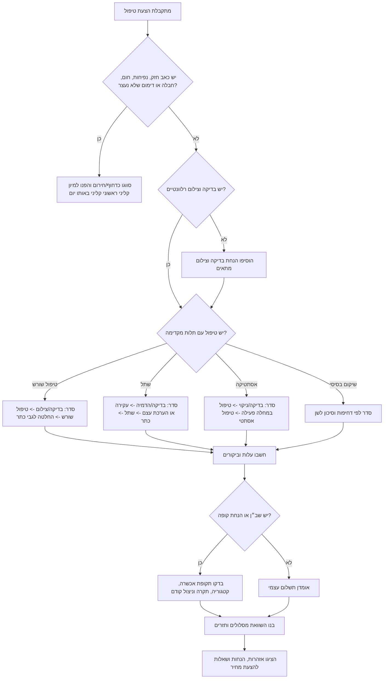

# מתכנן טיפולי שיניים

השתמשו בסקיל כדי להפוך הצעת טיפול או רשימת טיפולים לתוכנית עבודה מסודרת: שלבי טיפול, מספר ביקורים, אומדן עלות ב־₪, השוואת מסלולים, שאלות למרפאה ואזהרות שמחייבות בדיקה של רופא שיניים מורשה.

הסקיל מיועד לתכנון בלבד. אין לאבחן, לרשום טיפול, לעקוף רופא שיניים או להציג אומדן כהצעת מחיר מחייבת.

## תוצרים מרכזיים

הפיקו:

1. רשימת טיפולים נקייה עם מספרי שיניים, דחיפות, בדיקות חסרות ותלויות.
2. אומדן עלות ב־₪ עם הנחות עבודה מפורשות.
3. השוואה בין רופא פרטי, מכבידנט, כללית סמייל ומסלולים נוספים.
4. סדר ביקורים ותזרים תשלומים משוער.
5. רשימת שאלות לקבלת הצעת מחיר כתובה.
6. סעיף סיכונים רפואיים, כספיים, מינהליים ותזמוניים.

## קלט נדרש

| קלט | דוגמה | שימוש |
|---|---:|---|
| סוג מטופל | מבוגר, ילד, אזרח ותיק, עובד שמקבל סיוע | זכאות ותזמון |
| מסלול | private, maccabident, clalit_smile | מקדם מחיר |
| אזור | tel_aviv, center, jerusalem, haifa, north, south, periphery | הנחת מחיר מקומית |
| טיפולים | בדיקה, ניקוי, סתימה, טיפול שורש, כתר, שתל | עלות וסדר טיפול |
| מספר שן | 16, 46, 11 | מיפוי פעולה לשן |
| דחיפות | routine, soon, urgent, emergency | מיון קליני ראשוני ותוספת דחיפות |
| ביטוח / שב״ן | אחוז הנחה, תקרה שנתית, תקופת אכשרה | אומדן השתתפות עצמית |
| תאריך התחלה | 15/07/2026 | לוח ביקורים בפורמט ישראלי |
| מגבלת תקציב | מספר ביקורים בחודש, תקרת תשלום | פריסת תזרים |

כשמידע חסר, השתמשו בהנחות שמרניות וסמנו אותן במפורש.

## דוגמאות לקודי טיפול

תוכנית שיקום בסיסית:

```json
[
  {"code": "exam"},
  {"code": "xray_bitewing"},
  {"code": "cleaning"},
  {"code": "filling_small", "tooth": "16"},
  {"code": "root_canal_molar", "tooth": "46", "urgency": "soon"},
  {"code": "crown_porcelain", "tooth": "46"}
]
```

תכנון שתל:

```json
[
  {"code": "exam"},
  {"code": "panoramic_xray"},
  {"code": "extraction_surgical", "tooth": "36"},
  {"code": "implant", "tooth": "36"},
  {"code": "implant_crown", "tooth": "36"}
]
```

טיפול מניעתי לילד:

```json
[
  {"code": "exam"},
  {"code": "cleaning"},
  {"code": "fluoride_child"},
  {"code": "sealant_child", "quantity": 4}
]
```

## עץ החלטה



## שיטת אומדן עלות

```text
עלות ברוטו = מחיר אמצע בקטלוג × כמות × מקדם מסלול × מקדם אזור × מקדם דחיפות
כיסוי משוער = המינימום בין אחוז ההנחה הזכאי לבין יתרת התקרה השנתית
תשלום לפני מע״מ = עלות ברוטו - כיסוי משוער
מע״מ = רק אם include_vat=true; שיעור ברירת המחדל הוא 18% לפי בדיקה מ־04/06/2026
סה״כ למטופל = תשלום לפני מע״מ + מע״מ
```

מקדמי מסלול הם הנחות עבודה בלבד, לא מחירון רשמי:

| מסלול | מקדם | שימוש |
|---|---:|---|
| private | 1.00 | מרפאה פרטית או מומחה |
| maccabident | 0.78 | תכנון מסלול מרפאת קופה |
| clalit_smile | 0.80 | תכנון מסלול מרפאת קופה |
| leumit_dental | 0.82 | מסלול קופה נוסף |
| meuhedet_dental | 0.83 | מסלול קופה נוסף |

מקדמי אזור:

| אזור | מקדם |
|---|---:|
| tel_aviv | 1.12 |
| center | 1.05 |
| jerusalem | 1.06 |
| haifa | 1.00 |
| north | 0.95 |
| south | 0.94 |
| periphery | 0.90 |
| eilat | 0.92 |

החליפו את המקדמים במחירונים עדכניים ומתועדים לפני שימוש בסביבה אמיתית. מקדמי המסלול הם מקדמי תכנון בלבד, לא אחוזי הנחה רשמיים ולא מחירון מחייב.


## תמונת מקורות ישראלית מאומתת

השתמשו בעובדות הבאות לתכנון בשנת 2026 ושמרו לכל נתון תאריך מקור:

| נושא | עובדה תכנונית מאומתת | פעולה |
|---|---|---|
| מע״מ בישראל | שיעור המע״מ הרגיל הוא 18% מ־01/01/2025 ונמצא כתקף בבדיקת 2026. | השאירו `vat_rate=0.18` כש־`include_vat=true`; עדיין ודאו סיווג חשבונית. |
| ילדים | ילדים וילדות מגיל לידה עד גיל 18 זכאים לטיפולי שיניים מונעים ללא תשלום ולטיפולים משמרים בהשתתפות עצמית נמוכה במסלולי הקופות. | שאלו את מרפאת הקופה אילו פריטים כלולים ומה גובה ההשתתפות העצמית. |
| בני 72 ומעלה | משרד הבריאות מתאר זכאות לטיפולי שיניים מונעים, משמרים וחלק מהמשקמים דרך הקופות, חלקם ללא השתתפות עצמית וחלקם בהשתתפות נמוכה. | בדקו גיל, תדירות, תקרות, השתתפות עצמית וטופס התחייבות. |
| מכבידנט | מחירון 2026 ודף הזכויות מציגים מחירים והטבות לפי פריט ותוכנית. | אל תהפכו את הטבלה לאחוז הנחה אחיד; טענו מחירי פריט כשיש מקור עדכני. |
| כללית סמייל | דפי כללית מציינים הנחות של 25% במסלולים מסוימים וטיפולים משמרים ב־34 ₪ לפלטינום בגילי 18-72. | חשבו רק לאחר בדיקת חברות, גיל ותקופת אכשרה. |
| ממשקי API | לא אומת ממשק API ציבורי או אירועי webhook למחירי ספקים עבור החבילה. | התייחסו לדוגמאות `/v1/...` כחוזה מקומי, לא כנקודת קצה חיצונית. |

ראו `references/verification-log.md` לקישורי מקור, ציטוטים, תאריכי גישה ותוצאת בדיקה חוזרת.

## כללי סדר טיפול

| טיפול | חובה לבדוק לפני | שלב טיפולי מקובל |
|---|---|---|
| ניקוי אבנית | כאב פעיל, זיהום, מצב חניכיים | מניעה / הכנה |
| סתימה | בדיקה ועומק עששת | טיפול במחלה פעילה |
| טיפול שורש | צילום, אפשרות לשיקום השן, צורך בכתר | דחוף / משקם |
| כתר | חומר שן שנותר, מצב טיפול שורש, חומר מעבדתי | שיקום |
| שתל | הדמיה, נפח עצם, עישון/סוכרת, ייעוץ כירורגי | כירורגי / שיקומי |
| הלבנה | עששת, דלקת חניכיים, ניקוי קודם | מתוכנן שאינו דחוף |
| קשתיות שקופות | ייעוץ אורתודונטי, בריאות חניכיים, היענות | מתוכנן שאינו דחוף / ארוך טווח |
| תותבת | ריפוי לאחר עקירות, סגר, מצב שיניים קיימות | שיקום |

## הנחיות להשוואת מסלולים

השוו לפחות שלושה מסלולים כשאפשר:

1. רופא השיניים הנוכחי או מרפאה פרטית מומלצת.
2. מסלול מרפאת קופה כגון מכבידנט או כללית סמייל.
3. מומחה במקרה של שתל, כירורגיה, טיפול שורש מורכב, מחלת חניכיים, יישור שיניים או שיקום פה נרחב.

לעצמאים ולעסקים קטנים:

- הפרידו בין טיפול דחוף לבין טיפול מתוכנן שאינו דחוף או אסתטי.
- פרסו תשלומים לפי חודשי הכנסה צפויים.
- בקשו הצעת מחיר כתובה לפי ביקור, שלב מעבדה ושלב שיקומי.
- שמרו חשבוניות וקבלות לפי שנת מס, אך אל תניחו שהוצאה מוכרת בלי ייעוץ מס.
- אל תדחו טיפול בזיהום או כאב חריף רק כדי להחליק תזרים.

## מקרי קצה

### כאב לפני ניקוי אבנית
סווגו קודם כמיון קליני ראשוני. אל תציגו ניקוי כפתרון מספיק אם קיימים כאב, נפיחות, חום, חבלה או דימום מתמשך.

### הצעת שתל ללא הדמיה
הוסיפו אזהרה. הצעת מחיר מחייבת לשתל דורשת לרוב הדמיה ובדיקה קלינית. ציינו כתוספות אפשריות בלבד: השתלת עצם, הרמת סינוס, שן זמנית, סד כירורגי, סדציה או שכר מומחה.

### טיפול שורש בלי כתר
סמנו אי-ודאות לגבי כתר. בשיניים טוחנות נדרש לעיתים כתר אחרי טיפול שורש, אך ההחלטה תלויה בכמות חומר השן ובבדיקת הרופא.

### הלבנה כשיש עששת לא מטופלת
הקדימו טיפול במחלה פעילה. טיפול אסתטי צריך להמתין עד טיפול בעששת ובחניכיים.

### תקופת אכשרה בשב״ן
אל תחשבו הנחה עד סיום תקופת האכשרה. הוסיפו שאלה: “האם תקופת האכשרה הסתיימה עבור קטגוריית הטיפול הזאת?”

### תקרה שנתית כמעט מנוצלת
החילו רק את יתרת הזכאות. הציגו בבירור ניצול קודם ויתרת תקרה משוערת.

### טיפול לילד
ציינו שלפי מידע משרד הבריאות, ילדים וילדות מגיל לידה עד גיל 18 זכאים לטיפולי שיניים מונעים ללא תשלום ולטיפולים משמרים בהשתתפות עצמית נמוכה דרך מרפאות השיניים של קופות החולים או מרפאות שבהסכם. ודאו את סוג הטיפול, ההשתתפות העצמית ומסלול המרפאה לפני הצגת סכום.

### טיפול המשולם על ידי עסק
הפרידו בין תכנון רפואי לבין הנהלת חשבונות. סמנו החזר הוצאות, הטבת עובד והכרה במס כנושאים לרואה חשבון או יועץ מס.

### אי-ודאות לגבי מע״מ
לסימולציות בשנת 2026 השתמשו בשיעור המע״מ המאומת של 18% כאשר `include_vat=true`. אל תוסיפו מע״מ אוטומטית לטיפול שיניים קליני. השתמשו ב־`include_vat=true` רק לסימולציה של פריט חייב או פריט עסקי לא קליני. ודאו את סיווג החשבונית מול המרפאה ורואה החשבון.

## דפוסים לא רצויים

הימנעו מ:

- “זה המחיר המדויק.” כתבו “אומדן תכנוני” והציגו הנחות.
- “בחרו את הכי זול.” שקלו דחיפות, מורכבות, מומחיות, זמינות והיקף הצעה.
- “שתל תמיד עדיף על גשר.” הציגו חלופות ובקשו בדיקה קלינית.
- “אפשר לדחות טיפול דחוף בגלל תקציב.” הפנו למיון קליני ראשוני באותו יום כשיש סימני אזהרה.
- “הביטוח מכסה.” כתבו “ייתכן כיסוי אם קיימת זכאות, תקופת אכשרה הסתיימה, יש תקרה וקטגוריית הטיפול כלולה.”
- “תמיד יש מע״מ” או “אף פעם אין מע״מ.” ודאו סיווג חשבונית.
- “טיפול אסתטי קודם.” טפלו קודם בכאב, זיהום, עששת ומחלת חניכיים.

## תבנית פלט

```markdown
# תוכנית טיפולי שיניים

## תקציר
- מסלול:
- אזור:
- תאריך התחלה:
- מטרת המטופל:
- רמת ודאות: נמוכה / בינונית / גבוהה

## סדר טיפול
| שלב | טיפול | שן | ביקורים | למה עכשיו |
|---|---|---:|---:|---|

## אומדן עלות
| פריט | ברוטו | כיסוי משוער | תשלום מטופל |
|---|---:|---:|---:|

## תזרים
| חודש | ביקורים | תשלום משוער |
|---|---:|---:|

## השוואת מסלולים
| מסלול | סה״כ משוער למטופל | יתרונות | שאלות |
|---|---:|---|---|

## אזהרות
- ...

## שאלות למרפאה
- האם הצעת המחיר כתובה וסופית?
- אילו פריטים לא כלולים?
- האם המחיר כולל עבודת מעבדה, כתר זמני, צילום, תרופות, סדציה ומעקב?
- מי הרופא או המומחה שמבצע כל שלב?
- מה מדיניות הביטול והחירום?
```

## שימוש מהיר ב־CLI

```bash
python scripts/dental-treatment-planner-cli.py sample --output plan.json
python scripts/dental-treatment-planner-cli.py validate plan.json
python scripts/dental-treatment-planner-cli.py estimate plan.json --markdown
python scripts/dental-treatment-planner-cli.py compare plan.json
python scripts/dental-treatment-planner-cli.py schedule plan.json
```

## פתרון תקלות מהיר

| סימפטום | סיבה אפשרית | תיקון |
|---|---|---|
| קוד טיפול לא מוכר | הקוד לא נמצא בקטלוג | הריצו `catalog list` ומפו את ניסוח המרפאה |
| האומדן נמוך מדי | חסר כתר, צילום, מעבדה, כירורגיה או מומחה | הוסיפו תלויות ותוספות סיכון |
| האומדן גבוה מדי | מסלול שמרני מדי או כמות כפולה | בדקו כמות, מספר שן ומסלול |
| אין כיסוי | תקופת אכשרה, קטגוריה לא כלולה או תקרה מנוצלת | בדקו את שדות הביטוח |
| לוח הזמנים צפוף מדי | מגבלת ביקורים גבוהה מדי | הקטינו `max_visits_per_month` |

## רשימת בדיקה לפרודקשן

- [ ] החליפו את ערכי הקטלוג במחירונים עדכניים.
- [ ] תעדו תאריך מקור לכל מחירון.
- [ ] ודאו דרישות עדכניות של משרד הבריאות, קופות החולים, הגנת הצרכן, פרטיות ומיסוי.
- [ ] בצעו בדיקת פרטיות לפני שמירת מידע רפואי.
- [ ] אל תשמרו מספרי זהות אלא אם יש צורך חוקי והגנה מתאימה.
- [ ] הצפינו קבצים עם מידע רפואי.
- [ ] הוסיפו נוסח הסכמה לקבצים שמטופלים מעלים.
- [ ] נהלו יומן שינויים למחירונים.
- [ ] ודאו שאין פלט שמציג אבחנה רפואית.
- [ ] בדקו עברית ואנגלית עם אנשי מקצוע מקומיים.
- [ ] בדקו טיפול בסימני חירום.
- [ ] בדקו תקרה שנתית ותקופת אכשרה.
- [ ] בדקו תרחישי ילד, אזרח ותיק, שתל, אורתודונטיה והוצאה עסקית.
- [ ] סמנו כל השוואת מסלולים כאומדן בלבד.
