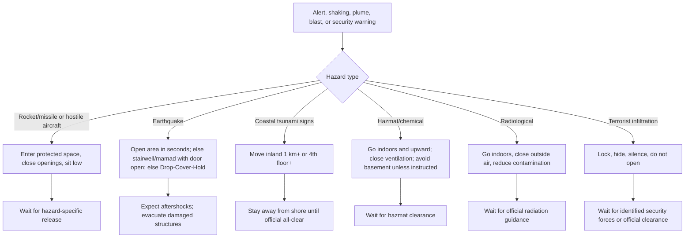
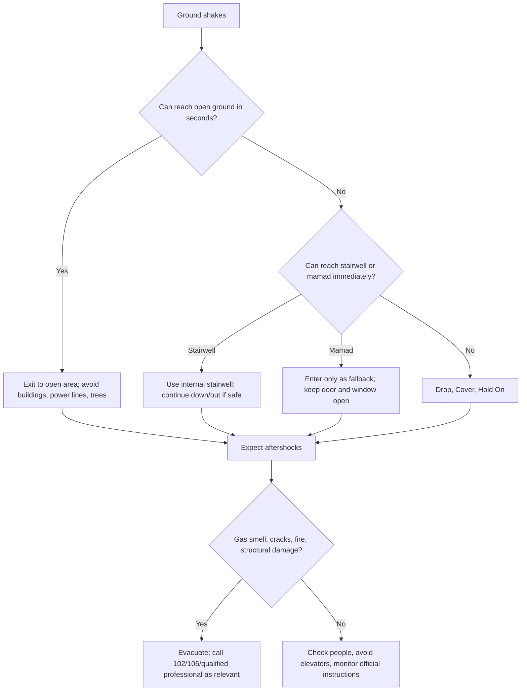
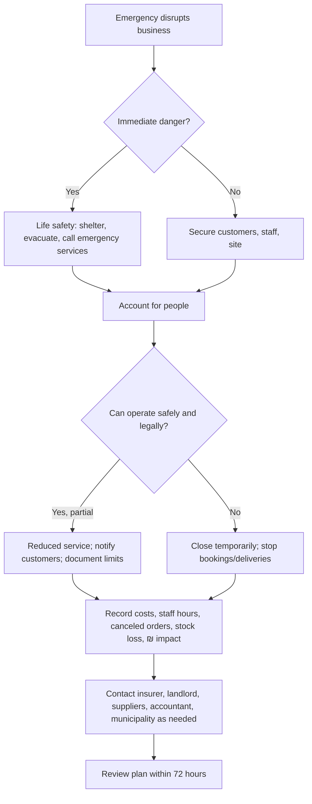

# Disaster-Preparedness Guide for Israel

Use this guide to make a practical emergency plan for a home, rental apartment, freelance work routine, retail shop, clinic, workshop, office, or consumer situation in Israel. Prefer short, imperative instructions during active danger. Use longer checklists for preparation, drills, and recovery.

Official current instructions override every section. Treat this guide as preparedness support, not as live alerting, legal advice, engineering approval, medical direction, or a substitute for emergency services.

## Emergency numbers and official channels

| Need | Contact | Use |
|---|---:|---|
| Police | 100 | Terrorist infiltration, suspicious object, public security threat |
| MDA ambulance | 101 | Injury, urgent medical emergency, severe physical symptoms |
| Fire and Rescue | 102 | Fire, gas smell, trapped people, hazardous materials, structural danger |
| Home Front Command | 104 | Alert-area and protected-space guidance |
| Municipality/local authority | 106 or local number | Shelter access, infrastructure, welfare, local evacuation |
| Emotional support | 1201 | Emotional first aid and distress support |

Keep two alert channels active: Home Front Command app plus siren, radio, Cell Broadcast, or a trusted local channel. Do not rely on forwarded screenshots as the only alert source.

## First decision: identify the hazard

## Prepare before emergencies

### Household checklist

1. Identify the protected space: mamad, mamak, miklat, internal stairwell, or safest interior room.
2. Time the route from every room during daytime and at night.
3. Remove obstacles permanently: shoes, toys, boxes, bicycles, and extension cords.
4. Keep supplies near the protected space: water, flashlight, power bank, radio, first-aid kit, medication, glasses, baby supplies, pet leash/carrier, paper contacts, ID copies, cash, and spare keys.
5. Set roles: adult for children, adult for pets/door/phone, older child for flashlight or water.
6. Create a regroup point outside the building and an out-of-area contact.
7. Practice calmly; avoid frightening simulations.

### Small-business checklist

1. Assign a shift lead, customer escort, accessibility buddy, incident recorder, first-aid contact, and door/lock role.
2. Mark the safest route for customers and staff with simple signs.
3. Define what stops immediately: checkout, treatment, machine work, cooking, delivery, stock handling, or client meetings.
4. Keep business supplies: first-aid kit, flashlight, power bank, paper staff list, supplier contacts, insurance policy number, landlord contact, spare keys, and critical system access procedure.
5. Back up bookkeeping: invoices, receipts, payroll, inventory, contracts, customer property records, VAT/tax documents where relevant.
6. Decide closure authority: who closes, who notifies staff, who updates customers, and who records losses in ₪.
7. Include accessibility: wheelchair route, hearing/vision support, older customers, children, non-Hebrew speakers, and panic response.

### Freelancer checklist

1. Keep a portable work kit: charger, power bank, hotspot/SIM backup, ID copy, medication, notebook, and receipt folder.
2. Back up contracts, invoices, deliverables, tax documents, insurance, and client communications.
3. Prepare a customer delay notice.
4. Know safe spaces at home, coworking spaces, client sites, cafés, transit stations, and common driving routes.
5. Track disruption: date, time, client, lost work, invoice affected, ₪ amount, screenshots, and official instruction evidence.

## Protected-space hierarchy for rocket and missile alerts

1. Mamad/mamak/miklat reachable within the local time-to-shelter.
2. Internal stairwell, away from exterior walls and not directly under the roof.
3. Interior room with minimal openings when no better option is reachable.
4. Outdoors: lie face down, protect head, move away from glass, vehicles, trees, and loose objects.
5. Vehicle: stop safely; exit and move away if safe; otherwise lower below window line and protect head.

Edge cases:
- Top-floor apartment: prefer internal stairwell if reachable; avoid staying below roof exposure.
- Locked public shelter: use the best available safe space now; report access after the event.
- Elevator: do not use it for shelter access.
- Shop with customers: safety comes before payment, stock, and closing the till.
- Delivery worker: avoid stopping under bridges, near fuel stations, beside glass, or in traffic lanes.

## Protocols by hazard

### Rocket or missile alert

Immediate actions: enter protected space, close door/window/shutter, sit below window line against an internal wall, protect head and neck, keep children close, and wait for official or hazard-specific release. Outdoors, enter a building if reachable; otherwise lie face down away from vehicles and glass. In a vehicle, stop safely and exit if possible.

Leaving: short-range rocket fire is often treated with about 10 minutes after the last impact/alert unless instructed otherwise. Long-range ballistic threats require explicit official release; do not assume a fixed 10-minute rule. Silence is not an all-clear.

Business example: a grocery store with customers stops checkout, escorts customers to the protected area, leaves unpaid items, and records closure time only after safety is restored.

### Hostile aircraft or drone

Enter protected space immediately, close doors and windows, stay away from exterior walls and windows, and wait at least 10 minutes unless another alert is received or Home Front Command gives a different explicit instruction. A hostile aircraft may cross several alert areas, so do not leave early to watch, film, or inspect debris. Call 100 for suspicious objects or crash sites.

### Earthquake

Earthquake response is different from missile response.

After shaking: do not use elevators, check injuries, leave damaged structures, call 102 for gas/fire/trapped people, and expect aftershocks. In coastal areas, watch for tsunami alerts and natural signs such as rapid sea withdrawal.

### Tsunami

Applies to Mediterranean and Red Sea coastal areas. Warning signs include strong earthquake near the coast, rapid sea withdrawal, unusual roar, or official alert. Move at least 1 km inland where possible. If trapped near the shore, go to the 4th floor or higher of a sturdy building. Leave buildings of three floors or fewer near the shore. Do not return to beaches, ports, marinas, or river mouths until official all-clear.

### Hazardous materials or chemical event

Enter a building, usually move upward, close windows/doors/outside-air ventilation, seal gaps if instructed, and avoid basements unless officials specifically direct otherwise. If exposed, remove outer clothing carefully, bag it, rinse skin gently, and seek official medical guidance. Do not mix cleaning chemicals or clean unknown residue without trained guidance. Businesses storing chemicals must keep inventory and safety data sheets where required.

### Radiological event

Treat radiological alerts as official-instruction events, not as a do-it-yourself cleanup task. Follow Home Front Command, police, fire-and-rescue, MDA, Ministry of Health, and local-authority instructions as issued. If instructed to shelter indoors, move to the directed room, close openings and outside-air ventilation, and wait for updated instructions. If direct contamination is suspected, avoid spreading it and wait for emergency or medical instructions before cleaning, discarding items, or leaving. Do not take iodine tablets, medications, or improvised protective substances unless explicitly instructed by a medical or official authority.

### Terrorist infiltration or active security incident

Enter a building or interior room, lock doors and windows, silence phones, move away from doors/windows/exterior walls, do not open for unknown people, and call 100 only when safe with location, number of people, visible threat direction, and injuries. Do not publish live security-force locations or hiding places.

## Special populations and accessibility

Children: use short repeated instructions, keep a comfort item, avoid graphic news, and give older children a simple role.

Older adults: keep glasses, hearing aids, medication, cane/walker, and phone near bed; arrange neighbor check-in; use closest safe area if the formal shelter is unreachable in time.

Mobility disabilities: check door widths and turning radius, keep routes clear, choose an accessible protected area, and assign buddy support without depending on one person.

Hearing disability: enable vibration/visual alerts, maintain nighttime alerts, and agree on visual signals.

Vision disability: keep route unchanged, use tactile markers if helpful, and store cane or guide-dog equipment in a fixed place.

Cognitive disability, autism, PTSD, or anxiety: use visual routine cards, calm practice, noise-reduction headphones if helpful, and grounding steps after the alert. Use 1201 or professional help for continuing distress.

## Business continuity decision tree

Minimum business plan: staff roster, emergency contacts, supplier list, insurance and lease contacts, data backups, accounting records, customer notice template, accessibility support, safe shutdown, and reopening criteria.

Reopening criteria: official restrictions lifted, structure safe, electricity/water/ventilation acceptable, sanitation restored, stock safe, staff available, payment system works, and customer communications sent.

## Troubleshooting quick table

| Problem | Action |
|---|---|
| Siren but no app alert | Treat siren as real; enter protected space; fix app settings later |
| App alert but no siren | Follow official app/Cell Broadcast if area applies |
| Locked shelter | Use next safest area; report later |
| Mamad used as storage | Clear path, door, window, and seating area |
| Customer refuses shelter | Give one clear instruction and point to route; do not debate |
| Power outage | Use flashlight/radio/power bank; avoid candles if gas damage possible |
| Gas smell after quake | Leave, avoid switches/flames, call 102 |
| Unknown residue | Do not touch/clean; isolate; follow 102/official guidance |

## Anti-patterns

Avoid finishing a purchase during an alert; filming interceptions; assuming every alert ends after 10 minutes; closing a mamad door during an earthquake; going to a basement for chemical plume without instruction; using elevators after earthquakes; mixing cleaning chemicals; posting live security information; building a plan around one phone/person/route; hiding supplies behind heavy boxes; forgetting pets; and failing to document business loss with dates, invoices, receipts, photos, and ₪ amounts.

## Production checklist

- [ ] State that current official instructions override the guide.
- [ ] Identify the hazard before prescribing action.
- [ ] Separate missile, earthquake, hazmat, radiological, tsunami, and security behavior.
- [ ] During active danger, give short concrete actions first.
- [ ] Include emergency numbers when relevant.
- [ ] Avoid medication instructions except official/medical direction.
- [ ] Avoid claiming a live official alert API.
- [ ] Localize terms: mamad, miklat, mamak, 104, 106, ₪, Israel-specific records.
- [ ] For business users, include staff, customers, accessibility, records, suppliers, insurance, and reopening criteria.
- [ ] For households, include children, older adults, disabilities, pets, medication, and nighttime route.
- [ ] Use neutral voice with no visual marks and badges, author attribution, or distribution branding.
