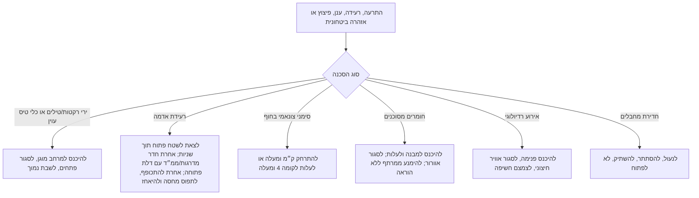
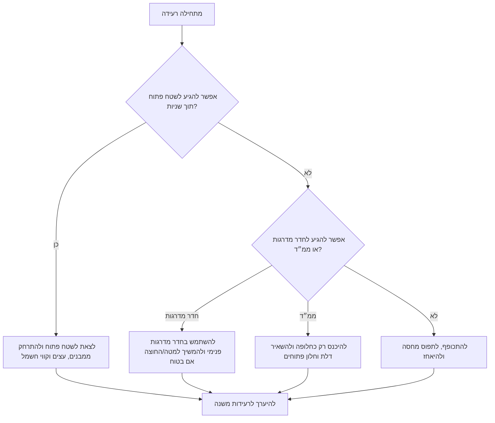
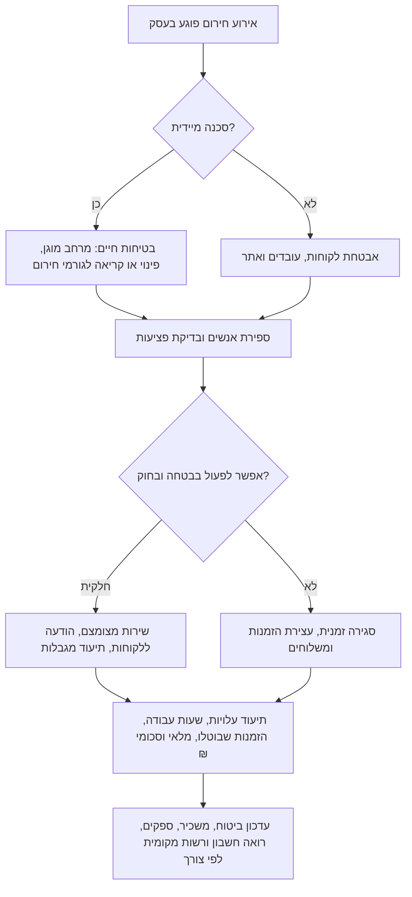

# מדריך היערכות לחירום בישראל

המדריך מיועד למשקי בית, דירות שכורות, עצמאים, נותני שירות עצמאיים, חנויות, מרפאות, סדנאות ומשרדים קטנים. בזמן סכנה פעילה יש להשתמש בהוראות קצרות וברורות. בתכנון, תרגול ושיקום יש להשתמש ברשימות הבדיקה המלאות.

הנחיות רשמיות ועדכניות גוברות על כל סעיף. אין להשתמש במדריך כתחליף להתרעה חיה, ייעוץ משפטי, אישור הנדסי, הוראה רפואית או שירות חירום.

## מספרי חירום וערוצים רשמיים

| צורך | מספר | שימוש |
|---|---:|---|
| משטרה | 100 | חדירת מחבלים, חפץ חשוד, אירוע ביטחוני |
| מד״א | 101 | פציעה, אירוע רפואי דחוף, סימנים גופניים קשים |
| כבאות והצלה | 102 | שריפה, ריח גז, לכודים, חומרים מסוכנים, חשש מבני |
| פיקוד העורף | 104 | הנחיות התגוננות, אזורי התרעה, מרחב מוגן |
| מוקד עירוני | 106 או מספר מקומי | מקלטים, תשתיות, רווחה, פינוי מקומי |
| ער״ן | 1201 | עזרה ראשונה נפשית ומצוקה |

יש לשמור שני ערוצי התרעה לפחות: יישומון פיקוד העורף יחד עם צופר, רדיו, התרעת חירום סלולרית או ערוץ מקומי מוסמך. אין להסתמך רק על צילום מסך שהועבר בקבוצה.

## החלטה ראשונה: לזהות את סוג הסכנה

## היערכות מראש

### משק בית

1. לזהות מרחב מוגן: ממ״ד, ממ״ק, מקלט, חדר מדרגות פנימי או חדר פנימי בטוח.
2. למדוד את הדרך מכל חדר ביום ובלילה.
3. להשאיר מעבר פנוי מנעליים, צעצועים, ארגזים, אופניים וכבלים.
4. להחזיק ליד המרחב המוגן מים, פנס, מטען נייד, רדיו, עזרה ראשונה, תרופות, משקפיים, ציוד תינוקות, רצועה/כלוב לבעל חיים, אנשי קשר מודפסים, צילום תעודות, מזומן ומפתחות.
5. לקבוע תפקידים: ילד קטן, בעל חיים, דלת/טלפון, פנס או מים.
6. לקבוע נקודת מפגש מחוץ לבניין ואיש קשר מחוץ לאזור.
7. לתרגל ברוגע, בלי הפחדה.

### עסק קטן, חנות, מרפאה או משרד

1. להגדיר אחראי משמרת, מלווה לקוחות, מלווה נגישות, רושם אירוע, איש עזרה ראשונה ואחראי דלת/נעילה.
2. לסמן מסלול למרחב מוגן בשילוט פשוט.
3. לקבוע מה נעצר מיד: קופה, טיפול, מכונה, בישול, משלוח, טיפול במלאי או פגישה.
4. להחזיק תיק עסקי: עזרה ראשונה, פנס, מטען נייד, רשימת עובדים, ספקים, פוליסת ביטוח, בעל נכס/משכיר, מפתחות ותהליך גישה למערכות קריטיות.
5. לגבות הנהלת חשבונות: חשבוניות מס, קבלות, תלושי שכר, מלאי, חוזים, רכוש לקוחות, מסמכי מע״מ ומס הכנסה לפי רלוונטיות.
6. לקבוע מי מוסמך לסגור, מי מודיע לעובדים, מי מעדכן לקוחות ומי מתעד הפסדים ב-₪.
7. לכלול נגישות: כיסא גלגלים, לקות שמיעה/ראייה, קשישים, ילדים, תיירים ולקוחות שאינם דוברי עברית.

דוגמה לתיעוד: ביום 04/06/2026 נסגרה מרפאה לשעתיים, בוטלו 4 תורים בשווי 1,600 ₪, נשמרו הודעות ללקוחות וצילום מסך של ההנחיה הרשמית.

### עצמאים ונותני שירות עצמאיים

1. להחזיק תיק עבודה נייד: מטען, סוללה, נקודה חמה/סים חלופי, צילום תעודה, תרופות, מחברת ותיקיית קבלות.
2. לגבות חוזים, חשבוניות, קבלות, תוצרים, מסמכי מס, ביטוח ותכתובות לקוח.
3. להכין הודעת עיכוב קצרה ללקוח.
4. לזהות מרחב מוגן בבית, חלל עבודה, אתר לקוח, בית קפה, תחנת מעבר ומסלול נסיעה.
5. לתעד הפרעה: תאריך, שעה, לקוח, עבודה שאבדה, חשבונית, סכום ב-₪, צילום מסך והנחיה רשמית.

## סדר עדיפויות בירי רקטות וטילים

1. ממ״ד, ממ״ק או מקלט שניתן להגיע אליו בזמן ההתגוננות.
2. חדר מדרגות פנימי, לא בצמוד לקיר חיצוני ולא ישירות מתחת לגג.
3. חדר פנימי עם מעט פתחים אם אין חלופה טובה יותר.
4. בחוץ: לשכב על הקרקע, פנים מטה, להגן על הראש ולהתרחק מזכוכית, כלי רכב, עצים וחפצים לא מקובעים.
5. ברכב: לעצור בבטחה; לצאת ולהתרחק אם אפשר; אחרת להתכופף מתחת לקו החלונות.

## פרוטוקולים לפי סכנה

### ירי רקטות וטילים

להיכנס למרחב מוגן, לסגור דלת וחלון/תריס, לשבת מתחת לקו החלון ליד קיר פנימי, להגן על הראש והעורף ולהמתין להנחיית יציאה מתאימה. בחוץ להיכנס למבנה אם ניתן, אחרת לשכב רחוק מכלי רכב וזכוכית. ברכב לעצור בבטחה ולצאת אם ניתן.

ביציאה: בירי קצר טווח מקובל להמתין כ־10 דקות אחרי נפילה/יירוט אחרון אם לא ניתנה הוראה אחרת. באיום בליסטי ארוך טווח אין להסתמך אוטומטית על 10 דקות; יש להמתין לשחרור רשמי. שקט אינו הודעת סיום.

דוגמה עסקית: חנות מכולת עוצרת קופה, מובילה לקוחות למרחב מוגן, משאירה מוצרים בקופה ומתעדת סגירה רק אחרי החזרה לבטיחות.

### חדירת כלי טיס עוין

להיכנס מיד למרחב מוגן, לסגור דלתות וחלונות, להתרחק מקירות חיצוניים וחלונות ולהמתין 10 דקות לפחות, אלא אם התקבלה התרעה נוספת או ניתנה הנחיה מפורשת אחרת מפיקוד העורף. כלי טיס עוין עלול לחלוף על פני כמה אזורי התרעה, ולכן אין לצאת מוקדם כדי לצפות, לצלם או לבדוק שברים. לחפץ חשוד או נפילה יש להתקשר 100.

### רעידת אדמה

ברעידת אדמה ההתנהגות שונה מירי טילים.

אחרי הרעידה אין להשתמש במעליות, יש לבדוק פציעות, לצאת ממבנה פגוע, להתקשר 102 לריח גז/שריפה/לכודים ולהיערך לרעידות משנה. באזור חוף יש לשים לב להתרעת צונאמי ולסימנים טבעיים כמו נסיגת ים חריגה.

### צונאמי

רלוונטי לחופי הים התיכון וים סוף. סימנים: רעידה חזקה ליד חוף, נסיגת ים מהירה, רעש חריג מהים או התרעה רשמית. יש להתרחק לפחות ק״מ מהחוף אם ניתן. אם אין זמן, לעלות לקומה 4 ומעלה במבנה יציב. לצאת ממבנים בני 3 קומות ומטה בקרבת החוף. אין לחזור לחוף, לנמל, למרינה או לשפך נחל עד הודעת סיום.

### חומרים מסוכנים

להיכנס למבנה, בדרך כלל לעלות לקומה גבוהה, לסגור חלונות, דלתות ואוורור חיצוני, ולאטום חריצים אם ניתנה הוראה. אין לרדת למרתף או מקלט תת קרקעי ללא הוראה מפורשת. אם הייתה חשיפה, להסיר בגד חיצוני בזהירות, להכניס לשקית, לשטוף עור בעדינות ולפעול לפי הנחיה רפואית. אין לערבב חומרי ניקוי ואין לנקות שאריות לא מזוהות ללא גורם מוסמך.

### אירוע רדיולוגי

להתייחס לאירוע רדיולוגי כאירוע שבו פועלים לפי הנחיות רשמיות בלבד, ולא כמשימת ניקוי עצמאית. לפעול לפי פיקוד העורף, משטרת ישראל, כבאות והצלה, מד״א, משרד הבריאות והרשות המקומית כפי שיונחו בזמן האירוע. אם ניתנה הנחיה להסתגר במבנה, לעבור לחדר שהוגדר בהנחיה, לסגור פתחים ואוורור חיצוני ולהמתין לעדכון רשמי. אם יש חשד לזיהום ישיר, להימנע מהפצתו ולהמתין להנחיה רפואית או רשמית לפני ניקוי, השלכת ציוד או יציאה. אין לקחת טבליות יוד, תרופות או חומרי מיגון מאולתרים ללא הנחיה מפורשת מגורם רפואי או רשמי.

### חדירת מחבלים או אירוע ביטחוני פעיל

להיכנס למבנה או חדר פנימי, לנעול דלתות וחלונות, להשתיק טלפונים, להתרחק מדלתות/חלונות/קירות חיצוניים, לא לפתוח לאדם לא מזוהה ולהתקשר 100 רק כשבטוח. אין לפרסם מיקום כוחות, מסתתרים או נתיבי תנועה.

## אוכלוסיות מיוחדות ונגישות

ילדים: להשתמש בהוראות קצרות, להשאיר חפץ מרגיע, לצמצם חדשות קשות ולתת לילדים גדולים תפקיד פשוט.

קשישים: לשמור משקפיים, מכשיר שמיעה, תרופות, מקל/הליכון וטלפון ליד המיטה; לתאם בדיקת שכן; להשתמש בחלופה קרובה אם המקלט לא נגיש בזמן.

מוגבלות בניידות: לבדוק רוחב דלתות וסיבוב כיסא גלגלים, לשמור נתיב פנוי, לבחור מרחב מוגן נגיש ולמנות מלווה בלי תלות באדם יחיד.

לקות שמיעה: להפעיל רטט/אור, לשמור התרעות בלילה ולקבוע סימנים מוסכמים.

לקות ראייה: לא לשנות את המסלול, להשתמש בסימון מישושי לפי צורך ולהשאיר מקל או ציוד כלב נחייה במקום קבוע.

אוטיזם, מוגבלות קוגניטיבית, פוסט טראומה או חרדה: להכין כרטיסיות שגרה, לתרגל ברוגע, להחזיק אוזניות מפחיתות רעש ולבצע תרגילי קרקוע. למצוקה מתמשכת ניתן לפנות לער״ן 1201 או לגורם מקצועי.

## רציפות עסקית

תוכנית מינימום: רשימת עובדים, אנשי קשר, ספקים, ביטוח ושכירות, גיבוי נתונים, חשבוניות, קבלות, מלאי, שכר, הודעת לקוח, נגישות, כיבוי בטוח וקריטריונים לפתיחה מחדש.

קריטריוני פתיחה: הוסרו מגבלות רשמיות, המבנה בטוח, חשמל/מים/אוורור תקינים, ניקיון ותברואה תקינים, מלאי בטוח, עובדים זמינים, מערכת תשלום פעילה והלקוחות עודכנו.

## תקלות מהירות

| תקלה | פעולה |
|---|---|
| צופר בלי התרעת יישומון | להתייחס כאירוע אמיתי; להיכנס למרחב מוגן; לתקן הגדרות אחר כך |
| התרעת יישומון בלי צופר | לפעול לפי התרעה רשמית אם האזור מתאים |
| מקלט נעול | להשתמש בחלופה עכשיו; לדווח אחר כך |
| ממ״ד כמחסן | לפנות נתיב, דלת, חלון ומקומות ישיבה |
| לקוח מסרב להיכנס | לתת הוראה אחת ברורה ולהצביע על המסלול; לא להתווכח |
| הפסקת חשמל | להשתמש בפנס/רדיו/מטען; להימנע מנרות אם יש חשש לגז |
| ריח גז אחרי רעידה | לצאת, לא להפעיל מתגים או אש, להתקשר 102 |
| שארית לא מזוהה | לא לגעת ולא לנקות; לבודד ולפעול לפי 102/הנחיה רשמית |

## דפוסים מסוכנים

אין לסיים רכישה בזמן התרעה, לצלם יירוטים, להניח שכל אירוע מסתיים אחרי 10 דקות, לסגור דלת ממ״ד ברעידת אדמה, לרדת למרתף באירוע כימי ללא הוראה, להשתמש במעליות אחרי רעידה, לערבב חומרי ניקוי, לפרסם מידע ביטחוני חי, לבנות תוכנית סביב טלפון/אדם/מסלול אחד, להחביא ציוד מאחורי ארגזים, לשכוח בעלי חיים או לא לתעד הפסדים עסקיים עם תאריכים, חשבוניות, קבלות, תמונות וסכומי ₪.

## רשימת בדיקה להטמעה

- [ ] לציין שהנחיות רשמיות ועדכניות גוברות.
- [ ] לזהות סוג סכנה לפני מתן פעולה.
- [ ] להבדיל בין טילים, רעידת אדמה, חומרים מסוכנים, אירוע רדיולוגי, צונאמי ואירוע ביטחוני.
- [ ] בזמן סכנה לתת פעולה קצרה לפני הסבר.
- [ ] לכלול מספרי חירום רלוונטיים.
- [ ] לא לתת הוראות תרופה ללא הנחיה רפואית/רשמית.
- [ ] לא לטעון לקיום API התרעות רשמי חי.
- [ ] להשתמש במונחים ישראליים: ממ״ד, מקלט, ממ״ק, 104, 106, ₪, הנהלת חשבונות.
- [ ] לעסק: עובדים, לקוחות, נגישות, ספקים, ביטוח, תיעוד ופתיחה מחדש.
- [ ] לבית: ילדים, קשישים, מוגבלויות, בעלי חיים, תרופות ומסלול לילה.
