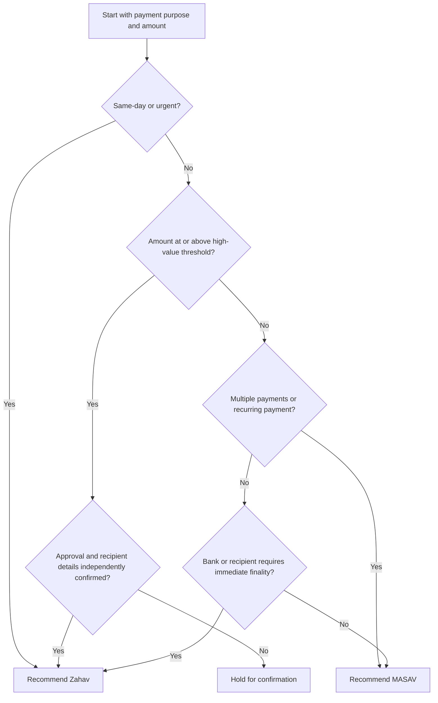
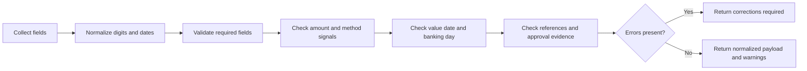

# Domestic Bank Transfer Form Helper

Use this skill to prepare Israeli domestic bank transfer data before copying it into a bank portal, accounting system, payroll workflow, approval queue, or internal payment register. Validate bank code, branch code, account number, amount, value date, transfer method, purpose, reference, recipient confirmation, and approval evidence.

This skill does not execute transfers, connect to a bank, bypass bank controls, or replace legal, tax, accounting, anti-money-laundering, or bank-specific advice. Confirm current limits, cutoffs, charges, and required fields with the bank before production use.

## Intended users

Use the helper for:

- Small businesses paying Israeli suppliers.
- Freelancers paying subcontractors or receiving client bank details for refunds.
- Bookkeepers preparing batches for approval.
- Payroll coordinators validating account details before MASAV submission.
- Consumers preparing a high-value Zahav transfer.
- Finance teams replacing uncontrolled spreadsheet copy-paste routines.

## Field model

| Field | Required | Validation | Example |
|---|---:|---|---|
| `recipient_name` | Yes | Non-empty legal or account name | `Example Supplier Ltd` |
| `payer_name` | No | Non-empty when available | `Acme Israel Ltd` |
| `bank_code` | Yes | 1 to 3 digits after normalization; checked against local reference table | `12` |
| `branch_code` | Yes | 1 to 3 digits; normalized to 3 digits | `045` |
| `account_number` | Yes | 4 to 12 digits after removing spaces and separators | `123456789` |
| `amount_ils` | Yes | Decimal amount greater than zero | `₪2,450.80` |
| `value_date` | Conditional | `YYYY-MM-DD`, `DD-MM-YYYY`, or `DD/MM/YYYY`; not in the past | `03/06/2026` |
| `method` | No | `auto`, `masav`, or `zahav` | `auto` |
| `purpose` | Recommended | Invoice, salary month, rent, refund, tax period, or other business reason | `Invoice 1007` |
| `reference` | Recommended | Short internal or bank reference, default limit 35 characters | `INV-1007` |
| `urgent` | No | Boolean signal for Zahav recommendation | `false` |
| `same_day` | No | Boolean signal for Zahav recommendation | `true` |
| `recurring` | No | Boolean signal for MASAV recommendation | `true` |
| `bulk_count` | No | Number of transfers in the batch | `20` |
| `approved_by` | Conditional | Recommended for production and high-value transfers | `Finance Manager` |
| `source_document_id` | Recommended | Invoice, payroll run, refund ticket, tax voucher, or approval identifier | `INV-1007` |

## Transfer-method decision tree

Use MASAV for routine, non-urgent, recurring, or bulk domestic payments. Use Zahav when same-day settlement, urgency, high value, or irreversible finality is required and approved.



## Validation flow



## Concrete examples

### Routine supplier transfer

Input:

```json
{
  "recipient_name": "Example Supplier Ltd",
  "bank_code": "12",
  "branch_code": "456",
  "account_number": "123456789",
  "amount_ils": "2450.80",
  "value_date": "03/06/2026",
  "purpose": "Invoice 1007",
  "reference": "INV-1007",
  "method": "auto"
}
```

Expected outcome:

- Valid request.
- Normalized bank, branch, and account values.
- Recommended method: MASAV.
- Add an information note when independent recipient-detail confirmation is recommended by amount.

### Urgent same-day payment

Input changes:

```json
{
  "same_day": true,
  "urgent": true,
  "amount_ils": "18500",
  "approved_by": "Finance Manager"
}
```

Expected outcome:

- Valid request when all required fields are present.
- Recommended method: Zahav.
- Prompt the operator to check same-day cutoff and irreversible settlement implications.

### Payroll batch

Input changes:

```json
{
  "bulk_count": 24,
  "purpose": "Salary 05/2026",
  "value_date": "09/06/2026"
}
```

Expected outcome:

- Recommended method: MASAV.
- Validate each row separately.
- Stop the batch when any employee row has an invalid account number, invalid amount, or missing recipient.

## Edge cases

| Edge case | Expected handling |
|---|---|
| Branch `7` | Normalize to `007`; warn that leading-zero padding must match the bank form. |
| Bank code `012` | Normalize to `12`. |
| Account `12-345 678` | Normalize to `12345678`. |
| Amount `₪1,234.56` | Parse as `1234.56`. |
| Amount `0` or negative amount | Return an error. |
| Unknown bank code | Return a warning, not an error, because bank-code tables can change. |
| Value date on Friday or Saturday | Return a calendar warning. Friday and holiday eves can be short business days; Saturday and holidays can be closed. Check the Bank of Israel operating-day calendar and the bank cutoff. |
| Value date before today | Return an error. |
| High-value MASAV selected manually | Return a warning and suggest Zahav or extra approval. |
| Long reference | Warn about truncation risk. |
| Missing purpose | Warn and request a practical business reason. |
| Production payment over ₪50,000 without approver | Warn under the helper's internal policy and require documented approval before portal entry. |
| High-value payment over ₪1,000,000 | Recommend Zahav under the helper's internal threshold and require independent recipient confirmation. This is not an official minimum or legal limit. |
| Refund to consumer | Use purpose `refund`, capture source order or credit note, verify recipient ownership. |
| Tax authority payment | Capture voucher period, entity number, and approval evidence. |


## Web-validated operating notes for 2026

Apply these notes when preparing domestic Israeli transfer forms:

- Use official Bank of Israel identification-code sources for bank and payment-system codes. Code `9` is Postal Finance and code `54` is Bank of Jerusalem. Treat the local table as a convenience snapshot, not an authoritative register.
- Treat Friday and holiday eves as possible short business days, not as a simple weekend rule. Treat Saturday and listed holidays as closure risks.
- Use Zahav when same-day final settlement is required. Official material describes Zahav as RTGS with final, irrevocable settlement and no minimum customer amount, while bank fees and bank portal cutoffs remain bank-specific.
- Use MASAV for routine domestic shekel credits, debits, payroll, tax payments, refunds, and batches when same-day finality is not required.
- Treat `₪50,000` production approval and `₪1,000,000` high-value routing thresholds as internal configurable controls. Do not present them as legal thresholds or Bank of Israel limits.
- Use 18% VAT only for tax-payment purpose text or accounting references where relevant. VAT does not validate the bank transfer itself.

## Anti-patterns

Avoid these practices:

- Copying bank details from an email thread without independent confirmation.
- Combining branch and account number into one field.
- Dropping leading zeroes from branch fields.
- Reusing a successful old transfer as proof that changed bank details are safe.
- Sending high-value urgent transfers without maker-checker approval.
- Treating a warning as approval to bypass bank or accounting controls.
- Submitting payroll when one row fails validation.
- Using free-text references that expose unnecessary personal data.
- Assuming MASAV and Zahav cutoffs are identical across banks.
- Assuming the local bank-code table is authoritative after mergers or bank changes.

## Troubleshooting summary

| Symptom | Likely cause | Action |
|---|---|---|
| Bank portal rejects branch | Missing leading zero, closed branch, wrong bank pair | Confirm branch from official bank confirmation and enter three digits. |
| Recipient reports non-receipt | MASAV processing window, rejected batch row, wrong account | Check bank confirmation, batch status, and value date. |
| Zahav option unavailable | Cutoff passed, user lacks permission, bank limit reached | Escalate to bank administrator or use next business day. |
| Reference truncated | Bank field limit lower than internal reference | Shorten reference and store full reference internally. |
| Payroll batch rejected | One invalid row or duplicate format issue | Validate each row, fix failures, regenerate batch. |
| Warning on unknown bank code | Local reference table is stale or recipient gave wrong code | Confirm with bank or recipient before submission. |

## Production checklist

Complete this checklist before using the output in a live banking flow:

1. Confirm bank-specific field limits, branch list, cutoffs, and approval rules.
2. Set `--env production` only for production approval review.
3. Store source document identifiers for invoices, salaries, tax vouchers, refunds, and rent.
4. Use independent confirmation for new or changed recipient bank details.
5. Require maker-checker approval for high-value, urgent, payroll, and new-recipient payments.
6. Validate each MASAV batch row before upload.
7. Keep full account numbers only where access is controlled; show redacted account numbers in routine reports.
8. Record warnings and approval decisions in the payment file.
9. Reconcile bank confirmation after submission.
10. Review rejected transfers and feed corrected scenarios into regression tests.

## CLI quick start

Install:

```bash
pip install -e .
pip install -r requirements-dev.txt
```

Create a local record:

```bash
domestic-bank-transfer-helper --env sandbox create   --recipient-name "Example Supplier Ltd"   --bank-code 12   --branch-code 456   --account-number 123456789   --amount-ils "2450.80"   --value-date "03/06/2026"   --purpose "Invoice 1007"   --reference "INV-1007"
```

Extract the identifier from the create response:

```bash
TRANSFER_ID="$(domestic-bank-transfer-helper --env sandbox create   --recipient-name "Example Supplier Ltd"   --bank-code 12   --branch-code 456   --account-number 123456789   --amount-ils "2450.80"   --value-date "03/06/2026"   --purpose "Invoice 1007"   --reference "INV-1007" | python -c 'import json,sys; print(json.load(sys.stdin)["id"])')"
```

Use the identifier in the next step:

```bash
domestic-bank-transfer-helper --env sandbox payload "$TRANSFER_ID"
```

## Python quick start

```python
from datetime import date
from domestic_bank_transfer_helper_client import TransferRequest, validate_transfer

request = TransferRequest(
    recipient_name="Example Supplier Ltd",
    bank_code="12",
    branch_code="456",
    account_number="123456789",
    amount_ils="2450.80",
    value_date="03/06/2026",
    purpose="Invoice 1007",
)
report = validate_transfer(request, env="sandbox", today=date(2026, 6, 2))
print(report.to_json())
```

## Required user prompts

When a field is missing, ask for the smallest safe correction:

- Missing recipient: request the recipient legal or account name.
- Missing bank or branch: request bank code and branch code from official recipient confirmation.
- Missing account number: request the account number only; do not infer it from old transfers.
- Missing amount: request the ₪ amount and source document.
- Urgent or high-value transfer: request confirmation of method, approval, and recipient verification.
- Missing purpose: request invoice number, salary month, rent month, refund reference, or tax period.

## Safety boundaries

Do not submit, schedule, or approve money movement. Do not claim that validation guarantees bank acceptance. Do not treat a successful syntax check as proof of recipient ownership. Do not store more personal data than necessary for payment operations.
