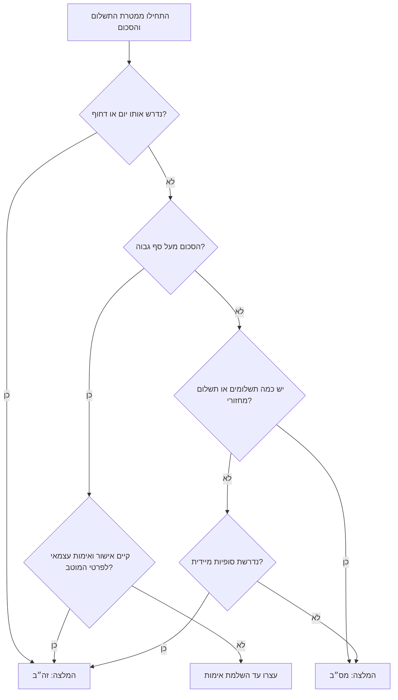
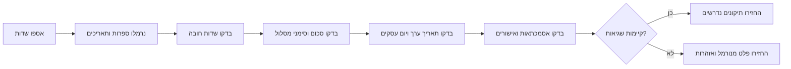

# מסייע לטופס העברה בנקאית מקומית בישראל

השתמשו במיומנות זו להכנת נתוני העברה בנקאית מקומית בישראל לפני העתקה לפורטל בנקאי, מערכת הנהלת חשבונות, תהליך שכר, תור אישורים או פנקס תשלומים פנימי. בדקו קוד בנק, מספר סניף, מספר חשבון, סכום, תאריך ערך, מסלול העברה, מטרת תשלום, אסמכתה, אימות פרטי מוטב ותיעוד אישור.

המיומנות אינה מבצעת העברה, אינה מתחברת לבנק, אינה עוקפת בקרות בנקאיות ואינה מחליפה ייעוץ משפטי, חשבונאי, מיסויי, איסור הלבנת הון או הנחיות בנק. אמתו מגבלות, שעות קבלה, עמלות ושדות חובה מול הבנק לפני שימוש תפעולי.

## משתמשים מתאימים

השתמשו במסייע עבור:

- עסקים קטנים המשלמים לספקים בישראל.
- עצמאים המשלמים לקבלני משנה או מזינים פרטי החזר ללקוח.
- מנהלי חשבונות המכינים תשלומים לאישור.
- חשבי שכר הבודקים פרטי עובדים לפני קובץ מס״ב.
- צרכנים המכינים העברת זה״ב בסכום משמעותי.
- צוותי כספים המחליפים גיליונות אלקטרוניים בלתי מבוקרים בתהליך מסודר.

## מודל שדות

| שדה | חובה | בדיקה | דוגמה |
|---|---:|---|---|
| `recipient_name` | כן | שם משפטי או שם חשבון שאינו ריק | `ספק לדוגמה בעמ` |
| `payer_name` | לא | שם משלם כאשר קיים | `חברה לדוגמה בעמ` |
| `bank_code` | כן | 1 עד 3 ספרות לאחר נרמול; בדיקה מול טבלת ייחוס מקומית | `12` |
| `branch_code` | כן | 1 עד 3 ספרות; נרמול לשלוש ספרות | `045` |
| `account_number` | כן | 4 עד 12 ספרות לאחר הסרת רווחים ומקפים | `123456789` |
| `amount_ils` | כן | סכום חיובי בשקלים | `₪2,450.80` |
| `value_date` | לפי צורך | `YYYY-MM-DD`, `DD-MM-YYYY` או `DD/MM/YYYY`; לא תאריך עבר | `03/06/2026` |
| `method` | לא | `auto`, `masav` או `zahav` | `auto` |
| `purpose` | מומלץ | חשבונית, חודש שכר, שכירות, החזר, תקופת מס או סיבה עסקית | `חשבונית 1007` |
| `reference` | מומלץ | אסמכתה קצרה פנימית או בנקאית, ברירת מחדל 35 תווים | `INV-1007` |
| `urgent` | לא | סימון דחיפות להמלצה על זה״ב | `false` |
| `same_day` | לא | דרישת זיכוי באותו יום | `true` |
| `recurring` | לא | סימון תשלום מחזורי להמלצה על מס״ב | `true` |
| `bulk_count` | לא | מספר העברות באצווה | `20` |
| `approved_by` | לפי צורך | מומלץ בסביבת ייצור ובסכומים גבוהים | `מנהלת כספים` |
| `source_document_id` | מומלץ | חשבונית, ריצת שכר, כרטיס החזר, שובר מס או מזהה אישור | `INV-1007` |

## עץ החלטה למסלול העברה

בחרו מס״ב לתשלום שגרתי, לא דחוף, מחזורי או מרובה מוטבים. בחרו זה״ב כאשר נדרש זיכוי באותו יום, דחיפות, סכום גבוה או סופיות מיידית לאחר אישור.



## זרימת בדיקות



## דוגמאות מעשיות

### תשלום ספק שגרתי

קלט:

```json
{
  "recipient_name": "ספק לדוגמה בעמ",
  "bank_code": "12",
  "branch_code": "456",
  "account_number": "123456789",
  "amount_ils": "2450.80",
  "value_date": "03/06/2026",
  "purpose": "חשבונית 1007",
  "reference": "INV-1007",
  "method": "auto"
}
```

תוצאה צפויה:

- בקשה תקינה.
- ערכי בנק, סניף וחשבון מנורמלים.
- מסלול מומלץ: מס״ב.
- הודעת מידע כאשר מומלץ אימות עצמאי של פרטי המוטב לפי גובה הסכום.

### תשלום דחוף באותו יום

שינויי קלט:

```json
{
  "same_day": true,
  "urgent": true,
  "amount_ils": "18500",
  "approved_by": "מנהלת כספים"
}
```

תוצאה צפויה:

- בקשה תקינה כאשר כל שדות החובה קיימים.
- מסלול מומלץ: זה״ב.
- דרישה לבדוק שעות קבלה ומשמעות סופיות ההעברה לפני הזנה לבנק.

### אצוות שכר

שינויי קלט:

```json
{
  "bulk_count": 24,
  "purpose": "שכר 05/2026",
  "value_date": "09/06/2026"
}
```

תוצאה צפויה:

- מסלול מומלץ: מס״ב.
- בדיקה נפרדת לכל עובד.
- עצירת האצווה כאשר שורת עובד כוללת מספר חשבון שגוי, סכום לא תקין או שם מוטב חסר.

## תרחישי קצה

| תרחיש | טיפול צפוי |
|---|---|
| סניף `7` | נרמול ל-`007`; אזהרה לבדוק שהוספת האפסים תואמת לטופס הבנק. |
| קוד בנק `012` | נרמול ל-`12`. |
| חשבון `12-345 678` | נרמול ל-`12345678`. |
| סכום `₪1,234.56` | פירוש כ-`1234.56`. |
| סכום `0` או סכום שלילי | שגיאה. |
| קוד בנק לא מוכר | אזהרה ולא שגיאה, משום שטבלאות קודים עשויות להשתנות. |
| תאריך ערך ביום שישי או שבת | אזהרת לוח פעילות. יום שישי וערב חג עשויים להיות יום עסקים קצר; שבת וחג עשויים להיות ימים ללא פעילות. בדקו את לוח הפעילות של בנק ישראל ואת שעת הקבלה בבנק. |
| תאריך ערך בעבר | שגיאה. |
| מס״ב ידני בסכום גבוה | אזהרה והמלצה לשקול זה״ב או אישור נוסף. |
| אסמכתה ארוכה | אזהרה מפני חיתוך בשדה בנקאי. |
| מטרת תשלום חסרה | אזהרה ובקשה לסיבה עסקית ברורה. |
| העברה בסביבת ייצור מעל ₪50,000 ללא מאשר | אזהרה לפי מדיניות פנימית של המסייע ותיעוד אישור לפני הזנה לבנק. |
| העברה מעל ₪1,000,000 | המלצה על זה״ב לפי סף פנימי של המסייע ואימות עצמאי של פרטי המוטב. זה אינו סכום מינימום רשמי ואינו מגבלה משפטית. |
| החזר לצרכן | השתמשו במטרה `refund`, תעדו הזמנה או זיכוי ואמתו בעלות על החשבון. |
| תשלום לרשות מס | תעדו תקופת שובר, מספר ישות ואישור מתאים. |


## הערות תפעול מאומתות לשנת 2026

החילו את ההנחיות הבאות בעת הכנת טופס העברה בנקאית מקומית בישראל:

- השתמשו במקורות קודי הזיהוי של בנק ישראל לבדיקת קוד בנק וקוד מערכת תשלומים. קוד `9` הוא ד.י. דואר פיננסים וקוד `54` הוא בנק ירושלים. התייחסו לטבלה המקומית כתמונת עזר ולא כמרשם מחייב.
- התייחסו ליום שישי ולערב חג כיום עסקים קצר אפשרי, ולא ככלל סוף שבוע פשוט. התייחסו לשבת ולחגים הרשומים כסיכון ליום ללא פעילות.
- השתמשו בזה״ב כאשר נדרשת סופיות באותו יום. החומר הרשמי מתאר את זה״ב כמערכת סליקה ברוטו בזמן אמת עם סופיות ואי-חזרה, ללא סכום מינימום ללקוח; עמלות ושעות קבלה בפורטל הבנק נשארות לפי הבנק.
- השתמשו במס״ב להעברות שקליות שגרתיות, חיובים, זיכויים, שכר, תשלומי מס, החזרים ואצוות כאשר אין צורך בסופיות מיידית.
- התייחסו לסף אישור ייצור של ₪50,000 ולסף ניתוב גבוה של ₪1,000,000 כבקרות פנימיות הניתנות לשינוי. אל תציגו אותם כסף משפטי או סף רשמי של בנק ישראל.
- השתמשו במע״מ 18% רק בטקסט מטרת תשלום או בתיעוד חשבונאי כאשר זה רלוונטי. שיעור המע״מ אינו בודק את ההעברה הבנקאית עצמה.

## דפוסים פסולים

הימנעו מהפעולות הבאות:

- העתקת פרטי בנק מתוך דוא״ל ללא אימות עצמאי.
- שילוב מספר סניף ומספר חשבון בשדה אחד.
- מחיקת אפסים מובילים במספר סניף.
- הסתמכות על העברה ישנה כהוכחה לכך שפרטים חדשים בטוחים.
- ביצוע העברה דחופה בסכום גבוה ללא אישור כפול.
- התייחסות לאזהרה כאישור לעקיפת בקרות בנק או הנהלת חשבונות.
- הגשת שכר כאשר שורה אחת נכשלה בבדיקה.
- שימוש באסמכתה הכוללת מידע אישי שאינו נדרש.
- הנחה ששעות הקבלה במס״ב ובזה״ב זהות בכל בנק.
- הנחה שטבלת קודי הבנק המקומית מספיקה לאחר מיזוגים או שינויי סניפים.

## תקלות נפוצות

| סימפטום | סיבה סבירה | פעולה |
|---|---|---|
| פורטל הבנק דוחה סניף | חסר אפס מוביל, סניף נסגר, זוג בנק-סניף שגוי | אמתו אישור בנק רשמי והזינו שלוש ספרות. |
| המוטב מדווח שלא התקבל כסף | חלון עיבוד מס״ב, שורת אצווה נדחתה, חשבון שגוי | בדקו אישור בנק, סטטוס אצווה ותאריך ערך. |
| אפשרות זה״ב אינה זמינה | חלפה שעת הקבלה, חסרה הרשאה, חריגה ממגבלת בנק | פנו למנהל מערכת בנקאית או קבעו יום עסקים הבא. |
| אסמכתה נחתכת | מגבלת השדה בבנק קצרה מהאסמכתה הפנימית | קצרו אסמכתה ושמרו את המלאה במערכת פנימית. |
| אצוות שכר נדחית | שורה אחת שגויה או בעיית פורמט חוזרת | בדקו כל שורה, תקנו כשלים וצרו קובץ מחדש. |
| אזהרה על קוד בנק לא מוכר | טבלת ייחוס מקומית אינה עדכנית או שהמוטב מסר קוד שגוי | אמתו מול הבנק או מול המוטב לפני הגשה. |

## רשימת בדיקות לפני ייצור

בצעו את הבדיקות הבאות לפני שימוש בפלט בתהליך בנקאי חי:

1. אמתו מגבלות שדות, רשימת סניפים, שעות קבלה וכללי אישור ספציפיים לבנק.
2. השתמשו ב-`--env production` רק לצורך סקירת אישור בסביבת ייצור.
3. שמרו מזהי מסמכי מקור עבור חשבוניות, שכר, שוברים, החזרים ושכירות.
4. בצעו אימות עצמאי לפרטי מוטב חדשים או משתנים.
5. דרשו אישור יוצר-בודק לתשלום בסכום גבוה, תשלום דחוף, שכר ומוטב חדש.
6. בדקו כל שורה באצוות מס״ב לפני העלאה.
7. שמרו מספרי חשבון מלאים רק במקום עם הרשאות מתאימות; הציגו מספרים מוסתרים בדוחות שגרתיים.
8. תעדו אזהרות והחלטות אישור בתיק התשלום.
9. בצעו התאמה מול אישור הבנק לאחר הגשה.
10. נתחו העברות שנדחו והוסיפו את התרחישים לבדיקות רגרסיה.

## התחלה מהירה בשורת פקודה

התקנה:

```bash
pip install -e .
pip install -r requirements-dev.txt
```

יצירת רשומה מקומית:

```bash
domestic-bank-transfer-helper --env sandbox create \
  --recipient-name "ספק לדוגמה בעמ" \
  --bank-code 12 \
  --branch-code 456 \
  --account-number 123456789 \
  --amount-ils "2450.80" \
  --value-date "03/06/2026" \
  --purpose "חשבונית 1007" \
  --reference "INV-1007"
```

שליפת מזהה מתוך תגובת היצירה:

```bash
TRANSFER_ID="$(domestic-bank-transfer-helper --env sandbox create \
  --recipient-name "ספק לדוגמה בעמ" \
  --bank-code 12 \
  --branch-code 456 \
  --account-number 123456789 \
  --amount-ils "2450.80" \
  --value-date "03/06/2026" \
  --purpose "חשבונית 1007" \
  --reference "INV-1007" | python -c 'import json,sys; print(json.load(sys.stdin)["id"])')"
```

שימוש במזהה בשלב הבא:

```bash
domestic-bank-transfer-helper --env sandbox payload "$TRANSFER_ID"
```

## התחלה מהירה בפייתון

```python
from datetime import date
from domestic_bank_transfer_helper_client import TransferRequest, validate_transfer

request = TransferRequest(
    recipient_name="ספק לדוגמה בעמ",
    bank_code="12",
    branch_code="456",
    account_number="123456789",
    amount_ils="2450.80",
    value_date="03/06/2026",
    purpose="חשבונית 1007",
)
report = validate_transfer(request, env="sandbox", today=date(2026, 6, 2))
print(report.to_json())
```

## שאלות חובה למשתמש

כאשר חסר שדה, בקשו את התיקון המינימלי הדרוש:

- חסר מוטב: בקשו שם משפטי או שם חשבון.
- חסר בנק או סניף: בקשו קוד בנק ומספר סניף מאישור בנק רשמי של המוטב.
- חסר מספר חשבון: בקשו את מספר החשבון בלבד; אל תסיקו אותו מהעברות קודמות.
- חסר סכום: בקשו סכום ב-₪ ומסמך מקור.
- תשלום דחוף או בסכום גבוה: בקשו אישור מסלול, אישור מנהלי ואימות פרטי מוטב.
- חסרה מטרה: בקשו מספר חשבונית, חודש שכר, חודש שכירות, אסמכתת החזר או תקופת מס.

## גבולות בטיחות

אל תגישו, אל תתזמנו ואל תאשרו תנועת כספים. אל תטענו שבדיקת תקינות מבטיחה קבלת הבנק. אל תתייחסו לבדיקה טכנית כהוכחה לבעלות המוטב על החשבון. אל תשמרו מידע אישי מעבר לנדרש לתפעול התשלום.
