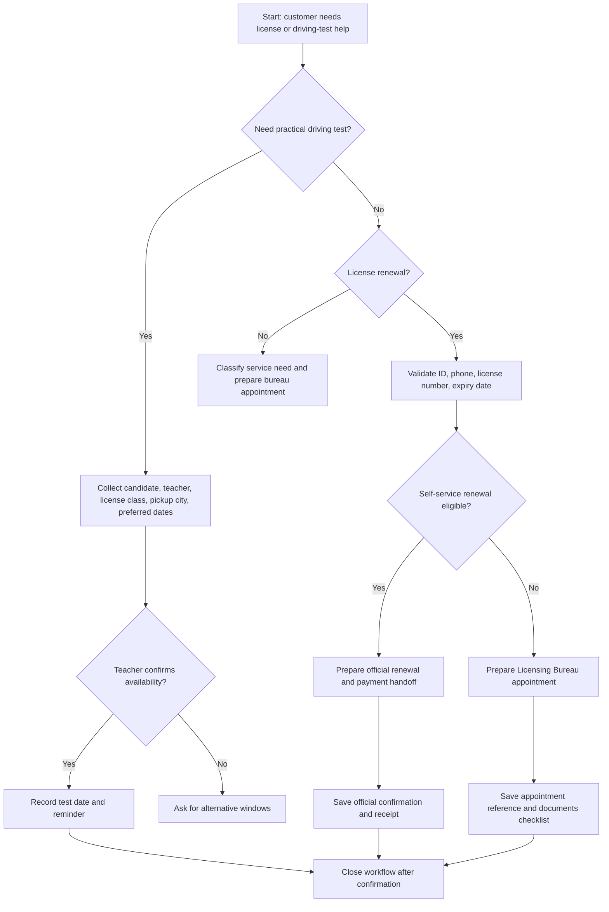

# Driving Test & License Renewal Booker

Use this skill to prepare, validate, coordinate, schedule eligible appointment handoffs, and track Israeli driving-license renewal and driving-test workflows. Apply it for individual consumers, freelancers who drive for work, driving teachers, delivery businesses, tradespeople with service vehicles, and office administrators responsible for staff license follow-up.

The skill supports three workflow families:

1. License renewal through official Ministry of Transport and Road Safety services.
2. Licensing Bureau appointment preparation when self-service renewal is blocked or an in-person service is required.
3. Practical driving-test coordination with an authorized driving teacher and candidate availability.

Final submission, identity verification, payment, and official appointment confirmation must happen only through official services. Practical driving-test dates are requested by the authorized teacher or driving school through the official process; do not represent a local draft as a confirmed government test date. Do not store passwords or bypass identity checks.

## Web-validated boundaries

Use these validated boundaries in production:

| Area | Current verified rule |
| --- | --- |
| Driver-license renewal payment | Use the driver-license payment route, not the vehicle-license payment route. The corrected payment handoff is `https://ecom.gov.il/voucherspa/input/209`. |
| Practical-test fee payment | Use `https://ecom.gov.il/voucherspa/input/427` for practical driving-test fee payment handoff. Confirm mutable fee amounts at payment time. |
| Licensing Bureau appointments | Use the Ministry of Transport appointment service and GoVisit. Appointment availability for licensing services is published as up to 30 days ahead. |
| Practical test scheduling | Coordinate with the authorized driving teacher or school. The candidate does not directly book the official test in this package. |
| Private service VAT | If a VAT-registered business charges a private service fee, apply the current Israeli VAT rate only after confirming it. As validated on 04/06/2026, the standard rate is 18%. |
| Webhooks and public APIs | No public official webhook event names or public booking API contract are referenced by the official sources used here. Treat integrations as browser handoff or approved private adapter only. |

## Intake checklist

Collect the minimum required details before starting:

| Field | Required for renewal | Required for bureau appointment | Required for practical test | Notes |
| --- | --- | --- | --- | --- |
| Full name | Yes | Yes | Yes | Match official records. |
| Israeli ID | Yes | Yes | Yes | Validate checksum before handoff. |
| Mobile phone | Yes | Yes | Yes | Prefer Israeli mobile number for SMS. |
| License number | Recommended | Recommended | Optional | Missing value may require manual lookup. |
| License class | Yes | Yes | Yes | Common classes: A, A1, A2, B, C1, C, D. |
| Expiry date | Yes | Optional | No | Store as DD/MM/YYYY in customer-facing notes. |
| Medical declaration status | Conditional | Conditional | No | Required for some renewals and status changes. |
| Payment status | Yes | No | No | Use official payment page only. |
| Preferred dates and city | Optional | Yes | Yes | Keep at least two alternatives for appointments. |
| Accessibility requirement | Conditional | Conditional | Conditional | Record only operational need, not sensitive medical detail. |
| Customer consent | Yes | Yes | Yes | Record consent before handling personal data. |

## Decision tree



## Renewal workflow

1. Validate the Israeli ID checksum and normalize the phone number.
2. Confirm the license expiry date and current license class.
3. Check whether a medical declaration, eyesight test, fee payment, or bureau visit is required.
4. Prepare a renewal payload with the official service links.
5. Open the official renewal service and complete identity verification with the customer present or through an approved customer-side process.
6. Pay the renewal fee only through an official payment page. Record the ₪ amount, receipt number, and payment date in DD/MM/YYYY format.
7. Store the confirmation number, receipt, and next reminder date.
8. Send the customer a neutral summary that includes the official confirmation, not a promise of government approval before confirmation exists.

### Renewal example

```python
import datetime as dt
from driving_license_booker import Applicant, DrivingLicenseBookerClient

client = DrivingLicenseBookerClient(environment="sandbox", state_path="state.json")
applicant = Applicant(
    full_name="Dana Levi",
    national_id="039456785",
    phone="0501234567",
    license_number="1234567",
)
readiness = client.check_renewal_readiness(
    applicant=applicant,
    expiry_date=dt.date(2026, 8, 31),
    has_paid_fee=False,
    medical_declaration_required=True,
    medical_declaration_done=False,
)
print(client.serialize(readiness))
```

Expected result: `ready` is false because fee payment and medical declaration are unresolved.

## Licensing Bureau appointment workflow

Use this path when online renewal is blocked, the customer needs an in-person service, identity details do not match, documents must be reviewed, or accessibility coordination is needed.

1. Confirm that an office visit is actually required.
2. Collect city, branch preference, preferred date windows, and accessibility needs.
3. Create a local handoff record.
4. Open the official appointment system and select the Licensing Bureau service.
5. Save the appointment reference, branch, date, time, and reminder schedule.
6. Send the customer a document checklist and arrival instructions.

### Appointment example

```bash
driving-license-booker create-office   --env sandbox   --state office-state.json   --name "Moshe Cohen"   --national-id 123456782   --phone 0527654321   --license-number 7654321   --date 2026-07-15   --city "Haifa"   --accessibility-needed
```

## Practical driving-test workflow

Use this path for learners, re-test cases, or license-class upgrades that require coordination with an authorized driving teacher.

1. Collect candidate name, Israeli ID, phone, license class, pickup city, and preferred dates.
2. Confirm that the teacher can coordinate the test and the appropriate vehicle class.
3. Send a structured message to the teacher.
4. Record the confirmed test date only after teacher confirmation.
5. Add reminders for candidate documents, arrival time, and payment or lesson balance if applicable.
6. Keep cancellation and rescheduling notes in the local record.

### Teacher message example

```python
import datetime as dt
from driving_license_booker import Applicant, DrivingLicenseBookerClient, TimeWindow

client = DrivingLicenseBookerClient()
message = client.make_teacher_message(
    applicant=Applicant("Noa Israeli", "039456785", "0501234567", license_class="B"),
    windows=[TimeWindow(dt.date(2026, 7, 20), city="Rishon LeZion")],
    teacher_name="Avi",
    pickup_city="Rishon LeZion",
)
print(message)
```

## Edge cases

| Case | Action |
| --- | --- |
| Expired license | Continue intake, mark warning, prioritize official renewal check, and avoid telling the customer to drive until validity is confirmed. |
| Invalid Israeli ID checksum | Stop before handoff and request corrected ID. |
| Foreign license conversion | Treat as bureau appointment or dedicated conversion workflow, not a standard renewal. |
| Medical declaration required | Add blocker until declaration completion is confirmed. |
| Customer lacks digital access | Prepare bureau appointment or assisted official-service session with consent. |
| Payment failed but card charged | Do not retry blindly. Check official receipt status and payment provider confirmation. |
| Appointment unavailable in preferred city | Offer nearby cities and document customer approval. |
| Accessibility request | Record operational requirements and avoid unnecessary medical detail. |
| Name mismatch | Escalate to official service or bureau appointment. Do not edit identity details casually. |
| Practical test teacher unavailable | Keep request in draft and collect alternative windows. |

## Anti-patterns

Do not do the following:

- Scrape protected government pages or automate CAPTCHA, SMS, national ID, or password steps.
- Store government login credentials in notes, spreadsheets, scripts, or environment variables.
- Charge a service fee before explaining what is official fee and what is private service fee.
- Promise a license renewal, test date, or appointment before official confirmation exists.
- Mix customers in a shared browser session.
- Keep scans of identity documents longer than necessary.
- Use a practical-test workflow as a substitute for teacher confirmation.
- Translate a Hebrew official term into an invented English label when customer communication needs the exact government wording.

## Troubleshooting overview

| Symptom | Likely cause | Fix |
| --- | --- | --- |
| ID rejected | Checksum or typo | Normalize and validate nine digits. |
| Phone rejected | Country code or missing leading zero | Normalize +972 to 0 format. |
| Renewal blocked | Medical declaration, eyesight test, debt, or data mismatch | Use readiness check and prepare bureau path. |
| No appointments | High demand or wrong service type | Search other cities and later dates. |
| Receipt missing | Payment not completed or delayed | Check official payment result before retrying. |
| Teacher cannot confirm | Vehicle or schedule conflict | Request new windows and keep draft state. |

## Production checklist

Before using the package in production:

- Install with `pip install -e .` and run the test suite.
- Configure a separate local state file for each branch or business unit.
- Store only necessary personal data and define retention periods.
- Log customer consent and the exact official confirmation reference.
- Separate official fee, private service fee, VAT where applicable, and ₪ receipt details.
- For VAT-registered service providers, verify the current VAT rate before issuing an invoice; the web-validated rate on 04/06/2026 is 18%.
- Use `--env production` only when real customers and official services are involved.
- Keep sandbox examples out of customer records.
- Train staff to stop at identity-verification and payment screens unless the customer is present or an approved consent process exists.
- Verify Hebrew templates before sending customer-facing messages.
- Review `references/troubleshooting.md` and `references/test-scenarios.md` before launch.

## CLI command map

| Command | Purpose |
| --- | --- |
| `service-links` | Print official-service links. |
| `create-renewal` | Create a local renewal handoff record. |
| `create-office` | Create a Licensing Bureau appointment handoff record. |
| `create-practical` | Create a practical-test coordination record. |
| `get` | Fetch a local record by request id. |
| `cancel` | Mark a local record as cancelled. |
| `list` | List local records, optionally by status. |
| `readiness` | Check renewal blockers and warnings. |
| `teacher-message` | Generate a Hebrew teacher coordination message. |
