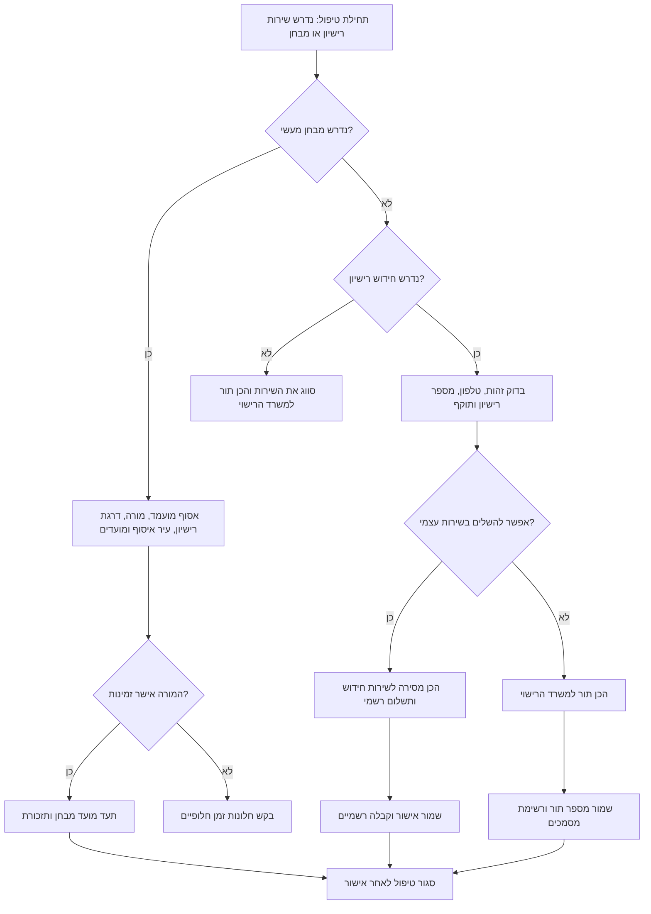

# תיאום חידוש רישיון נהיגה ומבחן מעשי

השתמש במיומנות זו כדי להכין, לבדוק, לתאם, למסור תורים כשקיימת זכאות, ולעקוב אחרי תהליכי חידוש רישיון נהיגה בישראל, תור למשרד הרישוי ותיאום מבחן מעשי עם מורה נהיגה מוסמך. הכלי מתאים לצרכנים פרטיים, עצמאים שנוהגים לצורכי עבודה, מורי נהיגה, עסקים קטנים עם שליחים או טכנאים, ומנהלי משרד שמטפלים במעקב אחר רישיונות עובדים.

המיומנות מטפלת בשלושה סוגי תהליך:

1. חידוש רישיון נהיגה דרך השירותים הרשמיים של משרד התחבורה והבטיחות בדרכים.
2. הכנת תור למשרד הרישוי כאשר החידוש העצמי אינו מספיק או נדרש שירות פרונטלי.
3. תיאום מבחן נהיגה מעשי עם מורה נהיגה מוסמך וזמינות מועמד.

הגשה סופית, אימות זהות, תשלום ואישור תור רשמי חייבים להתבצע רק בערוצים רשמיים. מועד מבחן נהיגה מעשי מתואם דרך מורה הנהיגה או בית הספר לנהיגה בתהליך הרשמי; אין להציג טיוטה מקומית כאישור מבחן רשמי. אין לשמור סיסמאות ואין לעקוף בדיקות זהות.

## גבולות שאומתו מול מקורות רשמיים

פעל לפי הגבולות הבאים בסביבת אמת:

| תחום | כלל מאומת |
| --- | --- |
| תשלום חידוש רישיון נהיגה | השתמש בנתיב תשלום רישיון נהיגה, לא בנתיב תשלום רישיון רכב. נתיב המסירה המתוקן הוא `https://ecom.gov.il/voucherspa/input/209`. |
| תשלום אגרת מבחן מעשי | השתמש ב-`https://ecom.gov.il/voucherspa/input/427` למסירת תשלום אגרת מבחן נהיגה. אשר סכומים משתנים בזמן התשלום. |
| תור למשרד הרישוי | השתמש בשירות זימון התורים של משרד התחבורה וב-GoVisit. לשירותי הרישוי ניתן לזמן תור עד 30 ימים מראש. |
| תיאום מבחן מעשי | תאם מול מורה הנהיגה או בית הספר לנהיגה. אל תציג את הכלי כמערכת שמזמינה מבחן רשמי ישירות עבור המועמד. |
| מע״מ על שכר שירות פרטי | אם העסק חייב במע״מ וגובה שכר שירות פרטי, אמת את שיעור המע״מ לפני הפקת חשבונית. נכון לאימות ביום 04/06/2026, השיעור הוא 18%. |
| ממשקי תכנות והתראות | לא אותרו שמות אירועי webhook או מפרט ממשק תכנות ציבורי רשמי להזמנת תורים או מבחנים. השתמש במסירה ידנית או במתאם פרטי מאושר בלבד. |

## רשימת פרטים לאיסוף

| פרט | חידוש רישיון | תור למשרד הרישוי | מבחן מעשי | הערות |
| --- | --- | --- | --- | --- |
| שם מלא | חובה | חובה | חובה | כפי שמופיע ברשומות הרשמיות. |
| מספר זהות | חובה | חובה | חובה | בדוק ספרת ביקורת לפני מסירה לשירות. |
| טלפון נייד | חובה | חובה | חובה | עדיף מספר ישראלי לקבלת מסרון. |
| מספר רישיון | מומלץ | מומלץ | רשות | חוסר במספר עלול לחייב בדיקה ידנית. |
| דרגת רישיון | חובה | חובה | חובה | דרגות נפוצות: A, A1, A2, B, C1, C, D. |
| תאריך תוקף | חובה | רשות | לא נדרש | הצג ללקוח בפורמט DD/MM/YYYY, למשל 31/08/2026. |
| הצהרה רפואית | לפי צורך | לפי צורך | לא נדרש | נדרשת במקרים מסוימים של חידוש או שינוי סטטוס. |
| סטטוס תשלום | חובה | לא נדרש | לא נדרש | תשלום רק בדף תשלום רשמי ובשקלים חדשים. |
| מועדים ועיר מועדפים | רשות | חובה | חובה | שמור לפחות שתי חלופות. |
| צורך בנגישות | לפי צורך | לפי צורך | לפי צורך | רשום צורך תפעולי בלבד, ללא פירוט רפואי עודף. |
| הסכמת לקוח | חובה | חובה | חובה | תעד הסכמה לפני טיפול במידע אישי. |

## עץ החלטה



## תהליך חידוש רישיון

1. בדוק את ספרת הביקורת של מספר הזהות ונרמל את מספר הטלפון.
2. ודא תאריך תוקף ודרגת רישיון נוכחית.
3. בדוק אם נדרשת הצהרה רפואית, בדיקת ראייה, תשלום אגרה או הגעה למשרד הרישוי.
4. הכן רשומת מסירה הכוללת קישורים רשמיים.
5. פתח את שירות החידוש הרשמי והשלם אימות זהות עם הלקוח או בתהליך הסכמה מאושר.
6. שלם אגרה רק בדף תשלום רשמי. רשום סכום ב-₪, מספר קבלה ותאריך תשלום בפורמט DD/MM/YYYY.
7. שמור מספר אישור, קבלה ותאריך תזכורת הבא.
8. שלח ללקוח סיכום ניטרלי הכולל אישור רשמי בלבד, ללא הבטחה לפני קבלת אישור.

### דוגמת חידוש

```python
import datetime as dt
from driving_license_booker import Applicant, DrivingLicenseBookerClient

client = DrivingLicenseBookerClient(environment="sandbox", state_path="state.json")
applicant = Applicant(
    full_name="דנה לוי",
    national_id="039456785",
    phone="0501234567",
    license_number="1234567",
)
readiness = client.check_renewal_readiness(
    applicant=applicant,
    expiry_date=dt.date(2026, 8, 31),
    has_paid_fee=False,
    medical_declaration_required=True,
    medical_declaration_done=False,
)
print(client.serialize(readiness))
```

תוצאה צפויה: הערך `ready` הוא false כל עוד האגרה וההצהרה הרפואית לא הושלמו.

## תהליך תור למשרד הרישוי

בחר במסלול זה כאשר החידוש המקוון חסום, נדרש שירות פרונטלי, קיימת אי התאמה בפרטי זהות, נדרש עיון במסמכים או יש צורך בתיאום נגישות.

1. ודא שנדרשת הגעה למשרד ולא ניתן להשלים בשירות עצמי.
2. אסוף עיר, העדפת סניף, חלונות זמן מועדפים וצורכי נגישות.
3. צור רשומת מסירה מקומית.
4. פתח את מערכת התורים הרשמית ובחר שירות של משרד הרישוי.
5. שמור מספר תור, סניף, תאריך, שעה ותזכורת.
6. שלח ללקוח רשימת מסמכים והנחיות הגעה.

### דוגמת תור

```bash
driving-license-booker create-office   --env sandbox   --state office-state.json   --name "משה כהן"   --national-id 123456782   --phone 0527654321   --license-number 7654321   --date 2026-07-15   --city "חיפה"   --accessibility-needed
```

## תהליך מבחן נהיגה מעשי

בחר במסלול זה עבור תלמידי נהיגה, נבחנים חוזרים או שדרוג דרגת רישיון הדורשים תיאום עם מורה נהיגה מוסמך.

1. אסוף שם מועמד, מספר זהות, טלפון, דרגת רישיון, עיר איסוף ומועדים מועדפים.
2. ודא שהמורה יכול לתאם מבחן ולספק רכב בדרגה המתאימה.
3. שלח הודעה מובנית למורה.
4. רשום מועד סופי רק לאחר אישור המורה.
5. הוסף תזכורות למסמכים, שעת הגעה ותשלום שיעור או יתרה אם קיימים.
6. שמור הערות ביטול או שינוי מועד ברשומה המקומית.

### הודעה למורה

```python
import datetime as dt
from driving_license_booker import Applicant, DrivingLicenseBookerClient, TimeWindow

client = DrivingLicenseBookerClient()
message = client.make_teacher_message(
    applicant=Applicant("נועה ישראלי", "039456785", "0501234567", license_class="B"),
    windows=[TimeWindow(dt.date(2026, 7, 20), city="ראשון לציון")],
    teacher_name="אבי",
    pickup_city="ראשון לציון",
)
print(message)
```

## מקרי קצה

| מקרה | פעולה |
| --- | --- |
| רישיון שפג תוקפו | המשך איסוף פרטים, סמן אזהרה, תעדף בדיקה רשמית, ואל תנחה את הלקוח לנהוג עד אימות תוקף. |
| מספר זהות שגוי | עצור לפני מסירה ובקש מספר מתוקן. |
| המרת רישיון זר | טפל כתור למשרד הרישוי או כתהליך ייעודי, לא כחידוש רגיל. |
| נדרשת הצהרה רפואית | סמן חסם עד להשלמת ההצהרה. |
| ללקוח אין גישה דיגיטלית | הכן תור למשרד הרישוי או טיפול מלווה בהסכמה מתועדת. |
| תשלום נכשל אך הכרטיס חויב | אל תנסה שוב מיד. בדוק קבלה ותוצאת תשלום רשמית. |
| אין תורים בעיר המבוקשת | הצע ערים סמוכות ותעד אישור לקוח. |
| בקשת נגישות | רשום צורך תפעולי בלבד והימנע מפרטים רפואיים מיותרים. |
| אי התאמה בשם | הסלם לשירות רשמי או לתור במשרד הרישוי. אל תשנה פרטי זהות ללא בסיס רשמי. |
| המורה אינו פנוי למבחן | השאר את הבקשה כטיוטה ואסוף חלונות זמן חלופיים. |

## פעולות שיש להימנע מהן

אין לבצע את הפעולות הבאות:

- גירוד מסכים מוגנים או עקיפת קוד אימות, מסרון, מספר זהות או סיסמה.
- שמירת פרטי כניסה לשירותים ממשלתיים בהערות, גיליונות, קבצים או משתני סביבה.
- גביית תשלום שירות בלי להפריד בין אגרה רשמית לבין שכר שירות פרטי.
- הבטחת חידוש רישיון, תור או מועד מבחן לפני קבלת אישור רשמי.
- טיפול בכמה לקוחות באותה הפעלת דפדפן.
- שמירת צילום תעודת זהות מעבר לנדרש.
- שימוש בתהליך מבחן מעשי במקום אישור מורה נהיגה.
- המצאת מונח עברי חדש כאשר קיים מונח רשמי מוכר.

## תקלות נפוצות

| סימפטום | סיבה אפשרית | תיקון |
| --- | --- | --- |
| מספר זהות נדחה | ספרת ביקורת שגויה או טעות הקלדה | נרמל לתשע ספרות ובדוק מחדש. |
| טלפון נדחה | קידומת מדינה או חסרה ספרה 0 בתחילה | המר +972 לפורמט ישראלי שמתחיל ב-0. |
| החידוש חסום | הצהרה רפואית, בדיקת ראייה, חוב או אי התאמה בנתונים | הפעל בדיקת מוכנות והכן תור למשרד הרישוי. |
| אין תורים | עומס או בחירת סוג שירות שגוי | בדוק ערים אחרות ומועדים מאוחרים יותר. |
| חסרה קבלה | התשלום לא הושלם או ממתין לעדכון | בדוק תוצאת תשלום רשמית לפני ניסיון נוסף. |
| המורה לא מאשר | בעיית רכב או לוח זמנים | בקש חלונות זמן חדשים והשאר את הרשומה כטיוטה. |

## רשימת מוכנות לסביבת אמת

לפני שימוש מול לקוחות אמיתיים:

- התקן באמצעות `pip install -e .` והרץ בדיקות.
- הגדר קובץ מצב נפרד לכל סניף או יחידה עסקית.
- שמור רק מידע אישי שנדרש לתהליך וקבע תקופת שמירה.
- תעד הסכמת לקוח ואת מספר האישור הרשמי המדויק.
- הפרד בין אגרה רשמית, שכר שירות פרטי, מע״מ לפי צורך וקבלות ב-₪.
- אם העסק רשום כעוסק מורשה, אמת את שיעור המע״מ לפני הוצאת חשבונית; באימות מיום 04/06/2026 השיעור הוא 18%.
- השתמש ב-`--env production` רק כאשר מדובר בלקוח אמיתי ובשירות רשמי.
- אל תעביר נתוני סביבת בדיקה לרשומות לקוח.
- הדרך עובדים לעצור במסכי אימות זהות ותשלום, אלא אם הלקוח נוכח או קיים תהליך הסכמה מאושר.
- בדוק נוסחים בעברית לפני שליחה ללקוח.
- קרא את `references/troubleshooting.md` ואת `references/test-scenarios.md` לפני השקה.

## מפת פקודות

| פקודה | שימוש |
| --- | --- |
| `service-links` | הדפסת קישורים רשמיים. |
| `create-renewal` | יצירת רשומת מסירה לחידוש רישיון. |
| `create-office` | יצירת רשומת מסירה לתור במשרד הרישוי. |
| `create-practical` | יצירת רשומת תיאום למבחן מעשי. |
| `get` | שליפת רשומה לפי מזהה בקשה. |
| `cancel` | סימון רשומה כמבוטלת. |
| `list` | הצגת רשומות, עם סינון לפי סטטוס לפי צורך. |
| `readiness` | בדיקת חסמים ואזהרות לחידוש. |
| `teacher-message` | יצירת הודעה בעברית למורה נהיגה. |
