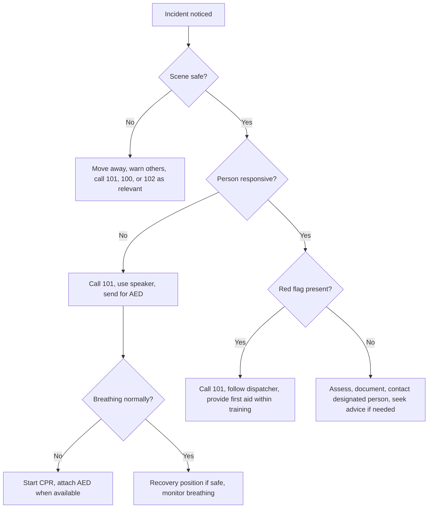
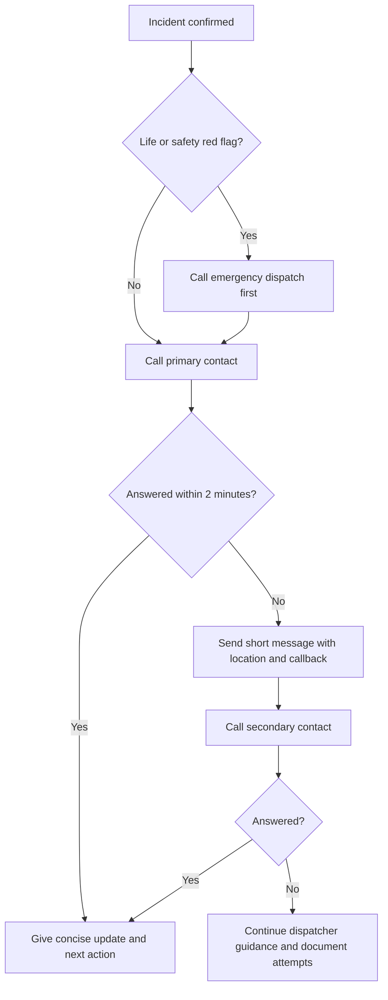
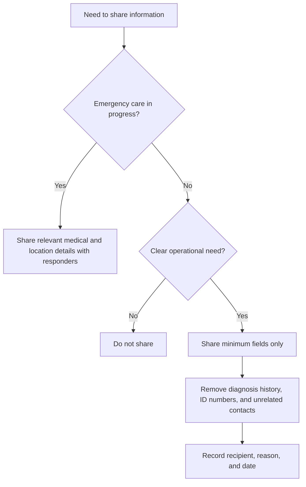

# Emergency Contact and First-Aid Info

Version: 2.2.0

## Purpose

Store emergency contacts, site access details, medical red flags, and first-aid reference material for Israeli small businesses, freelancers, households, and consumer-facing locations. Use the package to create a local emergency profile, validate it, print a redacted public sheet, and prepare staff for the first five minutes of a medical or safety incident.

Call **101** for medical emergencies in Israel. Use 1221 for United Hatzalah volunteer responder dispatch only as an additional, locally verified option, not as a substitute for 101. Follow the dispatcher. Use this skill as preparation and documentation support, not as a substitute for certified training, current MDA guidance, local volunteer responder coverage, or professional medical care.

## Operating rules

1. Protect life before documentation.
2. Call emergency dispatch before calling an owner, manager, or family member when a red flag exists.
3. Read the address exactly as written in the profile.
4. Send one person to meet responders and one person to bring an AED when available.
5. Share only emergency-relevant medical details.
6. Keep sensitive medical notes out of public sheets.
7. Review contacts, access notes, AED location, and first-aid kit status at least every 90 days.

## Israeli emergency numbers

| Need | Number | Notes |
|---|---:|---|
| Medical emergency | 101 | Ambulance, CPR, stroke, chest pain, severe bleeding, serious injury |
| Police | 100 | Violence, crime, immediate security threat |
| Fire and rescue | 102 | Fire, smoke, trapped person, rescue |
| Electric hazard | 103 | Fallen wires, infrastructure danger |
| Home Front Command | 104 | Civil defense guidance |
| Municipal issue | 106 or 107 | Verify local authority number |
| United Hatzalah volunteer responder | 1221 | Verify local coverage; do not use as a replacement for 101 |
| MDA text/WhatsApp access | 052-7000-101 | For hearing-impaired or text-based emergency access where available |

## Minimum profile

```json
{
  "profile_name": "Dizengoff Studio - Front Desk",
  "last_reviewed": "04-06-2026",
  "site": {
    "address_line": "Dizengoff 100, entrance B, floor 2",
    "locality": "Tel Aviv-Yafo",
    "access_notes": "Intercom 22; AED near pharmacy downstairs",
    "aed_location": "Ground floor pharmacy",
    "first_aid_kit_location": "Reception cabinet"
  },
  "contacts": [
    {
      "name": "Dana Cohen",
      "role": "Owner",
      "phone": "050-123-4567",
      "priority": 1,
      "can_receive_medical_info": true
    }
  ],
  "medical_notes": {
    "known_allergies": ["latex"],
    "regular_medications": [],
    "mobility_needs": ["stairs difficult"]
  }
}
```

## What to store

| Field | Store | Reason |
|---|---:|---|
| Name and role | Yes | Identifies the right person quickly |
| Israeli phone number | Yes | Enables escalation |
| Contact priority | Yes | Prevents repeated calls to one unavailable contact |
| Exact address | Yes | Dispatcher needs a clear location |
| Access notes | Yes, restricted if sensitive | Helps responders enter |
| AED and kit locations | Yes | Saves time |
| Allergies | Yes | Emergency-relevant |
| Regular medication | Yes, when accurate | Helps responders |
| ID number | Usually no | Sensitive and rarely needed in first minutes |
| Broad diagnosis history | Usually no | Overexposes sensitive data |
| Gate or alarm code | Restricted only | Do not print publicly |

## Decision tree: emergency response



## Decision tree: contact escalation



## Decision tree: privacy-minimal sharing



## First-aid instructions

Follow the dispatcher over this document. Use only actions within training and local procedure.

### CPR and AED for an adult

1. Confirm scene safety.
2. Check response by speaking loudly and tapping shoulders.
3. Call 101 and use speaker.
4. Send a person for an AED.
5. If the person is not breathing normally or only gasping, start chest compressions.
6. Push hard and fast in the center of the chest at about 100 to 120 compressions per minute.
7. Allow full recoil.
8. Give rescue breaths only when trained and willing.
9. Attach AED pads as soon as available and follow prompts.
10. Continue until normal breathing returns, EMS takes over, an AED instructs a pause, or exhaustion prevents safe continuation.

### Severe bleeding

1. Call 101 for heavy bleeding, spurting blood, deep wounds, amputation, or shock signs.
2. Apply firm direct pressure with gauze, cloth, or a pressure bandage.
3. Keep pressure continuous.
4. Add layers if dressing soaks through.
5. Use a tourniquet only for life-threatening limb bleeding and only when trained or instructed.
6. Mark tourniquet time.
7. Keep the person warm.

### Choking

For an adult or child over one year:

1. Encourage coughing if it is effective.
2. Call 101 when the person cannot speak, breathe, or cough effectively.
3. Use abdominal thrusts only when trained.
4. Start CPR if the person collapses.
5. Look in the mouth only when an object is visible.

For an infant:

1. Call 101.
2. Use cycles of 5 back blows and 5 chest thrusts.
3. Support the head and keep it lower than the body.
4. Do not use abdominal thrusts.

### Chest pain

1. Call 101 for chest pressure, pain radiating to arm, jaw, or back, shortness of breath, sweating, nausea, or collapse.
2. Keep the person resting.
3. Prepare medication and allergy information.
4. Give aspirin only when instructed by a dispatcher or qualified clinician and no allergy or contraindication is known.
5. Do not let the person drive.

### Stroke signs

Use face, arm, speech, time:

- Face drooping.
- Arm weakness.
- Speech difficulty.
- Time to call 101.

Record the exact time the person was last seen well. Do not give food, drink, or medication unless instructed.

### Anaphylaxis

1. Call 101.
2. Help use the person’s prescribed adrenaline auto-injector if available and indicated.
3. Keep the person lying down unless breathing is easier sitting.
4. Monitor breathing.
5. Prepare allergen and medication details for EMS.

### Burns

1. Stop the burning process.
2. Cool with cool running water for about 20 minutes when possible.
3. Remove jewelry or tight items near the burn.
4. Cover with clean non-stick dressing.
5. Call 101 for burns to face, airway, hands, genitals, large or deep burns, electrical burns, chemical burns, or smoke inhalation.
6. Do not use ice, butter, oil, toothpaste, or adhesive dressings on the burn.

### Seizure

1. Protect from injury by moving hard or sharp objects away.
2. Do not restrain.
3. Do not put anything in the mouth.
4. Time the seizure.
5. Call 101 if it lasts more than 5 minutes, repeats, causes injury, happens during pregnancy, follows water injury, involves diabetes, or is a first seizure.
6. Place in recovery position after convulsions stop and breathing is normal.

### Heat illness

1. Move to shade or air conditioning.
2. Call 101 for confusion, collapse, seizure, very high temperature, or worsening symptoms.
3. Cool with water, fans, wet cloths, and removal of excess clothing.
4. Give water only when fully awake and able to swallow.

### Poisoning or chemical exposure

1. Call 101 for severe symptoms or dangerous exposure.
2. Rinse chemical exposure with water.
3. Remove contaminated clothing when safe.
4. Keep the container, label, or photo for responders.
5. Do not induce vomiting unless instructed by a qualified professional.

### Electric shock

1. Do not touch the person while still connected to current.
2. Shut off power if possible.
3. Call 103 for electric infrastructure hazard.
4. Call 101 for injury.
5. Start CPR only when the scene is safe.

## Edge cases

### Person refuses ambulance

Call 101 when red flags exist. Ask dispatch how to proceed. Document the refusal, witness name, time, and instructions received. Do not restrain a competent adult unless immediate danger requires protective action under dispatcher or legal guidance.

### Minor injured

Call 101 for urgent symptoms. Contact parent or guardian after dispatch is active. Document who was called and when.

### Locked phone

Do not delay care trying to unlock a phone. Look for a medical bracelet, wallet card, lock-screen medical ID, or visible medication only when this does not delay dispatch or first aid.

### Multiple casualties

Call dispatch and report number injured, hazards, and location. Do not fill profiles during the urgent phase. Prioritize scene safety, airway, catastrophic bleeding, and CPR.

### Language barrier

Use simple Hebrew or English. Ask bystanders for translation only for operational details. Do not expose unrelated medical history.

## Production checklist

- [ ] Verify emergency numbers for the locality.
- [ ] Verify any volunteer responder number before printing.
- [ ] Confirm AED location and working status.
- [ ] Confirm first-aid kit location and expiry dates.
- [ ] Add exact address, entrance, floor, gate notes, and landmarks.
- [ ] Add at least two emergency contacts.
- [ ] Store only emergency-relevant medical details.
- [ ] Keep full profile restricted.
- [ ] Print only a redacted public sheet.
- [ ] Run validation.
- [ ] Run tests.
- [ ] Train staff on the first five minutes.
- [ ] Schedule the next review within 90 days.

## Anti-patterns

- Calling the owner before 101 when red flags exist.
- Posting full medical notes in a public area.
- Keeping only one contact.
- Using a messaging group as a substitute for emergency dispatch.
- Giving food, drink, or medication during suspected stroke or reduced consciousness.
- Moving a trauma patient without a safety reason.
- Treating unverified online tips as first-aid instructions.
- Leaving the only emergency copy in a locked office.


## Web-validated notes

- Treat the skill as local-first. No external API host, endpoint path, webhook event name, official form number, or fee schedule is required for core operation.
- Store Israeli VAT only as a non-operational verification note when incident cost examples use `₪`. The package does not calculate VAT, issue invoices, or submit tax data.
- Keep 101 as the primary medical emergency number. Record United Hatzalah 1221 only as a verified volunteer responder contact and verify coverage locally before printing.
- Use the Hebrew term `Magen David Adom` in English-facing material and `מד״א` or `מגן דוד אדום` in Hebrew-facing material.
