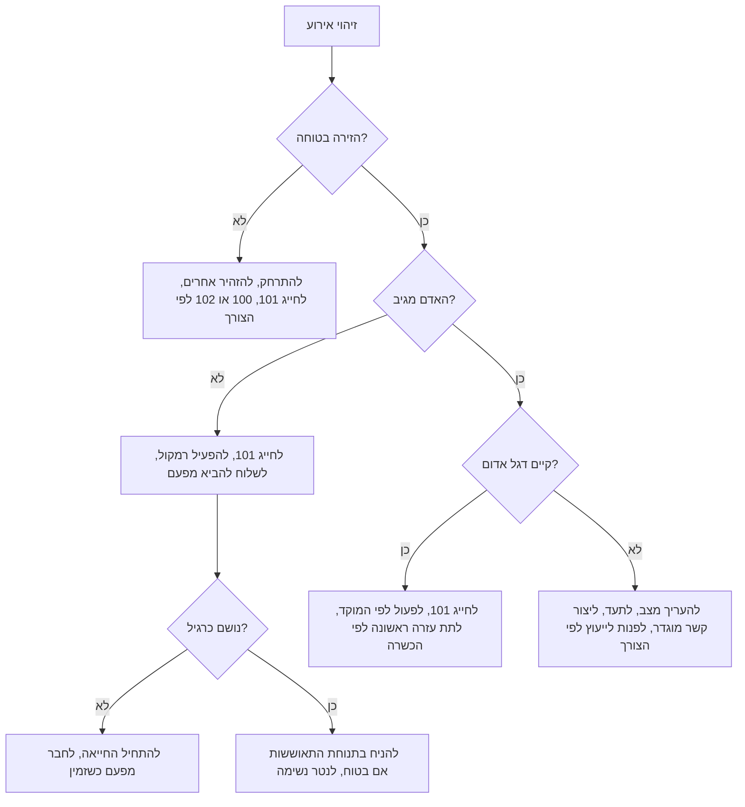
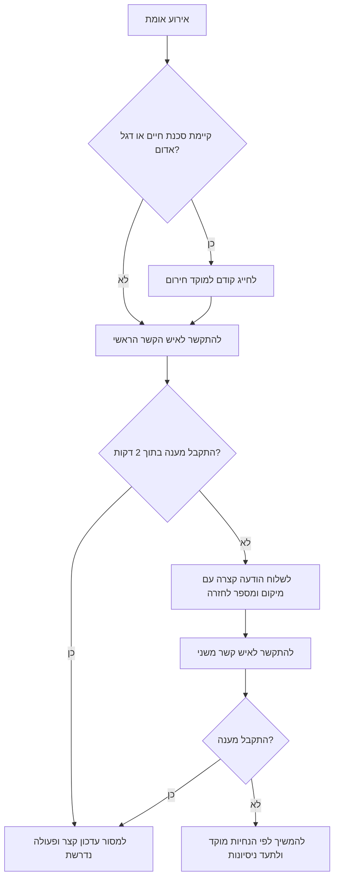
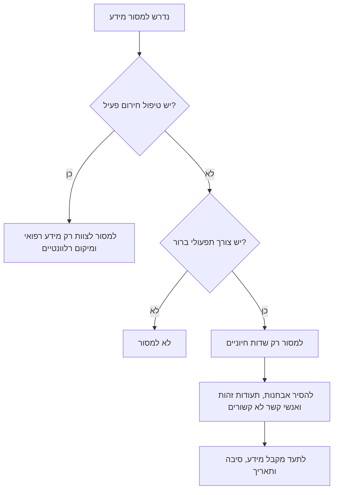

# פרטי קשר לשעת חירום ומידע עזרה ראשונה

גרסה: 2.2.0

## מטרה

לשמור באופן מקומי אנשי קשר לשעת חירום, פרטי גישה למקום, מידע רפואי חיוני והנחיות עזרה ראשונה לעסקים קטנים, לעצמאיות ולעצמאים, למשקי בית ולמקומות המקבלים קהל בישראל. להשתמש בחבילה להכנת פרופיל חירום, בדיקת תקינות, דף ציבורי מצומצם וכרטיס ארנק.

במצב חירום רפואי בישראל יש לחייג **101**, להפעיל רמקול ולפעול לפי הנחיות המוקד. ניתן לשמור גם את 1221 של איחוד הצלה כאפשרות תגבור מתנדבים לאחר אימות כיסוי מקומי, אך לא כתחליף ל-101. אין לעכב קריאה למד״א כדי למלא טופס, לאתר מנהל או לבדוק פרט שאינו חיוני.

## כללי עבודה

1. להגן על חיים לפני תיעוד.
2. לחייג למוקד חירום לפני שיחה לבעלים, למנהל או לבן משפחה כאשר קיים דגל אדום.
3. להקריא את הכתובת בדיוק כפי שהיא כתובה בפרופיל.
4. לשלוח אדם אחד לפגוש את הצוות ואדם נוסף להביא מפעם (דפיברילטור) כאשר קיים.
5. למסור רק מידע רפואי רלוונטי לטיפול.
6. להשאיר מידע רפואי רגיש מחוץ לדף ציבורי.
7. לבדוק אנשי קשר, פרטי גישה, מיקום מפעם ותיק עזרה ראשונה לפחות אחת ל-90 יום.

## מספרי חירום בישראל

| צורך | מספר | הערה |
|---|---:|---|
| חירום רפואי | 101 | אמבולנס, החייאה, שבץ, כאב בחזה, דימום קשה ופציעה חמורה |
| משטרה | 100 | אלימות, עבירה או סכנת ביטחון מיידית |
| כבאות והצלה | 102 | אש, עשן, לכודים וחילוץ |
| סכנת חשמל | 103 | חוטים שנפלו או סכנת תשתית חשמל |
| פיקוד העורף | 104 | הנחיות התגוננות אזרחית |
| מוקד עירוני | 106 או 107 | יש לאמת לפי הרשות המקומית |
| איחוד הצלה | 1221 | יש לאמת כיסוי מקומי; אין להשתמש כתחליף לחיוג 101 |
| נגישות מד״א במסרון או וואטסאפ | 052-7000-101 | מיועד לפנייה כתובה כאשר נדרש |

## פרופיל בסיסי

```json
{
  "profile_name": "סטודיו דיזנגוף - דלפק קבלה",
  "last_reviewed": "04/06/2026",
  "site": {
    "address_line": "דיזנגוף 100, כניסה ב, קומה 2",
    "locality": "תל אביב-יפו",
    "access_notes": "אינטרקום 22; מפעם ליד בית המרקחת",
    "aed_location": "בית מרקחת בקומת הרחוב",
    "first_aid_kit_location": "ארון קבלה"
  },
  "contacts": [
    {
      "name": "דנה כהן",
      "role": "בעלים",
      "phone": "050-123-4567",
      "priority": 1,
      "can_receive_medical_info": true
    }
  ],
  "medical_notes": {
    "known_allergies": ["לטקס"],
    "regular_medications": [],
    "mobility_needs": ["קושי במדרגות"]
  }
}
```

## מה לשמור

| שדה | לשמור | סיבה |
|---|---:|---|
| שם ותפקיד | כן | זיהוי מהיר של האדם הנכון |
| מספר טלפון ישראלי | כן | מאפשר הסלמה |
| סדר עדיפות | כן | מונע שיחות חוזרות לאותו איש קשר |
| כתובת מדויקת | כן | המוקד צריך מיקום ברור |
| פרטי גישה | כן, בהגבלה כאשר רגיש | מסייע לצוות להיכנס |
| מיקום מפעם ותיק עזרה ראשונה | כן | חוסך זמן |
| אלרגיות | כן | רלוונטי לטיפול מיידי |
| תרופות קבועות | כן, כאשר המידע מדויק | מסייע לצוות רפואי |
| מספר תעודת זהות | בדרך כלל לא | מידע רגיש שאינו נדרש בדקות הראשונות |
| היסטוריה רפואית רחבה | בדרך כלל לא | חשיפה עודפת של מידע רגיש |
| קוד שער או אזעקה | רק במקום מוגבל | אין להדפיס בפומבי |

## עץ החלטה: תגובה ראשונית



## עץ החלטה: הסלמת אנשי קשר



## עץ החלטה: שמירה על פרטיות



## הנחיות עזרה ראשונה

הנחיית מוקד גוברת על מסמך זה. לבצע רק פעולות במסגרת הכשרה ונהלי המקום.

### החייאה ומפעם במבוגר

1. לוודא בטיחות זירה.
2. לבדוק תגובה בדיבור ברור ובמגע בכתפיים.
3. לחייג 101 ולהפעיל רמקול.
4. לשלוח אדם להביא מפעם.
5. אם אין נשימה תקינה או יש נשימות חריגות בלבד, להתחיל עיסויי חזה.
6. ללחוץ חזק ומהר במרכז בית החזה בקצב של כ-100 עד 120 לחיצות בדקה.
7. לאפשר חזרה מלאה של בית החזה.
8. לבצע הנשמות רק אם קיימת הכשרה ונכונות.
9. לחבר מדבקות מפעם בהקדם ולפעול לפי ההנחיות הקוליות.
10. להמשיך עד חזרת נשימה תקינה, הגעת צוות רפואי, הוראת מפעם להפסקה או תשישות שמונעת המשך בטוח.

### דימום קשה

1. לחייג 101 בדימום כבד, התזה, פצע עמוק, קטיעה או סימני הלם.
2. להפעיל לחץ ישיר חזק בעזרת גזה, בד נקי או תחבושת לחץ.
3. לשמור על לחץ רציף.
4. להוסיף שכבות אם התחבושת נספגת.
5. להשתמש בחסם עורקים רק בדימום מסכן חיים מגפה ורק לפי הכשרה או הנחיה.
6. לסמן את זמן הנחת החסם.
7. לשמור על חום הגוף.

### חנק

במבוגר או בילד מעל גיל שנה:

1. לעודד שיעול אם הוא יעיל.
2. לחייג 101 כאשר האדם אינו מסוגל לדבר, לנשום או להשתעל ביעילות.
3. לבצע לחיצות בטן רק אם קיימת הכשרה.
4. להתחיל החייאה אם האדם מתמוטט.
5. לבדוק את הפה רק כאשר רואים גוף זר.

בתינוק:

1. לחייג 101.
2. לבצע מחזורים של 5 טפיחות גב ו-5 לחיצות חזה.
3. לתמוך בראש ולשמור אותו נמוך מהגוף.
4. אין לבצע לחיצות בטן בתינוק.

### כאב בחזה

1. לחייג 101 בלחץ בחזה, כאב המקרין ליד, ללסת או לגב, קוצר נשימה, הזעה, בחילה או התמוטטות.
2. להשאיר את האדם במנוחה.
3. להכין מידע על תרופות ואלרגיות.
4. לתת אספירין רק אם המוקד או גורם רפואי מוסמך הנחה ואין אלרגיה או התוויית נגד ידועה.
5. לא לאפשר נהיגה עצמית.

### סימני שבץ

להשתמש בכלל פנים, יד, דיבור, זמן:

- צניחת פנים.
- חולשה ביד.
- קושי בדיבור.
- זמן לחייג 101.

לתעד את השעה המדויקת שבה האדם נראה תקין לאחרונה. אין לתת אוכל, שתייה או תרופה ללא הנחיה.

### אנפילקסיס

1. לחייג 101.
2. לסייע בשימוש במזרק אדרנלין אישי כאשר הוא זמין ומתאים.
3. להשכיב את האדם אלא אם הנשימה נוחה יותר בישיבה.
4. לנטר נשימה.
5. להכין מידע על האלרגן ועל תרופות לצוות רפואי.

### כוויות

1. לעצור את מקור הכוויה.
2. לקרר במים זורמים קרירים כ-20 דקות כאשר אפשר.
3. להסיר תכשיטים או פריטים לוחצים ליד הכוויה.
4. לכסות בתחבושת נקייה שאינה נדבקת.
5. לחייג 101 בכוויות בפנים, בדרכי נשימה, בידיים, באיברי מין, בכוויה גדולה או עמוקה, בכוויה חשמלית, כימית או בשאיפת עשן.
6. אין להשתמש בקרח, חמאה, שמן, משחת שיניים או חבישה נדבקת על הכוויה.

### פרכוס

1. להרחיק חפצים קשים או חדים.
2. לא לרסן.
3. לא להכניס דבר לפה.
4. למדוד זמן.
5. לחייג 101 אם הפרכוס נמשך יותר מ-5 דקות, חוזר, גורם לפציעה, מתרחש בהריון, לאחר אירוע מים, בסוכרת או כפרכוס ראשון.
6. לאחר סיום הפרכוס, אם הנשימה תקינה, להניח בתנוחת התאוששות.

### פגיעת חום

1. להעביר לצל או למזגן.
2. לחייג 101 בבלבול, התמוטטות, פרכוס, חום גבוה מאוד או החמרה.
3. לקרר במים, מאוורר, מטליות רטובות והסרת ביגוד עודף.
4. לתת מים רק כאשר האדם בהכרה מלאה ומסוגל לבלוע.

### הרעלה או חשיפה לחומר כימי

1. לחייג 101 בתסמינים קשים או בחשיפה מסוכנת.
2. לשטוף חשיפה כימית במים.
3. להסיר ביגוד מזוהם כאשר בטוח לעשות זאת.
4. לשמור אריזה, תווית או צילום לצוות.
5. אין לגרום להקאה ללא הנחיה מוסמכת.

### התחשמלות

1. לא לגעת באדם כל עוד הוא מחובר לזרם.
2. לנתק חשמל אם אפשר.
3. לחייג 103 בסכנת תשתית חשמל.
4. לחייג 101 במקרה פגיעה.
5. להתחיל החייאה רק כשהזירה בטוחה.

## מקרי קצה

### סירוב לפינוי

לחייג 101 כאשר קיימים דגלים אדומים. לשאול את המוקד כיצד לפעול. לתעד את הסירוב, שם עד, שעה והנחיות שהתקבלו. אין לרסן בגיר כשיר אלא למניעת סכנה מיידית ובהתאם להנחיה.

### פגיעה בקטין

לחייג 101 בתסמינים דחופים. ליצור קשר עם הורה או אפוטרופוס לאחר הפעלת מוקד. לתעד למי נמסרה הודעה ובאיזו שעה.

### טלפון נעול

אין לעכב טיפול בניסיון לפתוח טלפון. לבדוק צמיד רפואי, כרטיס ארנק, מידע רפואי במסך נעילה או תרופה גלויה רק אם הדבר אינו מעכב קריאה או טיפול.

### מספר נפגעים

לחייג למוקד ולדווח מספר נפגעים, סכנות ומיקום. אין למלא פרופילים בשלב הדחוף. לתעדף בטיחות זירה, נתיב אוויר, דימום מסיבי והחייאה.

### מחסום שפה

להשתמש בעברית או באנגלית פשוטה. לבקש תרגום מעוברי אורח רק לפרטים תפעוליים. לא לחשוף היסטוריה רפואית שאינה רלוונטית.

## רשימת מוכנות

- [ ] לאמת מספרי חירום לפי היישוב.
- [ ] לאמת מספר מתנדבי הצלה לפני הדפסה.
- [ ] לבדוק מיקום מפעם ותקינות.
- [ ] לבדוק תיק עזרה ראשונה ותאריכי תפוגה.
- [ ] להוסיף כתובת מדויקת, כניסה, קומה, שער ונקודת ציון.
- [ ] להוסיף לפחות שני אנשי קשר.
- [ ] לשמור רק מידע רפואי חיוני.
- [ ] להגביל גישה לפרופיל מלא.
- [ ] להדפיס רק דף ציבורי מצומצם.
- [ ] להריץ בדיקת תקינות.
- [ ] להריץ בדיקות.
- [ ] לתרגל את חמש הדקות הראשונות.
- [ ] לקבוע בדיקה חוזרת בתוך 90 יום.

## דפוסי פעולה שגויים

- להתקשר לבעלים לפני 101 כאשר קיים דגל אדום.
- לתלות מידע רפואי מלא במקום ציבורי.
- להסתפק באיש קשר אחד.
- להשתמש בקבוצת הודעות כתחליף למוקד חירום.
- לתת אוכל, שתייה או תרופה בחשד לשבץ או ירידה בהכרה.
- להזיז נפגע טראומה ללא סיבה בטיחותית.
- להתבסס על עצות לא מאומתות.
- להשאיר את העותק היחיד במשרד נעול.

## תיעוד כספי ותפעולי

כאשר נדרש לתעד עלות החלפת ציוד, ניקוי, תיקון או מלאי שנפגע, לרשום סכום בשקלים, למשל `₪250`, ותאריך בפורמט `DD/MM/YYYY`.


## הערות לאחר אימות מקוון

- להשתמש ב-101 כמספר החירום הרפואי הראשי.
- לשמור את 1221 של איחוד הצלה כאפשרות תגבור בלבד, לאחר אימות כיסוי מקומי.
- להשתמש במונח המקצועי `מפעם (דפיברילטור)` בהופעה ראשונה ובמונח `מפעם` בהמשך כאשר ההקשר ברור.
- לשמור תאריכים עבריים-תפעוליים בפורמט `DD/MM/YYYY` וסכומים בשקלים עם הסימון `₪`.
- לא להוסיף חישובי מע״מ, טפסי מס או ממשקי דיווח; החבילה אינה כלי מס ואינה מנפיקה חשבוניות.
