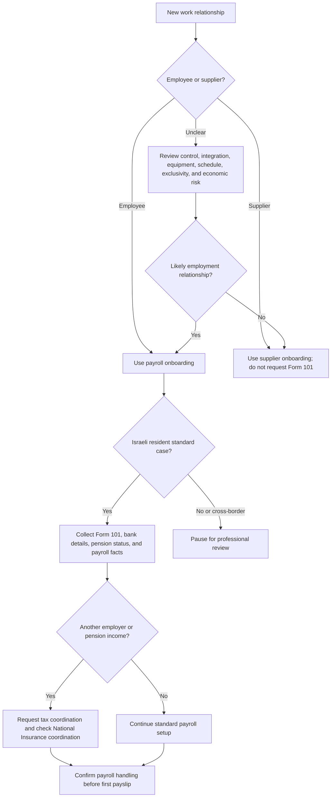
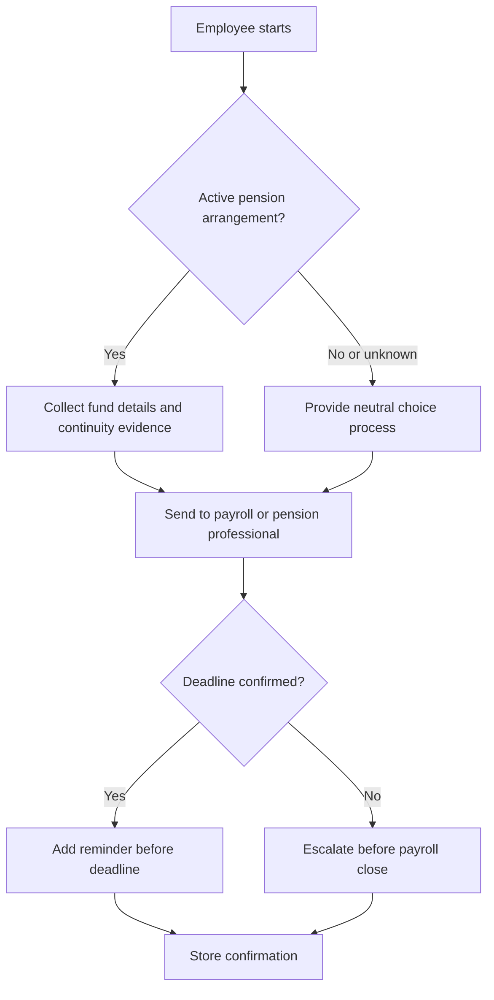

# Employee Onboarding Guide

## Purpose

Prepare practical onboarding materials for employees in Israel. Use the guide for small businesses, licensed dealers, companies, nonprofits, clinics, shops, agencies, studios, and freelancers hiring an employee. Generate checklists, employee messages, manager tasks, payroll handoffs, training plans, and professional-review notes.

This guide supports onboarding for salaried employees, hourly employees, shift workers, remote workers, employees with another employer, employees with existing pension coverage, youth employees, foreign workers, and workers moving from contractor status to employee status.

Do not present generated material as legal, tax, payroll, pension, or insurance advice. Mark issues that require a payroll provider, accountant, labor lawyer, licensed pension professional, or the relevant authority.

## Core rules

- Use neutral imperative wording.
- Do not include branding, visual marks, image references, promotional text, or creator names.
- Use DD-MM-YYYY in English materials and ₪ for currency. Use DD/MM/YYYY only when preparing Hebrew-facing materials.
- Separate employee onboarding from supplier onboarding.
- Treat Form 101, ID documents, bank details, pension details, and medical documents as sensitive.
- Keep employee-facing instructions short and manager-facing checklists detailed.
- Flag changing thresholds, permit issues, pension deadlines, and classification questions for professional review.

## Israeli onboarding checklist

| Area | Required action | Output |
|---|---|---|
| Identity | Collect legal name, ID or passport, address, phone, and personal email | Employee record |
| Form 101 | Request completed employee card before payroll close | Tax intake item |
| Payroll | Collect bank details, salary basis, start date, work schedule, and payment date | Payroll handoff |
| National Insurance | Ask about another employer, pension income, student status, youth status, foreign-worker status, and residency issues | Coordination prompt |
| Health insurance contributions | Treat as part of payroll contribution handling | Payroll review note |
| Pension | Ask whether an active pension arrangement exists and collect fund details | Pension intake |
| Employment terms | Prepare written employment terms or agreement | Terms notice |
| Timekeeping | Define clock-in, timesheet, absence, break, and overtime approval routes | Attendance policy |
| Policies | Provide confidentiality, privacy, safety, anti-harassment, expenses, and remote-work rules as relevant | Acknowledgments |
| Training | Plan day 1, week 1, and first-month training | Training checklist |

## Decision tree: choose the workflow

## Form 101 workflow

1. Request Form 101 immediately at hiring and instruct the employee to submit the completed form to the employer within 7 days of starting work, before payroll close whenever payroll timing is earlier.
2. Ask the employee to complete the form truthfully for the current tax year.
3. Check whether the employee declared another employer, pension payer, or additional income.
4. Request tax coordination approval when additional income exists.
5. Send the form and approvals to payroll.
6. Store documents in restricted storage.
7. Request a new Form 101 at the beginning of each tax year and an updated form when address, family status, residency, or tax-credit facts change.

Edge cases:

- Another employer: request tax coordination and ask payroll whether National Insurance coordination is needed.
- Student employee: request student documentation only when relevant to payroll treatment or declared eligibility.
- New immigrant or returning resident: request official eligibility documentation.
- Refusal or delay: do not fill the form for the employee; escalate to payroll for withholding handling.
- Cross-border work: pause for tax, immigration, social-security, and labor-law review.

## Pension workflow

1. Ask whether the employee has an active pension fund, provident fund, or managers insurance arrangement. If no prior active arrangement exists, the general waiting period is 6 months; if active coverage exists, entitlement starts from day one and deposits are generally made after 3 months or at tax-year end, whichever is earlier, retroactive to start. Verify sector-specific arrangements.
2. If active, collect fund name, account or policy number, and agent or provider contact. Do not force the employee into a specific pension product or provider.
3. If not active or unknown, provide a neutral selection process and ask payroll or a licensed professional about default arrangement rules.
4. Ask payroll or the pension professional to confirm the first deposit deadline.
5. Track the deadline and store confirmations securely.

## National Insurance and health insurance workflow

Collect facts that may affect payroll handling:

- Another employer.
- Pension income.
- Student status.
- Youth employment.
- Foreign-worker status.
- Non-resident or cross-border status.
- Disability, work injury, or special benefit considerations.

Do not calculate final contributions manually unless a verified payroll system is used. Ask payroll whether coordination approval is required when multiple income sources exist. For 2026 reference only, the National Insurance reduced wage bracket is ₪7,703 and the maximum wage subject to contributions is ₪51,910; verify current figures before calculation.

## Employment terms notice

Deliver written employment terms no later than 30 days after start for adult employees and no later than 7 days for employees under 18. Include:

- Employer legal name and identifier.
- Employee full name and ID or passport.
- Start date in DD-MM-YYYY.
- Role, department, and direct manager.
- Main duties.
- Workplace or remote-work arrangement.
- Work days, hours, breaks, and rest day.
- Gross salary, hourly rate, commission terms, overtime handling, and payment date.
- Vacation, sick leave, convalescence pay, travel reimbursement, and taxable benefits.
- Pension setup process.
- Confidentiality, privacy, and data-access duties.
- Training period and check-in schedule.
- Professional-review notes where terms are unusual.

## End-to-end production checklist

- [ ] Determine employee versus supplier path.
- [ ] Collect Form 101, identity details, bank details, and pension status.
- [ ] Ask about another employer and additional income.
- [ ] Request coordination approvals where needed.
- [ ] Prepare employment terms notice.
- [ ] Prepare timekeeping route before work starts.
- [ ] Prepare equipment and access forms.
- [ ] Deliver safety, privacy, confidentiality, and anti-harassment instructions.
- [ ] Send payroll handoff before payroll close.
- [ ] Schedule 7-day and 30-day check-ins.
- [ ] Store sensitive records in restricted storage.
- [ ] Mark legal, tax, pension, permit, and classification issues for professional review.

## Anti-patterns

Avoid:

- Requesting Form 101 after payroll already closed.
- Treating a worker as a supplier when the facts point to employment.
- Choosing a pension product for the employee without a proper process.
- Promising net salary without payroll review.
- Sending ID, bank, pension, or medical documents through an unapproved channel.
- Skipping timekeeping because the employer is small.
- Giving foreign workers access to work before permit review.
- Using Hebrew-only safety instructions when the employee does not understand Hebrew.
- Reusing old templates with wrong employer names, wrong dates, or irrelevant benefits.
- Mixing employee, supplier, intern, volunteer, and household-worker workflows.

## Timekeeping validation

Keep current records of working hours, overtime, weekly rest, and related pay items. If attendance is not recorded mechanically, digitally, or electronically, use a daily employee signature and approval by the responsible manager.

## Youth employment validation

For youth employees, verify age, permitted work, daily hours, weekly hours, night-work restrictions, and safety requirements before scheduling. General 2026 guidance confirms no more than 8 hours per day and 40 hours per week, with limited 9-hour days for ages 16-18 in five-day workplaces, subject to the 40-hour weekly cap.

## Foreign-worker validation

Before foreign-worker onboarding, verify permit, visa, employer authorization, written contract, medical insurance, suitable housing where relevant, pension or deposit route, and language-accessible safety instructions.

## Workplace-policy validation

For prevention of sexual harassment, appoint a responsible contact and define an efficient complaint route. Employers with more than 25 employees must set a policy document containing the main law and complaint-handling routes. For privacy and remote work, minimize monitoring, secure employee data, and keep access limited to legitimate business purposes.

## Troubleshooting quick table

| Problem | Action |
|---|---|
| Missing Form 101 | Send reminder, set deadline, escalate to payroll before payroll close |
| Another employer without coordination | Request tax coordination and ask payroll about National Insurance coordination |
| Missing pension details | Ask for fund statement, provider contact, or previous employer confirmation |
| Start date changed | Update terms, payroll handoff, access plan, and training schedule |
| Bank details rejected | Request corrected details and bank confirmation if needed |
| Hourly employee forgot clock-in | Use manager-approved correction form |
| Sensitive document sent through open chat | Move to restricted storage and remove unnecessary copies |
| Foreign-worker permit unclear | Pause work start and verify permit, visa, insurance, and payroll path |

## Deliverable pattern

When generating materials, return:

1. Context summary.
2. Employee document request.
3. Manager checklist.
4. Payroll handoff.
5. Pension intake.
6. First-day agenda.
7. First-month training plan.
8. Professional-review items.
9. Secure-storage reminder.
